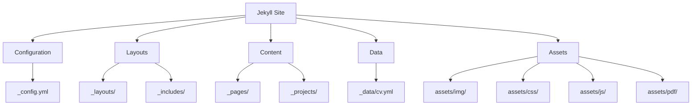
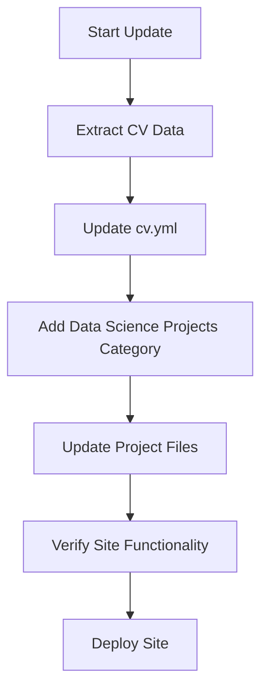

# Design Document: Jekyll CV Projects Update

## Overview

This design document outlines the approach for updating the Jekyll-based portfolio website with CV data and organizing data science projects. The implementation will focus on creating a new "Data Science Projects" category, ensuring proper display of IPython notebook projects, and maintaining site functionality after these updates.

## Architecture

The Jekyll site follows a standard Jekyll architecture with the following key components:

1. **Configuration Files**: `_config.yml` defines site-wide settings
2. **Layout Templates**: Located in `_layouts/` and `_includes/` directories
3. **Content Pages**: Markdown files in `_pages/` directory
4. **Project Files**: Located in `_projects/` directory
5. **Data Files**: YAML files in `_data/` directory (including `cv.yml`)
6. **Assets**: Images, CSS, JavaScript, and other resources in `assets/` directory

The update will primarily involve modifying the `_data/cv.yml` file to incorporate new CV data, updating the `_pages/projects.md` file to add a new category, and ensuring proper display of IPython notebook projects.

## Components and Interfaces

### 1. CV Data Integration

The CV data is stored in `_data/cv.yml` and is displayed on the CV page using various include templates from `_includes/cv/`. The update will involve:

- Extracting data from the provided PDF CV
- Updating the `_data/cv.yml` file with the new information
- Ensuring the CV page renders correctly with the updated data

### 2. Projects Page Update

The projects page (`_pages/projects.md`) displays projects categorized by type. The update will involve:

- Adding a new "Data Science Projects" category to the `display_categories` array
- Ensuring projects 5-12 are properly categorized as "Data Science Projects"
- Verifying that the projects are displayed correctly on the page

### 3. Project Files

The project files are stored in the `_projects/` directory and include both Markdown files and IPython notebooks. The update will involve:

- Ensuring IPython notebook projects (numbered 5-12) are properly formatted
- Verifying that the notebooks render correctly with all code, visualizations, and text
- Adding appropriate front matter to each project file to categorize it correctly

## Data Models

### CV Data Structure

The CV data is stored in `_data/cv.yml` with the following structure:

```yaml
- title: Section Title
  type: section_type (map, time_table, list, nested_list)
  contents:
    - name: Item Name
      value: Item Value
    # OR
    - title: Item Title
      institution: Institution Name
      year: Year
      description:
        - Description item 1
        - Description item 2
    # OR
    - List item
```

### Project Front Matter Structure

Each project file includes front matter with the following structure:

```yaml
---
layout: page
title: Project Title
description: Project Description
img: path/to/image.jpg
importance: numeric_value
category: category_name
---
```

## Error Handling

The implementation will include error handling for the following scenarios:

1. **Missing CV Data**: If certain sections of the CV are not available in the PDF, the implementation will maintain the existing structure and only update available sections.
2. **Project Display Issues**: If IPython notebooks do not render correctly, the implementation will provide fallback options such as converting to Markdown or providing links to the original notebooks.
3. **Build Failures**: If the site fails to build after updates, the implementation will include steps to diagnose and resolve the issues.

## Testing Strategy

The implementation will be tested using the following approach:

1. **Local Development Testing**:
   - Run `bundle exec jekyll serve` to build and serve the site locally
   - Verify that the site builds without errors
   - Check that all pages load correctly
   - Ensure that the CV data is displayed correctly
   - Verify that projects are categorized and displayed correctly

2. **Cross-browser Testing**:
   - Test the site in multiple browsers to ensure compatibility
   - Verify that responsive design works correctly on different screen sizes

3. **Content Verification**:
   - Ensure that all CV data is accurately represented
   - Verify that all projects are displayed with correct metadata
   - Check that IPython notebooks render correctly with all code, visualizations, and text

## Implementation Plan

The implementation will follow these steps:

1. **CV Data Update**:
   - Extract data from the provided PDF CV
   - Update the `_data/cv.yml` file with the new information

2. **Projects Page Update**:
   - Modify `_pages/projects.md` to add a new "Data Science Projects" category
   - Update project files to categorize them correctly

3. **Project Files Verification**:
   - Ensure IPython notebook projects are properly formatted
   - Verify that the notebooks render correctly

4. **Site Verification**:
   - Build and serve the site locally
   - Verify that all pages load correctly
   - Check that the CV data is displayed correctly
   - Ensure that projects are categorized and displayed correctly

## Diagrams

### Site Structure



### Update Process



## Conclusion

This design outlines the approach for updating the Jekyll-based portfolio website with CV data and organizing data science projects. The implementation will focus on maintaining the existing site structure while adding new content and ensuring proper display of all elements. The testing strategy will ensure that the site remains functional after the updates.