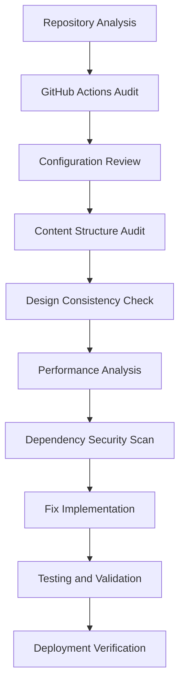

# Design Document

## Overview

This design outlines a comprehensive audit and remediation approach for the Jekyll portfolio website. The solution addresses GitHub Pages deployment issues, ensures design cohesiveness, optimizes performance, and establishes proper monitoring and maintenance workflows.

## Architecture

### Audit and Fix Workflow



### System Components

1. **GitHub Actions Pipeline**
   - Jekyll build and deployment workflow
   - Dependency caching for faster builds
   - Error handling and notification system
   - Security scanning integration

2. **Jekyll Configuration Layer**
   - Optimized `_config.yml` for GitHub Pages
   - Plugin compatibility verification
   - Theme integration validation
   - Environment-specific configurations

3. **Content Management System**
   - Structured data validation
   - Image optimization pipeline
   - SEO metadata generation
   - Content integrity checks

4. **Performance Optimization Layer**
   - CSS purging and minification
   - Image compression and WebP conversion
   - JavaScript bundling and optimization
   - Caching strategy implementation

## Components and Interfaces

### GitHub Actions Workflow Interface

**Purpose:** Automate build, test, and deployment processes

**Key Components:**
- Build job with Ruby/Jekyll setup
- Dependency installation and caching
- Site generation and validation
- Deployment to GitHub Pages
- Error reporting and notifications

**Configuration:**
```yaml
# .github/workflows/pages.yml
name: Deploy Jekyll site to Pages
on:
  push:
    branches: ["main"]
  workflow_dispatch:
permissions:
  contents: read
  pages: write
  id-token: write
```

### Jekyll Configuration Interface

**Purpose:** Ensure proper theme integration and plugin compatibility

**Key Elements:**
- Remote theme configuration for al-folio
- Plugin whitelist for GitHub Pages compatibility
- Asset optimization settings
- SEO and analytics integration
- Development vs production configurations

### Content Validation System

**Purpose:** Ensure content integrity and proper formatting

**Components:**
- YAML frontmatter validation
- Image reference verification
- Link checking and validation
- Metadata completeness checks
- Content structure consistency

### Performance Monitoring Interface

**Purpose:** Track and optimize site performance metrics

**Integration Points:**
- Google Analytics 4 setup
- Core Web Vitals monitoring
- Search Console integration
- Performance budget enforcement
- Error tracking and reporting

## Data Models

### Project Content Model
```yaml
# Project frontmatter structure
layout: page
title: String (required)
description: String (required)
img: String (path to image, required)
importance: Integer (1-10, required)
category: Enum ["Study", "Professional", "Personal"]
related_publications: Boolean
tags: Array[String] (optional)
github: String (optional)
website: String (optional)
```

### CV Data Model
```yaml
# CV section structure
- title: String
  type: Enum ["map", "list", "nested_list", "time_table"]
  contents: Array[Object]
    - name: String (for map type)
      value: String
    - title: String (for nested_list)
      items: Array[String]
```

### Configuration Model
```yaml
# Site configuration structure
title: String
description: String
url: String
baseurl: String
remote_theme: String
plugins: Array[String]
collections: Object
defaults: Array[Object]
```

## Error Handling

### Build Error Recovery
1. **Dependency Issues:** Automatic fallback to compatible versions
2. **Plugin Conflicts:** Graceful degradation with warnings
3. **Content Errors:** Detailed error reporting with line numbers
4. **Asset Missing:** Placeholder generation with error logging

### Runtime Error Management
1. **404 Handling:** Custom error page with navigation
2. **JavaScript Errors:** Graceful fallback for enhanced features
3. **Image Loading:** Lazy loading with error placeholders
4. **External Content:** Timeout handling for embedded content

### Monitoring and Alerting
1. **Build Failures:** GitHub Actions notifications
2. **Performance Degradation:** Automated alerts via analytics
3. **Security Issues:** Dependency vulnerability scanning
4. **Uptime Monitoring:** External service integration

## Testing Strategy

### Automated Testing Pipeline

1. **Build Validation**
   - Jekyll build success verification
   - Plugin compatibility testing
   - Configuration validation
   - Asset generation verification

2. **Content Testing**
   - Link checking (internal and external)
   - Image reference validation
   - Metadata completeness verification
   - SEO tag generation testing

3. **Performance Testing**
   - Page load speed measurement
   - Core Web Vitals assessment
   - Mobile responsiveness testing
   - Accessibility compliance checking

4. **Cross-browser Testing**
   - Modern browser compatibility
   - Mobile device testing
   - Dark/light mode validation
   - JavaScript functionality verification

### Manual Testing Checklist

1. **Visual Design Review**
   - Layout consistency across pages
   - Typography and spacing verification
   - Color scheme and branding alignment
   - Responsive design validation

2. **Content Accuracy**
   - CV information verification
   - Project descriptions and links
   - Contact information validation
   - Social media integration testing

3. **User Experience Testing**
   - Navigation flow validation
   - Search functionality testing
   - Form submission verification
   - Mobile user experience review

### Deployment Verification

1. **GitHub Pages Integration**
   - Custom domain configuration
   - SSL certificate validation
   - CDN performance verification
   - Cache invalidation testing

2. **Analytics and Monitoring**
   - Google Analytics tracking verification
   - Search Console integration testing
   - Performance monitoring setup
   - Error tracking configuration

## Implementation Phases

### Phase 1: Infrastructure Audit and Fix
- GitHub Actions workflow creation/repair
- Jekyll configuration optimization
- Dependency update and security scan
- Basic deployment verification

### Phase 2: Content and Design Audit
- Content structure validation
- Design consistency review
- Image optimization and validation
- SEO metadata verification

### Phase 3: Performance Optimization
- CSS and JavaScript optimization
- Image compression and WebP conversion
- Caching strategy implementation
- Performance monitoring setup

### Phase 4: Testing and Validation
- Comprehensive testing execution
- Cross-browser compatibility verification
- Mobile responsiveness validation
- Final deployment and monitoring setup