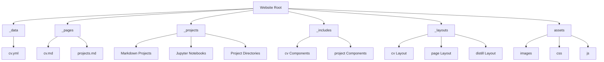
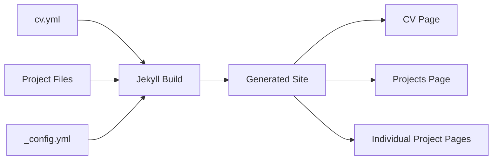
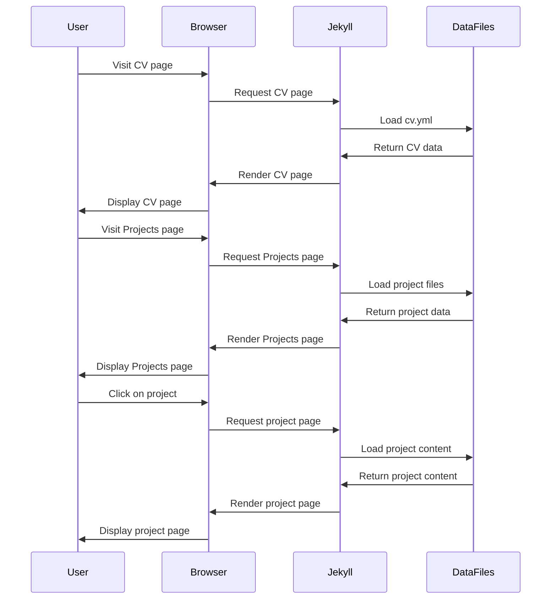

# Design Document: Website CV-Projects Alignment

## Overview

This design document outlines the approach for aligning the Jekyll portfolio website with the CV data and ensuring proper functionality of the projects page. The solution will focus on creating a cohesive experience across the website, with particular attention to the CV and projects sections, while implementing SEO best practices throughout.

The website is built using Jekyll with the al-folio theme, which provides a solid foundation for a portfolio site. The design will leverage Jekyll's templating system, collections, and data files to create a seamless integration between the CV data and project presentations.

## Architecture

The website follows a standard Jekyll architecture with the following key components:

1. **Data Layer**
   - `_data/cv.yml`: Contains structured CV information
   - Project frontmatter files: Contains metadata for individual projects
   - Jekyll configuration in `_config.yml`

2. **Template Layer**
   - Liquid templates in `_includes` and `_layouts` directories
   - CV-specific components in `_includes/cv/`
   - Project display components in `_includes/projects.liquid` and `_includes/projects_horizontal.liquid`

3. **Content Layer**
   - Markdown files in `_pages/` for static pages
   - Project files in `_projects/` (both Markdown and Jupyter notebooks)
   - Asset files in `assets/` directory

4. **Build Process**
   - Jekyll build process that combines data, templates, and content
   - Image processing for responsive images
   - SCSS compilation for styling

## Components and Interfaces

### CV Component

The CV component will be responsible for rendering the CV data from `_data/cv.yml` on the CV page. It will use the following components:

1. **CV Layout** (`_layouts/cv.liquid`)
   - Main layout for the CV page
   - Includes header, content area, and footer

2. **CV Section Components** (`_includes/cv/`)
   - `list.liquid`: Renders list-type CV sections
   - `time_table.liquid`: Renders time-based CV entries
   - `map.liquid`: Renders location-based information
   - `nested_list.liquid`: Renders hierarchical data like skills

3. **CV Data Interface**
   - Structure of `_data/cv.yml` file
   - Section types: map, list, time_table, nested_list
   - Content fields: title, contents, items, etc.

### Projects Component

The projects component will handle the display and organization of projects on the projects page:

1. **Projects Page** (`_pages/projects.md`)
   - Defines display categories and layout options
   - Controls horizontal vs. vertical display of project cards

2. **Project Display Components**
   - `_includes/projects.liquid`: Vertical project cards
   - `_includes/projects_horizontal.liquid`: Horizontal project cards
   - `_includes/interactive_notebook.liquid`: Jupyter notebook rendering

3. **Project Data Interface**
   - Project frontmatter in Markdown files or separate YAML files
   - Fields: title, description, img, importance, category, etc.
   - Project directory structure for complex projects

### SEO Component

The SEO component will implement search engine optimization across the site:

1. **Metadata Component** (`_includes/metadata.liquid`)
   - Generates meta tags for title, description, keywords
   - Implements Open Graph and Twitter Card metadata

2. **Structured Data Markup**
   - JSON-LD for projects and CV information
   - Schema.org vocabulary for rich search results

3. **SEO Configuration**
   - Site-wide SEO settings in `_config.yml`
   - Page-specific SEO in frontmatter

## Data Models

### CV Data Model

The CV data is structured in `_data/cv.yml` with the following schema:

```yaml
- title: [Section Title]
  type: [map|list|time_table|nested_list]
  contents:
    - name: [Item Name]
      value: [Item Value]
    # OR for time_table
    - title: [Entry Title]
      institution: [Institution Name]
      year: [Year]
      description:
        - [Description Item 1]
        - [Description Item 2]
    # OR for nested_list
    - title: [Category Title]
      items:
        - [Item 1]
        - [Item 2]
```

### Project Data Model

Projects are defined either directly in Markdown/Jupyter files or with separate frontmatter YAML files:

```yaml
---
layout: [page|distill]
title: [Project Title]
description: [Project Description]
img: [Image Path]
importance: [Numeric Order]
category: [Project Category]
secondary_categories: [Array of Additional Categories]
business_objective: [Business Goal]
methodology: [Technical Approach]
strategic_outcome: [Results]
tools: [Array of Tools/Technologies]
---
```

For Jupyter notebooks, the rendering will use the notebook's metadata and content structure.

## Error Handling

### CV Data Validation

1. **Missing Data Handling**
   - Implement conditional rendering to gracefully handle missing CV data
   - Provide default values or hide sections when data is incomplete

2. **Format Validation**
   - Validate CV data structure during build process
   - Log warnings for malformed data

### Project Display Fallbacks

1. **Missing Image Handling**
   - Use default placeholder images when project images are missing
   - Implement responsive image fallbacks

2. **Notebook Rendering Errors**
   - Gracefully degrade when notebook rendering fails
   - Provide alternative display options for complex notebooks

3. **Link Validation**
   - Check for broken internal links during build process
   - Implement proper 404 handling

## Testing Strategy

### CV Integration Testing

1. **Data Consistency Tests**
   - Verify that CV page accurately reflects `_data/cv.yml` content
   - Test updates to CV data propagate correctly

2. **Layout Tests**
   - Test CV page rendering across different screen sizes
   - Verify print layout for CV page

### Project Display Testing

1. **Project Rendering Tests**
   - Test rendering of different project types (Markdown, Jupyter)
   - Verify category filtering functionality

2. **Jupyter Notebook Tests**
   - Test rendering of notebooks with various content types
   - Verify interactive elements function correctly

3. **Link Validation**
   - Test all project links resolve correctly
   - Verify project navigation works as expected

### SEO Testing

1. **Metadata Validation**
   - Verify presence of required meta tags
   - Test structured data with Google's Rich Results Test

2. **Performance Testing**
   - Test page load times and Core Web Vitals
   - Verify image optimization

## Implementation Approach

### Phase 1: CV Alignment

Ensure the CV page correctly renders all data from `_data/cv.yml` with proper formatting and styling. This includes:

1. Reviewing and updating CV layout templates
2. Ensuring consistent styling between CV sections
3. Implementing proper linking between CV projects and project pages

### Phase 2: Project Display Enhancement

Improve the projects page to properly display all project types with correct linking:

1. Update project card templates for consistent display
2. Implement proper Jupyter notebook rendering
3. Ensure project categorization works correctly

### Phase 3: SEO Implementation

Add SEO optimization throughout the site:

1. Implement metadata components
2. Add structured data markup
3. Configure site-wide SEO settings

### Phase 4: Testing and Refinement

Conduct thorough testing and make refinements:

1. Test across different devices and browsers
2. Validate SEO implementation
3. Fix any issues with CV or project display

## Technical Considerations

### Jekyll Configuration

The `_config.yml` file will need specific settings for:

```yaml
# Collections
collections:
  projects:
    output: true
    permalink: /projects/:path/

# Defaults for collections
defaults:
  - scope:
      path: ""
      type: "projects"
    values:
      layout: page
```

### Jupyter Notebook Rendering

For rendering Jupyter notebooks, the site will use:

1. The `jekyll-jupyter-notebook` plugin
2. Custom styling for notebook elements
3. Proper handling of interactive elements

### Image Optimization

For optimal performance:

1. Use responsive images with appropriate srcset
2. Implement lazy loading for images
3. Use WebP format with fallbacks for older browsers

## Design Diagrams

### Site Structure Diagram



### Data Flow Diagram



### Component Interaction Diagram



## Conclusion

This design provides a comprehensive approach to aligning the CV and projects sections of the website while implementing SEO best practices. By leveraging Jekyll's templating system and data structures, the solution ensures a cohesive user experience and proper functionality across the site. The implementation will be done in phases, with testing at each stage to ensure quality and consistency.