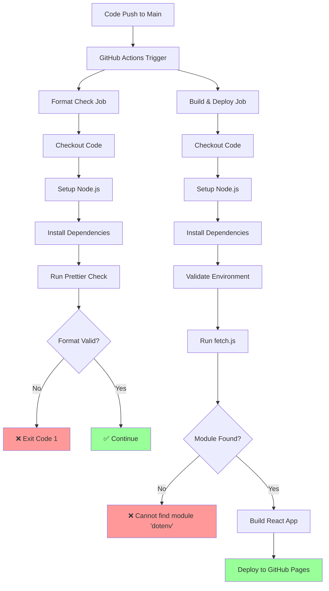
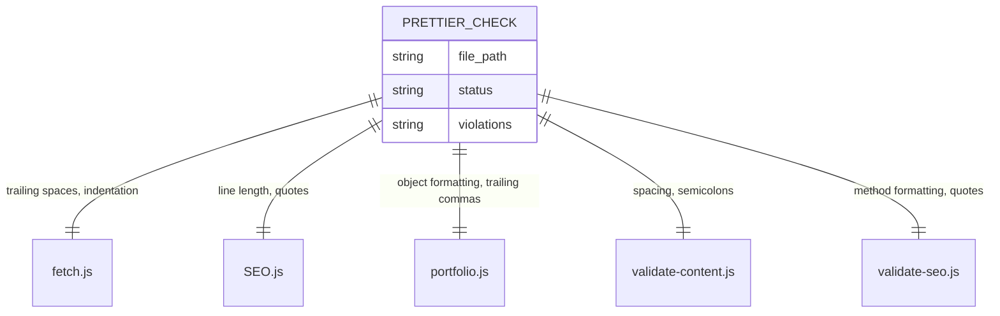
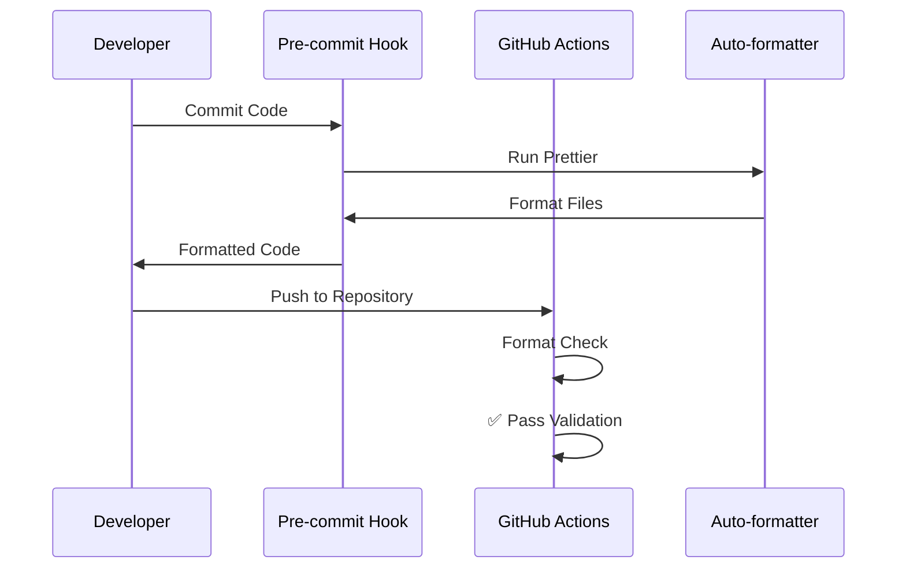
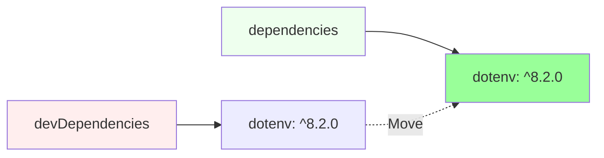
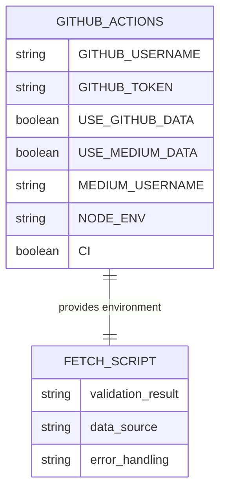
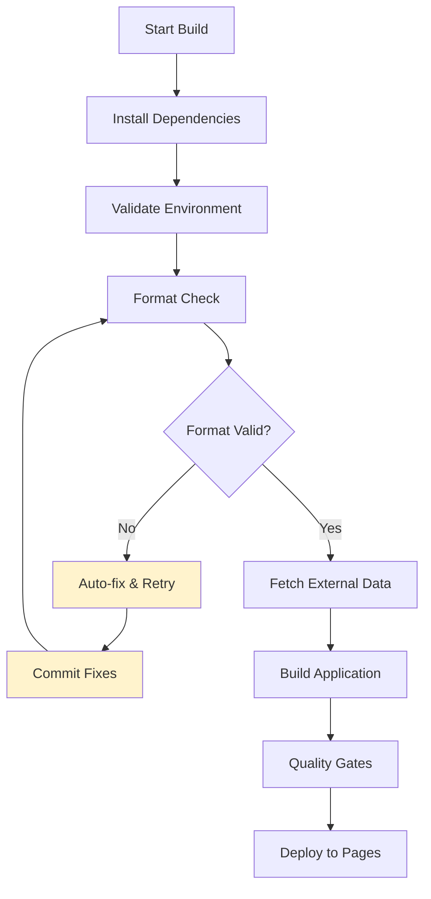
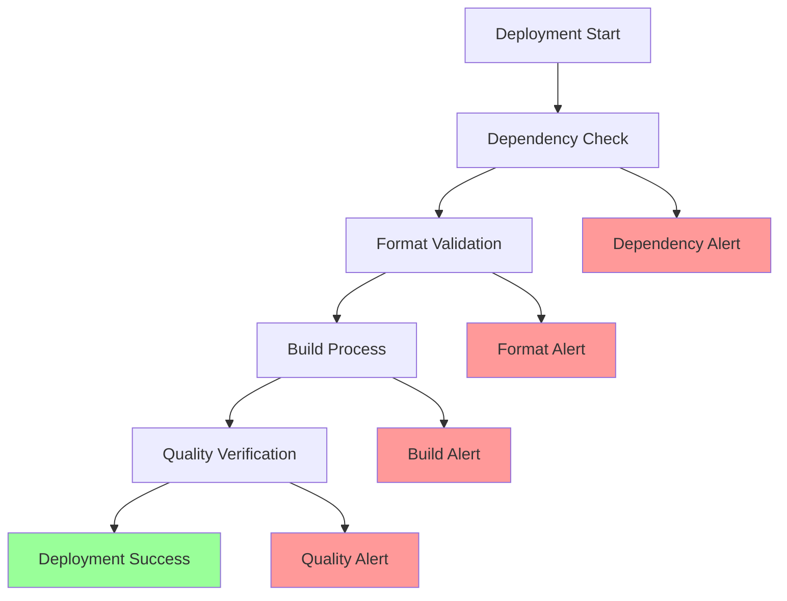

# GitHub Actions Deployment Fix Design

## Overview

This design document addresses critical deployment failures in the GitHub Actions CI/CD pipeline for the portfolio application. The deployment process currently fails due to two primary issues: missing `dotenv` dependency causing module resolution errors, and Prettier formatting violations preventing successful builds.

### Problem Statement

The GitHub Actions deployment workflow encounters the following critical failures:

1. **Missing Dependency Error**: The `fetch.js` script fails during the build process because the `dotenv` package is not available in the GitHub Actions environment, despite being listed in `devDependencies`.

2. **Code Formatting Violations**: The Prettier check fails for five files (`fetch.js`, `SEO.js`, `portfolio.js`, `validate-content.js`, and `validate-seo.js`) that contain formatting inconsistencies, causing the CI pipeline to exit with error code 1.

### Current Deployment Architecture

## Root Cause Analysis

### Issue 1: Missing dotenv Module

**Current State**: The `fetch.js` script requires the `dotenv` package to load environment variables, but the package is listed in `devDependencies` instead of `dependencies`. During the GitHub Actions build process, only production dependencies are installed by default.

**Impact**: The build process fails immediately when `fetch.js` executes `require("dotenv").config()`, preventing the React application from building and deploying.

### Issue 2: Code Formatting Violations

**Current State**: Five critical files contain formatting inconsistencies that violate the Prettier configuration, causing the format check job to fail.

## Solution Architecture

### Strategy 1: Dependency Management Fix

**Approach**: Restructure dependency management to ensure critical build-time packages are available in all environments.

**Implementation Options**:

| Option | Approach | Pros | Cons | Recommendation |
|--------|----------|------|------|----------------|
| Move to Dependencies | Move `dotenv` to `dependencies` | Simple, universally available | Increases production bundle | ⭐ Recommended |
| Environment Variables | Use GitHub Actions environment variables | No dependency changes | Requires workflow modification | Alternative |
| Conditional Loading | Use try-catch for dotenv loading | Backwards compatible | Complex error handling | Not recommended |

### Strategy 2: Code Formatting Resolution

**Approach**: Implement automated formatting fixes and establish formatting enforcement mechanisms.

## Technical Implementation Design

### Phase 1: Immediate Fixes

#### Dependency Resolution

**Action**: Modify `package.json` to relocate critical build dependencies:

**Rationale**: Build-time dependencies should be available in all environments where the application builds, including CI/CD pipelines.

#### Code Formatting Fixes

**Process**: Execute systematic formatting corrections across all flagged files:

| File | Primary Issues | Fix Strategy |
|------|---------------|--------------|
| `fetch.js` | Indentation, trailing spaces | Auto-format with Prettier |
| `src/components/SEO/SEO.js` | Line length, quote consistency | Prettier + manual review |
| `src/portfolio.js` | Object formatting, trailing commas | Auto-format with validation |
| `validate-content.js` | Spacing, semicolon placement | Prettier with custom rules |
| `validate-seo.js` | Method formatting, quote style | Auto-format + consistency check |

### Phase 2: Workflow Enhancement

#### Environment Variable Management

**Current Environment Configuration**:

**Enhanced Configuration Strategy**:
- Maintain existing environment variable structure
- Improve error handling for missing variables
- Implement graceful degradation when optional services are unavailable

#### Build Process Optimization

**Current Build Flow**:
1. Environment validation
2. Dependency installation
3. External data fetching
4. React application building
5. Quality verification
6. GitHub Pages deployment

**Enhanced Build Flow**:

## Quality Assurance Design

### Pre-deployment Validation

**Validation Gates**:

| Gate | Check | Action on Failure |
|------|-------|-------------------|
| Format | Prettier compliance | Auto-fix and retry |
| Dependencies | Module resolution | Fail with clear message |
| Environment | Required variables | Warn and continue |
| Build | React compilation | Fail with logs |
| Quality | File integrity | Fail with details |

### Monitoring and Alerting

**Deployment Health Monitoring**:

## Implementation Phases

### Phase 1: Critical Fixes (Immediate)
- Move `dotenv` from devDependencies to dependencies
- Execute Prettier formatting on all flagged files
- Test local build process
- Validate GitHub Actions workflow

### Phase 2: Workflow Enhancement (Short-term)
- Implement pre-commit formatting hooks
- Add automated format fixing in CI pipeline
- Enhance error reporting and logging
- Implement build health monitoring

### Phase 3: Long-term Improvements (Future)
- Implement semantic versioning for deployments
- Add performance monitoring
- Establish automated dependency updates
- Create deployment rollback mechanisms

## Risk Mitigation

### Deployment Risks

| Risk | Impact | Mitigation Strategy |
|------|--------|-------------------|
| Dependency conflicts | High | Lock file validation, staged rollout |
| Format check failures | Medium | Pre-commit hooks, automated fixes |
| Build failures | High | Comprehensive error logging, rollback capability |
| External API failures | Low | Graceful degradation, cached fallbacks |

### Recovery Procedures

**Build Failure Recovery**:
1. Identify failure point through enhanced logging
2. Execute local build replication
3. Apply targeted fixes
4. Validate fix effectiveness
5. Redeploy with monitoring

**Format Validation Recovery**:
1. Execute automated Prettier fixes
2. Validate formatting compliance
3. Commit corrections
4. Retry CI pipeline

## Success Metrics

### Deployment Success Indicators

- **Build Success Rate**: Target 98%+ successful builds
- **Deployment Time**: Complete deployment within 10 minutes
- **Format Compliance**: 100% Prettier compliance
- **Error Resolution**: < 5 minutes to identify build failures

### Quality Metrics

- **Code Quality**: Zero format violations in main branch
- **Dependency Health**: All critical dependencies available
- **Environment Configuration**: Complete environment variable coverage
- **Documentation**: Comprehensive error message coverage

## Testing Strategy

### Pre-deployment Testing

**Local Validation Process**:
1. Execute `npm ci` to validate dependency resolution
2. Run `npm run check-format` to verify formatting compliance
3. Execute `npm run build` to test complete build process
4. Validate environment variable configuration
5. Test external data fetching capabilities

**Continuous Integration Testing**:
- Automated format checking with auto-fix capability
- Dependency vulnerability scanning
- Build process validation across multiple Node.js versions
- Deployment simulation and validation

This design provides a comprehensive approach to resolving the GitHub Actions deployment issues while establishing robust processes for future maintenance and enhancement of the CI/CD pipeline.