# GitHub Deployment Fix Design

## Overview

This design document outlines the comprehensive analysis and fixes needed for the GitHub deployment process of Sameh Shehata's portfolio. The analysis reveals several issues with the current deployment configuration that affect site coherence, data consistency, and deployment reliability.

## Current State Analysis

### Repository Type
**Frontend Application** - React-based portfolio using Create React App with SCSS styling and modern development practices.

### Technology Stack
- **Frontend Framework**: React 16.10.2
- **Build Tool**: Create React App (react-scripts 5.0.0)
- **Styling**: SCSS/Sass
- **Deployment**: GitHub Pages via gh-pages package
- **CI/CD**: GitHub Actions
- **External Integrations**: GitHub API, Medium RSS

### Identified Issues

#### 1. Data Fetching Logic Problems
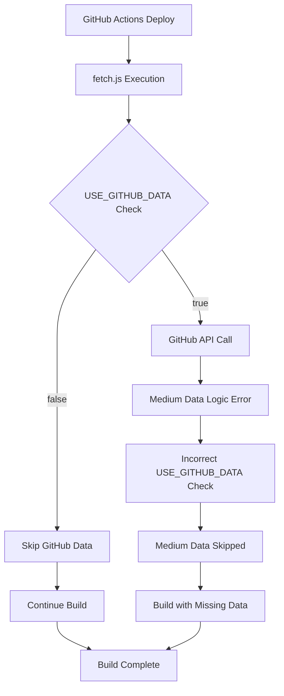

**Issue**: In `fetch.js` line 94, Medium data fetching uses `USE_GITHUB_DATA` instead of `USE_MEDIUM_DATA`

#### 2. Deployment Environment Variables
- Missing proper environment variable validation
- GitHub token scope and permissions unclear
- Medium integration incorrectly configured

#### 3. Site Content Redundancy
- Multiple similar project descriptions
- Duplicate certification references
- Inconsistent project image paths

#### 4. Build Process Inefficiencies
- Fetch script runs during both development and production
- No error handling for API failures
- Missing data validation

## Architecture Fixes

### 1. Data Fetching System Redesign

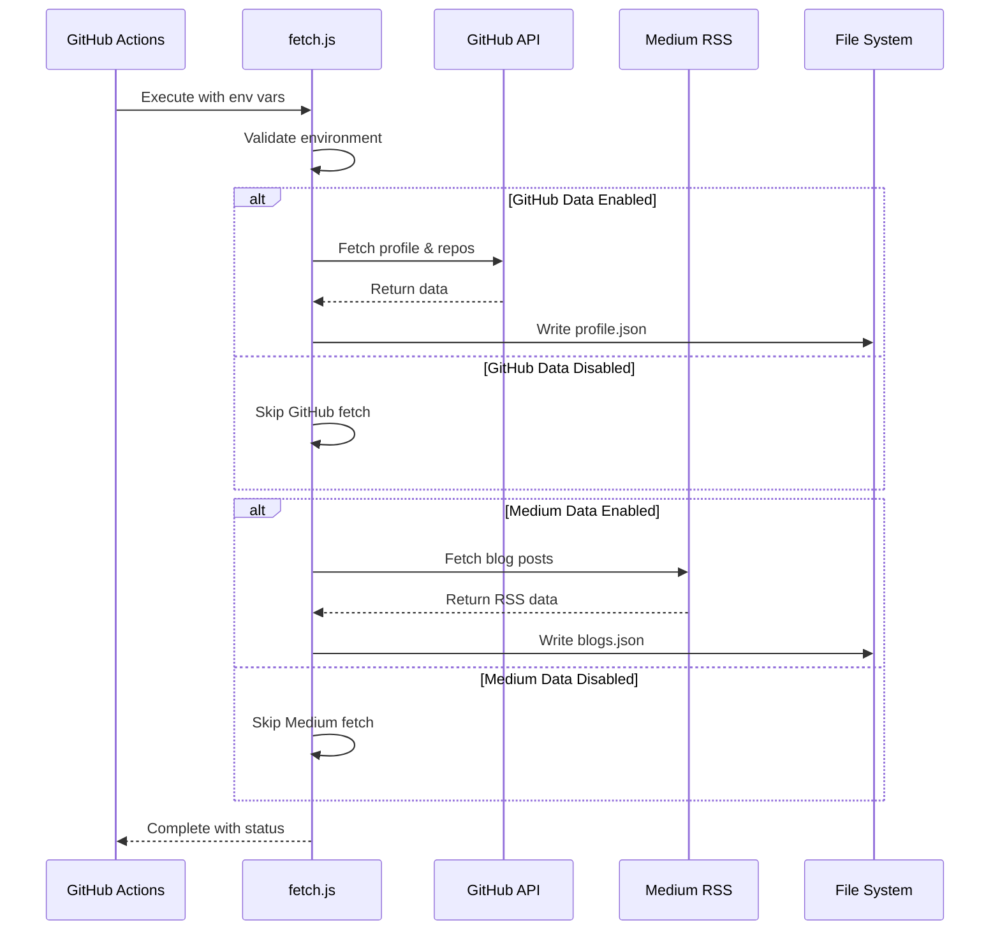

#### Fixed Environment Logic
```javascript
// Current broken logic
if (USE_GITHUB_DATA === "true") {
  // Fetch Medium data - WRONG!
}

// Fixed logic
if (USE_MEDIUM_DATA === "true" && MEDIUM_USERNAME) {
  // Fetch Medium data - CORRECT!
}
```

### 2. Enhanced Error Handling

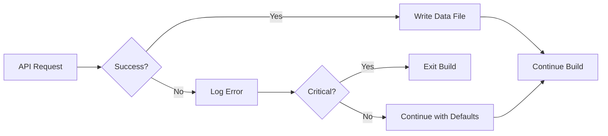

### 3. Content Deduplication Strategy

#### Project Organization
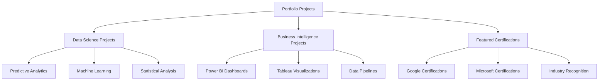

### 4. Deployment Workflow Optimization

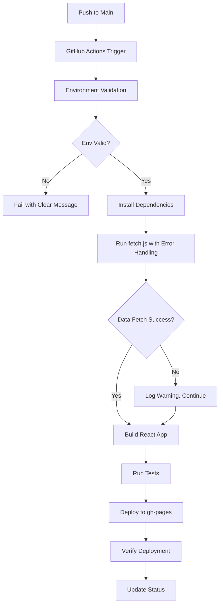

## Component Architecture

### 1. Portfolio Data Management

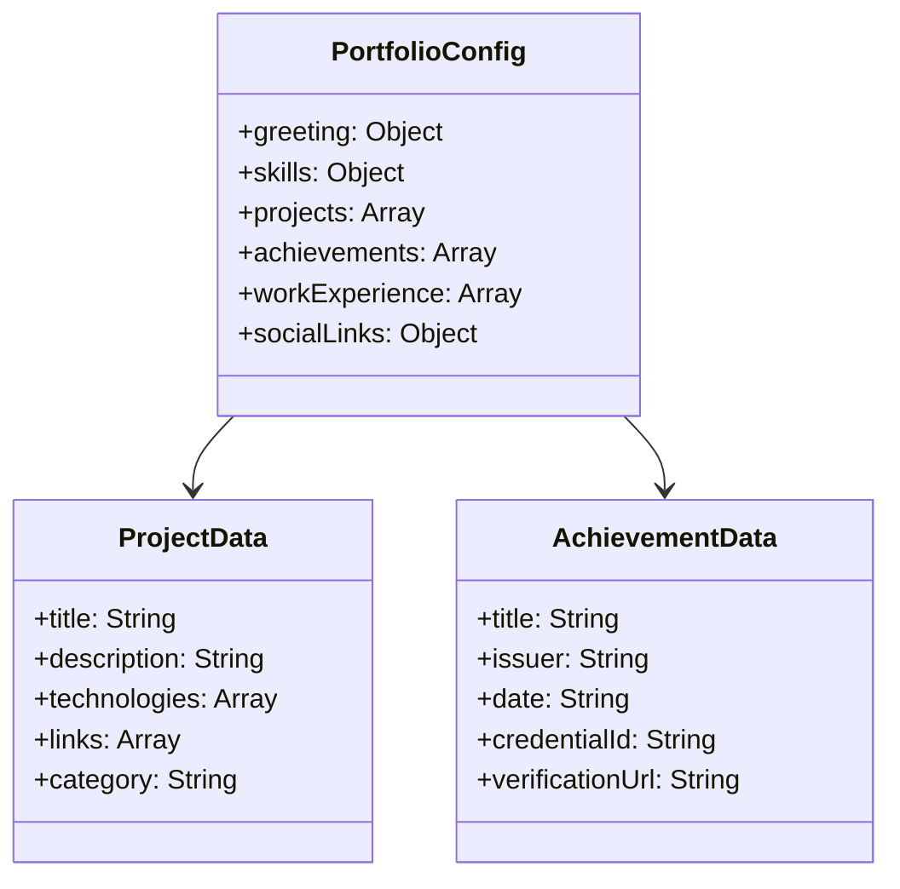

### 2. Data Fetching Service

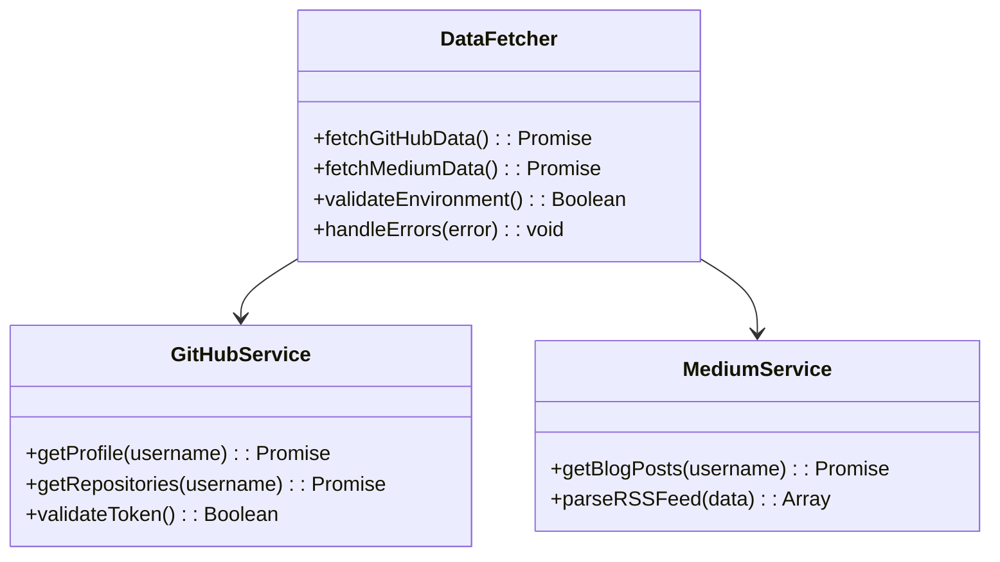

### 3. Build Process Components

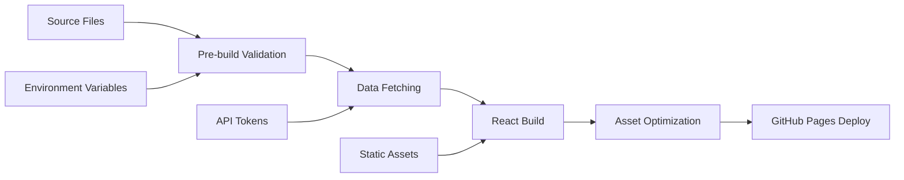

## Implementation Details

### 1. Fixed fetch.js Logic

#### Environment Validation
```javascript
const requiredEnvVars = {
  github: ['GITHUB_USERNAME', 'GITHUB_TOKEN'],
  medium: ['MEDIUM_USERNAME']
};

function validateEnvironment() {
  const errors = [];
  
  if (USE_GITHUB_DATA === "true") {
    requiredEnvVars.github.forEach(envVar => {
      if (!process.env[envVar]) {
        errors.push(`Missing required environment variable: ${envVar}`);
      }
    });
  }
  
  if (USE_MEDIUM_DATA === "true") {
    requiredEnvVars.medium.forEach(envVar => {
      if (!process.env[envVar]) {
        errors.push(`Missing required environment variable: ${envVar}`);
      }
    });
  }
  
  return errors;
}
```

#### Corrected Data Fetching
```javascript
// GitHub Data Fetching
if (USE_GITHUB_DATA === "true") {
  await fetchGitHubData();
}

// Medium Data Fetching - FIXED
if (USE_MEDIUM_DATA === "true" && MEDIUM_USERNAME) {
  await fetchMediumData();
}
```

### 2. Enhanced Error Handling

```javascript
async function fetchWithRetry(fetchFunction, maxRetries = 3) {
  for (let attempt = 1; attempt <= maxRetries; attempt++) {
    try {
      return await fetchFunction();
    } catch (error) {
      console.error(`Attempt ${attempt} failed:`, error.message);
      
      if (attempt === maxRetries) {
        console.error('Max retries reached. Continuing with fallback data.');
        return null;
      }
      
      // Exponential backoff
      await new Promise(resolve => setTimeout(resolve, 1000 * attempt));
    }
  }
}
```

### 3. Content Deduplication

#### Project Categorization
```javascript
const projectCategories = {
  'Data Science': [
    'Cyclistic Bike-Sharing Analysis',
    'Employee Turnover Analysis',
    'Stock Volatility Forecasting'
  ],
  'Business Intelligence': [
    'Technology Trends Dashboard',
    'Power BI Dashboard Portfolio'
  ],
  'Machine Learning': [
    'Earthquake Damage Prediction',
    'Corporate Bankruptcy Prediction',
    'Air Quality Prediction'
  ]
};
```

#### Achievement Grouping
```javascript
const achievementGroups = {
  'Google Certifications': [
    'Advanced Data Analytics',
    'Business Intelligence',
    'Cloud Data Analytics',
    'Data Analytics Professional Certificate'
  ],
  'Microsoft Certifications': [
    'Power BI Data Analyst Associate (PL-300)',
    'Fabric Analytics Engineer Associate (DP-600)'
  ],
  'Industry Recognition': [
    'WorldQuant Applied Data Science Labs',
    'McKinsey Forward Program',
    'IBM Advanced Data Analytics'
  ]
};
```

### 4. Deployment Configuration

#### GitHub Actions Workflow Enhancement
```yaml
env:
  # Core configuration
  GITHUB_USERNAME: "samehshi"
  GITHUB_TOKEN: ${{ secrets.GITHUB_TOKEN }}
  
  # Feature flags with validation
  USE_GITHUB_DATA: "true"
  USE_MEDIUM_DATA: "false"  # Disabled until username is confirmed
  
  # Optional integrations
  MEDIUM_USERNAME: "sameh_shi"
  
  # Build configuration
  CI: false
  NODE_ENV: production
```

#### Environment Variable Validation Step
```yaml
- name: Validate Environment
  run: |
    echo "Validating required environment variables..."
    if [ "$USE_GITHUB_DATA" = "true" ]; then
      if [ -z "$GITHUB_USERNAME" ]; then
        echo "Error: GITHUB_USERNAME is required when USE_GITHUB_DATA=true"
        exit 1
      fi
    fi
    
    if [ "$USE_MEDIUM_DATA" = "true" ]; then
      if [ -z "$MEDIUM_USERNAME" ]; then
        echo "Warning: MEDIUM_USERNAME not set, Medium integration disabled"
        echo "USE_MEDIUM_DATA=false" >> $GITHUB_ENV
      fi
    fi
    
    echo "Environment validation complete"
```

## Data Flow Architecture

### 1. Build-Time Data Flow

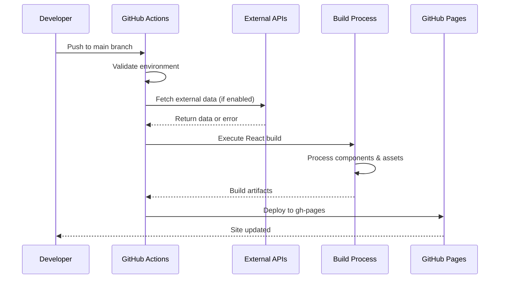

### 2. Runtime Data Flow

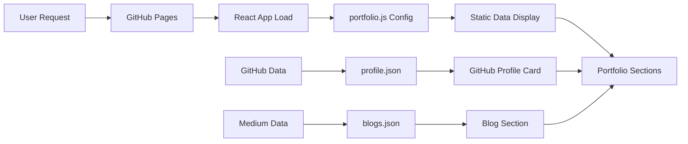

## Testing Strategy

### 1. Build Testing

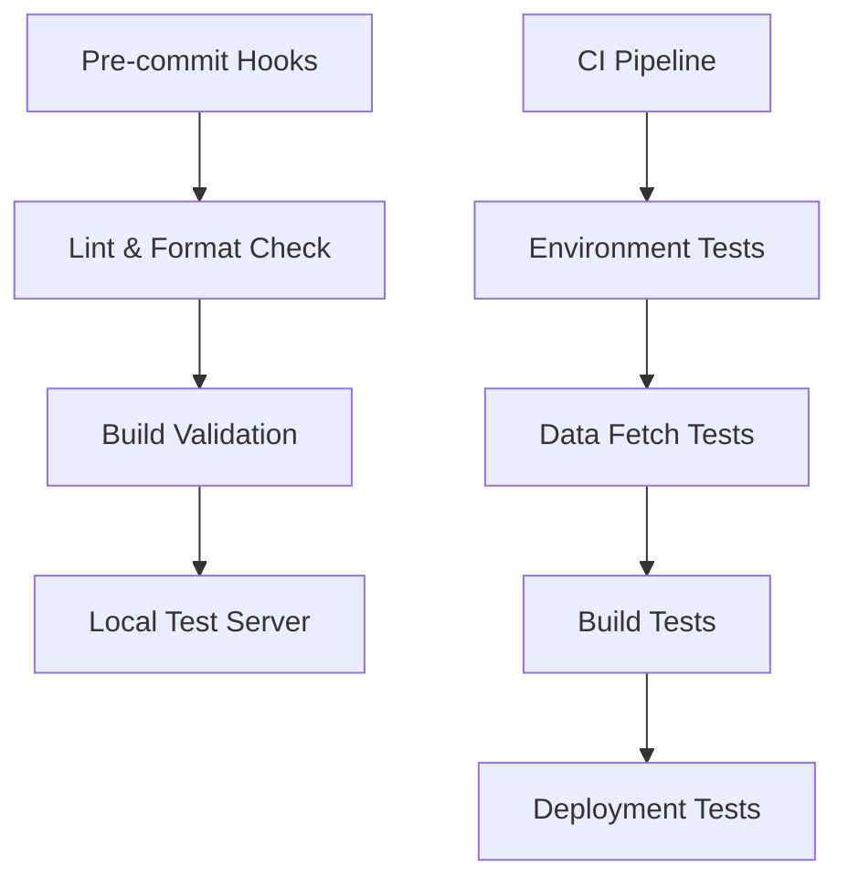

### 2. Content Validation

#### Automated Content Checks
```javascript
// Example content validation
const validateContent = {
  projects: (projects) => {
    const duplicates = findDuplicateProjects(projects);
    if (duplicates.length > 0) {
      console.warn('Duplicate projects found:', duplicates);
    }
  },
  
  achievements: (achievements) => {
    const missingLinks = achievements.filter(a => !a.footerLink?.length);
    if (missingLinks.length > 0) {
      console.warn('Achievements missing verification links:', missingLinks.map(a => a.title));
    }
  }
};
```

## Performance Optimization

### 1. Build Performance

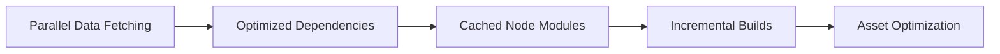

### 2. Runtime Performance

#### Bundle Size Optimization
- Remove unused dependencies
- Optimize image assets
- Implement lazy loading for non-critical sections

#### Loading Performance
- Preload critical fonts
- Optimize initial render
- Implement service worker for caching

## Security Considerations

### 1. API Token Management

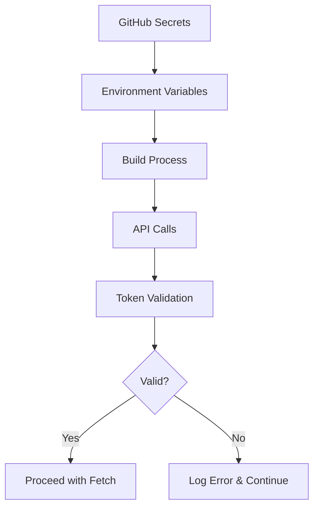

### 2. Data Sanitization

```javascript
const sanitizeData = {
  github: (data) => {
    // Remove sensitive information
    delete data.user?.email;
    delete data.user?.privateRepos;
    return data;
  },
  
  medium: (data) => {
    // Sanitize blog content
    return data.items?.map(item => ({
      title: item.title,
      link: item.link,
      pubDate: item.pubDate,
      description: sanitizeHtml(item.description)
    }));
  }
};
```

## Monitoring and Maintenance

### 1. Deployment Monitoring

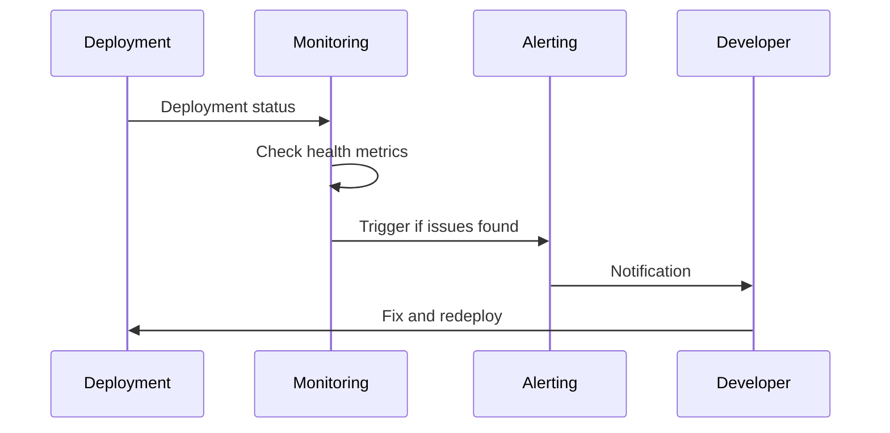

### 2. Content Freshness

#### Automated Updates
- Weekly GitHub data refresh
- Monthly content review
- Quarterly dependency updates

#### Health Checks
- Link validation
- Image loading verification
- Performance monitoring

## Migration Steps

### Phase 1: Immediate Fixes
1. Fix fetch.js Medium data logic error
2. Add environment variable validation
3. Enhance error handling in deployment workflow

### Phase 2: Content Optimization
1. Deduplicate project descriptions
2. Reorganize achievements by category
3. Optimize image assets and paths

### Phase 3: Performance Enhancements
1. Implement build caching
2. Add content validation tests
3. Set up monitoring and alerting

### Phase 4: Long-term Improvements
1. Add automated content freshness checks
2. Implement A/B testing for content optimization
3. Add advanced analytics and tracking