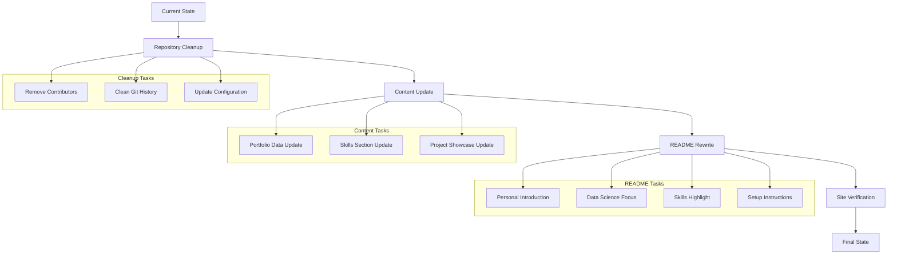
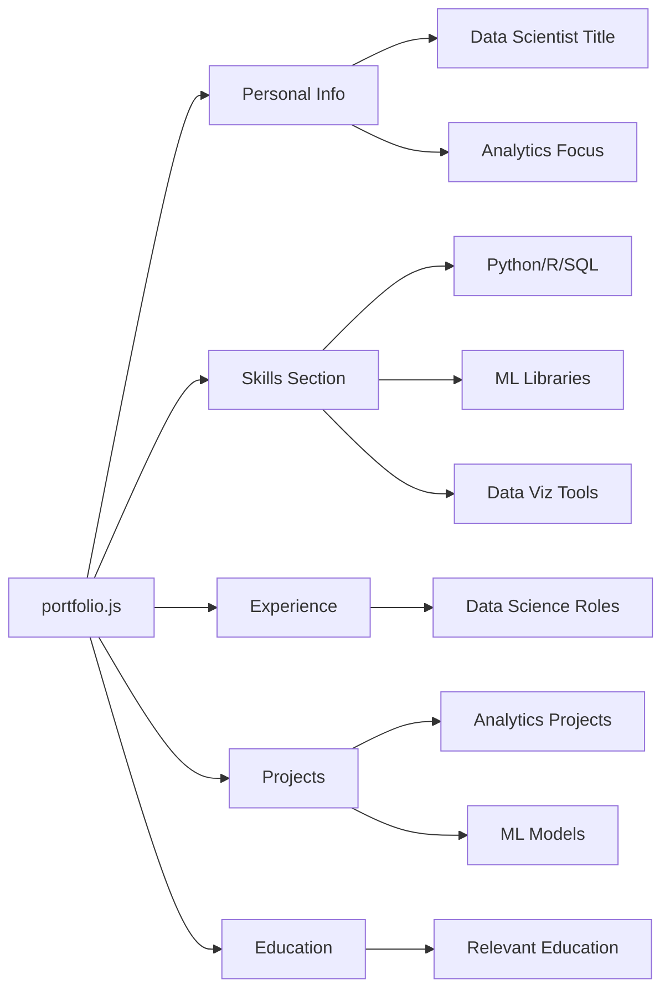
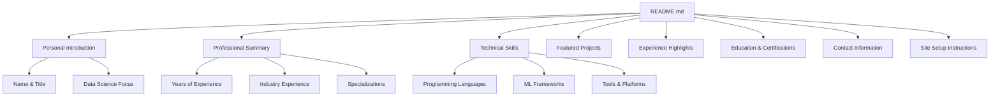
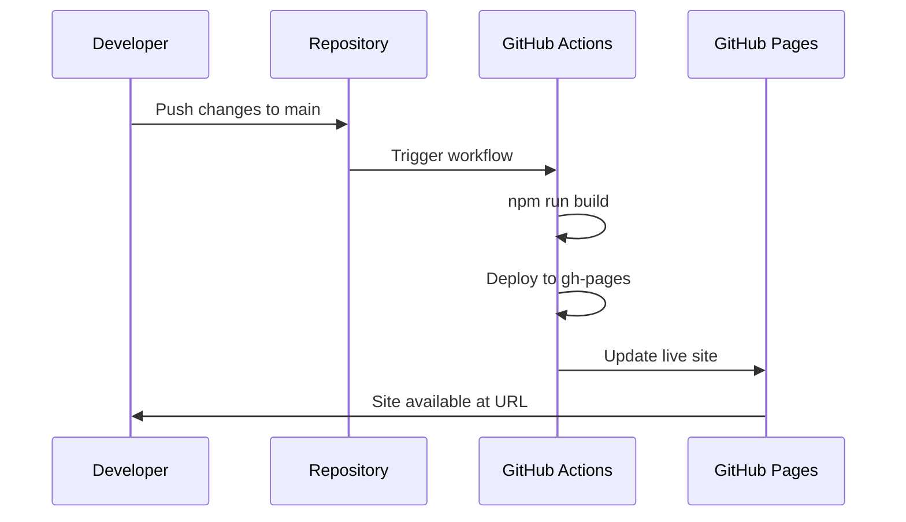

# Repository Cleanup and Site Setup Design

## Overview

This design document outlines the comprehensive cleanup and transformation of the developer portfolio repository to reflect the owner's role as a data scientist and analyst, along with ensuring proper site publication at https://samehshi.github.io/portfolio/.

The project will be transformed from a generic developer portfolio template to a personalized data science portfolio while maintaining the existing React-based architecture and deployment infrastructure.

## Architecture

### Current System State
- React-based single-page application (SPA)
- GitHub Pages deployment configured
- Portfolio content managed through `src/portfolio.js`
- External data integration (GitHub, Medium)
- Responsive design with theme switching

### Target System State
- Clean repository history
- Updated README reflecting data science focus
- Personalized portfolio content
- Verified GitHub Pages deployment
- Optimized for data science showcase

## Repository Cleanup Tasks

### Contributors and History Cleanup
- Remove existing contributors from repository metadata
- Clean up commit history if needed
- Update package.json author information
- Remove references to original template authors

### Configuration Updates
- Update package.json with personal details
- Modify homepage URL to ensure correct GitHub Pages deployment
- Update repository metadata and descriptions
- Clean up any template-specific references

### File Structure Optimization
- Remove unnecessary template files
- Clean up documentation that references original template
- Remove or update any attribution files
- Organize project structure for data science focus

## Content Transformation

### Portfolio Configuration (`src/portfolio.js`)
Update the central configuration file with data science-focused content:

### Skills and Technologies Update
Replace generic development skills with data science stack:
- Programming: Python, R, SQL, Scala
- Machine Learning: scikit-learn, TensorFlow, PyTorch, Keras
- Data Analysis: pandas, NumPy, SciPy
- Visualization: matplotlib, seaborn, plotly, Tableau, Power BI
- Big Data: Spark, Hadoop, Kafka
- Cloud Platforms: AWS, GCP, Azure (data services)
- Databases: PostgreSQL, MongoDB, BigQuery, Snowflake

### Project Showcase Adaptation
Transform project section to highlight data science work:
- Data analysis projects
- Machine learning models
- Visualization dashboards
- Research publications
- Kaggle competitions
- Open source data science contributions

## README Transformation

### Structure Design
The new README will follow this structure:

### Content Focus Areas
- **Professional Identity**: Data Scientist and Analyst
- **Core Competencies**: Machine learning, statistical analysis, data visualization
- **Industry Experience**: Relevant domains and applications
- **Technical Expertise**: Comprehensive skill stack
- **Project Portfolio**: Showcase of data science work
- **Impact Metrics**: Quantifiable achievements and results

### Technical Documentation
- Local development setup
- Portfolio customization guide
- Deployment instructions
- Troubleshooting section

## Site Publication Verification

### GitHub Pages Configuration
Ensure proper deployment configuration:
- Verify `homepage` field in package.json points to `https://samehshi.github.io/portfolio/`
- Confirm GitHub Actions workflow for automated deployment
- Validate gh-pages branch configuration
- Test deployment pipeline functionality

### Deployment Validation Tasks

### Site Functionality Testing
- Navigation and routing verification
- Responsive design testing
- Theme switching functionality
- External API integrations (GitHub, Medium)
- Performance optimization validation
- SEO metadata verification

## Implementation Strategy

### Phase 1: Repository Cleanup
1. Update repository metadata and configuration
2. Clean up contributors and attribution
3. Remove template-specific content
4. Update package.json with personal information

### Phase 2: Content Transformation
1. Update `src/portfolio.js` with data science content
2. Modify skills and technology sections
3. Update project showcase with relevant work
4. Customize theme and styling if needed

### Phase 3: README Rewrite
1. Draft new README content focused on data science
2. Include professional summary and skills
3. Add setup and customization instructions
4. Include contact and professional links

### Phase 4: Site Verification
1. Test local development environment
2. Verify GitHub Pages deployment configuration
3. Deploy and test live site functionality
4. Validate all external integrations
5. Perform comprehensive site testing

## Quality Assurance

### Testing Checklist
- [ ] Local development server runs successfully
- [ ] Production build generates without errors
- [ ] GitHub Pages deployment completes successfully
- [ ] Site loads at https://samehshi.github.io/portfolio/
- [ ] All navigation links function correctly
- [ ] Responsive design works on multiple devices
- [ ] Theme switching operates properly
- [ ] External API integrations load data
- [ ] Contact forms and links are functional

### Performance Validation
- Site loading speed optimization
- Mobile responsiveness verification
- Cross-browser compatibility testing
- SEO metadata validation
- Accessibility compliance check

## Risk Mitigation

### Backup Strategy
- Create backup of current configuration before changes
- Maintain version control of all modifications
- Document all configuration changes
- Test deployment process in separate branch first

### Rollback Plan
- Keep original template references for emergency restoration
- Maintain deployment configuration backup
- Document all GitHub Pages settings
- Preserve working deployment workflow

## Success Metrics

### Technical Metrics
- Successful deployment at target URL
- Site performance within acceptable limits
- All functionality working as expected
- Mobile responsiveness achieved

### Content Metrics
- README accurately represents data science focus
- Portfolio content reflects professional expertise
- Skills section aligned with data science stack
- Project showcase demonstrates relevant experience

The implementation of this design will result in a clean, professional data science portfolio that effectively showcases the owner's expertise while maintaining the technical infrastructure for easy updates and reliable deployment.