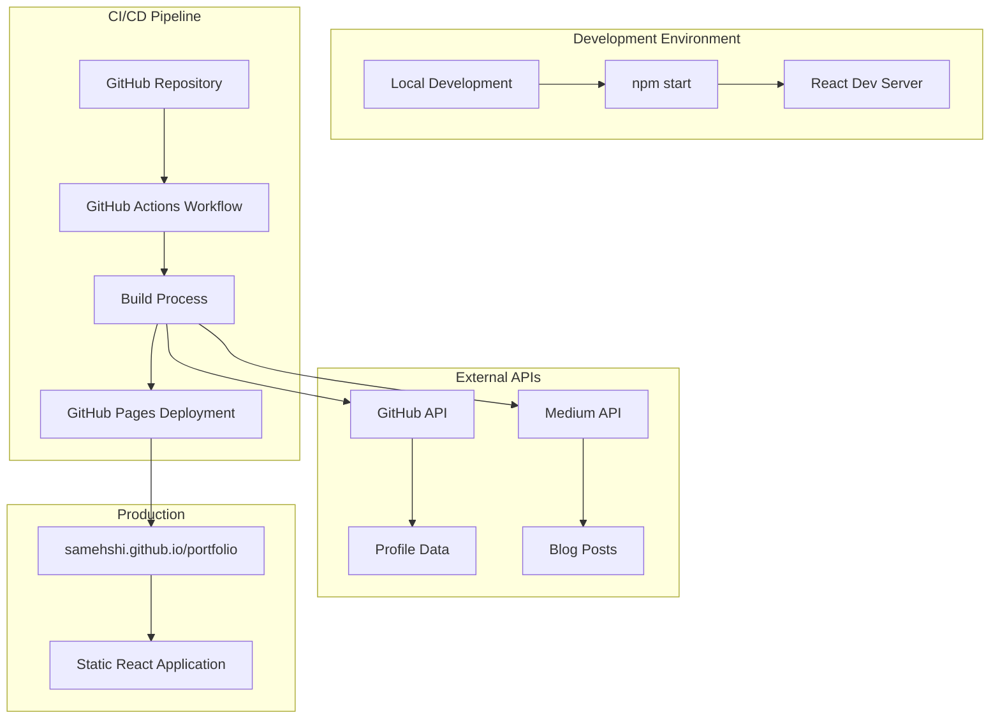
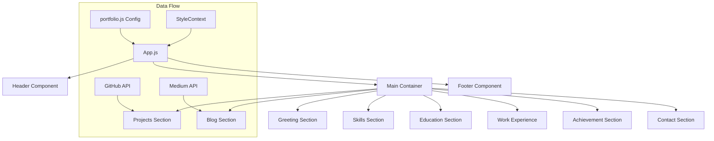
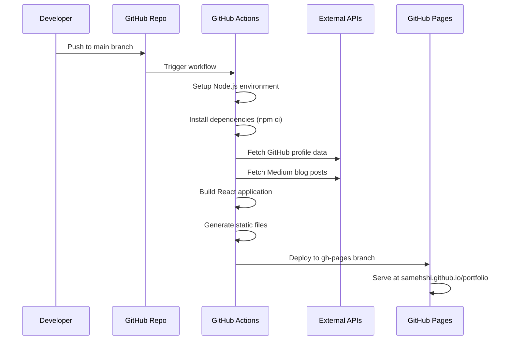
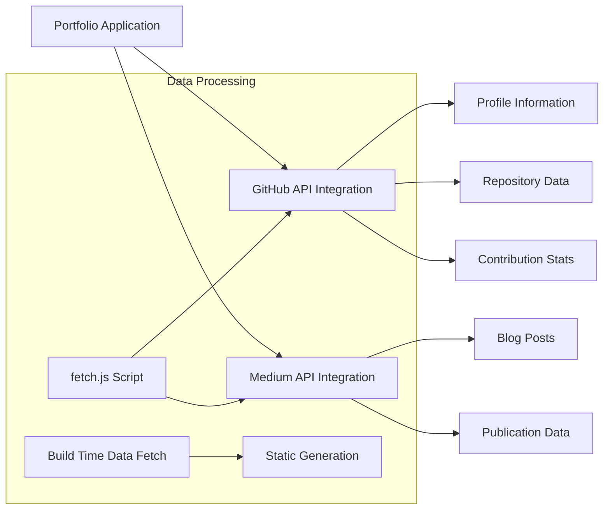
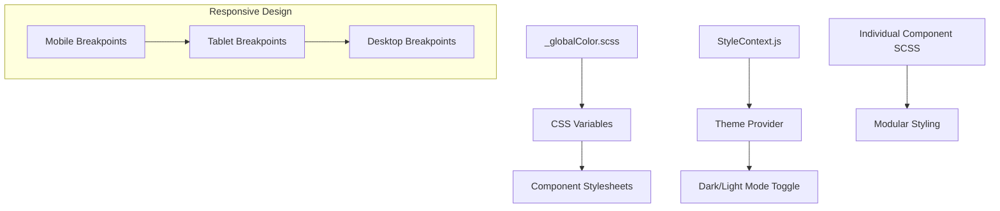
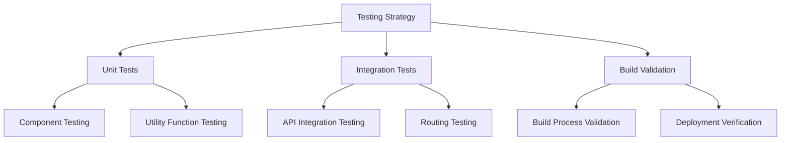
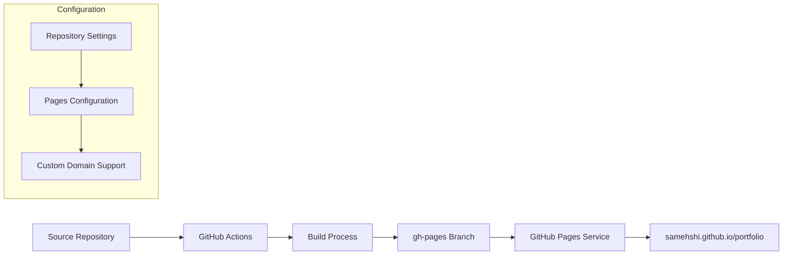
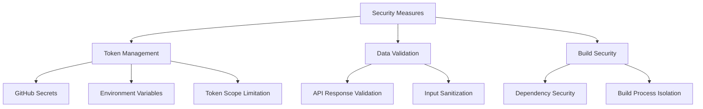
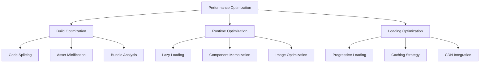
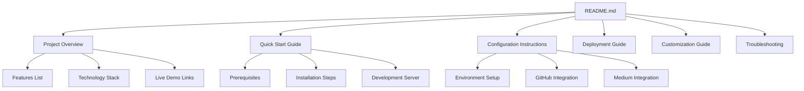

# Portfolio Repository Setup Design

## Overview

This design document outlines the complete setup process for deploying a React-based developer portfolio to GitHub Pages at `samehshi.github.io/portfolio`. The portfolio is built using React 16.10.2 with modern styling and integrates with external APIs (GitHub, Medium) to dynamically fetch content. The solution includes automated deployment via GitHub Actions and proper configuration for both development and production environments.

### Project Context
- **Repository Type**: Frontend Application (React SPA)
- **Deployment Target**: GitHub Pages (`samehshi.github.io/portfolio`)
- **Technology Stack**: React, Sass, Lottie animations, external API integrations
- **Build System**: Create React App with custom fetch scripts

## Architecture

### System Architecture Overview



### Component Architecture



## Repository Configuration

### Package.json Modifications

The current `package.json` requires updates for proper GitHub Pages deployment:

**Current Configuration:**
```json
{
  "homepage": "https://samehshi.github.io/portfolio",
  "scripts": {
    "predeploy": "npm run build",
    "deploy": "gh-pages -b gh-pages -d build"
  }
}
```

**Required Dependencies Verification:**
- React 16.10.2 (current)
- gh-pages for deployment
- All component dependencies properly installed

### Environment Configuration

**Environment Variables Setup:**

```env
REACT_APP_GITHUB_TOKEN="<PERSONAL_ACCESS_TOKEN>"
GITHUB_USERNAME="samehshi"
USE_GITHUB_DATA="true"
MEDIUM_USERNAME="<MEDIUM_USERNAME>"
```

**Security Configuration:**
- GitHub token stored as repository secret
- No sensitive data in public code
- Proper .gitignore configuration

## GitHub Actions Workflow

### Deployment Pipeline Architecture



### Workflow Configuration

**Current Workflow Analysis:**
- Triggers: Push to main, manual dispatch, weekly schedule
- Environment: Ubuntu latest with Node.js 18.x
- Build process includes data fetching
- Deployment to gh-pages branch

**Required Workflow Enhancements:**

```yaml
name: Build and Deploy Portfolio
env:
  CI: false
on:
  workflow_dispatch:
  push:
    branches: [main]
  schedule:
    - cron: '0 12 * * 1'

jobs:
  build-and-deploy:
    runs-on: ubuntu-latest
    permissions:
      contents: write
      pages: write
      id-token: write
    steps:
      - name: Checkout repository
      - name: Setup Node.js 18.x
      - name: Cache dependencies
      - name: Install dependencies
      - name: Build application
      - name: Deploy to GitHub Pages
      - name: Configure Pages settings
```

## Data Integration Layer

### External API Configuration



### GitHub Integration Features

**Profile Data:**
- Basic profile information
- Pinned repositories display
- Contribution statistics
- Profile picture and bio

**Repository Data:**
- Open source projects showcase
- Repository statistics
- Technology stack detection
- Project descriptions

### Medium Integration Features

**Blog Content:**
- Recent blog posts
- Publication metadata
- Author information
- Content previews

## Styling and Theme System

### Theme Architecture



### Styling Strategy

**Global Styling:**
- SCSS variables for consistent theming
- Responsive design patterns
- Component-specific stylesheets

**Theme Management:**
- Context-based theme switching
- localStorage persistence
- Dynamic color scheme application

## Testing Strategy

### Testing Architecture



### Test Implementation

**Unit Testing:**
- React component functionality
- Utility function validation
- Style consistency checks

**Integration Testing:**
- API data fetching
- Component interaction
- Theme switching functionality

**Build Testing:**
- Successful compilation
- Asset optimization
- Environment variable handling

## Deployment Configuration

### GitHub Pages Setup



### Deployment Process

**Build Configuration:**
- Public path configuration for subdirectory
- Asset optimization and minification
- Environment-specific builds

**Pages Configuration:**
- Source branch: gh-pages
- Build output directory: root (/)
- Custom domain support (optional)

### DNS and Domain Configuration

**GitHub Pages Domain:**
- Primary URL: `samehshi.github.io/portfolio`
- HTTPS enforcement enabled
- Custom domain configuration (optional)

**Repository Settings:**
- Pages source: Deploy from branch
- Branch: gh-pages
- Folder: / (root)

## Security Considerations

### API Security



### Security Implementation

**Token Security:**
- GitHub Personal Access Token with minimal permissions
- Storage in repository secrets
- No hardcoded credentials

**Data Security:**
- API response validation
- Error handling for failed requests
- Graceful degradation for missing data

**Build Security:**
- Dependency vulnerability scanning
- Secure build environment
- Minimal permissions for deployment

## Performance Optimization

### Performance Strategy



### Optimization Techniques

**Build Optimization:**
- Webpack bundle optimization
- Asset compression and minification
- Tree shaking for unused code

**Runtime Performance:**
- Component lazy loading
- Image optimization
- API response caching

**Loading Performance:**
- Progressive content loading
- Critical CSS inlining
- Resource preloading

## README Documentation Structure

### Documentation Architecture



### README Content Structure

**Project Introduction:**
- Clear project description
- Feature highlights
- Technology stack overview
- Live demo links

**Setup Instructions:**
- Prerequisites and requirements
- Step-by-step installation
- Environment configuration
- Development workflow

**Customization Guide:**
- Portfolio content configuration
- Theme customization
- Component modification
- Adding new sections

**Deployment Instructions:**
- GitHub Pages setup
- GitHub Actions configuration
- Domain configuration
- Troubleshooting common issues