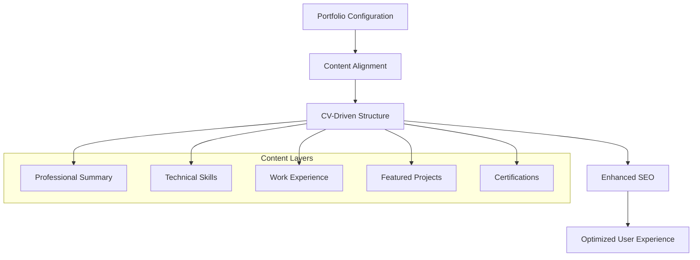
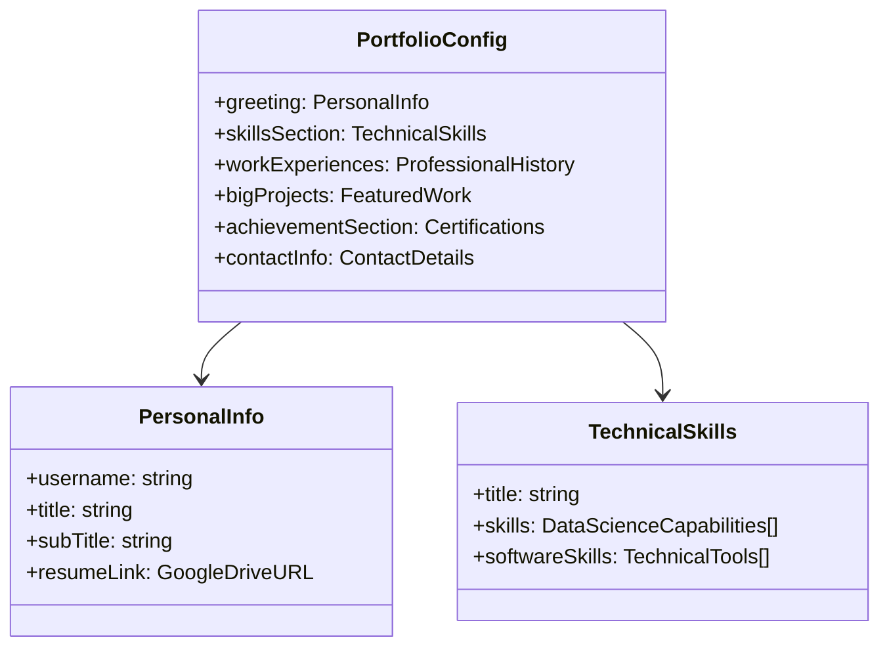
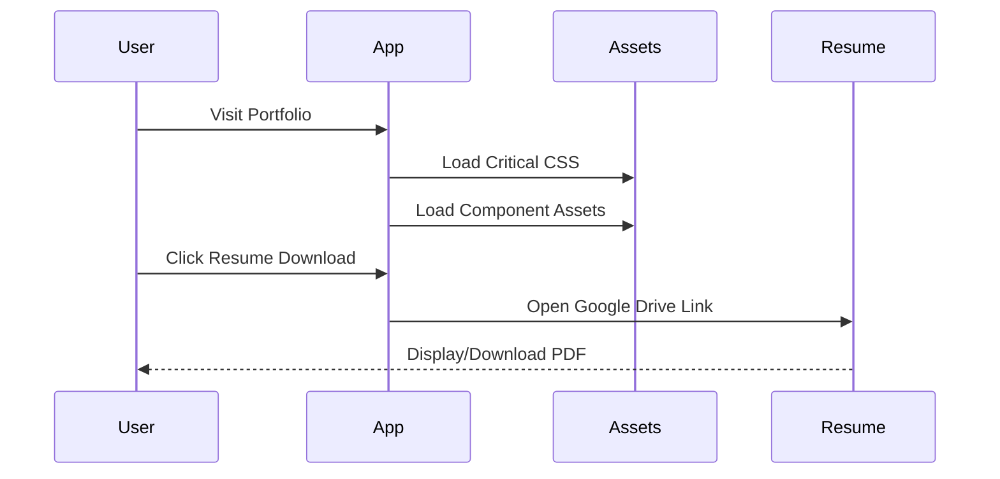

# Site Reorganization & Resume Link Update Design

## Overview

This design document outlines the reorganization of Sameh Shehata Abdelaziz's portfolio website to better align with his CV, update the resume download link to point to Google Drive, and improve SEO metadata for social sharing. The portfolio focuses on data science, business intelligence, and AI expertise with 15+ years of experience.

## Architecture

### Current State Analysis
The portfolio is built as a React SPA with configuration-driven content through `portfolio.js`. The site currently has:
- Data science and BI focused content
- Updated resume link to Google Drive
- Professional metadata optimized for social sharing
- Component-based architecture with clear separation of concerns

### Target Architecture


## Component Architecture

### Portfolio Configuration Structure
The `portfolio.js` file serves as the single source of truth, with sections organized to reflect CV structure:



### Resume Link Integration
The resume download functionality is implemented through:
- **Source**: `portfolio.js` greeting section
- **Target URL**: `https://drive.google.com/file/d/19l9-hfWYe10w2v0uGoPAiixkjl8RKxxb/view?usp=sharing`
- **Component**: Greeting component with download button
- **Behavior**: Opens Google Drive in new tab for viewing/downloading

## Content Alignment Strategy

### Professional Summary Enhancement
Current greeting section optimized for data science positioning:
- **Title**: "Hi all, I'm Sameh"
- **Professional Identity**: Data & BI Analyst with 15+ years experience
- **Value Proposition**: Transforming complex datasets into actionable business insights
- **Key Differentiators**: Advanced analytics, AI, and business intelligence expertise

### Skills Section Optimization
Technical capabilities aligned with CV highlights:

| Skill Category | Tools & Technologies |
|----------------|---------------------|
| Programming | Python, R, SQL |
| BI Platforms | Power BI, Tableau, Looker |
| Cloud & Analytics | AWS, BigQuery, Microsoft Fabric |
| AI/ML | Machine Learning, Gemini, Predictive Analytics |

### Project Portfolio Alignment
Featured projects demonstrate CV competencies:
1. **Bankruptcy Risk Assessment** - Financial services predictive modeling
2. **Earthquake Damage Prediction** - NGO disaster response optimization  
3. **Housing Price Prediction** - Real estate valuation accuracy
4. **Customer Segmentation** - Retail analytics and engagement

### Certifications Showcase
Professional credentials highlighting continuous learning:
- Google Data Analytics Professional Certificate (2023)
- IBM Advanced Data Analytics (2023)
- Microsoft Power BI Data Analyst Associate PL-300 (2024)
- Microsoft Fabric Analytics Engineer Associate DP-600 (2025)
- WorldQuant University Applied Data Science Labs (2024)
- McKinsey Forward Program (2024)

## SEO & Social Media Optimization

### Meta Tags Enhancement
Updated HTML meta tags for improved social sharing:

```html
<title>Sameh Shehata Abdelaziz | Data Scientist & BI Analyst</title>
<meta name="description" content="Data Scientist and Business Intelligence Analyst with 15+ years of experience in transforming complex datasets into actionable business insights.">

<!-- Open Graph -->
<meta property="og:title" content="Sameh Shehata Abdelaziz | Data Scientist & BI Analyst">
<meta property="og:description" content="Data Scientist and BI Analyst with 15+ years experience in AI, machine learning, and advanced analytics.">

<!-- Twitter -->
<meta property="twitter:title" content="Sameh Shehata Abdelaziz | Data Scientist & BI Analyst">
<meta property="twitter:description" content="Data Scientist and BI Analyst with 15+ years experience in AI, machine learning, and advanced analytics.">
```

### URL Structure
- **Production URL**: `https://samehshi.github.io/portfolio/`
- **Resume URL**: Google Drive direct link with sharing permissions
- **Repository**: GitHub Pages deployment with automated CI/CD

## Data Management

### Content Configuration
All content changes implemented through `portfolio.js` modifications:
- Personal information updates
- Professional experience alignment
- Skills and technologies synchronization
- Project descriptions optimization
- Certification details accuracy

### Asset Management
Static assets organized for performance:
- Company logos for work experience
- Project images for portfolio showcase
- Certification provider logos
- Optimized image formats (WebP, PNG)

## Testing Strategy

### Content Validation
- **Resume Link Testing**: Verify Google Drive accessibility and permissions
- **SEO Testing**: Validate meta tags with social media preview tools
- **Responsive Testing**: Ensure optimal display across devices
- **Performance Testing**: Validate loading times and asset optimization

### User Experience Testing
- **Navigation Flow**: Smooth section transitions and anchor links
- **Download Functionality**: Resume access from multiple entry points
- **Social Sharing**: Preview accuracy across platforms
- **Contact Integration**: Form functionality and email integration

## Deployment Configuration

### GitHub Pages Setup
Current deployment configuration:
- **Branch**: `gh-pages` for production deployment
- **Build Process**: Automated via GitHub Actions
- **Domain**: Custom GitHub Pages subdomain
- **SSL**: Enabled through GitHub Pages HTTPS

### Environment Variables
No sensitive data exposure in public repository:
- Google Analytics tracking ID
- Social media integration tokens
- Contact form service endpoints

## Performance Optimization

### Loading Strategy


### Asset Optimization
- **Images**: Compressed and optimized formats
- **Fonts**: Preloaded critical typography
- **Scripts**: Code splitting for faster initial load
- **CSS**: Critical path optimization

## Maintenance Strategy

### Content Updates
- **Portfolio.js**: Single source for all content changes
- **Version Control**: Git-based change tracking
- **Backup Strategy**: Configuration backup file maintained
- **Review Process**: Content accuracy validation

### Technical Maintenance
- **Dependency Updates**: Regular package maintenance
- **Security Patches**: Automated vulnerability scanning
- **Performance Monitoring**: Core Web Vitals tracking
- **Accessibility Compliance**: WCAG 2.1 standards adherence