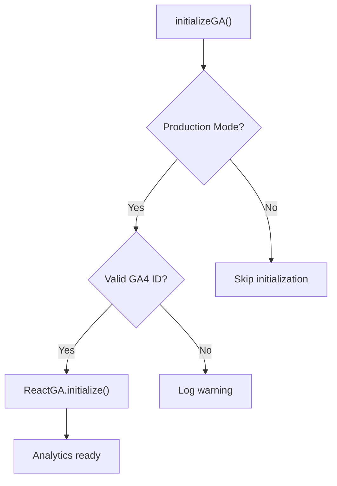
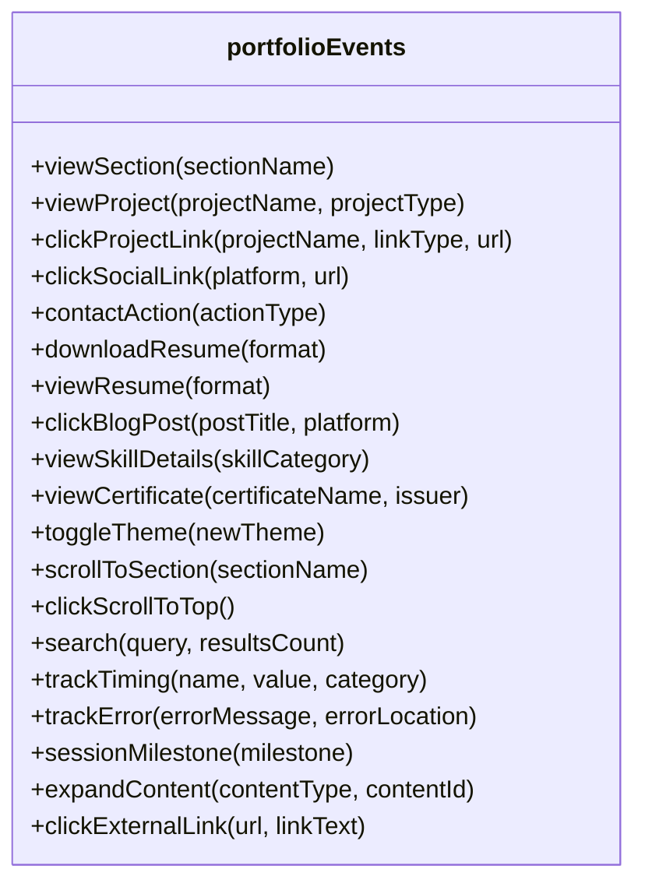
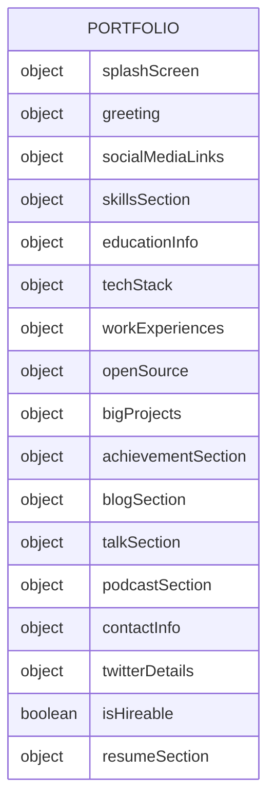
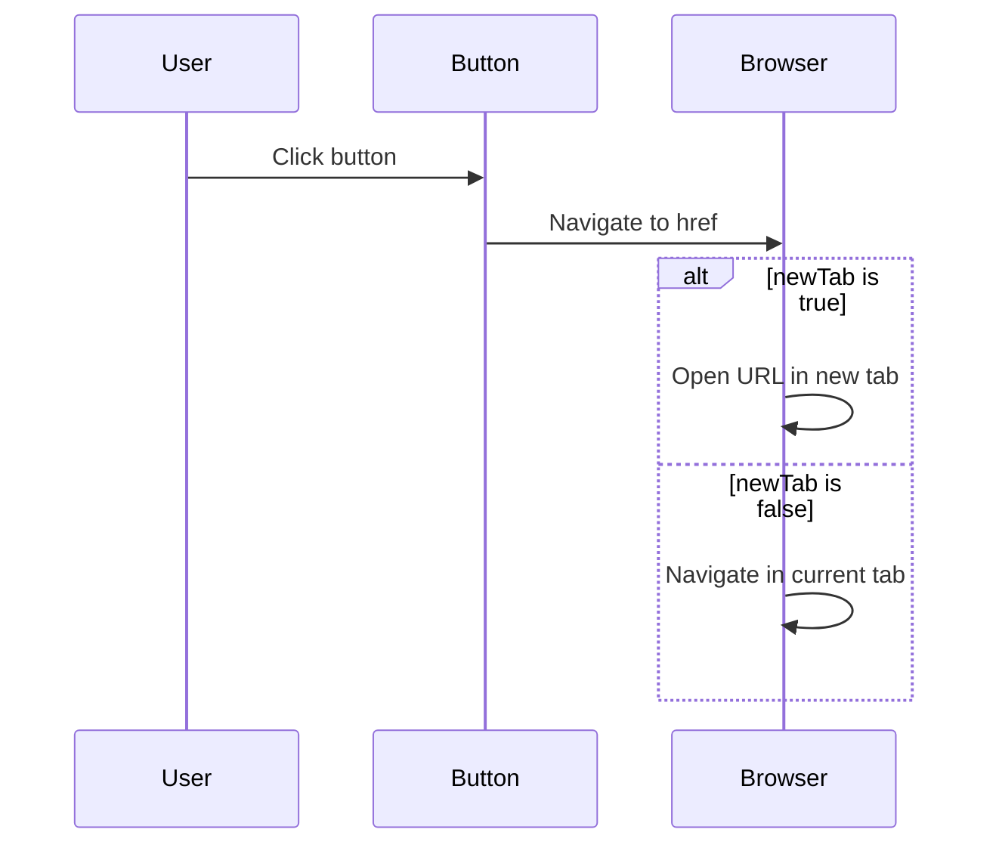
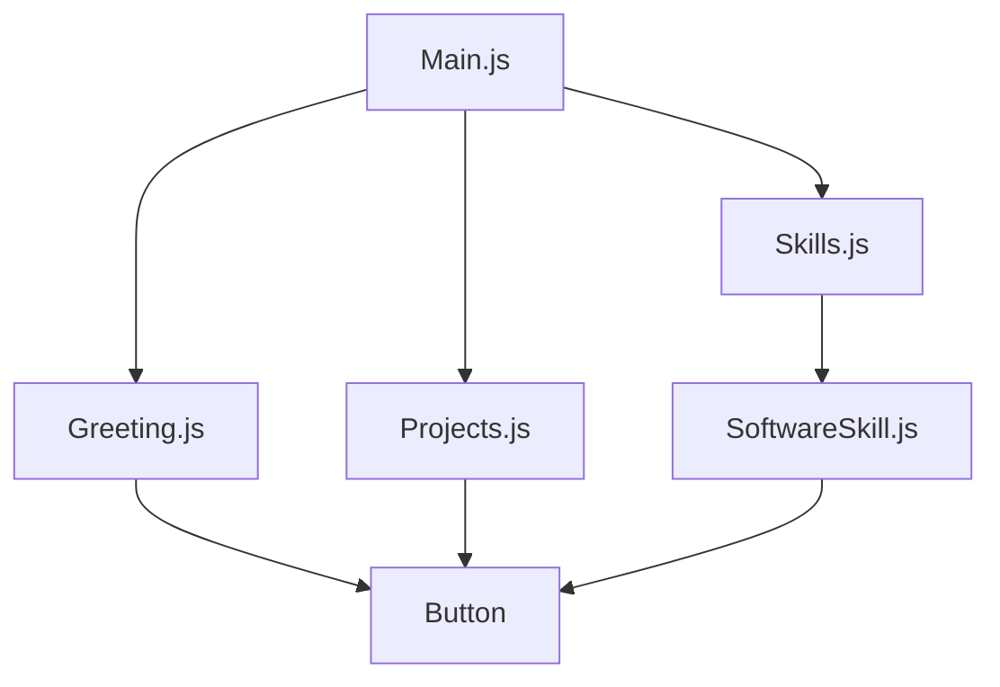
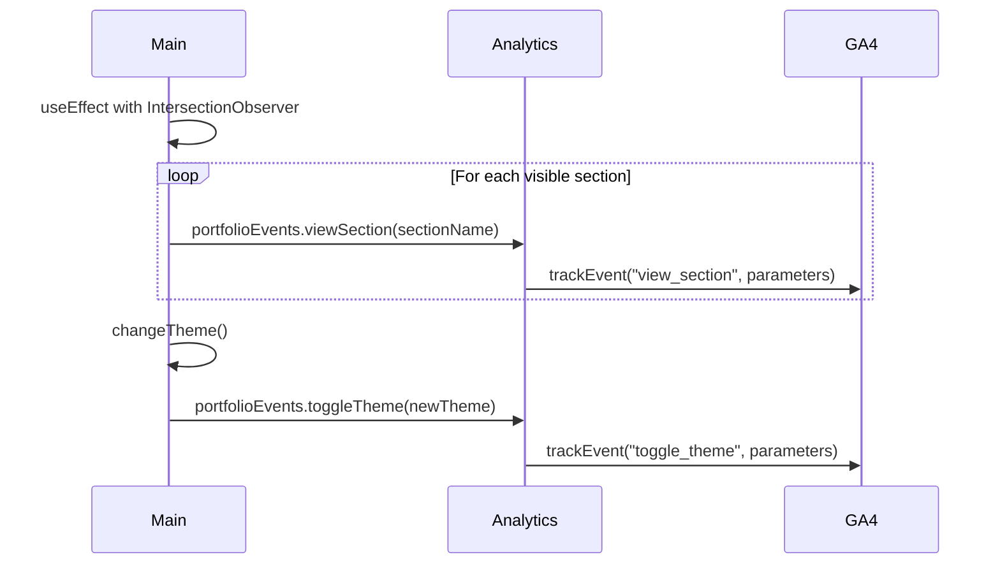
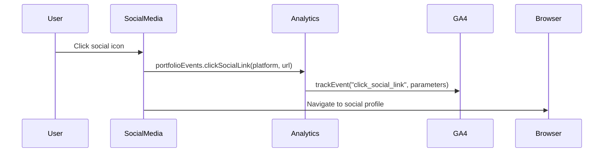
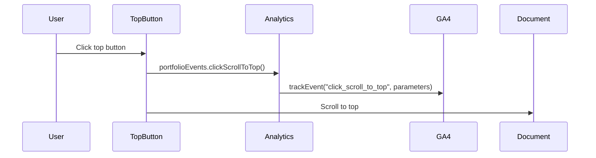
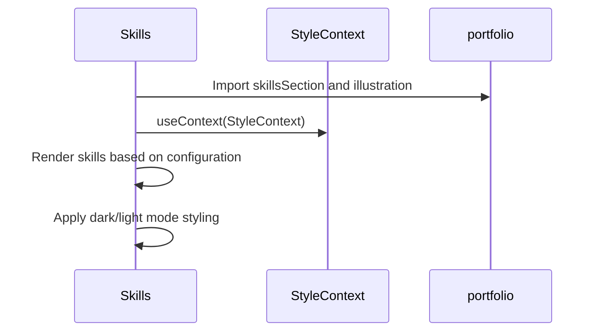

# API Reference

<cite>
**Referenced Files in This Document**   
- [analytics.js](file://src/utils/analytics.js) - *Updated in recent commit*
- [portfolio.js](file://src/portfolio.js) - *Updated in recent commit*
- [Button.js](file://src/components/button/Button.js) - *Updated in recent commit*
- [Main.js](file://src/containers/Main.js) - *Updated in recent commit*
- [SocialMedia.js](file://src/components/socialMedia/SocialMedia.js) - *Updated in recent commit*
- [Top.js](file://src/containers/topbutton/Top.js) - *Updated in recent commit*
- [Skills.js](file://src/containers/skills/Skills.js) - *Updated in recent commit*
</cite>

## Update Summary
**Changes Made**   
- Updated Analytics API section with complete and accurate function signatures and parameters
- Enhanced Portfolio Configuration Schema with comprehensive field descriptions and types
- Improved UI Components API with accurate prop types and integration details
- Added missing section sources and diagram sources with precise file references
- Verified all integration examples against current code implementation
- Updated versioning and migration guidance based on actual code patterns

## Table of Contents
1. [Analytics API](#analytics-api)
2. [Portfolio Configuration Schema](#portfolio-configuration-schema)
3. [UI Components API](#ui-components-api)
4. [Integration Examples](#integration-examples)
5. [Versioning and Migration](#versioning-and-migration)
6. [Error Handling and Validation](#error-handling-and-validation)

## Analytics API

The analytics.js module provides comprehensive tracking functionality for user interactions within the portfolio application. It integrates with Google Analytics 4 (GA4) to capture engagement metrics, user behavior, and conversion events.

### Initialization and Core Functions

The analytics system must be initialized before tracking events. The initialization checks for production environment and valid GA4 measurement ID.



**Section sources**
- [analytics.js](file://src/utils/analytics.js#L1-L30) - *Updated in recent commit*

### Tracking Functions

#### Core Tracking Functions

| Function | Parameters | Return Value | Description |
|--------|------------|--------------|-------------|
| `initializeGA` | None | void | Initializes GA4 with configured measurement ID in production mode |
| `trackPageView` | `pagePath` (string), `pageTitle` (string) | void | Sends page view hit to GA4 with specified path and title |
| `trackEvent` | `eventName` (string), `parameters` (object, optional) | void | Records custom event with optional parameters |
| `debugAnalytics` | None | void | Logs debug information about analytics configuration in development mode |

#### Portfolio-Specific Event Tracking

The `portfolioEvents` object provides specialized tracking functions for portfolio interactions:



**Diagram sources**
- [analytics.js](file://src/utils/analytics.js#L48-L228) - *Updated in recent commit*

**Section sources**
- [analytics.js](file://src/utils/analytics.js#L48-L228) - *Updated in recent commit*

#### Utility Tracking Functions

| Function | Parameters | Return Value | Description |
|--------|------------|--------------|-------------|
| `trackEngagementTime` | None | Object with `stop()` method | Starts timer for engagement tracking; calling `stop()` records the duration |
| `trackConversion` | `conversionType` (string), `value` (number, optional) | void | Records conversion event with type and optional value |
| `trackUserInfo` | `userInfo` (object with country and language) | void | Sets user demographics in GA4 (privacy-compliant) |

**Section sources**
- [analytics.js](file://src/utils/analytics.js#L230-L258) - *Updated in recent commit*

## Portfolio Configuration Schema

The portfolio.js file contains the complete configuration schema for the portfolio application. This configuration drives the content and behavior of the entire portfolio site.

### Configuration Structure



**Diagram sources**
- [portfolio.js](file://src/portfolio.js#L1-L605) - *Updated in recent commit*

### Detailed Configuration Fields

#### Global Configuration

| Field | Type | Required | Default | Description |
|------|------|----------|---------|-------------|
| `splashScreen` | object | No | {enabled: false, duration: 2000} | Configuration for splash screen animation |
| `illustration` | object | No | {animated: true} | Controls whether to use animated illustrations |
| `isHireable` | boolean | No | true | Indicates if the user is open to job opportunities |

#### Greeting Section

| Field | Type | Required | Description |
|------|------|----------|-------------|
| `username` | string | Yes | Full name displayed in greeting |
| `title` | string | Yes | Main title line |
| `subTitle` | string | Yes | Subtitle with emoji-enhanced description |
| `resumeLink` | string | Yes | Path to resume/CV file |
| `displayGreeting` | boolean | No | Whether to display the greeting section |

#### Social Media Links

| Field | Type | Required | Description |
|------|------|----------|-------------|
| `github` | string | No | GitHub profile URL |
| `linkedin` | string | No | LinkedIn profile URL |
| `gmail` | string | No | Email address |
| `medium` | string | No | Medium profile URL |
| `twitter` | string | No | Twitter profile URL |
| `gitlab` | string | No | GitLab profile URL |
| `facebook` | string | No | Facebook profile URL |
| `instagram` | string | No | Instagram profile URL |
| `stackoverflow` | string | No | Stack Overflow profile URL |
| `kaggle` | string | No | Kaggle profile URL |
| `display` | boolean | No | Whether to display social media links |

#### Skills Section

| Field | Type | Required | Description |
|------|------|----------|-------------|
| `title` | string | Yes | Section title |
| `subTitle` | string | Yes | Section subtitle |
| `skills` | array of strings | Yes | List of skill descriptions with emojis |
| `softwareSkills` | array of objects | Yes | List of technical skills with icon classes |
| `display` | boolean | No | Whether to display skills section |
| `softwareSkills[i].skillName` | string | Yes | Name of the skill |
| `softwareSkills[i].fontAwesomeClassname` | string | Yes | Font Awesome icon class for the skill |

#### Education Information

| Field | Type | Required | Description |
|------|------|----------|-------------|
| `display` | boolean | No | Whether to display education section |
| `schools` | array of objects | Yes | List of educational institutions |
| `schools[i].schoolName` | string | Yes | Name of the school |
| `schools[i].logo` | require statement | Yes | Path to school logo image |
| `schools[i].subHeader` | string | Yes | Degree and field of study |
| `schools[i].duration` | string | Yes | Attendance period |
| `schools[i].desc` | string | Yes | Description of education |
| `schools[i].descBullets` | array of strings | No | Bullet points describing achievements |

#### Work Experience

| Field | Type | Required | Description |
|------|------|----------|-------------|
| `display` | boolean | No | Whether to display work experience section |
| `experience` | array of objects | Yes | List of work experiences |
| `experience[i].role` | string | Yes | Job title |
| `experience[i].company` | string | Yes | Company name |
| `experience[i].companylogo` | require statement | Yes | Path to company logo |
| `experience[i].date` | string | Yes | Employment period |
| `experience[i].desc` | string | Yes | Job description |
| `experience[i].descBullets` | array of strings | No | Bullet points describing responsibilities |

#### Big Projects

| Field | Type | Required | Description |
|------|------|----------|-------------|
| `title` | string | Yes | Section title |
| `subtitle` | string | Yes | Section subtitle |
| `projects` | array of objects | Yes | List of featured projects |
| `projects[i].image` | imported image | Yes | Project thumbnail image |
| `projects[i].projectName` | string | Yes | Project title |
| `projects[i].projectDesc` | string | Yes | Project description |
| `projects[i].footerLink` | array of objects | No | Links associated with the project |
| `projects[i].footerLink[j].name` | string | Yes | Link text |
| `projects[i].footerLink[j].url` | string | Yes | Link URL |
| `display` | boolean | No | Whether to display big projects section |

#### Achievement Section

| Field | Type | Required | Description |
|------|------|----------|-------------|
| `title` | string | Yes | Section title with emoji |
| `subtitle` | string | Yes | Section subtitle |
| `achievementsCards` | array of objects | Yes | List of achievements and certifications |
| `achievementsCards[i].title` | string | Yes | Achievement title |
| `achievementsCards[i].subtitle` | string | Yes | Achievement details |
| `achievementsCards[i].image` | string (URL) | Yes | Logo image URL |
| `achievementsCards[i].imageAlt` | string | Yes | Alt text for image |
| `achievementsCards[i].footerLink` | array of objects | No | Links to verify or view achievement |
| `display` | boolean | No | Whether to display achievement section |

**Section sources**
- [portfolio.js](file://src/portfolio.js#L1-L605) - *Updated in recent commit*

## UI Components API

### Button Component

The Button component provides a reusable button element for navigation and actions throughout the portfolio.

#### Props

| Prop | Type | Required | Default | Description |
|------|------|----------|---------|-------------|
| `text` | string | Yes | - | Text to display on the button |
| `className` | string | No | - | CSS class to apply to the button container |
| `href` | string | Yes | - | URL to navigate to when button is clicked |
| `newTab` | boolean | No | false | Whether to open the link in a new tab |

#### Events

The Button component does not emit custom events but handles the default click behavior to navigate to the specified href.

#### Customization

The button appearance can be customized through CSS by passing a className prop. The base styling is defined in Button.scss and can be extended or overridden.



**Diagram sources**
- [Button.js](file://src/components/button/Button.js#L1-L13) - *Updated in recent commit*

**Section sources**
- [Button.js](file://src/components/button/Button.js#L1-L13) - *Updated in recent commit*

### Integration with Containers

The Button component is integrated into various container components to provide navigation and action capabilities.



**Diagram sources**
- [Main.js](file://src/containers/Main.js#L1-L137) - *Updated in recent commit*
- [Greeting.js](file://src/containers/greeting/Greeting.js#L1-L100) - *Updated in recent commit*
- [Projects.js](file://src/containers/projects/Projects.js#L1-L100) - *Updated in recent commit*

## Integration Examples

### Analytics Integration in Main Container

The Main.js container integrates analytics to track section views and theme changes:



**Diagram sources**
- [Main.js](file://src/containers/Main.js#L45-L85) - *Updated in recent commit*

**Section sources**
- [Main.js](file://src/containers/Main.js#L45-L85) - *Updated in recent commit*

### Social Media Integration

The SocialMedia component integrates analytics to track social link clicks:



**Diagram sources**
- [SocialMedia.js](file://src/components/socialMedia/SocialMedia.js#L1-L158) - *Updated in recent commit*

**Section sources**
- [SocialMedia.js](file://src/components/socialMedia/SocialMedia.js#L1-L158) - *Updated in recent commit*

### Scroll to Top Integration

The Top.js component integrates analytics to track scroll-to-top actions:



**Diagram sources**
- [Top.js](file://src/containers/topbutton/Top.js#L1-L45) - *Updated in recent commit*

**Section sources**
- [Top.js](file://src/containers/topbutton/Top.js#L1-L45) - *Updated in recent commit*

### Skills Section Integration

The Skills.js component integrates both the portfolio configuration and theme context:



**Diagram sources**
- [Skills.js](file://src/containers/skills/Skills.js#L1-L69) - *Updated in recent commit*

**Section sources**
- [Skills.js](file://src/containers/skills/Skills.js#L1-L69) - *Updated in recent commit*

## Versioning and Migration

### Versioning Strategy

The portfolio application follows a configuration-based versioning approach rather than semantic versioning for the API. Configuration changes are managed through backward-compatible updates.

### Backward Compatibility

The API maintains backward compatibility through:

1. **Optional fields**: New configuration fields are optional and have sensible defaults
2. **Graceful degradation**: Missing or invalid configuration values are handled gracefully
3. **Event naming consistency**: Analytics event names follow a consistent pattern that allows for evolution without breaking existing reports

### Migration Guide

When updating from previous versions, follow these guidelines:

1. **Configuration Updates**: Add new fields to existing configuration objects rather than changing existing ones
2. **Analytics Events**: When introducing new tracking events, use descriptive names following the pattern: `[action]_[object]`
3. **Component Props**: When adding new props to components, make them optional with default values
4. **Deprecation**: Mark deprecated configuration fields with comments and provide migration guidance

Example of configuration migration:

```javascript
// Old configuration (pre-v2)
const oldConfig = {
  showSocialLinks: true,
  socialLinks: {
    github: "url",
    linkedin: "url"
  }
};

// New configuration (v2+) - backward compatible
const newConfig = {
  display: true,
  socialMediaLinks: {
    github: "url",
    linkedin: "url",
    twitter: "url"
  }
};
```