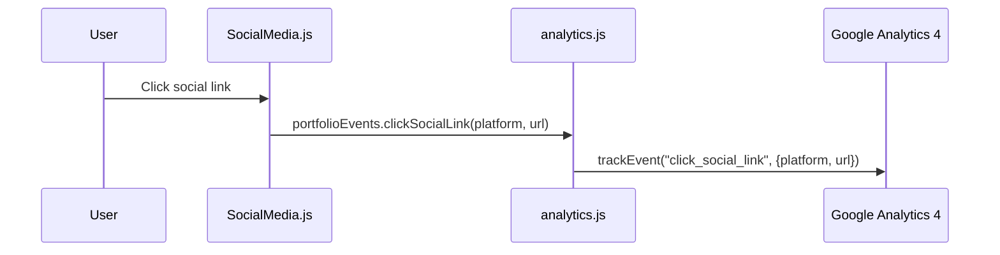
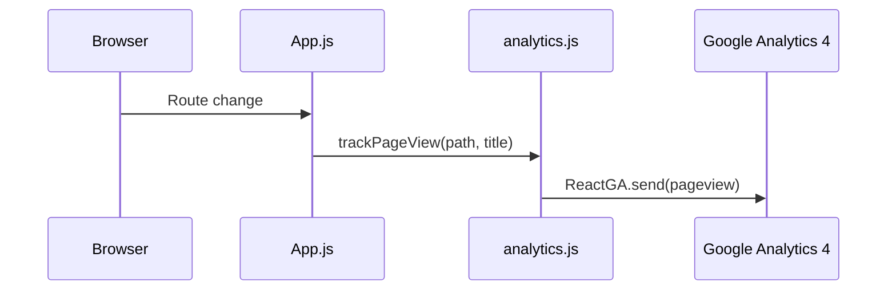

# Analytics API

<cite>
**Referenced Files in This Document**   
- [analytics.js](file://src/utils/analytics.js)
- [SocialMedia.js](file://src/components/socialMedia/SocialMedia.js)
- [Main.js](file://src/containers/Main.js)
- [Projects.js](file://src/containers/projects/Projects.js)
- [Contact.js](file://src/containers/contact/Contact.js)
- [portfolio.js](file://src/portfolio.js)
- [App.js](file://src/App.js)
</cite>

## Table of Contents
1. [Introduction](#introduction)
2. [Core Functions](#core-functions)
3. [Portfolio Events Utility](#portfolio-events-utility)
4. [Initialization and Configuration](#initialization-and-configuration)
5. [Usage in UI Components](#usage-in-ui-components)
6. [Conversion and Error Tracking](#conversion-and-error-tracking)
7. [Security and Privacy Settings](#security-and-privacy-settings)
8. [Debugging and Development](#debugging-and-development)
9. [Data Flow and Sequence Diagrams](#data-flow-and-sequence-diagrams)
10. [Conclusion](#conclusion)

## Introduction
The `analytics.js` module provides a comprehensive interface for integrating Google Analytics 4 (GA4) into the portfolio application. It enables detailed tracking of user interactions, page views, engagement metrics, and business conversions while maintaining privacy compliance and performance optimization. This documentation details all exported functions, their parameters, usage contexts, and integration points across the application.

## Core Functions

### initializeGA
Initializes Google Analytics 4 with environment-specific configuration. Only activates in production when a valid GA4 measurement ID is present.

**Parameters**: None  
**Return Value**: `void`  
**Usage Context**: Called at application startup to configure GA4 with secure cookie settings and disabled ad personalization.

[SPEC SYMBOL](file://src/utils/analytics.js#L8-L24)

### trackPageView
Manually sends page view hits to GA4. Used instead of automatic tracking to maintain control over page context.

**Parameters**:
- `pagePath` (string): URL path of the viewed page
- `pageTitle` (string): Title of the viewed page

**Return Value**: `void`  
**Usage Context**: Triggered on route changes to record navigation behavior.

[SPEC SYMBOL](file://src/utils/analytics.js#L27-L35)

### trackEvent
Generic event tracking function that sends custom events to GA4 with optional parameters.

**Parameters**:
- `eventName` (string): Name of the event
- `parameters` (object, optional): Additional event parameters

**Return Value**: `void`  
**Usage Context**: Base function used by all specialized tracking calls.

[SPEC SYMBOL](file://src/utils/analytics.js#L38-L42)

**Section sources**
- [analytics.js](file://src/utils/analytics.js#L8-L42)

## Portfolio Events Utility
The `portfolioEvents` object contains specialized tracking functions for specific user interactions within the portfolio application.

### viewSection
Tracks when a user views a specific section of the portfolio.

[SPEC SYMBOL](file://src/utils/analytics.js#L47-L53)

### viewProject
Records when a user views a specific project in the portfolio.

[SPEC SYMBOL](file://src/utils/analytics.js#L55-L63)

### clickSocialLink
Captures clicks on social media links across the application.

[SPEC SYMBOL](file://src/utils/analytics.js#L75-L83)

### contactAction
Tracks various contact-related interactions such as email clicks or form submissions.

[SPEC SYMBOL](file://src/utils/analytics.js#L85-L93)

### downloadResume
Monitors resume download events with format specification.

[SPEC SYMBOL](file://src/utils/analytics.js#L95-L104)

### toggleTheme
Records theme switching behavior between light and dark modes.

[SPEC SYMBOL](file://src/utils/analytics.js#L135-L143)

### scrollToSelector
Tracks navigation via scrolling to specific sections.

[SPEC SYMBOL](file://src/utils/analytics.js#L145-L153)

### clickScrollToTop
Captures clicks on the "scroll to top" button.

[SPEC SYMBOL](file://src/utils/analytics.js#L155-L161)

### trackError
Logs JavaScript errors and exceptions for monitoring and debugging.

[SPEC SYMBOL](file://src/utils/analytics.js#L185-L195)

### sessionMilestone
Tracks user engagement duration milestones.

[SPEC SYMBOL](file://src/utils/analytics.js#L197-L204)

**Section sources**
- [analytics.js](file://src/utils/analytics.js#L45-L204)

## Initialization and Configuration
The analytics module uses environment variables to determine tracking behavior:

- `REACT_APP_GA4_MEASUREMENT_ID`: GA4 measurement ID (defaults to `G-09NVE6K239`)
- `NODE_ENV`: Determines production vs development mode

GA4 is initialized with the following security-conscious settings:
- `send_page_view: false` – Manual page view control
- `cookie_flags: "SameSite=None;Secure"` – Secure cookie configuration
- `allow_ad_personalization_signals: false` – Disables ad personalization
- `allow_google_signals: false` – Prevents Google signal collection

These settings ensure compliance with privacy regulations while maintaining accurate tracking in production environments.

**Section sources**
- [analytics.js](file://src/utils/analytics.js#L3-L24)

## Usage in UI Components

### Social Media Links
The `SocialMedia.js` component integrates `clickSocialLink` to track interactions with social platforms:



**Diagram sources**
- [SocialMedia.js](file://src/components/socialMedia/SocialMedia.js#L7-L157)
- [analytics.js](file://src/utils/analytics.js#L75-L83)

### Section Visibility Tracking
The `Main.js` component uses Intersection Observer to automatically track section views:

[SPEC SYMBOL](file://src/containers/Main.js#L55-L65)

### Theme Toggle Tracking
Theme changes are tracked when users switch between dark and light modes:

[SPEC SYMBOL](file://src/containers/Main.js#L125-L127)

**Section sources**
- [SocialMedia.js](file://src/components/socialMedia/SocialMedia.js#L7-L157)
- [Main.js](file://src/containers/Main.js#L55-L65)

## Conversion and Error Tracking

### trackConversion
Tracks business impact events such as form submissions or downloads with monetary value.

**Parameters**:
- `conversionType` (string): Type of conversion
- `value` (number, optional): Numeric value of conversion (default: 1)

**Return Value**: `void`  
**Usage Context**: Measures success events like contact form submissions or PDF downloads.

[SPEC SYMBOL](file://src/utils/analytics.js#L245-L253)

### trackError
Captures non-fatal JavaScript errors for monitoring application stability.

**Parameters**:
- `errorMessage` (string): Description of the error
- `errorLocation` (string): Where the error occurred

**Return Value**: `void`  
**Usage Context**: Integrated with error boundaries or try-catch blocks to monitor client-side issues.

[SPEC SYMBOL](file://src/utils/analytics.js#L185-L195)

**Section sources**
- [analytics.js](file://src/utils/analytics.js#L185-L195)
- [analytics.js](file://src/utils/analytics.js#L245-L253)

## Security and Privacy Settings
The analytics implementation prioritizes user privacy and regulatory compliance:

- **Ad Personalization Disabled**: `allow_ad_personalization_signals: false`
- **Google Signals Blocked**: `allow_google_signals: false`
- **Secure Cookies**: `cookie_flags: "SameSite=None;Secure"`
- **Development Mode Protection**: Tracking disabled when `NODE_ENV !== "production"`
- **Measurement ID Validation**: Only initializes with valid `G-` prefixed IDs

These settings align with GDPR and CCPA requirements by minimizing data collection and preventing cross-site tracking capabilities.

**Section sources**
- [analytics.js](file://src/utils/analytics.js#L15-L24)

## Debugging and Development

### debugAnalytics
Provides diagnostic information during development without sending data to GA4.

**Parameters**: None  
**Return Value**: `void`  
**Output**: Console log with GA4 configuration status

[SPEC SYMBOL](file://src/utils/analytics.js#L266-L274)

The function outputs:
- Current GA measurement ID
- Production mode status
- Initialization state of ReactGA

This utility helps developers verify tracking setup without affecting production data.

**Section sources**
- [analytics.js](file://src/utils/analytics.js#L266-L274)

## Data Flow and Sequence Diagrams

### Page View Tracking Flow


**Diagram sources**
- [App.js](file://src/App.js#L12)
- [analytics.js](file://src/utils/analytics.js#L27-L35)

### Event Tracking Architecture
```mermaid
graph TB
A[UI Component] --> B{Interaction}
B --> C[Call portfolioEvents.method()]
C --> D[trackEvent with parameters]
D --> E{isProduction?}
E --> |Yes| F[Send to GA4]
E --> |No| G[No tracking]
```

**Diagram sources**
- [analytics.js](file://src/utils/analytics.js#L38-L42)
- [Main.js](file://src/containers/Main.js#L55-L65)

## Conclusion
The `analytics.js` module provides a robust, privacy-conscious analytics solution for the portfolio application. It enables granular tracking of user engagement while maintaining compliance with data protection regulations. The modular design allows easy extension of tracking capabilities, and the integration with ReactGA ensures reliable data collection in production environments. Developers can leverage the debugging utilities to verify implementation without affecting live analytics data.