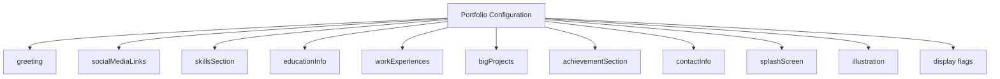
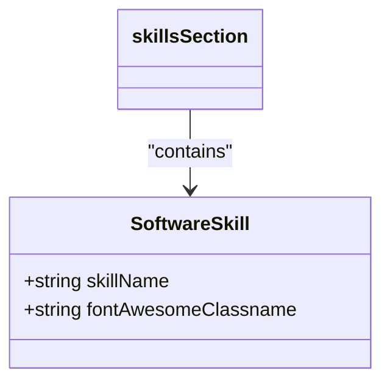

# Configuration Schema

<cite>
**Referenced Files in This Document**   
- [portfolio.js](file://src/portfolio.js)
- [SEO.js](file://src/components/SEO/SEO.js)
- [SplashScreen.js](file://src/containers/splashScreen/SplashScreen.js)
- [SoftwareSkill.js](file://src/components/softwareSkills/SoftwareSkill.js)
- [Achievement.js](file://src/containers/achievement/Achievement.js)
- [Projects.js](file://src/containers/projects/Projects.js)
</cite>

## Table of Contents
1. [Introduction](#introduction)
2. [Top-Level Configuration Sections](#top-level-configuration-sections)
3. [Greeting Section](#greeting-section)
4. [Social Media Links](#social-media-links)
5. [Skills Section](#skills-section)
6. [Education Information](#education-information)
7. [Work Experiences](#work-experiences)
8. [Big Projects](#big-projects)
9. [Achievement Section](#achievement-section)
10. [Contact Information](#contact-information)
11. [Dynamic Content Rendering](#dynamic-content-rendering)
12. [Display Flags and Section Visibility](#display-flags-and-section-visibility)
13. [Splash Screen Configuration](#splash-screen-configuration)
14. [Illustration Settings](#illustration-settings)
15. [SEO Metadata Generation](#seo-metadata-generation)
16. [Validation Rules and Troubleshooting](#validation-rules-and-troubleshooting)
17. [Example Configurations](#example-configurations)

## Introduction
The portfolio.js configuration schema serves as the central data source for the personal portfolio application, defining all content, styling, and behavioral aspects of the website. This comprehensive configuration file enables complete customization of the portfolio without requiring code modifications, allowing users to update their professional information, skills, projects, and other details through a structured JavaScript object format. The schema drives both UI rendering and SEO metadata generation, ensuring that content updates automatically propagate throughout the application.

**Section sources**
- [portfolio.js](file://src/portfolio.js#L1-L50)

## Top-Level Configuration Sections
The portfolio.js configuration file contains multiple top-level sections that organize different aspects of the portfolio. Each section corresponds to a specific component or feature of the website, allowing for modular configuration and easy maintenance. The configuration includes sections for greeting, social media links, skills, education, work experience, projects, achievements, contact information, and various display settings.

**Diagram sources**
- [portfolio.js](file://src/portfolio.js#L1-L604)

**Section sources**
- [portfolio.js](file://src/portfolio.js#L1-L604)

## Greeting Section
The greeting section configures the introductory content displayed at the beginning of the portfolio. This section includes the user's name, title, subtitle, resume download link, and display settings.

### Properties
- **username**: string - Full name of the portfolio owner (required)
- **title**: string - Professional title or headline (required)
- **subTitle**: string - Detailed professional description with emoji support (required)
- **resumeLink**: string - Path to the resume/CV file for download (required)
- **displayGreeting**: boolean - Controls visibility of the greeting section (default: true)

The greeting section uses the `emoji()` function to render emoji characters in the subtitle, enhancing visual appeal and engagement. The resumeLink property should point to a downloadable PDF file stored in the public directory.

**Section sources**
- [portfolio.js](file://src/portfolio.js#L25-L40)

## Social Media Links
The socialMediaLinks section defines the user's professional social media profiles and contact information.

### Properties
- **github**: string - URL to GitHub profile (required)
- **linkedin**: string - URL to LinkedIn profile (required)
- **gmail**: string - Email address for contact (required)
- **medium**: string - URL to Medium profile (optional)
- **display**: boolean - Controls visibility of the social media section (default: false)

All social media links are rendered using Font Awesome icons, with automatic icon selection based on the platform. The display property allows users to hide the entire section when not needed.

**Section sources**
- [portfolio.js](file://src/portfolio.js#L42-L55)

## Skills Section
The skillsSection configures the skills and technical expertise display, including both descriptive skills and software skills with visual icons.

### Properties
- **title**: string - Section title (required)
- **subTitle**: string - Section subtitle with emoji support (required)
- **skills**: array of strings - Descriptive skill statements using emoji() function (required)
- **softwareSkills**: array of objects - Technical skills with Font Awesome icons (required)
- **display**: boolean - Controls visibility of the skills section (default: true)

### Software Skills Structure
Each software skill object contains:
- **skillName**: string - Name of the technical skill (required)
- **fontAwesomeClassname**: string - Font Awesome CSS class for the icon (required)

The softwareSkills array renders icons using the specified Font Awesome classname, creating a visual representation of technical proficiency. Users must ensure correct Font Awesome classnames are used to display the appropriate icons.

**Diagram sources**
- [SoftwareSkill.js](file://src/components/softwareSkills/SoftwareSkill.js#L1-L27)

**Section sources**
- [portfolio.js](file://src/portfolio.js#L57-L120)
- [SoftwareSkill.js](file://src/components/softwareSkills/SoftwareSkill.js#L1-L27)

## Education Information
The educationInfo section configures the display of academic background and educational achievements.

### Properties
- **display**: boolean - Controls visibility of the education section (default: true)
- **schools**: array of objects - Educational institutions attended

### School Object Structure
Each school object contains:
- **schoolName**: string - Name of the educational institution (required)
- **logo**: require() - Path to the school logo image (required)
- **subHeader**: string - Degree and field of study (required)
- **duration**: string - Attendance period in "YYYY — YYYY" format (required)
- **desc**: string - Description of the educational experience (required)
- **descBullets**: array of strings - Bullet points highlighting key achievements or focus areas

The logo property uses the `require()` function to import image assets, ensuring proper bundling and optimization.

**Section sources**
- [portfolio.js](file://src/portfolio.js#L122-L145)

## Work Experiences
The workExperiences section configures the professional work history display.

### Properties
- **display**: boolean - Controls visibility of the work experiences section (default: true)
- **experience**: array of objects - Professional roles and positions

### Experience Object Structure
Each experience object contains:
- **role**: string - Job title or position (required)
- **company**: string - Company name (required)
- **companylogo**: require() - Path to the company logo image (required)
- **date**: string - Employment period in "YYYY — YYYY" format (required)
- **desc**: string - Description of responsibilities and achievements (required)
- **descBullets**: array of strings - Bullet points highlighting key accomplishments

The work experiences are displayed in reverse chronological order, with the most recent position appearing first.

**Section sources**
- [portfolio.js](file://src/portfolio.js#L147-L188)

## Big Projects
The bigProjects section configures the display of featured projects and accomplishments.

### Properties
- **title**: string - Section title (required)
- **subtitle**: string - Section subtitle with emoji support (required)
- **projects**: array of objects - Featured projects
- **display**: boolean - Controls visibility of the big projects section (default: true)

### Project Object Structure
Each project object contains:
- **image**: imported image - Project illustration or screenshot (required)
- **projectName**: string - Name of the project (required)
- **projectDesc**: string - Description of the project (required)
- **footerLink**: array of objects - Links associated with the project

### Footer Link Structure
Each footer link object contains:
- **name**: string - Display text for the link (required)
- **url**: string - URL destination (required)

Projects are organized into thematic categories using comments within the configuration, allowing for logical grouping of related projects.

**Section sources**
- [portfolio.js](file://src/portfolio.js#L190-L320)
- [Projects.js](file://src/containers/projects/Projects.js#L1-L75)

## Achievement Section
The achievementSection configures the display of certifications, awards, and professional milestones.

### Properties
- **title**: string - Section title with emoji support (required)
- **subtitle**: string - Section subtitle (required)
- **achievementsCards**: array of objects - Individual achievements
- **display**: boolean - Controls visibility of the achievement section (default: true)

### Achievement Card Structure
Each achievement card object contains:
- **title**: string - Name of the certification or achievement (required)
- **subtitle**: string - Issuing organization and date (required)
- **image**: string - URL to the certification logo (required)
- **imageAlt**: string - Alternative text for the image (required)
- **footerLink**: array of objects - Links to verify or view the achievement

The achievement section supports multiple categories of achievements, including Google certifications, Microsoft certifications, and industry recognition programs.

**Section sources**
- [portfolio.js](file://src/portfolio.js#L322-L440)
- [Achievement.js](file://src/containers/achievement/Achievement.js#L1-L58)

## Contact Information
The contactInfo section configures the contact details and communication options.

### Properties
- **title**: string - Section title with emoji support (required)
- **subtitle**: string - Invitation text for visitors (required)
- **number**: string - Phone number in international format (required)
- **email_address**: string - Email address for contact (required)

The contact information provides multiple channels for potential employers or collaborators to reach the portfolio owner, including phone and email.

**Section sources**
- [portfolio.js](file://src/portfolio.js#L535-L545)

