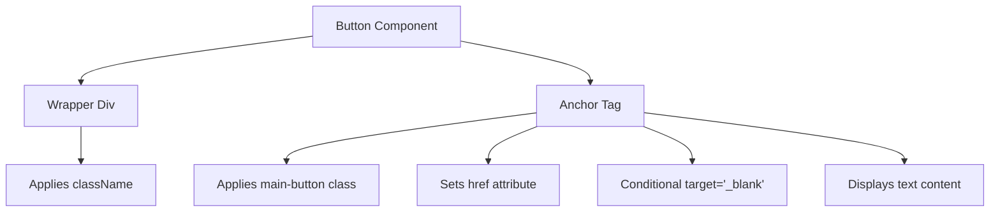
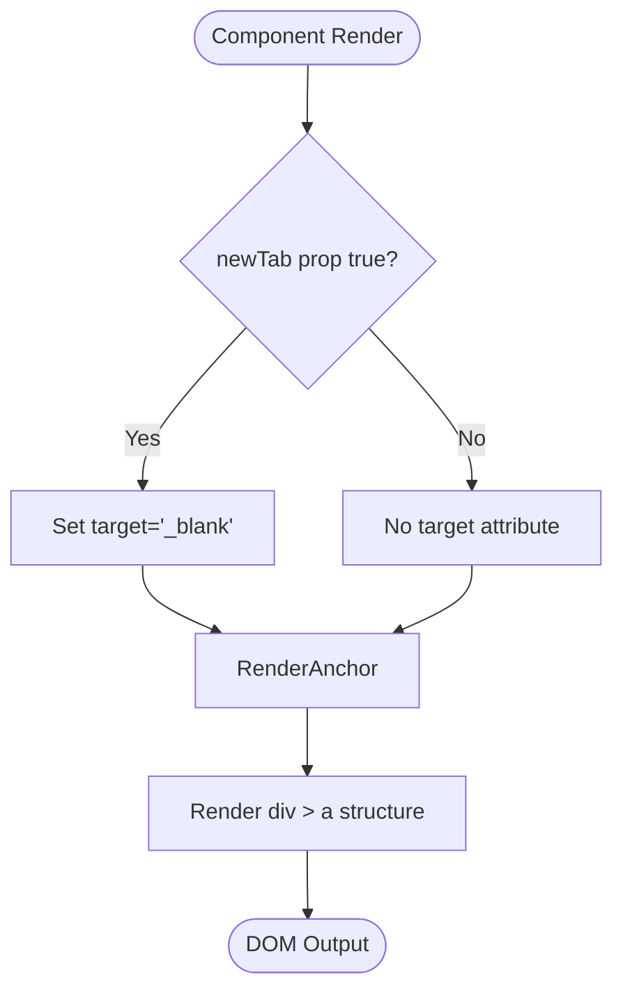
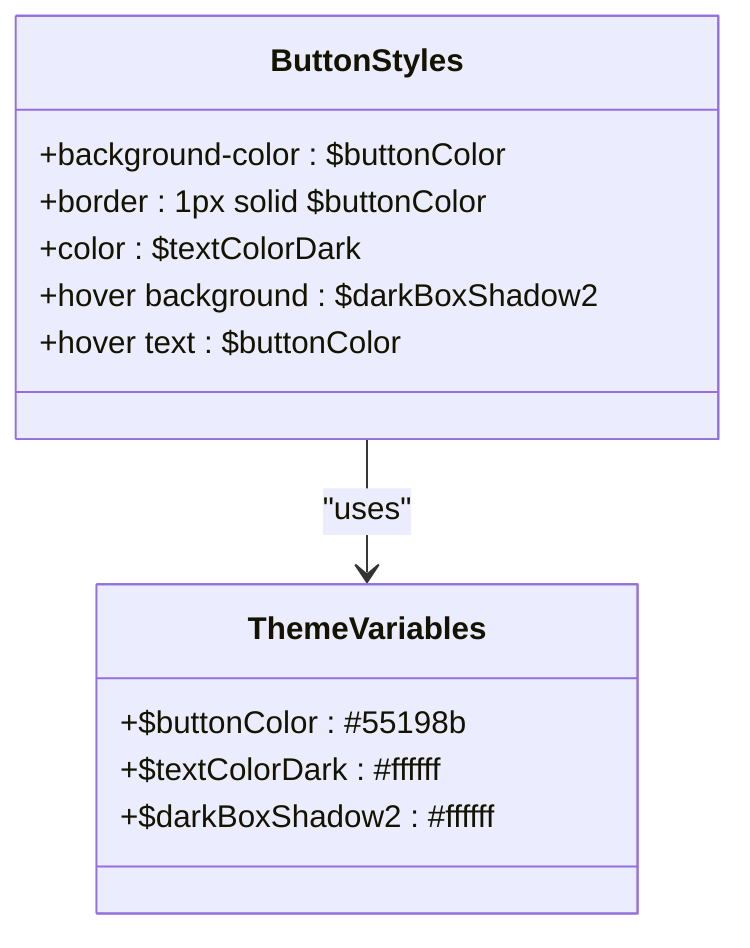

# UI Components API

<cite>
**Referenced Files in This Document**   
- [Button.js](file://src/components/button/Button.js)
- [Button.scss](file://src/components/button/Button.scss)
- [_globalColor.scss](file://src/_globalColor.scss)
- [Projects.js](file://src/containers/projects/Projects.js)
- [Contact.js](file://src/containers/contact/Contact.js)
- [Greeting.js](file://src/containers/greeting/Greeting.js)
</cite>

## Table of Contents
1. [Introduction](#introduction)
2. [Core Components](#core-components)
3. [Architecture Overview](#architecture-overview)
4. [Detailed Component Analysis](#detailed-component-analysis)
5. [Usage Examples](#usage-examples)
6. [Accessibility Considerations](#accessibility-considerations)
7. [Styling and Theme Integration](#styling-and-theme-integration)
8. [Component Usage Across Containers](#component-usage-across-containers)
9. [Performance Implications and Refactoring Suggestions](#performance-implications-and-refactoring-suggestions)

## Introduction
The Button.js component is a reusable UI element designed to render consistent call-to-action buttons across the portfolio application. It leverages semantic HTML anchor tags wrapped in a div container, enabling flexible navigation and download behaviors while maintaining accessibility standards. This documentation provides a comprehensive overview of its API, styling integration, usage patterns, and performance characteristics.

## Core Components

The Button component serves as a foundational UI building block, abstracting common button behaviors and styles for consistent rendering across multiple containers. It accepts four primary props: `text`, `className`, `href`, and `newTab`, enabling diverse use cases from internal navigation to external links.

**Section sources**
- [Button.js](file://src/components/button/Button.js#L3-L11)

## Architecture Overview

The Button component follows a simple functional component pattern in React, using destructured props to render an anchor (`<a>`) tag inside a wrapper `<div>`. The anchor tag always receives the `main-button` class for consistent styling, while the wrapper div uses the passed `className` prop for layout positioning.



**Diagram sources**
- [Button.js](file://src/components/button/Button.js#L3-L11)

## Detailed Component Analysis

### Button Component Analysis

The Button component renders a semantic anchor tag with consistent styling and behavior. It conditionally applies the `target='_blank'` attribute when the `newTab` prop is true, ensuring external links open in new tabs while preserving security with default noreferrer behavior.

#### Prop Definitions
| Prop | Type | Required | Description |
|------|------|----------|-------------|
| text | string | Yes | The visible text content of the button |
| className | string | No | CSS class applied to the wrapper div for layout control |
| href | string | Yes | URL destination for the anchor tag |
| newTab | boolean | No | If true, opens link in a new tab with `target='_blank'` |

The component uses short-circuit evaluation (`target={newTab && "_blank"}`) to conditionally set the target attribute, avoiding unnecessary DOM attributes when not needed.



**Diagram sources**
- [Button.js](file://src/components/button/Button.js#L3-L11)

**Section sources**
- [Button.js](file://src/components/button/Button.js#L3-L11)

## Usage Examples

### Internal Navigation
Used in Greeting.js for smooth page navigation:
```jsx
<Button text="Contact me" href="#contact" />
```

### External Links with New Tab
Used in Projects.js to link to GitHub profile:
```jsx
<Button
  text="More Projects"
  className="project-button"
  href={socialMediaLinks.github}
  newTab={true}
/>
```

### Download Buttons
Can be used with `href` pointing to file resources and `newTab={true}` for download behavior.

**Section sources**
- [Greeting.js](file://src/containers/greeting/Greeting.js#L7)
- [Projects.js](file://src/containers/projects/Projects.js#L2)

## Accessibility Considerations

The Button component maintains accessibility through semantic HTML usage. The anchor tag provides native keyboard navigation and screen reader support. Users can navigate to the button using tab keys and activate it with Enter. The uppercase text transformation and sufficient padding enhance visibility and touch target size. The component inherits contrast ratios from theme variables in `_globalColor.scss`, ensuring readable text against background colors.

**Section sources**
- [Button.js](file://src/components/button/Button.js#L3-L11)
- [_globalColor.scss](file://src/_globalColor.scss#L1-L90)

## Styling and Theme Integration

The Button component integrates with SCSS styling through `Button.scss`, which imports global theme variables from `_globalColor.scss`. The `main-button` class uses `$buttonColor` for background and border, and `$textColorDark` for text, ensuring consistency across light and dark themes. Hover effects utilize `$darkBoxShadow2` and color swaps for visual feedback.



**Diagram sources**
- [Button.scss](file://src/components/button/Button.scss#L1-L47)
- [_globalColor.scss](file://src/_globalColor.scss#L1-L90)

## Component Usage Across Containers

The Button component is reused across multiple containers for consistent call-to-action elements:
- **Projects.js**: "More Projects" button linking to GitHub
- **Greeting.js**: "Contact me" button for internal navigation
- Potentially other containers following the same pattern

This centralized component ensures visual and behavioral consistency while reducing code duplication.

**Section sources**
- [Projects.js](file://src/containers/projects/Projects.js#L2)
- [Greeting.js](file://src/containers/greeting/Greeting.js#L7)
- [Contact.js](file://src/containers/contact/Contact.js)

## Performance Implications and Refactoring Suggestions

The current implementation wraps every button in a div element, which may lead to unnecessary DOM wrappers when multiple buttons are used. While the impact is minimal for small applications, in large-scale usage this could affect rendering performance.

**Refactoring Suggestions:**
1. Consider making the wrapper div optional via a prop
2. Allow customization of the root element (div vs span) for layout flexibility
3. Implement React.memo() for pure component optimization if props are stable
4. Evaluate replacing the div wrapper with CSS grid/flexbox on parent containers

The component's lightweight nature and use of native HTML elements already contribute to good performance characteristics.

**Section sources**
- [Button.js](file://src/components/button/Button.js#L3-L11)
- [Button.scss](file://src/components/button/Button.scss#L1-L47)