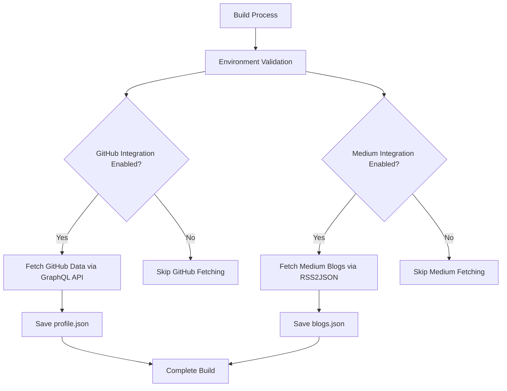
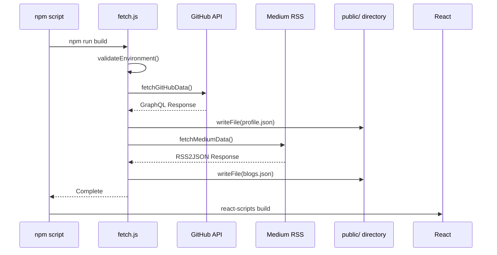
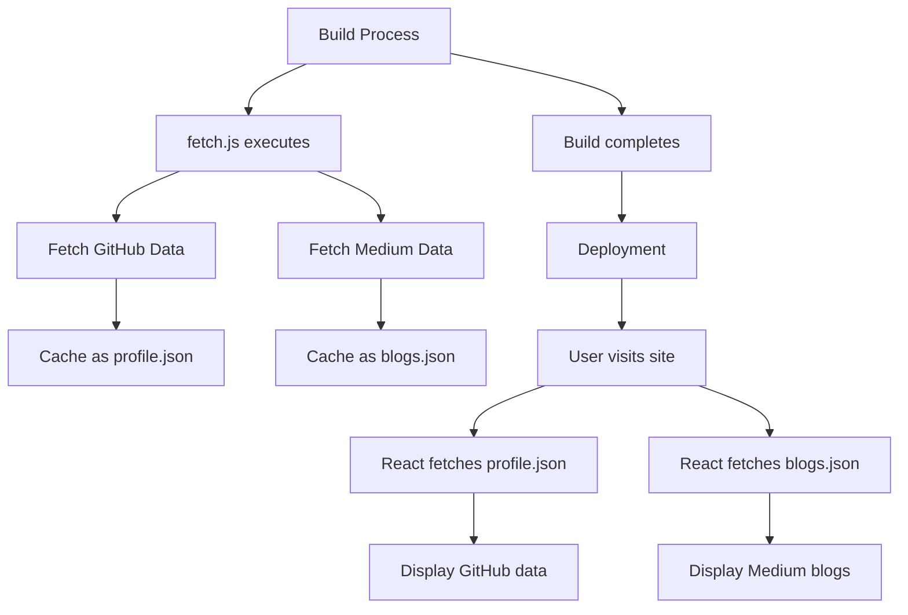
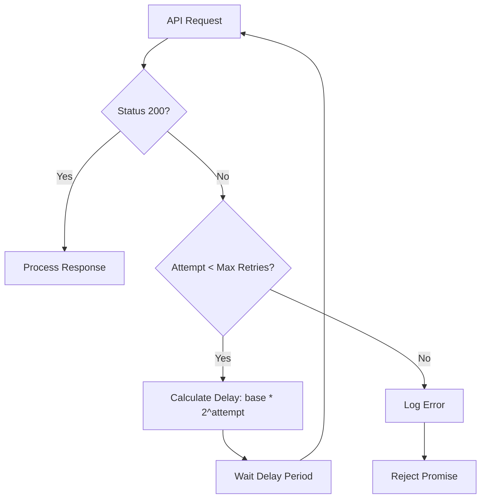

# Advanced Features

<cite>
**Referenced Files in This Document**   
- [fetch.js](file://fetch.js)
- [Blogs.js](file://src/containers/blogs/Blogs.js)
- [Twitter.js](file://src/containers/twitter-embed/Twitter.js)
- [portfolio.js](file://src/portfolio.js)
- [Profile.js](file://src/containers/profile/Profile.js)
- [package.json](file://package.json)
- [.env.example](file://.env.example)
</cite>

## Table of Contents
1. [Introduction](#introduction)
2. [Data Fetching Architecture](#data-fetching-architecture)
3. [Build-Time Data Population](#build-time-data-population)
4. [External API Integration](#external-api-integration)
5. [Caching and Performance Strategies](#caching-and-performance-strategies)
6. [Error Handling and Resilience](#error-handling-and-resilience)
7. [Security Considerations](#security-considerations)
8. [Troubleshooting Guide](#troubleshooting-guide)
9. [Conclusion](#conclusion)

## Introduction

This document details the advanced integration features of the portfolio application, focusing on external API data fetching, build-time content population, and third-party component integration. The system leverages external services like GitHub and Medium to dynamically populate content, enhancing the portfolio with real-time data from professional platforms. The architecture is designed to balance dynamic content with performance optimization through strategic caching and error handling mechanisms.

**Section sources**
- [fetch.js](file://fetch.js#L1-L255)
- [portfolio.js](file://src/portfolio.js#L516-L580)

## Data Fetching Architecture

The portfolio implements a sophisticated data fetching architecture that integrates with external APIs during the build process. This approach ensures that dynamic content from GitHub and Medium is pre-fetched and available as static assets, optimizing both performance and reliability. The system uses environment variables to control which integrations are active, allowing for flexible configuration based on deployment requirements.



**Diagram sources**
- [fetch.js](file://fetch.js#L1-L255)
- [package.json](file://package.json#L50-L55)

**Section sources**
- [fetch.js](file://fetch.js#L1-L255)
- [package.json](file://package.json#L50-L55)

## Build-Time Data Population

The application leverages a build-time data population strategy through the `fetch.js` script, which executes before the React application starts or builds. This script is configured in the `package.json` scripts as a pre-build step, ensuring that external data is fetched and cached before the application serves content to users.



**Diagram sources**
- [fetch.js](file://fetch.js#L1-L255)
- [package.json](file://package.json#L50-L55)

**Section sources**
- [fetch.js](file://fetch.js#L1-L255)
- [package.json](file://package.json#L50-L55)

## External API Integration

### GitHub Integration

The GitHub integration uses the GraphQL API to fetch profile data and pinned repositories. Authentication is handled through a personal access token stored in environment variables, ensuring secure access to GitHub's API. The integration retrieves comprehensive profile information including name, bio, avatar, location, and repository details such as stars, forks, and primary language.

### Medium Integration

Medium content is integrated through the RSS2JSON service, which converts Medium's RSS feed into a JSON format that can be easily consumed by the application. This approach bypasses Medium's lack of a public REST API while still enabling dynamic blog content population. The integration extracts blog titles, links, and content for display in the portfolio.

### Twitter Embedding

Twitter content is embedded using the `react-twitter-embed` library, which provides React components for embedding Twitter timelines. The integration is configured through the `twitterDetails` object in `portfolio.js`, specifying the username to display. The component uses React's Suspense for lazy loading and includes timeout handling to manage potential loading issues.

```mermaid
classDiagram
class Blogs {
+useState mediumBlogs
+useEffect() fetchData()
+extractTextContent(html)
+render()
}
class Twitter {
+useState isDark
+renderLoader()
+timeOut()
+render()
}
class Profile {
+useState prof
+useEffect() fetchData()
+render()
}
Blogs --> "fetches" "/blogs.json"
Twitter --> "embeds" "TwitterTimelineEmbed"
Profile --> "fetches" "/profile.json"
Profile --> "falls back to" "Contact"
```

**Diagram sources**
- [Blogs.js](file://src/containers/blogs/Blogs.js#L1-L100)
- [Twitter.js](file://src/containers/twitter-embed/Twitter.js#L1-L55)
- [Profile.js](file://src/containers/profile/Profile.js#L1-L53)

**Section sources**
- [Blogs.js](file://src/containers/blogs/Blogs.js#L1-L100)
- [Twitter.js](file://src/containers/twitter-embed/Twitter.js#L1-L55)
- [Profile.js](file://src/containers/profile/Profile.js#L1-L53)

## Caching and Performance Strategies

The application implements a multi-layered caching strategy to optimize performance and reduce API calls. During the build process, external API responses are cached as static JSON files in the `public/` directory. This approach transforms dynamic data fetching into static asset serving, significantly improving load times and reducing dependency on external services during runtime.

At runtime, the application uses React's `useEffect` hook to fetch the pre-cached JSON files, eliminating the need for repeated external API calls. This strategy ensures consistent performance regardless of external API availability or rate limiting. The caching mechanism is particularly effective for content that doesn't require real-time updates, such as blog posts and GitHub profile information.



**Diagram sources**
- [fetch.js](file://fetch.js#L1-L255)
- [Blogs.js](file://src/containers/blogs/Blogs.js#L26-L28)
- [Profile.js](file://src/containers/profile/Profile.js#L18-L20)

**Section sources**
- [fetch.js](file://fetch.js#L1-L255)
- [Blogs.js](file://src/containers/blogs/Blogs.js#L1-L100)
- [Profile.js](file://src/containers/profile/Profile.js#L1-L53)

## Error Handling and Resilience

The data fetching system implements comprehensive error handling and resilience strategies to ensure reliability. The `fetchWithRetry` function provides exponential backoff retry logic with configurable retry limits and delay intervals. This approach gracefully handles transient network issues and API rate limiting by automatically retrying failed requests with increasing delays between attempts.

For critical integrations like GitHub, errors are treated as fatal, causing the build process to fail if data cannot be retrieved. This ensures data integrity but requires proper environment configuration. For non-critical integrations like Medium, the system degrades gracefully, continuing the build process even if blog data cannot be fetched, thus maintaining overall application functionality.



**Diagram sources**
- [fetch.js](file://fetch.js#L64-L125)

**Section sources**
- [fetch.js](file://fetch.js#L64-L125)

## Security Considerations

The integration architecture incorporates several security best practices for handling third-party services. API credentials are stored in environment variables rather than hardcoded in the source code, with a `.env.example` file providing template guidance without exposing sensitive information. The GitHub integration uses personal access tokens with limited scopes (public_repo, read:user), following the principle of least privilege.

The application also implements secure coding practices by validating environment variables before making API requests, preventing failed requests due to missing configuration. Additionally, the use of HTTPS for all external API calls ensures data in transit is encrypted. For the Twitter embedding, the application includes timeout handling to prevent indefinite loading states that could be exploited.

**Section sources**
- [fetch.js](file://fetch.js#L1-L255)
- [.env.example](file://.env.example#L1-L24)

## Troubleshooting Guide

### Common Issues and Solutions

#### Environment Configuration Errors
- **Symptom**: "Github Username was found to be undefined"
- **Solution**: Ensure all required environment variables are set in `.env` file, particularly `GITHUB_USERNAME` and `GITHUB_TOKEN`

#### API Rate Limiting
- **Symptom**: Repeated "Request failed with status code: 403"
- **Solution**: Verify GitHub token has proper permissions and consider implementing additional rate limiting controls

#### Medium Integration Failures
- **Symptom**: Blogs section reverts to default content
- **Solution**: Check `MEDIUM_USERNAME` environment variable and verify the Medium RSS feed is accessible

#### Twitter Embed Loading Issues
- **Symptom**: "Can't load? Check privacy protection settings"
- **Solution**: This is often caused by browser privacy settings blocking third-party content; users may need to adjust their browser settings

#### Build Process Failures
- **Symptom**: Build fails during data fetching stage
- **Solution**: Check network connectivity and API endpoint availability; verify environment variables are properly loaded

**Section sources**
- [fetch.js](file://fetch.js#L1-L255)
- [.env.example](file://.env.example#L1-L24)
- [Twitter.js](file://src/containers/twitter-embed/Twitter.js#L1-L55)

## Conclusion

The advanced integration features of this portfolio demonstrate a sophisticated approach to combining static site generation with dynamic external data. By fetching and caching external API data during the build process, the application achieves optimal performance while maintaining up-to-date content from professional platforms. The architecture balances functionality with reliability through comprehensive error handling, security best practices, and graceful degradation strategies. This approach serves as a model for integrating third-party services in static site applications, providing a seamless user experience while minimizing runtime dependencies on external APIs.