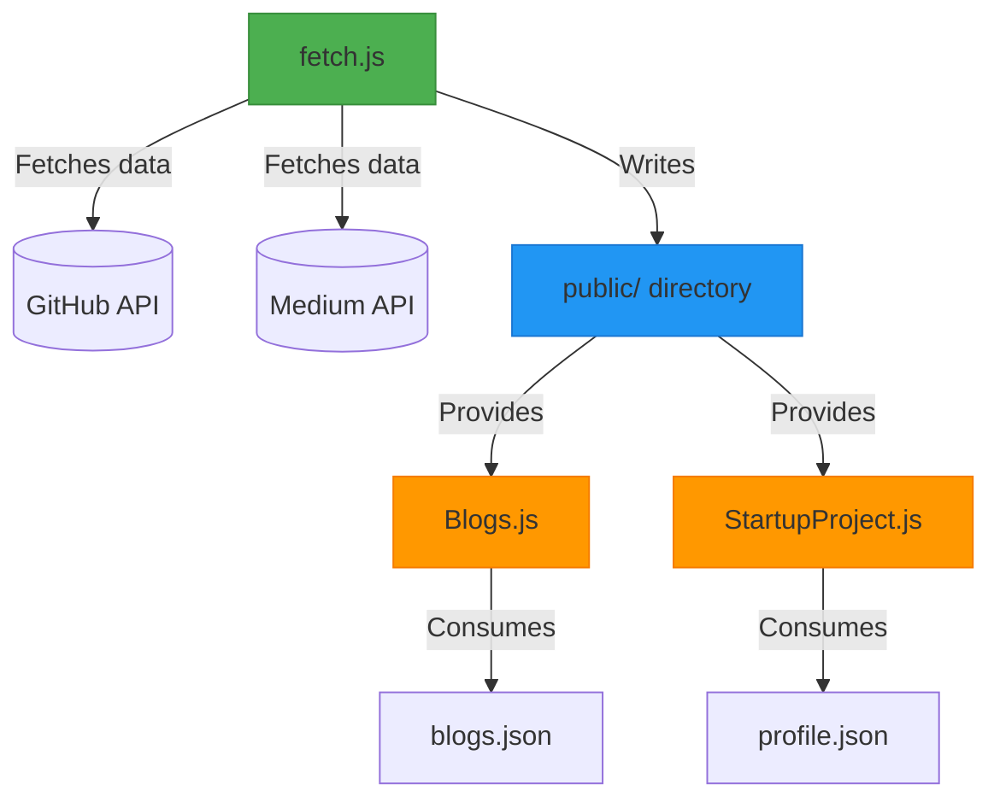
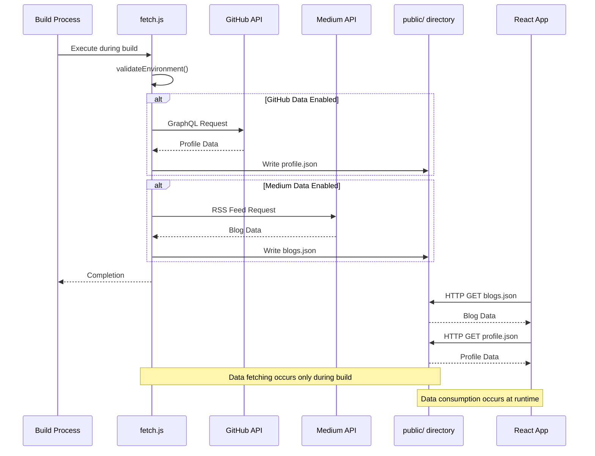
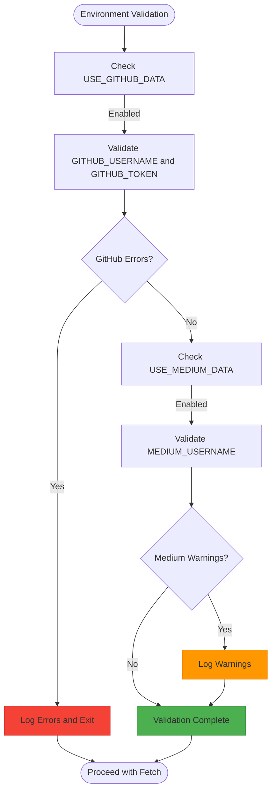
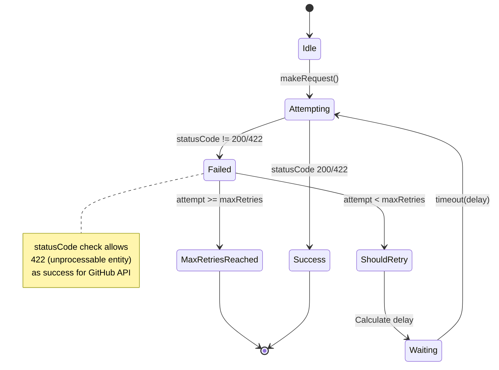
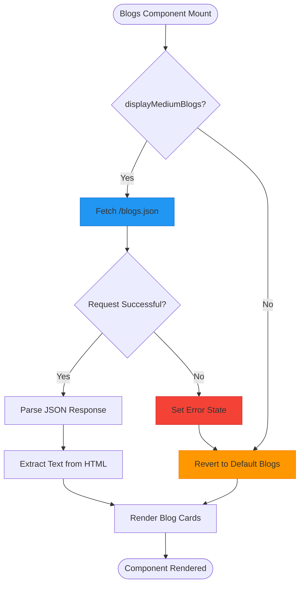

# Dynamic Data Fetching

<cite>
**Referenced Files in This Document**   
- [fetch.js](file://fetch.js)
- [src/containers/blogs/Blogs.js](file://src/containers/blogs/Blogs.js)
- [src/containers/StartupProjects/StartupProject.js](file://src/containers/StartupProjects/StartupProject.js)
- [public/profile.json](file://public/profile.json)
- [public/blogs.json](file://public/blogs.json)
</cite>

## Table of Contents
1. [Introduction](#introduction)
2. [Project Structure](#project-structure)
3. [Core Components](#core-components)
4. [Architecture Overview](#architecture-overview)
5. [Detailed Component Analysis](#detailed-component-analysis)
6. [Dependency Analysis](#dependency-analysis)
7. [Performance Considerations](#performance-considerations)
8. [Troubleshooting Guide](#troubleshooting-guide)
9. [Conclusion](#conclusion)

## Introduction

The dynamic data fetching mechanism implemented in `fetch.js` enables static site generation with dynamic content by retrieving data from external APIs during the build process. This pre-build script populates static assets with fresh content from GitHub and Medium, allowing the React application to consume this data as if it were static files. The system is designed with robust error handling, conditional execution based on environment flags, and secure credential management through environment variables. This documentation provides a comprehensive analysis of the implementation, execution flow, integration points, and best practices for maintaining data consistency in this hybrid static-dynamic architecture.

## Project Structure

The dynamic data fetching system is organized across several key directories in the project structure. The `fetch.js` script at the root level serves as the entry point for pre-build data population. Fetched data is written to the `public/` directory as JSON files, making them accessible to the client-side React application. The container components in `src/containers/` consume these generated files to display dynamic content. This separation of concerns between data fetching (build-time) and data consumption (runtime) enables efficient static site generation while maintaining access to up-to-date external content.



**Diagram sources**
- [fetch.js](file://fetch.js)
- [src/containers/blogs/Blogs.js](file://src/containers/blogs/Blogs.js)
- [src/containers/StartupProjects/StartupProject.js](file://src/containers/StartupProjects/StartupProject.js)
- [public/profile.json](file://public/profile.json)
- [public/blogs.json](file://public/blogs.json)

**Section sources**
- [fetch.js](file://fetch.js)
- [public](file://public)

## Core Components

The dynamic data fetching system comprises several core components that work together to enable static site generation with dynamic content. The `fetch.js` script orchestrates the entire process, beginning with environment validation and proceeding through conditional data fetching from external APIs. Key components include the environment validation function, which ensures all required configuration is present before proceeding; the retry mechanism with exponential backoff for resilient API communication; and the file writing utility with comprehensive error handling. The system is designed to fail gracefully, with critical errors terminating the build process while non-critical failures allow the build to continue with fallback content.

**Section sources**
- [fetch.js](file://fetch.js#L13-L69)
- [fetch.js](file://fetch.js#L72-L142)
- [fetch.js](file://fetch.js#L145-L157)

## Architecture Overview

The dynamic data fetching architecture follows a pre-build execution model where external API data is retrieved and cached as static assets before the site is deployed. This approach combines the performance benefits of static site generation with the freshness of dynamic content. The architecture is controlled by environment flags (`USE_GITHUB_DATA` and `USE_MEDIUM_DATA`) that determine which data sources to query. API credentials are securely managed through environment variables, never exposed in the client-side code. The fetched data is written to the `public/` directory as JSON files, which are then consumed by React components during runtime. This separation ensures that sensitive credentials remain in the build environment while providing fast, cacheable data access to the client application.



**Diagram sources**
- [fetch.js](file://fetch.js)
- [public/profile.json](file://public/profile.json)
- [public/blogs.json](file://public/blogs.json)
- [src/containers/blogs/Blogs.js](file://src/containers/blogs/Blogs.js)

## Detailed Component Analysis

### Environment Validation System

The environment validation system ensures that all required configuration is present before attempting to fetch external data. This prevents failed API requests due to missing credentials and provides clear error messages to developers. The validation checks for the presence of `GITHUB_USERNAME` and `GITHUB_TOKEN` when `USE_GITHUB_DATA` is enabled, and warns about missing `MEDIUM_USERNAME` when `USE_MEDIUM_DATA` is enabled. The system logs the current configuration state, providing visibility into which features are active and which credentials are available.



**Diagram sources**
- [fetch.js](file://fetch.js#L13-L69)

**Section sources**
- [fetch.js](file://fetch.js#L13-L69)

### Retry Mechanism with Exponential Backoff

The retry mechanism implements resilient API communication through exponential backoff, significantly improving reliability in the face of transient network issues or API rate limiting. When a request fails, the system waits for an increasing amount of time before retrying, with the delay calculated as `baseDelay * 2^(attempt-1)`. This approach prevents overwhelming the API with rapid-fire requests during outages while ensuring eventual success when the service recovers. The system logs each attempt, providing visibility into retry behavior during debugging.



**Diagram sources**
- [fetch.js](file://fetch.js#L72-L142)

**Section sources**
- [fetch.js](file://fetch.js#L72-L142)

### Data Consumption in React Components

The React components consume the pre-fetched data through standard HTTP requests to the JSON files in the `public/` directory. The `Blogs.js` component demonstrates this pattern, first checking the `blogSection.displayMediumBlogs` flag to determine whether to fetch external blog data. When enabled, it retrieves the `blogs.json` file and processes the HTML content from Medium's RSS feed to extract plain text descriptions. The component includes comprehensive error handling, falling back to default blog content if the external data cannot be retrieved.



**Diagram sources**
- [src/containers/blogs/Blogs.js](file://src/containers/blogs/Blogs.js#L25-L65)

**Section sources**
- [src/containers/blogs/Blogs.js](file://src/containers/blogs/Blogs.js)

## Dependency Analysis

The dynamic data fetching system has minimal external dependencies, relying primarily on Node.js built-in modules (`fs` and `https`) and the `dotenv` package for environment variable management. The system is designed to be self-contained, with no direct dependencies between the build-time data fetching and runtime application code beyond the generated JSON files. This loose coupling allows the data fetching mechanism to be modified or replaced without affecting the React components, as long as the output format remains consistent. The use of environment variables for configuration enables different behavior across development, staging, and production environments without code changes.

```mermaid
graph LR
fetch[fetch.js] --> fs[fs]
fetch --> https[https]
fetch --> dotenv[dotenv]
fetch --> public[public/]
public --> Blogs[Blogs.js]
public --> StartupProjects[StartupProject.js]
classDef node fill:#4CAF50,stroke:#388E3C;
classDef external fill:#9C27B0,stroke:#7B1FA2;
classDef output fill:#2196F3,stroke:#1976D2;
classDef component fill:#FF9800,stroke:#F57C00;
class fs,node
class https,node
class dotenv,external
class public,output
class Blogs,component
class StartupProjects,component
```

**Diagram sources**
- [fetch.js](file://fetch.js)
- [package.json](file://package.json)

**Section sources**
- [fetch.js](file://fetch.js)
- [package.json](file://package.json)

## Performance Considerations

The pre-build data fetching approach offers significant performance advantages by eliminating runtime API calls to external services. Since the data is fetched once during the build process and served as static files, page load times are minimized and not subject to external API latency or availability. The retry mechanism with exponential backoff ensures reliable data retrieval without compromising build performance through excessive retry attempts. For large datasets, the system could be enhanced with caching strategies to avoid refetching unchanged data on every build, further optimizing build times. The conditional execution based on environment flags allows developers to disable non-essential data fetching during development, speeding up the build-test cycle.

## Troubleshooting Guide

When troubleshooting issues with the dynamic data fetching system, begin by examining the console output from the `fetch.js` script, which provides detailed logging of the environment validation, API requests, and file writing operations. Common issues include missing environment variables, invalid API credentials, and network connectivity problems. The environment validation phase will identify configuration issues before any API requests are made, providing clear error messages. For API connectivity issues, check the retry logs to determine if the problem is transient (resolved by retries) or persistent. If the JSON files are not being generated, verify that the `public/` directory is writable and that the build process has the necessary permissions. When debugging data display issues in React components, use browser developer tools to inspect the network requests for the JSON files and verify their content.

**Section sources**
- [fetch.js](file://fetch.js)
- [src/containers/blogs/Blogs.js](file://src/containers/blogs/Blogs.js)