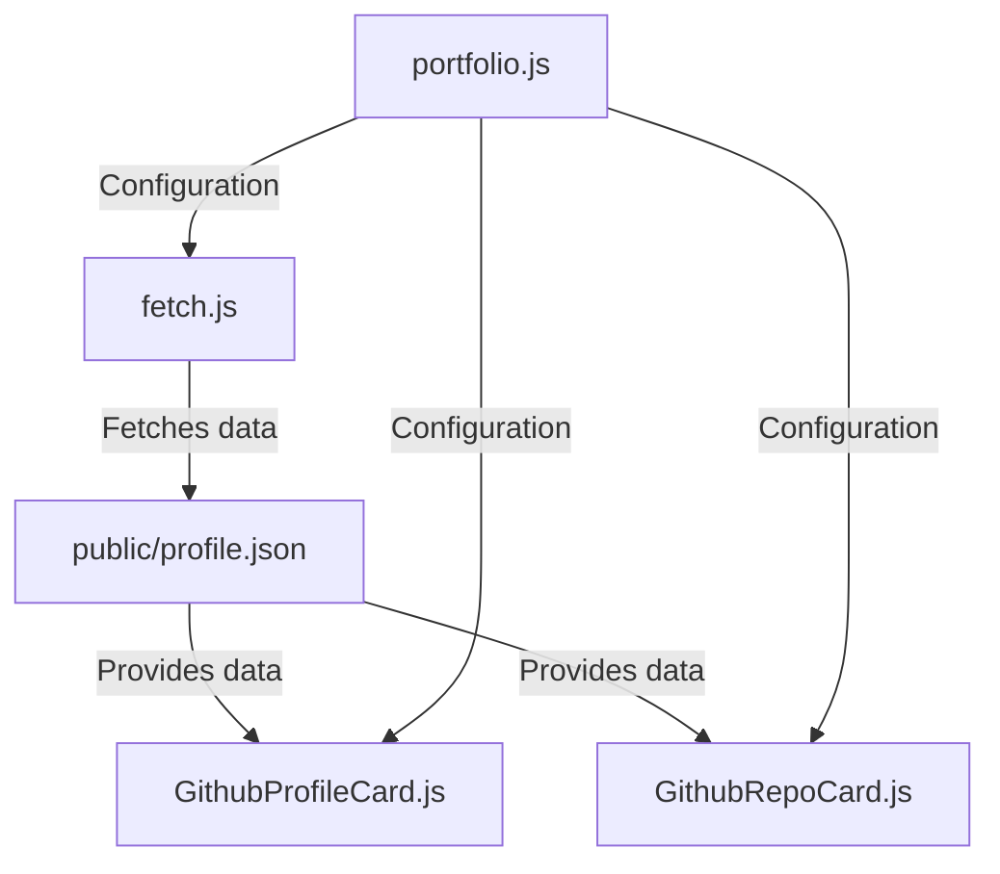
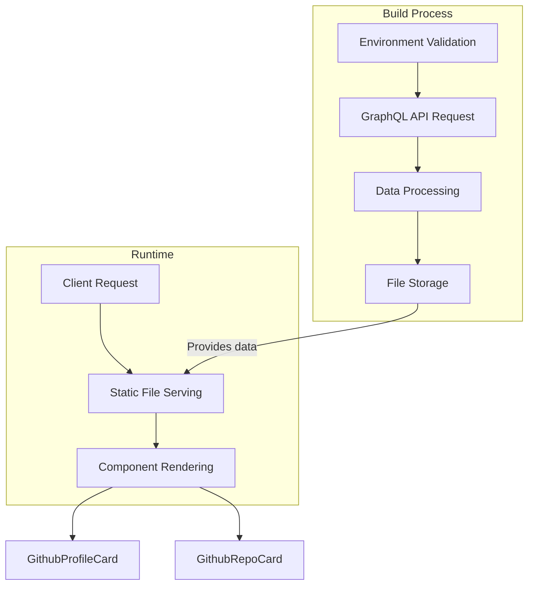
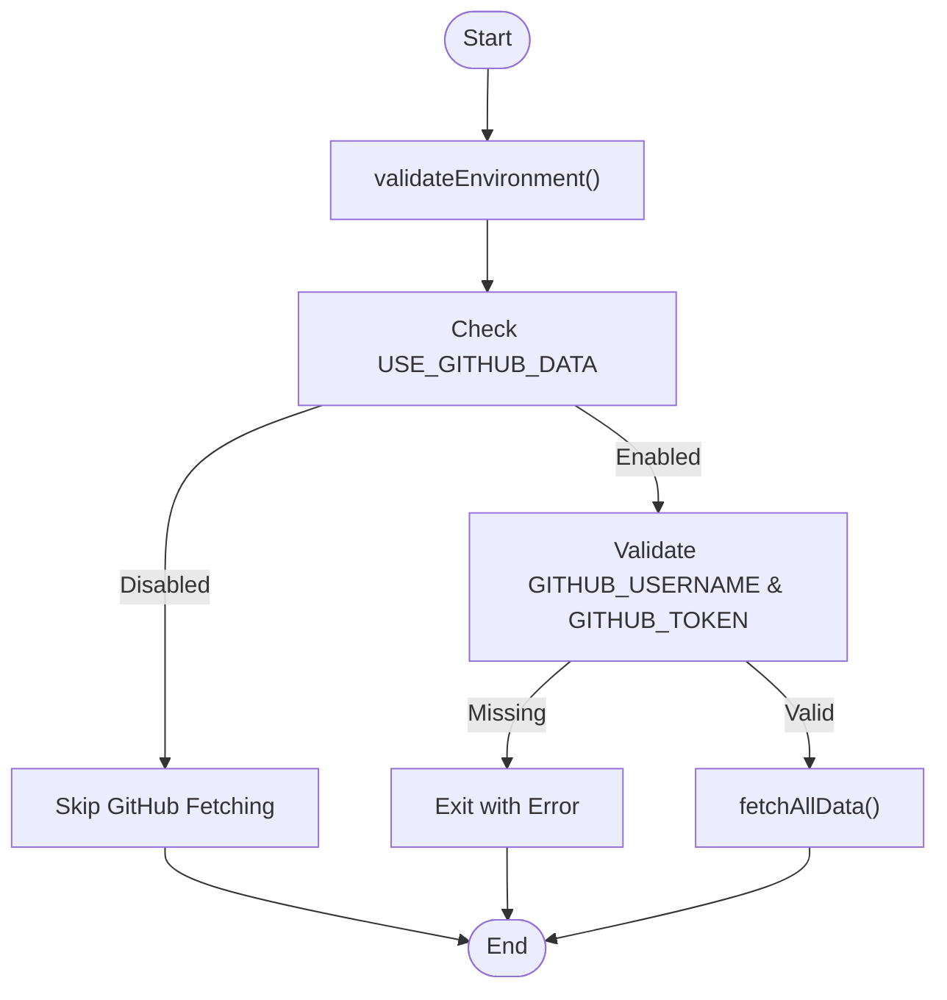
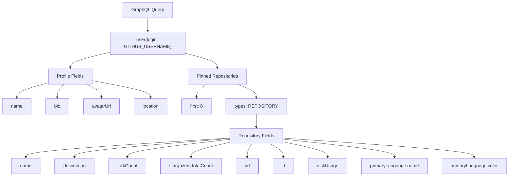
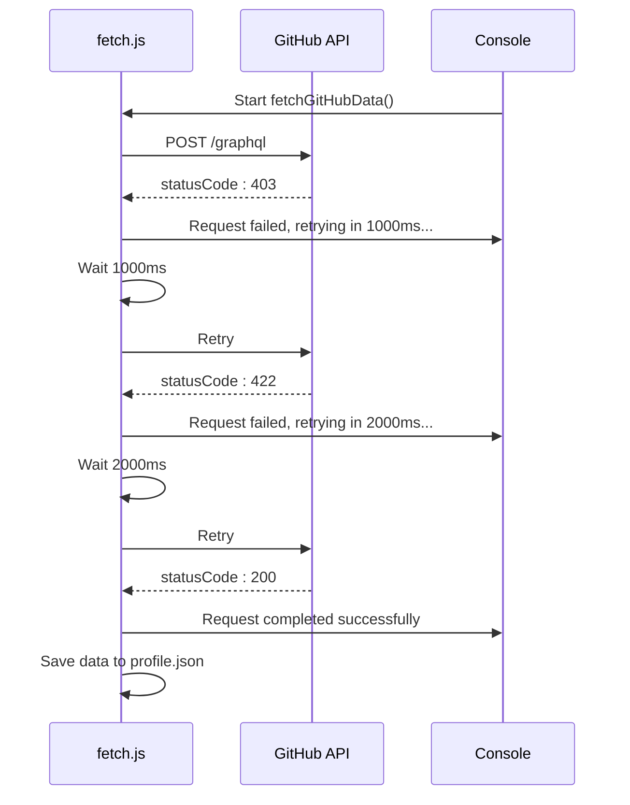
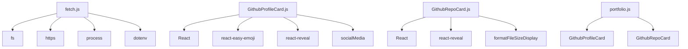

# GitHub Integration

<cite>
**Referenced Files in This Document**   
- [fetch.js](file://fetch.js)
- [src/components/githubProfileCard/GithubProfileCard.js](file://src/components/githubProfileCard/GithubProfileCard.js)
- [src/components/githubRepoCard/GithubRepoCard.js](file://src/components/githubRepoCard/GithubRepoCard.js)
- [public/profile.json](file://public/profile.json)
- [src/portfolio.js](file://src/portfolio.js)
</cite>

## Table of Contents
1. [Introduction](#introduction)
2. [Project Structure](#project-structure)
3. [Core Components](#core-components)
4. [Architecture Overview](#architecture-overview)
5. [Detailed Component Analysis](#detailed-component-analysis)
6. [Dependency Analysis](#dependency-analysis)
7. [Performance Considerations](#performance-considerations)
8. [Troubleshooting Guide](#troubleshooting-guide)
9. [Conclusion](#conclusion)

## Introduction

This document provides comprehensive documentation for the GitHub integration system in the portfolio application. The integration leverages GitHub's GraphQL API to fetch user profile information and pinned repository data during the build process. This data is used to dynamically populate the GitHub Profile Card and GitHub Repository Card components, creating a personalized and up-to-date representation of the developer's GitHub presence. The system is designed with robust error handling, retry logic, and environment validation to ensure reliable data fetching.

## Project Structure

The GitHub integration components are organized across the project structure with clear separation of concerns. The data fetching logic is centralized in the root-level `fetch.js` script, while the UI components are located in the `src/components` directory. Fetched data is stored in the `public` directory for client-side access.



**Diagram sources**
- [fetch.js](file://fetch.js#L1-L283)
- [src/components/githubProfileCard/GithubProfileCard.js](file://src/components/githubProfileCard/GithubProfileCard.js#L1-L63)
- [src/components/githubRepoCard/GithubRepoCard.js](file://src/components/githubRepoCard/GithubRepoCard.js#L1-L96)
- [public/profile.json](file://public/profile.json#L1-L1)
- [src/portfolio.js](file://src/portfolio.js#L1-L604)

**Section sources**
- [fetch.js](file://fetch.js#L1-L283)
- [src/components/githubProfileCard/GithubProfileCard.js](file://src/components/githubProfileCard/GithubProfileCard.js#L1-L63)
- [src/components/githubRepoCard/GithubRepoCard.js](file://src/components/githubRepoCard/GithubRepoCard.js#L1-L96)
- [public/profile.json](file://public/profile.json#L1-L1)
- [src/portfolio.js](file://src/portfolio.js#L1-L604)

## Core Components

The GitHub integration system consists of several core components that work together to fetch, store, and display GitHub data. The `fetch.js` script serves as the data acquisition engine, executing during the build process to retrieve GitHub profile and repository information. This data is then consumed by two React components: `GithubProfileCard` and `GithubRepoCard`, which render the user's GitHub presence in the portfolio. The system is controlled by configuration settings in `portfolio.js` and environment variables that manage authentication and feature toggles.

**Section sources**
- [fetch.js](file://fetch.js#L1-L283)
- [src/components/githubProfileCard/GithubProfileCard.js](file://src/components/githubProfileCard/GithubProfileCard.js#L1-L63)
- [src/components/githubRepoCard/GithubRepoCard.js](file://src/components/githubRepoCard/GithubRepoCard.js#L1-L96)
- [src/portfolio.js](file://src/portfolio.js#L1-L604)

## Architecture Overview

The GitHub integration follows a build-time data fetching architecture, where external API calls are made during the application build process rather than at runtime. This approach ensures that the GitHub data is pre-rendered and available immediately when the application loads, improving performance and user experience. The architecture consists of a data fetching layer (`fetch.js`), a data persistence layer (`public/profile.json`), and a presentation layer (GitHub component cards).



**Diagram sources**
- [fetch.js](file://fetch.js#L1-L283)
- [public/profile.json](file://public/profile.json#L1-L1)
- [src/components/githubProfileCard/GithubProfileCard.js](file://src/components/githubProfileCard/GithubProfileCard.js#L1-L63)
- [src/components/githubRepoCard/GithubRepoCard.js](file://src/components/githubRepoCard/GithubRepoCard.js#L1-L96)

## Detailed Component Analysis

### Data Fetching Process

The data fetching process is orchestrated by the `fetch.js` script, which executes as a Node.js process during the build phase. The process begins with environment validation to ensure all required configuration is present, followed by the execution of a GraphQL query to GitHub's API.

#### Environment Validation and Configuration


**Diagram sources**
- [fetch.js](file://fetch.js#L13-L69)

**Section sources**
- [fetch.js](file://fetch.js#L13-L69)

#### GraphQL Query Structure and Authentication
The system uses GitHub's GraphQL API to efficiently retrieve both profile information and pinned repository data in a single request. The query is structured to minimize network overhead and includes specific fields needed by the UI components.



The request is authenticated using a Bearer token in the Authorization header, with additional headers to identify the client and specify the content type.

**Diagram sources**
- [fetch.js](file://fetch.js#L191-L252)

**Section sources**
- [fetch.js](file://fetch.js#L191-L252)

#### Error Handling and Retry Logic
The system implements robust error handling with exponential backoff retry logic to handle transient failures and rate limiting from the GitHub API.



The retry mechanism uses exponential backoff with a base delay of 1 second, doubling the delay after each failed attempt (1s, 2s, 4s). This approach helps avoid overwhelming the API during periods of high load or temporary unavailability.

**Diagram sources**
- [fetch.js](file://fetch.js#L72-L142)

**Section sources**
- [fetch.js](file://fetch.js#L72-L142)

### UI Component Integration

The fetched GitHub data is consumed by two React components that display the user's GitHub profile and repositories in the portfolio.

#### GithubProfileCard Component
The `GithubProfileCard` component displays the user's profile information including name, bio, location, and avatar. It also shows the user's availability for hire based on the `isHireable` setting in `portfolio.js`.

```mermaid
classDiagram
class GithubProfileCard {
+prof : Object
+render() : JSX.Element
+isHireable : boolean
}
class SocialMedia {
+socialMediaLinks : Object
+render() : JSX.Element
}
GithubProfileCard --> SocialMedia : "uses"
GithubProfileCard --> "prof" : "displays"
```

The component receives profile data as a prop and renders it with appropriate styling and formatting. The bio text is processed with emoji support, and location information is displayed with a location icon when available.

**Diagram sources**
- [src/components/githubProfileCard/GithubProfileCard.js](file://src/components/githubProfileCard/GithubProfileCard.js#L1-L63)

**Section sources**
- [src/components/githubProfileCard/GithubProfileCard.js](file://src/components/githubProfileCard/GithubProfileCard.js#L1-L63)

#### GithubRepoCard Component
The `GithubRepoCard` component displays information about the user's pinned repositories, including name, description, primary language, star count, fork count, and size.

```mermaid
classDiagram
class GithubRepoCard {
+repo : Object
+isDark : boolean
+openUrlInNewTab(url, name) : void
+render() : JSX.Element
}
class formatFileSizeDisplay {
+bytes : number
+returns : string
}
GithubRepoCard --> formatFileSizeDisplay : "uses"
GithubRepoCard --> "repo.node" : "displays"
```

Each repository card is interactive, opening the repository URL in a new tab when clicked. The primary language is displayed with a colored indicator matching GitHub's language colors, and file sizes are formatted for readability using the `formatFileSizeDisplay` utility function.

**Diagram sources**
- [src/components/githubRepoCard/GithubRepoCard.js](file://src/components/githubRepoCard/GithubRepoCard.js#L1-L96)

**Section sources**
- [src/components/githubRepoCard/GithubRepoCard.js](file://src/components/githubRepoCard/GithubRepoCard.js#L1-L96)

## Dependency Analysis

The GitHub integration components have a clear dependency hierarchy, with the data fetching script depending on Node.js core modules and the UI components depending on React and utility functions.



The `fetch.js` script has dependencies on Node.js built-in modules (`fs`, `https`, `process`) and the `dotenv` package for environment variable management. The UI components depend on React and several utility libraries for enhanced functionality. The `portfolio.js` configuration file serves as the integration point, importing and configuring the GitHub components.

**Diagram sources**
- [fetch.js](file://fetch.js#L1-L283)
- [src/components/githubProfileCard/GithubProfileCard.js](file://src/components/githubProfileCard/GithubProfileCard.js#L1-L63)
- [src/components/githubRepoCard/GithubRepoCard.js](file://src/components/githubRepoCard/GithubRepoCard.js#L1-L96)
- [src/portfolio.js](file://src/portfolio.js#L1-L604)

**Section sources**
- [fetch.js](file://fetch.js#L1-L283)
- [src/components/githubProfileCard/GithubProfileCard.js](file://src/components/githubProfileCard/GithubProfileCard.js#L1-L63)
- [src/components/githubRepoCard/GithubRepoCard.js](file://src/components/githubRepoCard/GithubRepoCard.js#L1-L96)
- [src/portfolio.js](file://src/portfolio.js#L1-L604)

## Performance Considerations

The build-time data fetching approach has significant performance implications that should be considered when using this integration.

### Build Process Impact
Blocking the build process on external API calls introduces potential delays and reliability concerns. The build time will be extended by the duration of the GitHub API request, which can vary based on network conditions and API response times. This can be particularly problematic in CI/CD environments with time limits.

### Caching Strategies
To mitigate the performance impact, consider implementing caching strategies:
- Cache the `profile.json` file in CI/CD pipelines to avoid repeated API calls
- Implement a fallback mechanism that uses a cached version if the API is unavailable
- Consider using a CDN or edge caching for the static JSON file

### Fallback Content
When the GitHub API is unavailable or returns an empty response, the application should gracefully handle these scenarios:
- Display placeholder content or default values
- Show a message indicating that GitHub data is temporarily unavailable
- Maintain core functionality without the GitHub integration

## Troubleshooting Guide

### Common Issues and Solutions

#### Authentication Failures
Authentication failures typically occur when the GitHub token is missing, invalid, or lacks the necessary scopes.

**Symptoms:**
- "Request failed with status code: 401"
- "Bad credentials" error from GitHub API
- Environment validation errors

**Solutions:**
1. Verify that `GITHUB_TOKEN` is set in the `.env` file
2. Ensure the token has the `read:user` and `repo` scopes for full functionality
3. Regenerate the token if it has expired or been revoked
4. Check that `USE_GITHUB_DATA=true` in the environment variables

#### Rate Limiting
GitHub enforces rate limits on API requests, which can cause temporary failures.

**Symptoms:**
- "Request failed with status code: 403"
- "API rate limit exceeded" messages
- Intermittent failures that resolve after waiting

**Solutions:**
1. Use a personal access token with appropriate scopes (increases rate limit from 60 to 5,000 requests per hour)
2. Implement client-side caching to reduce API calls
3. Consider using GitHub's conditional requests with ETag headers
4. Monitor API rate limit status using the `X-RateLimit-Remaining` header

#### Empty or Missing Data
Empty responses can occur when the user has no pinned repositories or incomplete profile information.

**Symptoms:**
- Profile cards display without data
- Repository cards do not appear
- `totalCount` is 0 in the GraphQL response

**Solutions:**
1. Verify that repositories are pinned in the GitHub profile
2. Ensure profile fields (bio, location) are filled in the GitHub account
3. Check the GraphQL response in `profile.json` for actual data
4. Implement default values or placeholder content in the UI components

#### Environment Configuration
Proper environment configuration is critical for the GitHub integration to function.

**Required Environment Variables:**
- `USE_GITHUB_DATA=true` to enable the integration
- `GITHUB_USERNAME` with the GitHub username
- `GITHUB_TOKEN` with a valid personal access token

**Validation Steps:**
1. Run the `fetch.js` script manually to see validation output
2. Check console logs for environment validation messages
3. Verify that all required variables are set before the build process

**Section sources**
- [fetch.js](file://fetch.js#L13-L69)
- [fetch.js](file://fetch.js#L191-L252)
- [src/portfolio.js](file://src/portfolio.js#L215-L218)

## Conclusion

The GitHub integration system provides a robust mechanism for dynamically incorporating GitHub profile and repository data into the portfolio application. By