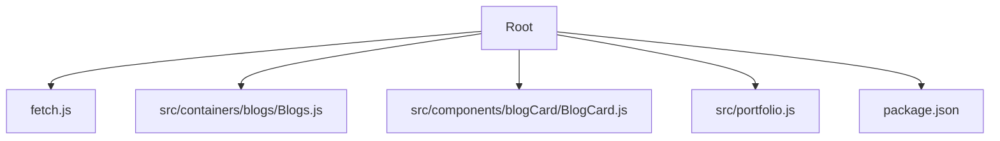
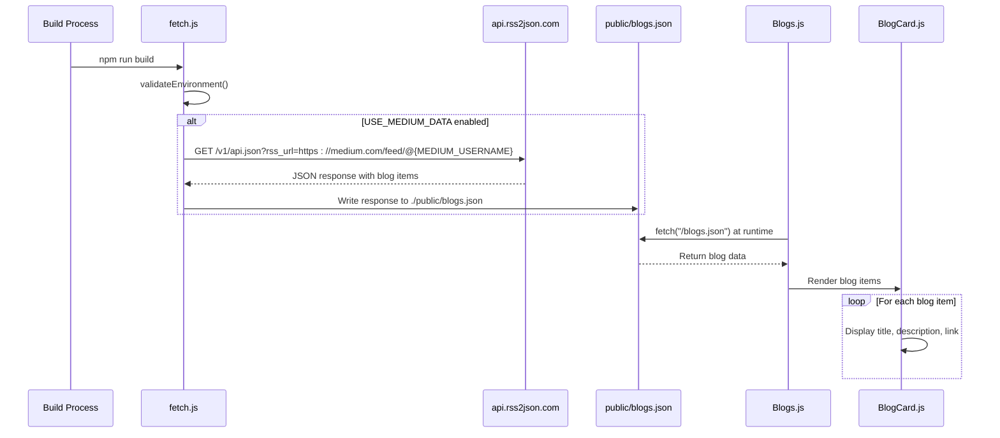
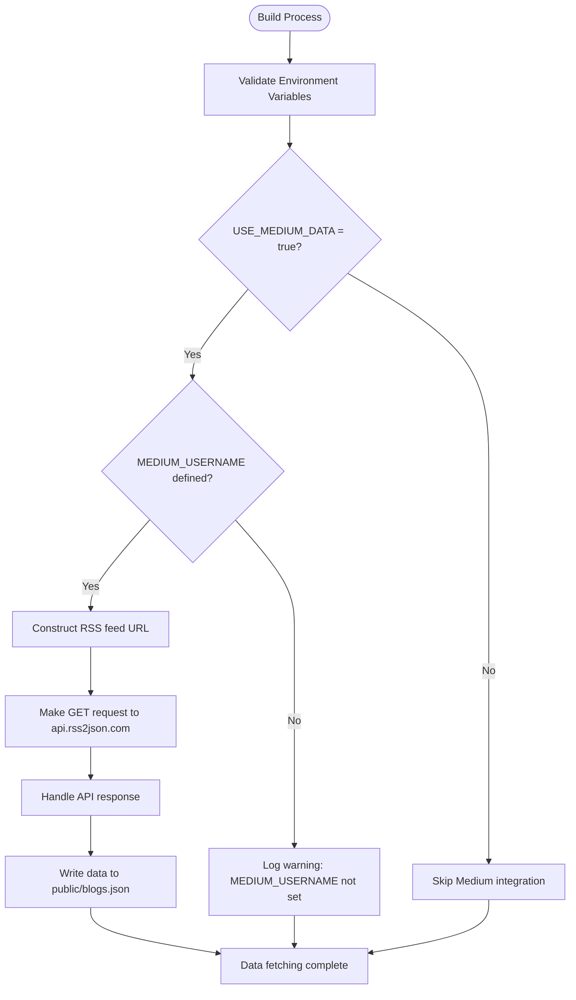
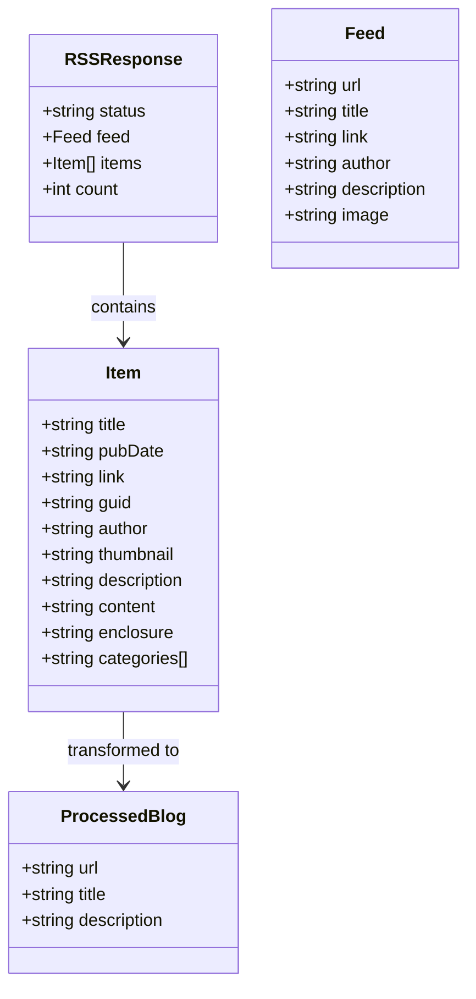
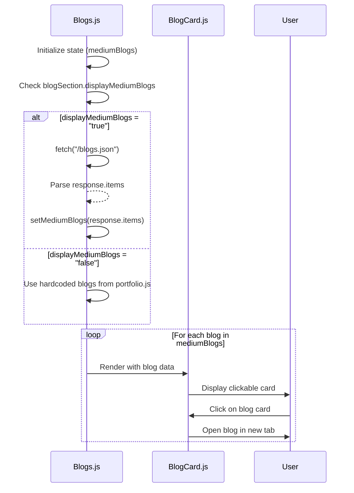
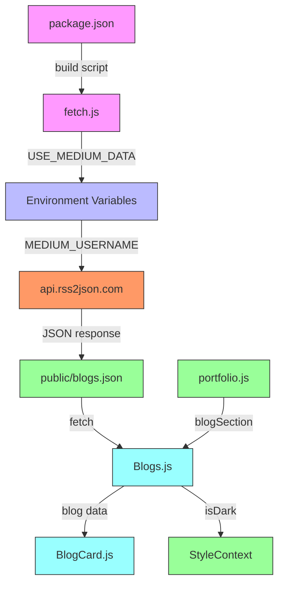

# Medium Blog Integration

<cite>
**Referenced Files in This Document**   
- [fetch.js](file://fetch.js)
- [src/containers/blogs/Blogs.js](file://src/containers/blogs/Blogs.js)
- [src/components/blogCard/BlogCard.js](file://src/components/blogCard/BlogCard.js)
- [src/portfolio.js](file://src/portfolio.js)
- [package.json](file://package.json)
</cite>

## Table of Contents
1. [Introduction](#introduction)
2. [Project Structure](#project-structure)
3. [Core Components](#core-components)
4. [Architecture Overview](#architecture-overview)
5. [Detailed Component Analysis](#detailed-component-analysis)
6. [Dependency Analysis](#dependency-analysis)
7. [Performance Considerations](#performance-considerations)
8. [Troubleshooting Guide](#troubleshooting-guide)
9. [Conclusion](#conclusion)

## Introduction

This document provides a comprehensive analysis of the Medium blog integration system in the portfolio application. The integration leverages RSS-to-JSON conversion through api.rss2json.com to fetch and display blog content from Medium during the build process. The system is designed to enhance content delivery by statically generating blog data, improving performance and reliability. This documentation details the implementation, data flow, error handling, and best practices for maintaining this integration.

## Project Structure

The Medium blog integration spans multiple components across the application structure, with key files located in specific directories:



**Diagram sources**
- [fetch.js](file://fetch.js)
- [src/containers/blogs/Blogs.js](file://src/containers/blogs/Blogs.js)
- [src/components/blogCard/BlogCard.js](file://src/components/blogCard/BlogCard.js)
- [src/portfolio.js](file://src/portfolio.js)
- [package.json](file://package.json)

**Section sources**
- [fetch.js](file://fetch.js)
- [src/containers/blogs/Blogs.js](file://src/containers/blogs/Blogs.js)
- [src/components/blogCard/BlogCard.js](file://src/components/blogCard/BlogCard.js)
- [src/portfolio.js](file://src/portfolio.js)
- [package.json](file://package.json)

## Core Components

The Medium blog integration consists of several core components that work together to fetch, process, and display blog content. The system operates during the build process when USE_MEDIUM_DATA is enabled, using the MEDIUM_USERNAME environment variable to construct the feed URL. The integration follows a static generation pattern, where blog data is fetched at build time and stored in public/blogs.json for consumption by the frontend components.

**Section sources**
- [fetch.js](file://fetch.js#L254-L282)
- [src/containers/blogs/Blogs.js](file://src/containers/blogs/Blogs.js#L0-L99)
- [src/components/blogCard/BlogCard.js](file://src/components/blogCard/BlogCard.js#L0-L36)

## Architecture Overview

The Medium blog integration follows a build-time data fetching architecture that separates data acquisition from runtime rendering. This approach provides performance benefits by serving pre-fetched blog data as static assets rather than making client-side API calls.



**Diagram sources**
- [fetch.js](file://fetch.js#L254-L282)
- [src/containers/blogs/Blogs.js](file://src/containers/blogs/Blogs.js#L33-L74)
- [src/components/blogCard/BlogCard.js](file://src/components/blogCard/BlogCard.js#L0-L36)

## Detailed Component Analysis

### Medium Data Fetching Process

The Medium data fetching process is implemented in fetch.js and executes during the build process when USE_MEDIUM_DATA is enabled. The process begins with environment validation to ensure required configuration is present.



**Diagram sources**
- [fetch.js](file://fetch.js#L40-L94)
- [fetch.js](file://fetch.js#L254-L282)

**Section sources**
- [fetch.js](file://fetch.js#L0-L283)

### Data Transformation and Processing

The integration transforms RSS feed data from Medium into a usable JSON structure through the api.rss2json.com service. The response contains blog items with HTML-formatted content that requires additional processing before display.



The data transformation process includes:
- Extracting text content from HTML paragraphs in the blog content
- Converting HTML entities and tags to plain text
- Mapping RSS fields to application-specific properties
- Handling potential malformed responses gracefully

**Diagram sources**
- [src/containers/blogs/Blogs.js](file://src/containers/blogs/Blogs.js#L15-L32)
- [fetch.js](file://fetch.js#L254-L282)

**Section sources**
- [src/containers/blogs/Blogs.js](file://src/containers/blogs/Blogs.js#L0-L99)

### Blog Rendering Components

The frontend components consume the statically generated blog data and render it through a container-component pattern. The Blogs.js container manages state and data fetching, while BlogCard components handle individual blog item presentation.



**Diagram sources**
- [src/containers/blogs/Blogs.js](file://src/containers/blogs/Blogs.js#L33-L98)
- [src/components/blogCard/BlogCard.js](file://src/components/blogCard/BlogCard.js#L0-L36)

**Section sources**
- [src/containers/blogs/Blogs.js](file://src/containers/blogs/Blogs.js#L0-L99)
- [src/components/blogCard/BlogCard.js](file://src/components/blogCard/BlogCard.js#L0-L36)

## Dependency Analysis

The Medium blog integration relies on several key dependencies and configuration settings that enable its functionality. These dependencies create a chain of execution from build configuration to runtime rendering.



**Diagram sources**
- [package.json](file://package.json#L70-L72)
- [fetch.js](file://fetch.js#L0-L283)
- [src/containers/blogs/Blogs.js](file://src/containers/blogs/Blogs.js#L0-L99)
- [src/portfolio.js](file://src/portfolio.js#L515-L535)

**Section sources**
- [package.json](file://package.json#L70-L72)
- [fetch.js](file://fetch.js#L0-L283)
- [src/containers/blogs/Blogs.js](file://src/containers/blogs/Blogs.js#L0-L99)
- [src/portfolio.js](file://src/portfolio.js#L515-L535)

## Performance Considerations

The static generation approach used in this Medium blog integration provides significant performance benefits:

1. **Reduced Runtime Latency**: Blog data is pre-fetched during build time, eliminating client-side API calls and reducing page load times
2. **Improved Reliability**: The application doesn't depend on third-party API availability at runtime
3. **Better SEO**: Search engines can easily crawl statically generated content
4. **Lower Bandwidth Usage**: The client downloads a single JSON file rather than making multiple API requests

However, this approach has limitations:
- Blog content is only updated when the site is rebuilt
- Requires successful build-time API calls to maintain current content
- Depends on the reliability of the RSS-to-JSON conversion service

The implementation includes several performance optimizations:
- Exponential backoff retry logic for failed API requests
- Asynchronous data fetching that doesn't block the main build process
- Error-tolerant design that allows the build to continue even if Medium data fetching fails

## Troubleshooting Guide

When encountering issues with the Medium blog integration, follow this systematic troubleshooting approach:

**Section sources**
- [fetch.js](file://fetch.js#L40-L94)
- [fetch.js](file://fetch.js#L254-L282)
- [src/containers/blogs/Blogs.js](file://src/containers/blogs/Blogs.js#L33-L74)

### Common Issues and Solutions

| Issue | Possible Cause | Solution |
|------|---------------|----------|
| No blog posts displayed | USE_MEDIUM_DATA not set to "true" | Set USE_MEDIUM_DATA="true" in environment variables |
| "MEDIUM_USERNAME not set" warning | MEDIUM_USERNAME environment variable missing | Add MEDIUM_USERNAME to .env file with your Medium username |
| Empty blogs.json file | API request failed or returned empty response | Check network connectivity and api.rss2json.com status |
| HTML content displayed incorrectly | extractTextContent function failing | Verify the HTML parsing logic handles your blog's formatting |
| Build process failing | Critical environment variables missing | Ensure all required environment variables are set |

### Debugging Feed Retrieval

To debug feed retrieval issues:

1. Verify environment variables are properly set:
```bash
echo "USE_MEDIUM_DATA: $USE_MEDIUM_DATA"
echo "MEDIUM_USERNAME: $MEDIUM_USERNAME"
```

2. Test the RSS feed URL directly:
```bash
curl "https://medium.com/feed/@yourusername"
```

3. Test the RSS-to-JSON conversion:
```bash
curl "https://api.rss2json.com/v1/api.json?rss_url=https://medium.com/feed/@yourusername"
```

4. Check fetch.js logs for detailed error messages during the build process.

### Error State Handling

The implementation includes robust error handling:
- Graceful degradation when Medium data is unavailable
- Fallback to hardcoded blog posts from portfolio.js
- Comprehensive logging for debugging purposes
- Non-blocking error handling that doesn't prevent site deployment

## Conclusion

The Medium blog integration demonstrates an effective pattern for incorporating third-party content into a static site. By fetching blog data during the build process, the implementation achieves optimal performance while maintaining content freshness. The system's modular design separates concerns between data acquisition, transformation, and presentation, making it maintainable and extensible. With proper environment configuration and error handling, this integration provides a reliable way to showcase Medium content while preserving the performance benefits of static site generation.