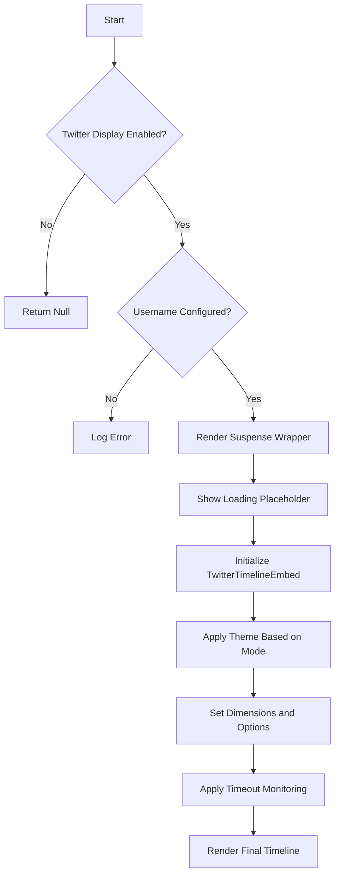
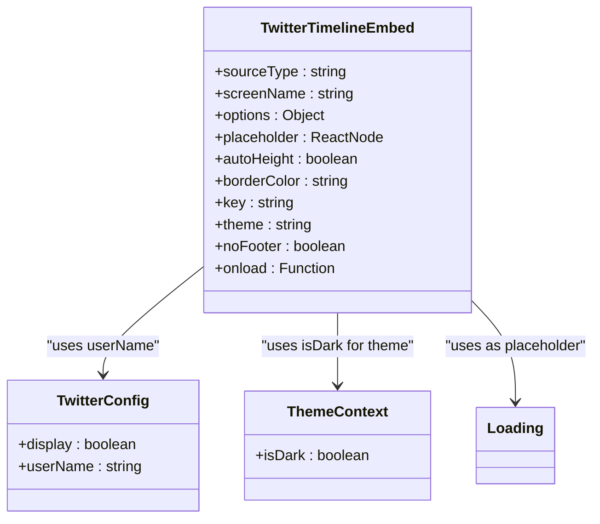
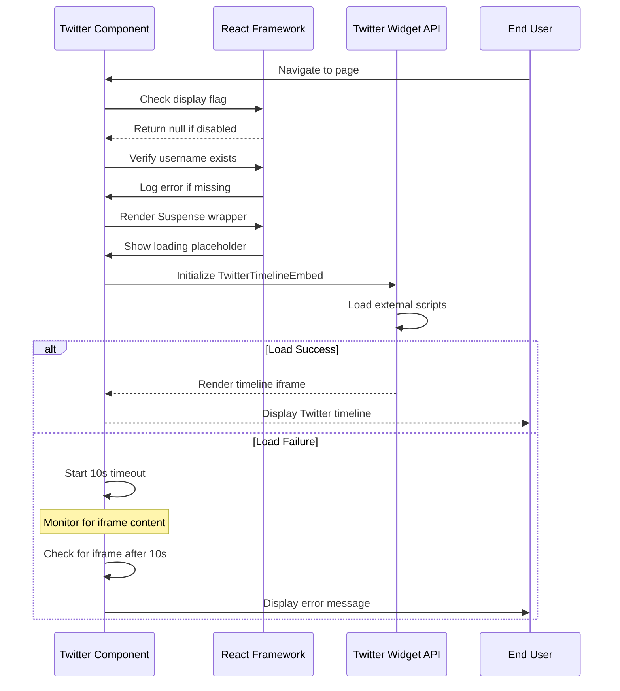

# Third-Party Embeds

<cite>
**Referenced Files in This Document**   
- [twitter.js](file://src/containers/twitter-embed/twitter.js)
- [twitter.scss](file://src/containers/twitter-embed/twitter.scss)
- [portfolio.js](file://src/portfolio.js)
- [package.json](file://package.json)
- [SEO.js](file://src/components/SEO/SEO.js)
</cite>

## Table of Contents
1. [Introduction](#introduction)
2. [Twitter Integration Implementation](#twitter-integration-implementation)
3. [Embed Configuration and Props](#embed-configuration-and-props)
4. [Asynchronous Script Loading and Error Handling](#asynchronous-script-loading-and-error-handling)
5. [Accessibility and Theme Management](#accessibility-and-theme-management)
6. [Security Considerations](#security-considerations)
7. [Performance Optimization](#performance-optimization)
8. [Common Issues and Troubleshooting](#common-issues-and-troubleshooting)
9. [Alternatives and Fallback Strategies](#alternatives-and-fallback-strategies)
10. [Conclusion](#conclusion)

## Introduction
This document provides comprehensive documentation for implementing third-party Twitter embeds in a React application using the react-twitter-embed library. It focuses on the integration pattern used in the portfolio project, specifically the Twitter component that displays a user's timeline. The documentation covers implementation details, configuration options, error handling, security implications, and performance considerations for embedding Twitter content.

## Twitter Integration Implementation

The Twitter integration is implemented through a dedicated container component that leverages the react-twitter-embed library to render Twitter timelines. The implementation follows React best practices for conditional rendering, loading states, and theme adaptation.

The Twitter component is configured to display a profile timeline based on user settings defined in the portfolio configuration. It uses React's Suspense feature to handle asynchronous loading of the Twitter widget, providing a seamless user experience during content loading.

**Diagram sources**
- [twitter.js](file://src/containers/twitter-embed/twitter.js#L1-L53)

**Section sources**
- [twitter.js](file://src/containers/twitter-embed/twitter.js#L1-L53)
- [portfolio.js](file://src/portfolio.js#L590-L595)

## Embed Configuration and Props

The Twitter embed is configured with several props that control its appearance, behavior, and integration with the host application. These props are passed to the TwitterTimelineEmbed component from the react-twitter-embed library.

The implementation uses configuration values from the portfolio.js file, specifically the twitterDetails object, which contains the Twitter username and display settings. The component dynamically adjusts its theme based on the application's dark mode state, providing a consistent user experience across different themes.

Key props used in the implementation include:
- **sourceType**: Set to "profile" to display a user's timeline
- **screenName**: Populated from twitterDetails.userName in portfolio configuration
- **options**: Contains height (400px) and width (based on screen width)
- **placeholder**: Displays a loading component during initialization
- **autoHeight**: Set to false for consistent layout
- **borderColor**: Set to white for visual separation
- **key**: Changes based on dark mode state to force re-render
- **theme**: Dynamically set to "dark" or "light" based on application theme
- **noFooter**: Set to true to remove Twitter footer elements
- **onload**: Callback function that implements timeout monitoring

**Diagram sources**
- [twitter.js](file://src/containers/twitter-embed/twitter.js#L1-L53)
- [portfolio.js](file://src/portfolio.js#L590-L595)

**Section sources**
- [twitter.js](file://src/containers/twitter-embed/twitter.js#L1-L53)
- [portfolio.js](file://src/portfolio.js#L590-L595)

## Asynchronous Script Loading and Error Handling

The implementation includes robust handling for the asynchronous loading of Twitter's widget JavaScript and potential loading failures. The react-twitter-embed library manages the loading of external scripts, but the component adds additional error handling to improve user experience.

A timeout mechanism is implemented to detect when the Twitter embed fails to load within a reasonable timeframe (10 seconds). If no iframe content is detected within this period, an error message is displayed suggesting users check their privacy protection settings, which commonly block third-party scripts.

The component uses React's Suspense feature with a custom loading placeholder to provide visual feedback during the loading process. This ensures users are aware that content is being loaded rather than encountering a blank space.

**Diagram sources**
- [twitter.js](file://src/containers/twitter-embed/twitter.js#L1-L53)

**Section sources**
- [twitter.js](file://src/containers/twitter-embed/twitter.js#L1-L53)

## Accessibility and Theme Management

The Twitter embed implementation includes accessibility considerations and dynamic theme management to ensure compatibility with the application's dark mode feature.

Theme adaptation is handled by reading the isDark value from the StyleContext, which provides a consistent theme state across the application. The Twitter embed's theme prop is set to "dark" or "light" based on this context value, ensuring visual consistency with the rest of the interface.

The implementation uses semantic HTML and proper container structure to maintain accessibility. The embed is contained within div elements with appropriate class names and IDs, allowing for proper styling and screen reader interpretation.

Accessibility features include:
- Proper error messaging with descriptive text
- Consistent loading states with visual indicators
- Responsive design that adapts to different screen sizes
- High contrast between text and background in both light and dark modes
- Semantic structure with proper heading hierarchy in surrounding content

**Section sources**
- [twitter.js](file://src/containers/twitter-embed/twitter.js#L1-L53)
- [StyleContext.js](file://src/contexts/StyleContext.js#L1-L9)

## Security Considerations

Integrating third-party embeds introduces several security considerations that must be addressed to protect users and maintain application integrity.

The implementation relies on the react-twitter-embed library, which acts as a wrapper around Twitter's official embedding API. This approach is generally secure as it uses Twitter's approved embedding methods rather than direct iframe embedding or scraping.

Key security implications include:
- **Content Security Policy (CSP)**: The application should implement appropriate CSP headers to control which external resources can be loaded. This helps prevent XSS attacks while allowing necessary Twitter domains.
- **Cross-Site Scripting (XSS) Risks**: Third-party scripts have the potential to execute malicious code. The risk is mitigated by using Twitter's official embedding API and keeping the react-twitter-embed library updated.
- **Privacy Protection Conflicts**: Many browser privacy features and ad blockers automatically block Twitter embeds, which can lead to failed loading as handled by the timeout mechanism.
- **Data Collection**: Twitter widgets may collect user data for analytics and advertising purposes, which should be disclosed in the application's privacy policy.

The package.json file shows that react-twitter-embed version 3.0.3 is used, which should be regularly updated to address any security vulnerabilities in the library or its dependencies.

**Section sources**
- [package.json](file://package.json#L40)
- [twitter.js](file://src/containers/twitter-embed/twitter.js#L1-L53)

## Performance Optimization

The implementation includes several performance optimization techniques to minimize the impact of third-party embeds on application loading and user experience.

Lazy loading is achieved through React's Suspense feature, which defers the loading of the Twitter embed until it is needed. This prevents the external scripts from blocking the initial page load and improves overall performance.

The component uses a placeholder loading state to provide immediate visual feedback while the Twitter widget initializes. This prevents layout shifts and maintains a smooth user experience.

Additional performance considerations:
- **Script Loading**: The react-twitter-embed library uses scriptjs to asynchronously load Twitter's widget JavaScript, preventing render-blocking.
- **Conditional Rendering**: The component only renders when enabled in the portfolio configuration, avoiding unnecessary processing.
- **Efficient Re-renders**: The key prop changes based on theme state, which efficiently triggers re-renders when the theme changes without unnecessary updates.
- **Responsive Sizing**: The width is set based on the screen width, optimizing display across different devices.

For further optimization, additional techniques could be implemented:
- Intersection Observer API to load the embed only when it enters the viewport
- Skeleton screens to maintain layout stability
- Prefetching of Twitter scripts during idle time
- Caching of embed content when possible

**Section sources**
- [twitter.js](file://src/containers/twitter-embed/twitter.js#L1-L53)

## Common Issues and Troubleshooting

Several common issues may arise when implementing Twitter embeds, along with their solutions as demonstrated in the current implementation.

**Embed Rendering Failures**: The most common issue is the embed failing to load, typically due to privacy protection settings, ad blockers, or network issues. The implementation addresses this with a 10-second timeout that displays a user-friendly error message suggesting they check their privacy settings.

**Layout Shifts**: Third-party embeds can cause