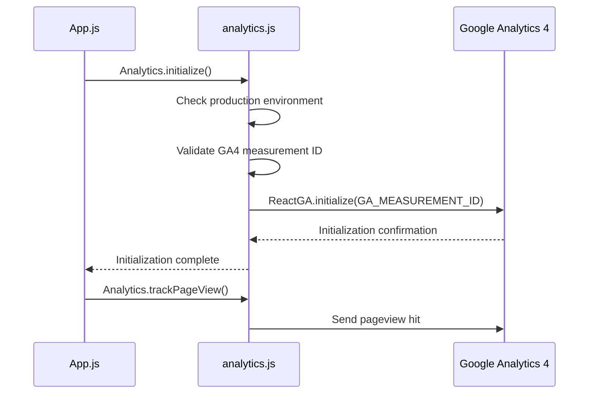
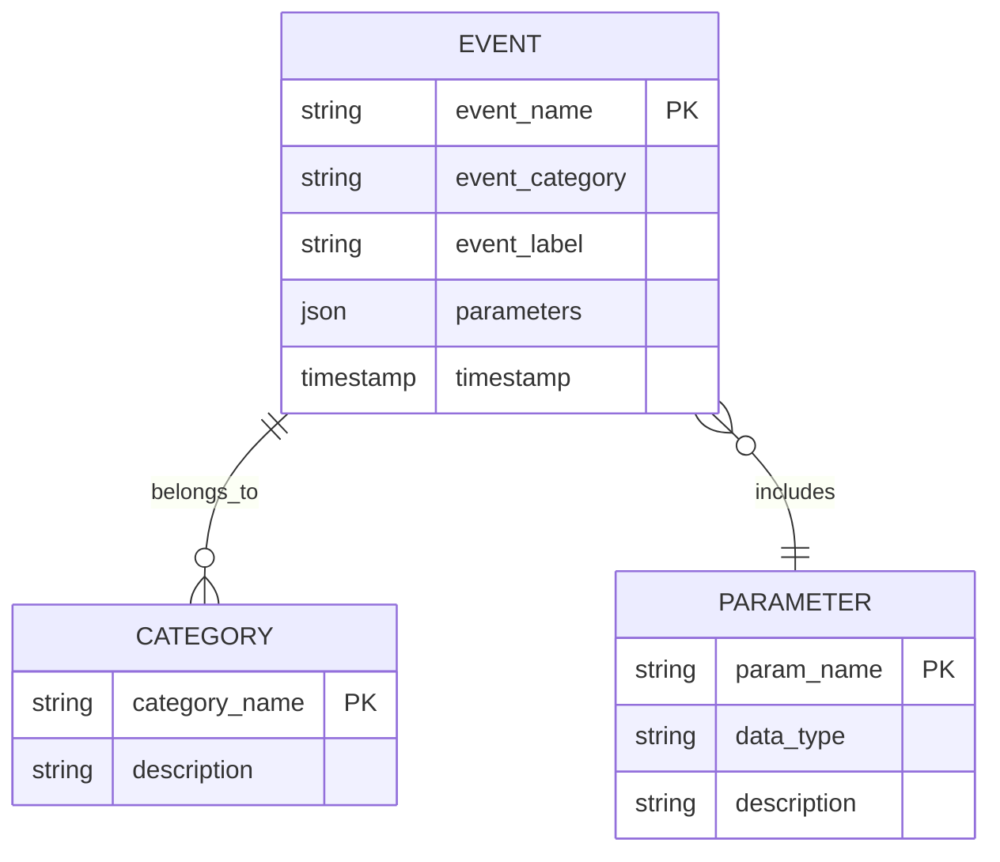
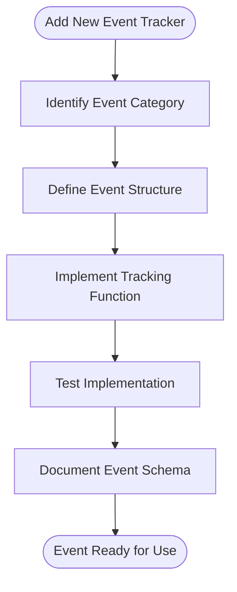
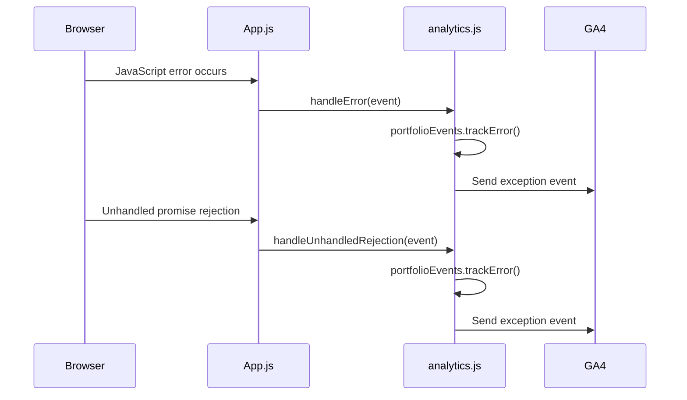

<cite>
**Referenced Files in This Document**   
- [analytics.js](file://src/utils/analytics.js)
- [App.js](file://src/App.js)
</cite>

## Table of Contents
1. [Introduction](#introduction)
2. [Analytics Initialization](#analytics-initialization)
3. [Event Tracking Schema](#event-tracking-schema)
4. [Client Implementation Guidelines](#client-implementation-guidelines)
5. [Security and Privacy Considerations](#security-and-privacy-considerations)
6. [Debugging and Monitoring](#debugging-and-monitoring)
7. [Performance Optimization](#performance-optimization)
8. [Conclusion](#conclusion)

## Introduction
This document provides comprehensive documentation for the Google Analytics 4 (GA4) integration in the portfolio application using the react-ga4 library. The analytics system is designed to track user interactions, measure engagement, and provide insights into user behavior across the portfolio website. The implementation follows privacy-conscious practices while capturing meaningful data about user interactions with projects, sections, and navigation elements.

**Section sources**
- [analytics.js](file://src/utils/analytics.js#L0-L288)
- [App.js](file://src/App.js#L0-L100)

## Analytics Initialization
The GA4 instance is initialized through a dedicated analytics module that handles configuration and setup. The initialization process occurs during application startup in the App.js component, ensuring analytics are available throughout the user session.



**Diagram sources**
- [analytics.js](file://src/utils/analytics.js#L8-L24)
- [App.js](file://src/App.js#L6-L10)

### Initialization Process
The initialization process follows a conditional approach based on the environment and configuration:

1. **Environment Check**: The system verifies if the application is running in production mode using `process.env.NODE_ENV === "production"`
2. **Measurement ID Validation**: The GA4 measurement ID is retrieved from environment variables (`REACT_APP_GA4_MEASUREMENT_ID`) with a fallback default value
3. **ID Format Validation**: The system confirms the measurement ID follows the GA4 format (starts with "G-")
4. **Configuration Options**: The initialization includes privacy-focused settings that disable ad personalization and Google signals

The initialization function `initializeGA` is called from the App component's useEffect hook, ensuring it runs once when the application mounts. This approach prevents multiple initializations during component re-renders.

**Section sources**
- [analytics.js](file://src/utils/analytics.js#L8-L24)
- [App.js](file://src/App.js#L6-L10)

## Event Tracking Schema
The analytics implementation includes a comprehensive event tracking schema that captures various user interactions across the portfolio. The schema is organized into logical categories based on the type of interaction being tracked.

### Event Categories
The tracking system categorizes events into several groups:

- **Engagement**: User interactions with content (section views, project views, link clicks)
- **Navigation**: User movement through the application (scrolling, section navigation)
- **UI Interaction**: User interface changes (theme toggling)
- **Conversion**: Key user actions (resume downloads, contact interactions)
- **Error**: Application errors and exceptions
- **Performance**: Page load times and performance metrics



**Diagram sources**
- [analytics.js](file://src/utils/analytics.js#L45-L225)

### Specific Event Types
The implementation includes specific event types for various user actions:

#### Section and Project Interactions
- `view_section`: Tracked when a user views a specific section of the portfolio
- `view_project`: Recorded when a user views a specific project
- `click_project_link`: Captures clicks on project links (GitHub, live demo, etc.)

#### Navigation Events
- `scroll_to_section`: Tracked when a user scrolls to a specific section
- `click_scroll_to_top`: Recorded when the user clicks the scroll-to-top button

#### Engagement and Conversion
- `download_resume`: Tracked when a user downloads the resume
- `contact_action`: Records contact interactions (email clicks, form submissions)
- `session_milestone`: Captures engagement duration milestones (30 seconds, 1 minute, etc.)

#### UI and External Interactions
- `toggle_theme`: Tracked when the user switches between dark and light themes
- `click_external_link`: Records clicks on external links
- `click_social_link`: Captures clicks on social media links

**Section sources**
- [analytics.js](file://src/utils/analytics.js#L45-L225)

## Client Implementation Guidelines
This section provides guidelines for developers who need to add new event trackers to the application.

### Adding New Event Trackers
To add a new event tracker, follow these steps:

1. **Identify the Event Category**: Determine which category the new event belongs to (engagement, navigation, conversion, etc.)
2. **Define the Event Structure**: Create a consistent naming convention for the event name, category, and label
3. **Implement the Tracking Function**: Add the new function to the `portfolioEvents` object in analytics.js



**Diagram sources**
- [analytics.js](file://src/utils/analytics.js#L45-L225)

### Best Practices for Event Naming
Follow these conventions when creating new event names:

- Use lowercase with underscores as separators (snake_case)
- Make event names descriptive and specific
- Include relevant parameters that provide context
- Follow the pattern: action_object_detail (e.g., "view_project_details")

### Example Implementation
To add a new event for tracking when users expand project details:

```javascript
// In analytics.js, within the portfolioEvents object
expandProjectDetails: (projectId) => {
  trackEvent("expand_project_details", {
    project_id: projectId,
    event_category: "engagement",
    event_label: "project_expansion"
  });
}
```

Then call this function from the appropriate component when the expand action occurs.

**Section sources**
- [analytics.js](file://src/utils/analytics.js#L45-L225)

## Security and Privacy Considerations
The analytics implementation prioritizes user privacy and data protection through several security measures.

### Data Anonymization
The system implements IP address anonymization by default through GA4's built-in privacy features. The configuration explicitly disables ad personalization signals and Google signals to minimize data collection:

```javascript
gaOptions: {
  cookie_flags: "SameSite=None;Secure",
  allow_ad_personalization_signals: false,
  allow_google_signals: false
}
```

### Environment-Based Tracking
Analytics are only enabled in production environments. In development mode, all tracking functions are disabled to prevent test data from contaminating analytics reports:

```javascript
const isProduction = process.env.NODE_ENV === "production";
```

### User Consent Considerations
While explicit consent management is not implemented in the current version, the design supports future integration of consent mechanisms. The modular structure allows for easy addition of consent checks before tracking functions are called.

**Section sources**
- [analytics.js](file://src/utils/analytics.js#L5-L24)

## Debugging and Monitoring
This section covers tools and approaches for verifying analytics data collection and troubleshooting issues.

### Development Debugging
A dedicated debug function is available for development environments:

```javascript
export const debugAnalytics = () => {
  if (!isProduction) {
    console.log("Analytics Debug Info:", {
      GA_MEASUREMENT_ID,
      isProduction,
      initialized: ReactGA.isInitialized
    });
  }
};
```

This function can be called from the browser console to verify the analytics configuration and initialization status.

### Error Tracking
The system includes comprehensive error tracking that captures JavaScript errors and unhandled promise rejections:



**Diagram sources**
- [App.js](file://src/App.js#L48-L65)

### Monitoring Approaches
To verify analytics data collection:

1. **Real-time Reports**: Use GA4's real-time reporting to see events as they occur
2. **Browser Developer Tools**: Monitor network requests to verify GA4 hits are being sent
3. **Debug Console**: Use the debugAnalytics function to verify initialization
4. **Event Counters**: Implement temporary counters in development to verify event frequency

**Section sources**
- [analytics.js](file://src/utils/analytics.js#L266-L274)
- [App.js](file://src/App.js#L48-L65)

## Performance Optimization
The analytics implementation includes several performance optimizations to minimize impact on page load times.

### Lazy Initialization
Analytics are initialized after the main application components have loaded, preventing blocking of critical rendering paths. The initialization occurs in a useEffect hook, which runs after the component has mounted.

### Conditional Execution
All tracking functions include environment checks that prevent execution in development mode, eliminating any performance overhead during development.

### Efficient Event Batching
The react-ga4 library handles event batching internally, reducing the number of network requests by grouping multiple events together.

### Performance Monitoring
The system includes built-in performance tracking that measures page load times:

```javascript
window.addEventListener("load", () => {
  setTimeout(() => {
    const perfData = performance.getEntriesByType("navigation")[0];
    if (perfData) {
      Analytics.portfolioEvents.trackTiming(
        "page_load_time",
        Math.round(perfData.loadEventEnd - perfData.fetchStart),
        "performance"
      );
    }
  }, 0);
});
```

This approach ensures that performance monitoring does not impact the metrics being measured by using a setTimeout with 0 delay.

**Section sources**
- [App.js](file://src/App.js#L67-L80)

## Conclusion
The Google Analytics 4 integration provides a comprehensive, privacy-conscious solution for tracking user engagement and behavior in the portfolio application. The implementation follows best practices for modern web analytics, with a modular design that separates concerns between initialization, event tracking, and application integration. The system captures meaningful data about user interactions while respecting privacy through environment-based tracking and disabled ad personalization features. The architecture supports easy extension for new event types and includes robust debugging tools for verification and troubleshooting. Future enhancements could include explicit user consent management and more granular performance monitoring.