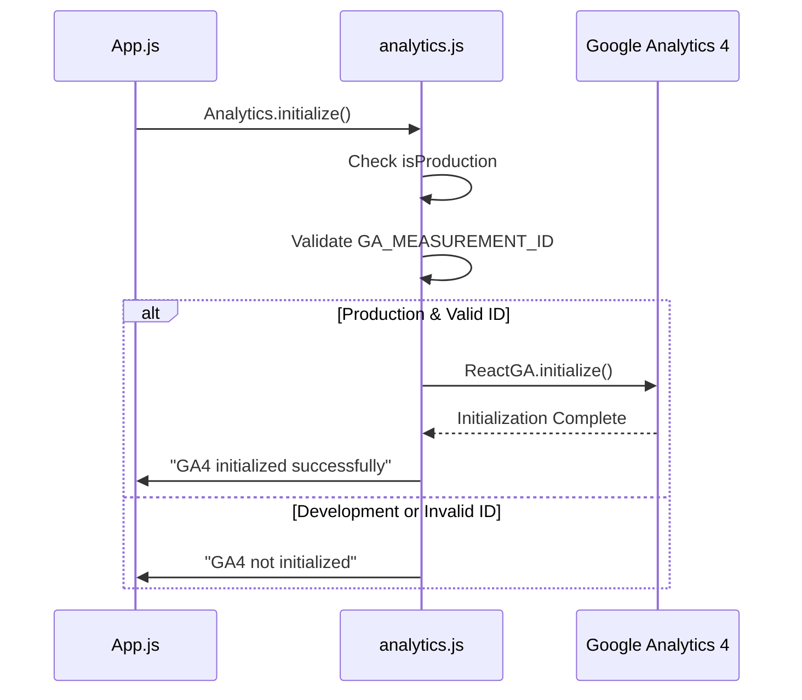
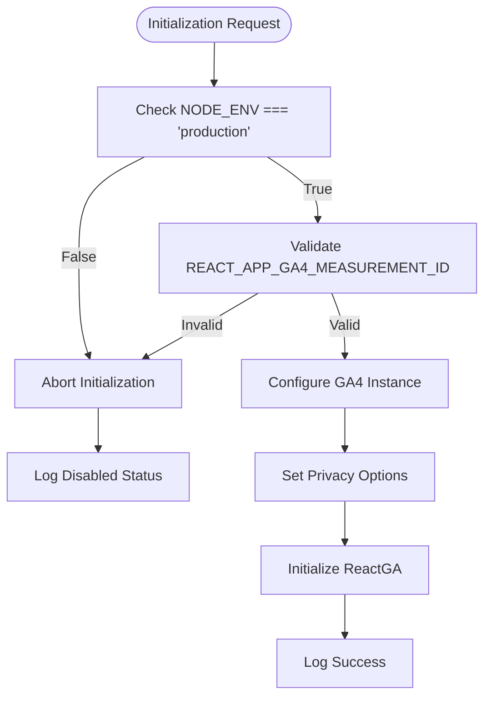
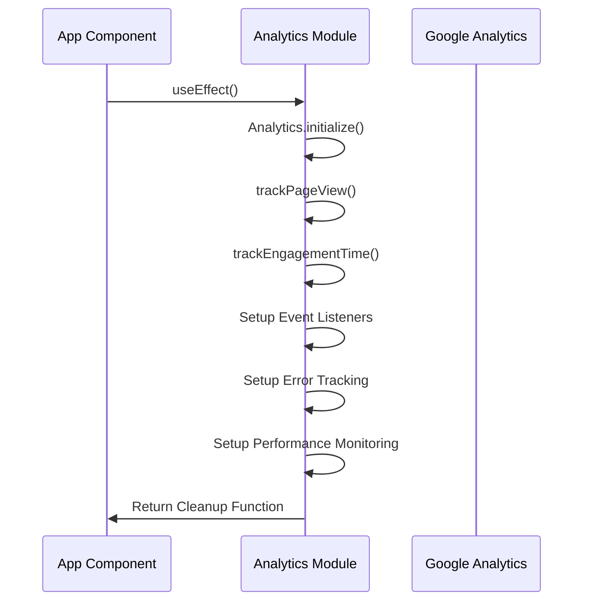

# Analytics Initialization

<cite>
**Referenced Files in This Document**   
- [analytics.js](file://src/utils/analytics.js)
- [App.js](file://src/App.js)
- [SEO_ANALYTICS_README.md](file://SEO_ANALYTICS_README.md)
- [SEO.js](file://src/components/SEO/SEO.js)
</cite>

## Table of Contents
1. [Introduction](#introduction)
2. [Analytics Initialization Process](#analytics-initialization-process)
3. [Configuration and Security](#configuration-and-security)
4. [Integration with Application Lifecycle](#integration-with-application-lifecycle)
5. [Privacy and Compliance Features](#privacy-and-compliance-features)
6. [Performance Considerations](#performance-considerations)
7. [Troubleshooting Guide](#troubleshooting-guide)
8. [Conclusion](#conclusion)

## Introduction

This document provides comprehensive documentation for the analytics initialization process in the Sameh Shehata Portfolio application. The system implements Google Analytics 4 (GA4) to track user engagement, behavior, and performance metrics while maintaining privacy compliance and optimal performance. The initialization process is designed to activate analytics only in production environments with proper configuration, ensuring development activities are not tracked. The architecture separates analytics configuration from implementation, providing a clean interface for tracking various user interactions across the portfolio site.

**Section sources**
- [SEO_ANALYTICS_README.md](file://SEO_ANALYTICS_README.md#L1-L50)

## Analytics Initialization Process

The analytics initialization process is centered around the `initializeGA` function in the analytics utility module, which orchestrates the setup of Google Analytics 4 with appropriate configuration options. The initialization follows a conditional execution pattern that ensures analytics are only enabled in production environments with valid configuration.



**Diagram sources**
- [analytics.js](file://src/utils/analytics.js#L8-L24)
- [App.js](file://src/App.js#L7-L10)

**Section sources**
- [analytics.js](file://src/utils/analytics.js#L8-L24)

## Configuration and Security

The analytics system implements robust configuration and security practices to protect user privacy and ensure proper operation. Configuration is managed through environment variables with sensible defaults, while security measures include production-only activation and privacy-preserving settings.

### Environment Configuration
The system uses environment variables to securely manage the Google Analytics 4 measurement ID, preventing hardcoded credentials in the source code:

```javascript
const GA_MEASUREMENT_ID = process.env.REACT_APP_GA4_MEASUREMENT_ID || "G-09NVE6K239";
const isProduction = process.env.NODE_ENV === "production";
```

This approach ensures that the actual measurement ID is not exposed in the repository and can be different for various deployment environments.

### Security Controls
The initialization process includes multiple security and privacy controls:

- **Environment-based activation**: Analytics only initialize in production mode
- **Measurement ID validation**: Ensures the ID follows the GA4 format (starts with "G-")
- **Secure cookie flags**: Implements SameSite=None;Secure for cross-site tracking compliance
- **Ad personalization disabled**: Prevents user profiling for advertising purposes



**Diagram sources**
- [analytics.js](file://src/utils/analytics.js#L3-L24)

**Section sources**
- [analytics.js](file://src/utils/analytics.js#L3-L24)
- [SEO_ANALYTICS_README.md](file://SEO_ANALYTICS_README.md#L100-L150)

## Integration with Application Lifecycle

The analytics system is integrated into the application's lifecycle through React's useEffect hook in the main App component. This ensures that analytics are initialized when the application mounts and properly configured for tracking user interactions.

### Initialization Flow
The integration point in App.js demonstrates a comprehensive approach to analytics setup:



The initialization includes not only the core GA4 setup but also comprehensive tracking for:
- Page views (manually sent due to SPA navigation)
- User engagement time and session milestones
- Page visibility changes
- JavaScript errors and unhandled promise rejections
- Performance metrics using the Web Performance API

### Configuration Options
The system implements specific configuration options to optimize tracking behavior:

- **send_page_view: false**: Disables automatic page view tracking, allowing manual control for Single Page Application (SPA) routing
- **debug: false**: Disables debug mode in production to reduce console output
- **titleCase: false**: Prevents automatic title case conversion of event names

**Section sources**
- [App.js](file://src/App.js#L7-L50)
- [analytics.js](file://src/utils/analytics.js#L15-L24)

## Privacy and Compliance Features

The analytics implementation prioritizes user privacy and regulatory compliance through several technical measures and configuration choices.

### Privacy-Preserving Settings
The configuration explicitly disables features that could compromise user privacy:

- **allow_ad_personalization_signals: false**: Prevents Google from using data for ad personalization
- **allow_google_signals: false**: Disables Google signals for cross-device tracking
- **cookie_flags: "SameSite=None;Secure"**: Ensures cookies are only sent over secure connections and can be accessed in cross-site contexts

These settings align with GDPR and other privacy regulations by minimizing data collection and preventing user profiling.

### Conditional Execution
The system implements conditional execution based on environment:

```javascript
if (isProduction && GA_MEASUREMENT_ID && GA_MEASUREMENT_ID.startsWith("G-")) {
  // Initialize in production with valid ID
} else {
  // Skip initialization in development
}
```

This prevents tracking of development and testing activities, ensuring only production user behavior is measured.

**Section sources**
- [analytics.js](file://src/utils/analytics.js#L18-L24)
- [SEO_ANALYTICS_README.md](file://SEO_ANALYTICS_README.md#L200-L250)

## Performance Considerations

The analytics implementation considers performance implications, particularly regarding application startup time and runtime overhead.

### Asynchronous Loading
The ReactGA library loads asynchronously, preventing blocking of the main thread during application initialization. The initialization occurs within useEffect, ensuring it doesn't impact the initial render performance.

### Performance Monitoring
Interestingly, the analytics system includes performance tracking capabilities:

```javascript
window.addEventListener("load", () => {
  setTimeout(() => {
    const perfData = performance.getEntriesByType("navigation")[0];
    if (perfData) {
      Analytics.portfolioEvents.trackTiming(
        "page_load_time",
        Math.round(perfData.loadEventEnd - perfData.fetchStart),
        "performance"
      );
    }
  }, 0);
});
```

This tracks page load time as a custom event, providing insights into application performance from the user's perspective.

### Best Practices for Minimizing Impact
To minimize impact on app startup time:

- Analytics initialization is non-blocking
- Only essential configuration is set during initialization
- Event tracking is optimized with production checks
- Comprehensive error handling prevents crashes

**Section sources**
- [App.js](file://src/App.js#L40-L50)
- [analytics.js](file://src/utils/analytics.js#L250-L280)

## Troubleshooting Guide

This section addresses common issues that may occur during analytics initialization and provides guidance for resolution.

### Common Initialization Issues

#### Missing Measurement ID
**Symptoms**: "GA4 not initialized (development mode or missing ID)" in console
**Causes**:
- REACT_APP_GA4_MEASUREMENT_ID not set in environment variables
- Environment file (.env) missing or misconfigured
- Measurement ID does not start with "G-"

**Solutions**:
1. Verify the environment variable is set: `REACT_APP_GA4_MEASUREMENT_ID=G-XXXXXXXXXX`
2. Ensure the .env file is present in the root directory
3. Confirm the measurement ID follows the GA4 format

#### Incorrect Environment Activation
**Symptoms**: Analytics not tracking in production
**Causes**:
- NODE_ENV not set to "production"
- Build process not setting production environment
- Local development variables overriding production settings

**Solutions**:
1. Verify deployment process sets NODE_ENV=production
2. Check build scripts for proper environment configuration
3. Validate environment variables are correctly deployed

#### Configuration Validation
The system includes a validation script that can help identify configuration issues:

```bash
node validate-seo.js
```

This script checks for proper environment configuration, including the presence and format of the GA4 measurement ID.

**Section sources**
- [analytics.js](file://src/utils/analytics.js#L20-L24)
- [validate-seo.js](file://validate-seo.js#L205-L256)
- [SEO_ANALYTICS_README.md](file://SEO_ANALYTICS_README.md#L300-L350)

## Conclusion

The analytics initialization process in the Sameh Shehata Portfolio application demonstrates a well-architected approach to implementing Google Analytics 4 with attention to security, privacy, and performance. By conditionally initializing analytics only in production environments with valid configuration, the system ensures accurate measurement of user behavior while protecting development activities from being tracked. The implementation includes comprehensive privacy-preserving settings that disable ad personalization and limit data collection, aligning with modern privacy regulations. The integration with the React application lifecycle through useEffect ensures proper initialization and cleanup, while the configuration options provide fine-grained control over tracking behavior. This architecture serves as a model for implementing analytics in modern web applications with a balanced approach to measurement, privacy, and performance.