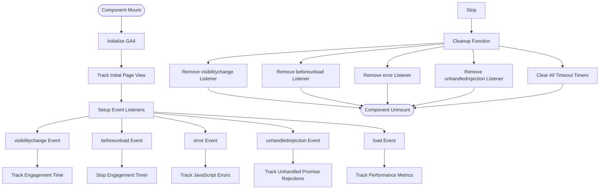
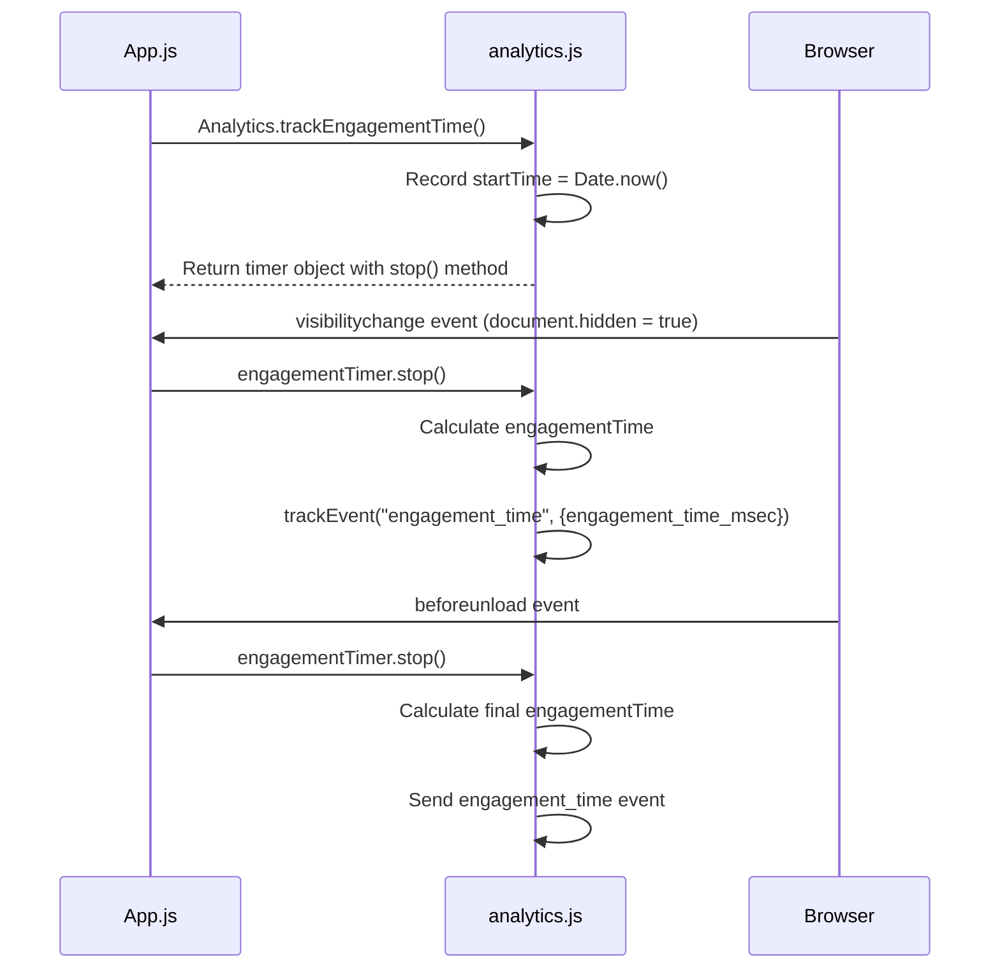
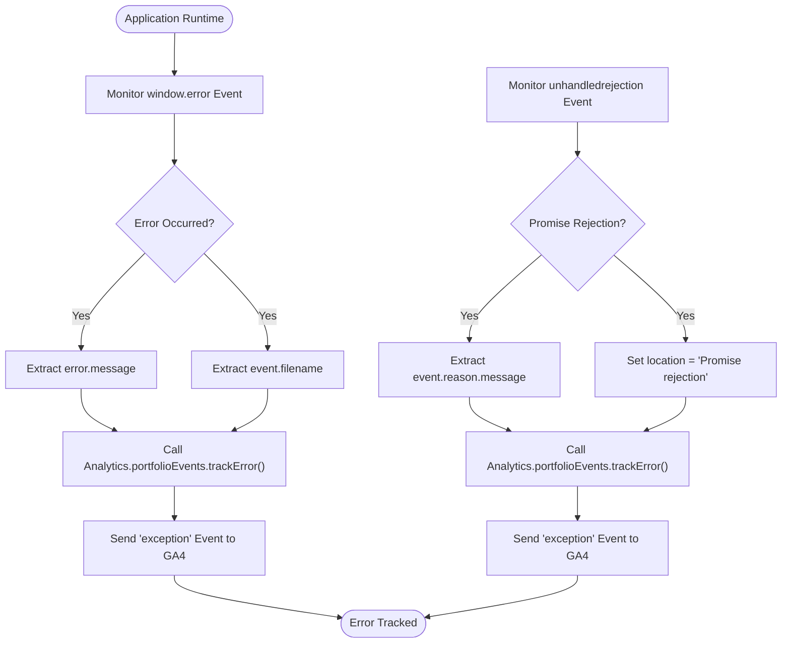
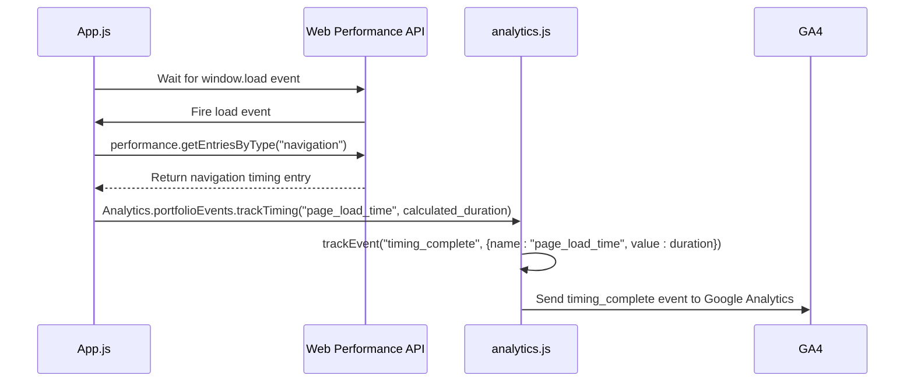

# Analytics Integration Points

<cite>
**Referenced Files in This Document**   
- [App.js](file://src/App.js)
- [analytics.js](file://src/utils/analytics.js)
- [SEO_ANALYTICS_README.md](file://SEO_ANALYTICS_README.md)
</cite>

## Table of Contents
1. [Introduction](#introduction)
2. [Analytics Initialization and Lifecycle](#analytics-initialization-and-lifecycle)
3. [Page View Tracking](#page-view-tracking)
4. [User Engagement Measurement](#user-engagement-measurement)
5. [Error Monitoring](#error-monitoring)
6. [Performance Timing](#performance-timing)
7. [Security and Privacy Considerations](#security-and-privacy-considerations)
8. [Debugging and Verification](#debugging-and-verification)
9. [Conclusion](#conclusion)

## Introduction

This document details the comprehensive analytics integration strategy implemented in the portfolio application. The analytics system is deeply embedded within the core user experience, capturing critical behavioral data while maintaining performance and respecting user privacy. The implementation leverages Google Analytics 4 (GA4) through the `react-ga4` library, with a custom analytics utility layer that provides structured event tracking for portfolio-specific interactions. The integration is centered around the App.js component, which serves as the primary orchestration point for analytics initialization, event tracking, and lifecycle management.

**Section sources**
- [App.js](file://src/App.js#L0-L100)
- [analytics.js](file://src/utils/analytics.js#L0-L288)

## Analytics Initialization and Lifecycle

The analytics system follows a strict lifecycle management pattern to ensure proper initialization and cleanup. In the App.js component, the `useEffect` hook is responsible for initializing the analytics system when the component mounts and cleaning up all event listeners when the component unmounts. This prevents memory leaks and ensures that analytics events are only tracked during active user sessions.

**Diagram sources**
- [App.js](file://src/App.js#L0-L100)

**Section sources**
- [App.js](file://src/App.js#L0-L100)
- [analytics.js](file://src/utils/analytics.js#L0-L42)

## Page View Tracking

Page view tracking is implemented as one of the first actions in the analytics initialization sequence. The system captures the current URL path and document title, sending this information to GA4 as a pageview hit. This implementation bypasses automatic pageview tracking by configuring `send_page_view: false` in the GA4 initialization options, allowing for manual control over when and how page views are reported. This approach provides greater flexibility for single-page application (SPA) navigation, where route changes don't trigger full page reloads.

**Section sources**
- [App.js](file://src/App.js#L15-L17)
- [analytics.js](file://src/utils/analytics.js#L30-L38)

## User Engagement Measurement

The application implements sophisticated user engagement measurement through multiple mechanisms. The primary engagement metric is tracked through the `trackEngagementTime` utility function, which starts a timer when the App component mounts and stops it when the user navigates away or closes the tab. The system also tracks session milestones at 30 seconds, 1 minute, 2 minutes, and 5 minutes of engagement, providing insights into user retention and content effectiveness.

The engagement tracking respects user activity states through integration with the Page Visibility API. When the `visibilitychange` event fires and `document.hidden` is true, the engagement timer is stopped, ensuring that time when the user is not actively viewing the page (e.g., when switching tabs or minimizing the browser) is not counted as engagement time.

**Diagram sources**
- [App.js](file://src/App.js#L19-L28)
- [analytics.js](file://src/utils/analytics.js#L206-L218)

**Section sources**
- [App.js](file://src/App.js#L19-L34)
- [analytics.js](file://src/utils/analytics.js#L206-L218)

## Error Monitoring

Comprehensive error monitoring is implemented through integration with browser error events. The system captures both caught JavaScript errors via the `window.error` event and unhandled promise rejections via the `unhandledrejection` event. This dual approach ensures that both synchronous and asynchronous errors are tracked, providing a complete picture of application stability.

The error tracking implementation includes defensive programming to handle cases where error properties might be undefined, using fallback values like "Unknown error" and "Unknown location" to ensure that error events are always sent with meaningful data.

**Diagram sources**
- [App.js](file://src/App.js#L41-L58)
- [analytics.js](file://src/utils/analytics.js#L184-L192)

**Section sources**
- [App.js](file://src/App.js#L41-L58)
- [analytics.js](file://src/utils/analytics.js#L184-L192)

## Performance Timing

Performance monitoring is implemented using the Web Performance API to capture critical page load metrics. The system listens for the `window.load` event and then uses `performance.getEntriesByType("navigation")` to retrieve detailed timing information about the page loading process. The primary metric tracked is the total page load time, calculated as the difference between `loadEventEnd` and `fetchStart` timestamps.

This implementation uses a `setTimeout` with a 0ms delay to ensure that the performance measurement occurs after the load event has fully completed and all performance entries are available. The timing data is sent as a custom event to GA4 with appropriate categorization for analysis in the analytics dashboard.

**Diagram sources**
- [App.js](file://src/App.js#L60-L74)
- [analytics.js](file://src/utils/analytics.js#L174-L182)

**Section sources**
- [App.js](file://src/App.js#L60-L74)
- [analytics.js](file://src/utils/analytics.js#L174-L182)

## Security and Privacy Considerations

The analytics implementation prioritizes user privacy and data security through several key measures. The configuration explicitly disables Google signals and ad personalization with `allow_ad_personalization_signals: false` and `allow_google_signals: false` to comply with privacy regulations. The system avoids collecting sensitive personal information in event parameters, focusing instead on behavioral metrics that don't identify individual users.

The implementation respects the user's browsing environment by only enabling analytics in production mode (`process.env.NODE_ENV === "production"`), ensuring that no tracking occurs during development. The cookie configuration includes `SameSite=None;Secure` flags to prevent cross-site request forgery attacks and ensure cookies are only sent over secure connections.

Additionally, the system provides a debug function (`debugAnalytics`) that only operates in non-production environments, allowing developers to verify analytics functionality without affecting production data.

**Section sources**
- [analytics.js](file://src/utils/analytics.js#L10-L15)
- [analytics.js](file://src/utils/analytics.js#L255-L287)

## Debugging and Verification

The analytics system includes multiple mechanisms for debugging and verification. The `debugAnalytics` utility function provides a comprehensive overview of the analytics configuration, including the measurement ID, environment status, and initialization state. This function is automatically disabled in production to prevent sensitive information from being exposed.

Developers can verify event firing using browser developer tools by monitoring network requests to Google Analytics endpoints. The implementation includes console logging of successful GA4 initialization, providing immediate feedback during development and deployment.

The SEO_ANALYTICS_README.md document provides comprehensive documentation of all available tracking functions and their proper usage, serving as a reference for developers implementing additional analytics features.

**Section sources**
- [analytics.js](file://src/utils/analytics.js#L255-L287)
- [SEO_ANALYTICS_README.md](file://SEO_ANALYTICS_README.md#L0-L377)

## Conclusion

The analytics integration in this portfolio application demonstrates a comprehensive approach to user behavior tracking that balances data collection with performance and privacy considerations. By centralizing analytics initialization and event tracking in the App.js component, the system ensures consistent data collection across all user interactions. The implementation leverages modern web APIs for engagement measurement and performance monitoring while maintaining clean separation between the analytics utility layer and the application components.

The lifecycle management pattern with proper cleanup in the useEffect return function prevents memory leaks and ensures that event listeners are properly removed when the component unmounts. This attention to detail in the implementation reflects a mature approach to analytics integration that prioritizes both data quality and application performance.