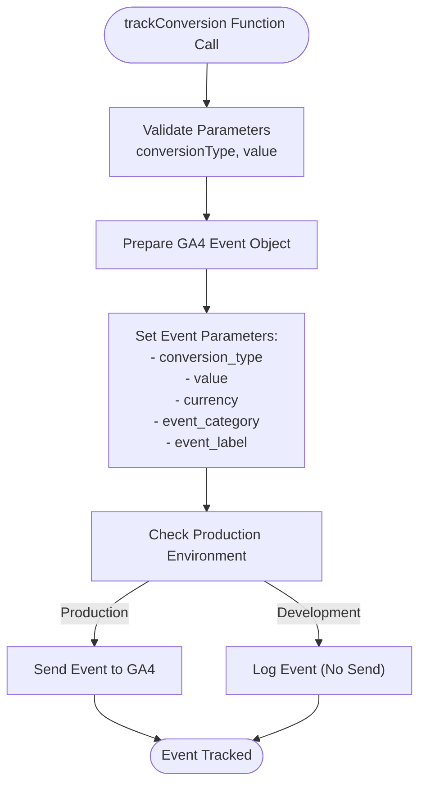
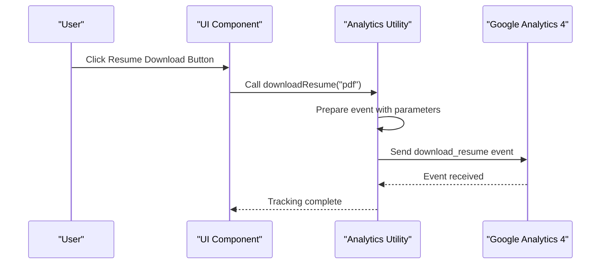
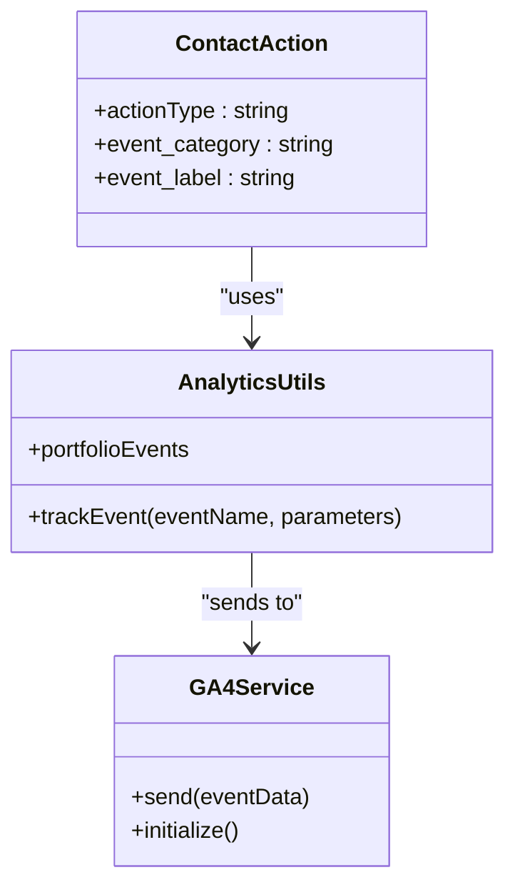
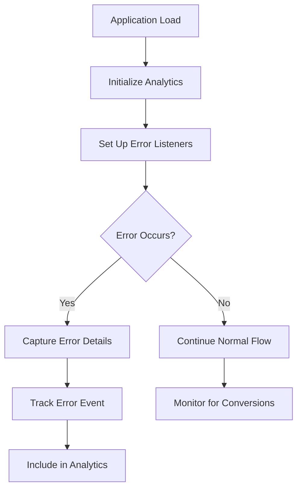
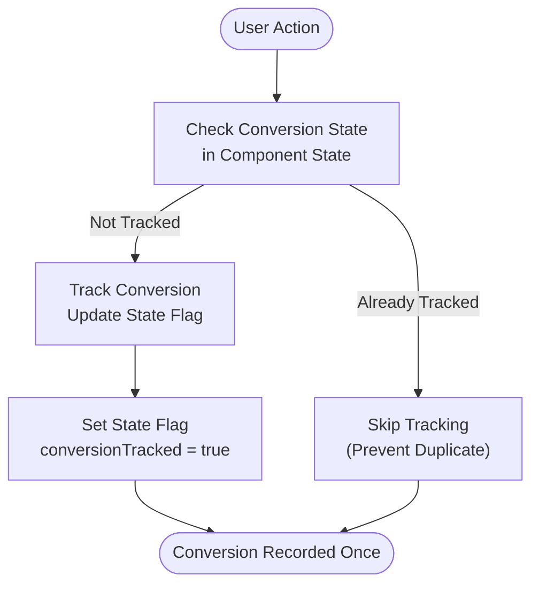
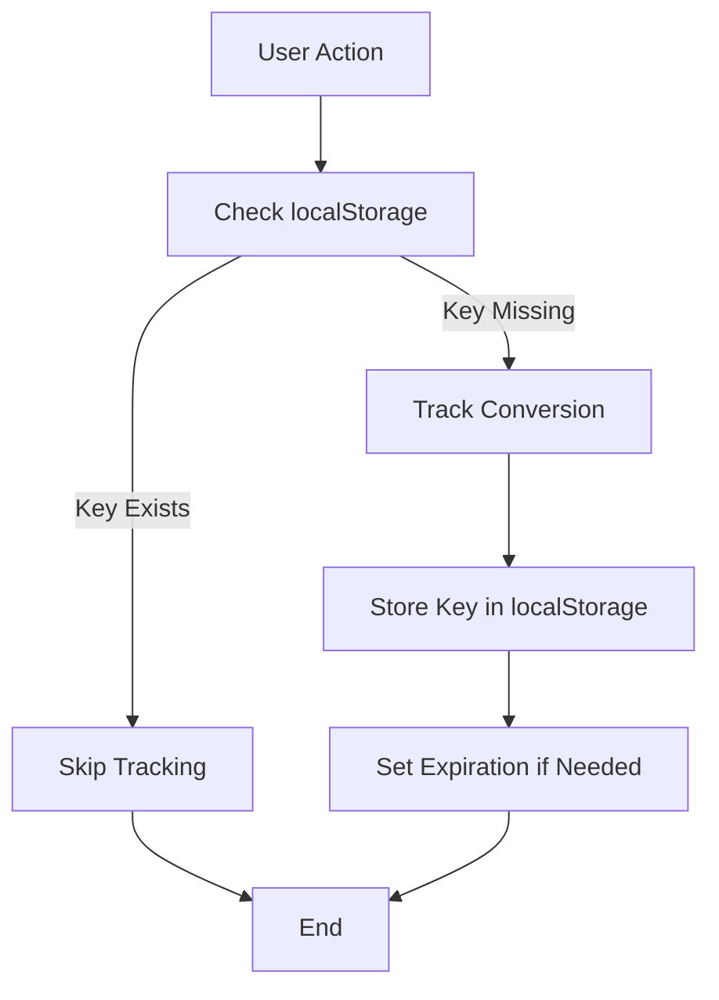

# Conversion Tracking

<cite>
**Referenced Files in This Document**  
- [analytics.js](file://src/utils/analytics.js)
- [App.js](file://src/App.js)
- [useLocalStorage.js](file://src/hooks/useLocalStorage.js)
</cite>

## Table of Contents
1. [Introduction](#introduction)
2. [Core Conversion Tracking Function](#core-conversion-tracking-function)
3. [Primary Conversion Events](#primary-conversion-events)
4. [Conversion Event Structure](#conversion-event-structure)
5. [Implementation Examples](#implementation-examples)
6. [Deduplication and Overcounting Prevention](#deduplication-and-overcounting-prevention)
7. [Error Tracking and Conversion Funnel Analysis](#error-tracking-and-conversion-funnel-analysis)
8. [Best Practices for New Conversion Types](#best-practices-for-new-conversion-types)
9. [Conclusion](#conclusion)

## Introduction

This document provides comprehensive documentation for the conversion tracking implementation in the portfolio application. The system is designed to measure key user actions that represent potential business outcomes, such as resume downloads, contact form submissions, and external link clicks. The tracking infrastructure leverages Google Analytics 4 (GA4) to capture and categorize these events, enabling data-driven insights into user engagement and conversion patterns.

The conversion tracking system is built on a modular architecture that separates core analytics functionality from specific event implementations. This design allows for consistent tracking across the application while maintaining flexibility for adding new conversion types. The implementation follows privacy-conscious practices by defaulting to non-personalized advertising signals and providing clear categorization of different user interactions.

**Section sources**
- [analytics.js](file://src/utils/analytics.js#L245-L253)
- [App.js](file://src/App.js#L1-L100)

## Core Conversion Tracking Function

The `trackConversion` function serves as the primary interface for recording conversion events in the application. This function abstracts the underlying GA4 implementation details, providing a simplified API for tracking various types of conversions with consistent parameter structure.



**Diagram sources**
- [analytics.js](file://src/utils/analytics.js#L245-L253)

**Section sources**
- [analytics.js](file://src/utils/analytics.js#L245-L253)

## Primary Conversion Events

The application implements two primary functions that serve as conversion trackers: `downloadResume` and `contactAction`. These functions are specifically designed to capture high-value user interactions that represent potential business outcomes.

### Resume Download Tracking

The `downloadResume` function tracks when users download the portfolio resume, assigning a value of 1 to each download event. This conversion type is particularly valuable as it indicates strong user interest in the portfolio owner's professional background.



**Diagram sources**
- [analytics.js](file://src/utils/analytics.js#L155-L162)

### Contact Action Tracking

The `contactAction` function captures various types of contact interactions, including email clicks, phone clicks, and contact form submissions. Each of these actions represents a direct attempt by the user to initiate communication, making them valuable conversion events.



**Diagram sources**
- [analytics.js](file://src/utils/analytics.js#L148-L153)

**Section sources**
- [analytics.js](file://src/utils/analytics.js#L148-L162)

## Conversion Event Structure

Conversion events in this application follow a standardized structure that ensures consistency in data collection and reporting. Each conversion event includes specific parameters that provide context and enable detailed analysis in GA4.

### Event Parameters

The following table outlines the structure of conversion events as implemented in the application:

| Parameter | Value | Description | Required |
|---------|-------|-------------|----------|
| **event_name** | "conversion" | The primary event name for all conversions | Yes |
| **conversion_type** | string | Specific type of conversion (e.g., "resume_download", "contact_form") | Yes |
| **value** | number | Numeric value assigned to the conversion (default: 1) | No |
| **currency** | "USD" | Currency code for value tracking | Yes |
| **event_category** | "conversion" | High-level category for event grouping | Yes |
| **event_label** | "portfolio_conversion" | Descriptive label for the conversion event | Yes |

**Section sources**
- [analytics.js](file://src/utils/analytics.js#L245-L253)

## Implementation Examples

The conversion tracking system is implemented throughout the application, with specific examples demonstrating how conversion events are triggered and processed.

### App.js Error Tracking Implementation

The error tracking implementation in App.js provides insights that can inform conversion funnel analysis. By monitoring JavaScript errors and unhandled promise rejections, the application can identify potential barriers to conversion completion.



This error tracking approach helps identify technical issues that might prevent users from completing conversion actions, such as form submissions or downloads failing due to JavaScript errors.

**Diagram sources**
- [App.js](file://src/App.js#L30-L45)

**Section sources**
- [App.js](file://src/App.js#L30-L45)

## Deduplication and Overcounting Prevention

To ensure accurate conversion measurement, the application implements strategies to prevent overcounting conversions. While the current implementation does not include explicit deduplication logic for conversion events, the architecture supports such functionality through the use of state management and localStorage.

### State Flag Implementation Pattern

A recommended approach for preventing duplicate conversion tracking involves using state flags to ensure each conversion is counted only once per session:



### localStorage Deduplication Strategy

For persistent deduplication across sessions, localStorage can be leveraged to store conversion tracking status:



The `useLocalStorage` hook provides the foundation for implementing such deduplication strategies, allowing conversion status to be persisted across page reloads and sessions.

**Diagram sources**
- [useLocalStorage.js](file://src/hooks/useLocalStorage.js#L2-L36)

**Section sources**
- [useLocalStorage.js](file://src/hooks/useLocalStorage.js#L2-L36)

## Error Tracking and Conversion Funnel Analysis

The error tracking implementation in App.js serves as a valuable tool for conversion funnel analysis. By monitoring and recording JavaScript errors, the application can identify potential friction points that may be preventing users from completing desired actions.

### Error Tracking Implementation

The application sets up comprehensive error monitoring through event listeners for both standard errors and unhandled promise rejections:

```javascript
// Error tracking setup in App.js
const handleError = event => {
  Analytics.portfolioEvents.trackError(
    event.error?.message || "Unknown error",
    event.filename || "Unknown location"
  );
};

const handleUnhandledRejection = event => {
  Analytics.portfolioEvents.trackError(
    event.reason?.message || "Unhandled promise rejection",
    "Promise rejection"
  );
};

window.addEventListener("error", handleError);
window.addEventListener("unhandledrejection", handleUnhandledRejection);
```

This error tracking can be correlated with conversion data to identify patterns where users encounter errors just before or during conversion attempts, indicating potential technical barriers to conversion completion.

**Section sources**
- [App.js](file://src/App.js#L30-L45)

## Best Practices for New Conversion Types

When defining new conversion types, several best practices should be followed to maintain alignment with business objectives and GA4 reporting requirements.

### Naming Conventions

Adopt consistent naming conventions for new conversion types:
- Use lowercase with underscores (e.g., "resume_download", "contact_form_submit")
- Be descriptive but concise
- Group related conversions with common prefixes

### Value Assignment

Consider the business value when assigning values to conversions:
- High-intent actions (e.g., contact form submission) may warrant higher values
- Standard actions (e.g., resume download) typically use value=1
- Consider implementing variable values based on user segmentation or action context

### Category and Label Strategy

Maintain consistency in event categorization:
- Use "conversion" as the event_category for all business outcome events
- Use descriptive event_labels that clearly identify the conversion type
- Consider implementing sub-categorization for complex conversion funnels

### Testing and Validation

Before deploying new conversion tracking:
- Test in development environment to verify event structure
- Validate data appears correctly in GA4 debug view
- Confirm event parameters meet reporting requirements
- Document the new conversion type and its business significance

## Conclusion

The conversion tracking implementation in this portfolio application provides a robust framework for measuring key user actions that represent potential business outcomes. The `trackConversion` function serves as the central mechanism for recording conversions, with standardized parameters ensuring consistency in data collection.

Primary conversion trackers like `downloadResume` and `contactAction` capture high-value user interactions, assigning appropriate values to measure engagement. The system is designed with extensibility in mind, allowing for the addition of new conversion types while maintaining alignment with GA4 reporting requirements.

To ensure data accuracy, developers should implement deduplication strategies using state flags or localStorage, preventing overcounting of conversions. The existing error tracking infrastructure provides valuable insights for conversion funnel analysis, helping identify technical barriers to conversion completion.

By following the documented best practices, new conversion types can be added systematically, ensuring the tracking data remains reliable and actionable for business decision-making.