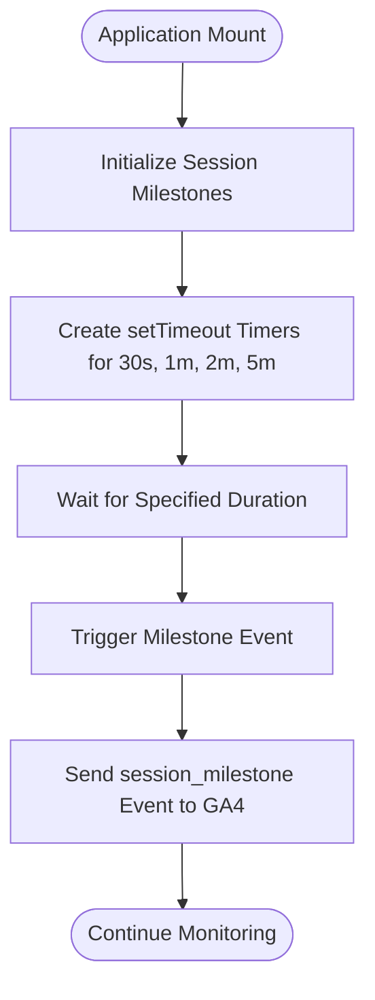
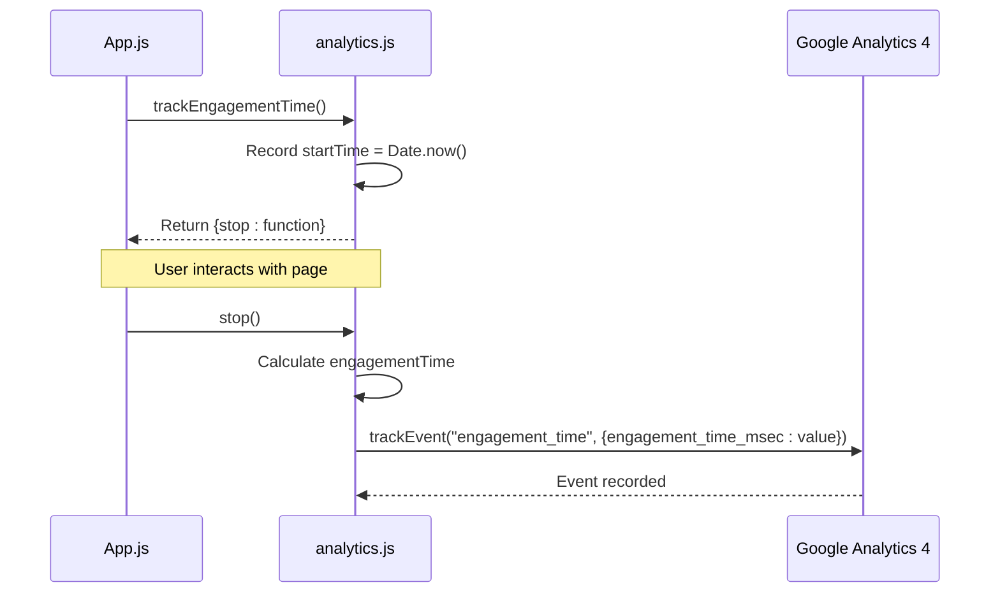
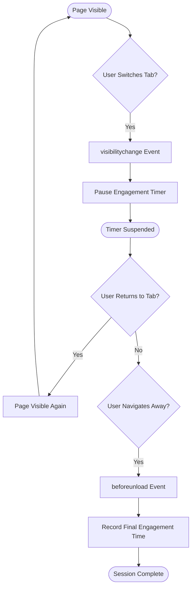
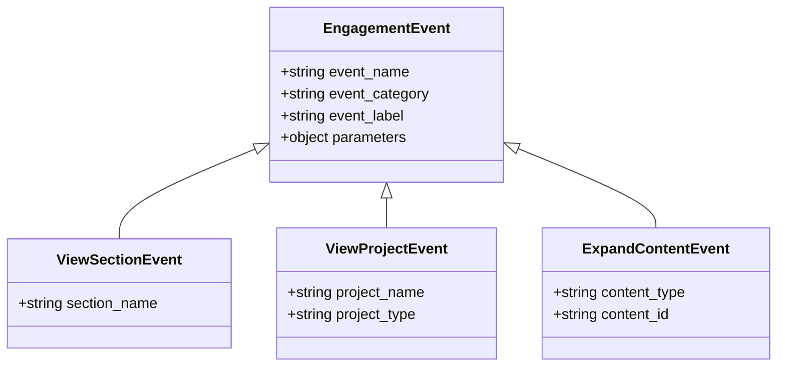
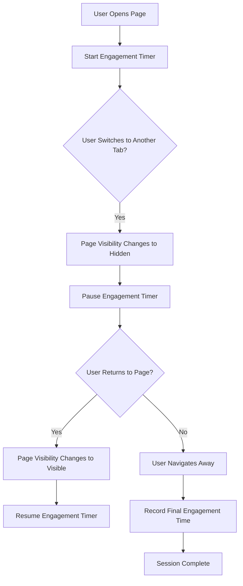
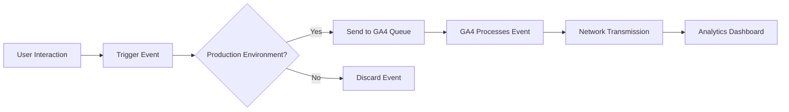

# Engagement Tracking

<cite>
**Referenced Files in This Document**   
- [App.js](file://src/App.js)
- [analytics.js](file://src/utils/analytics.js)
</cite>

## Table of Contents
1. [Introduction](#introduction)
2. [Session Milestone Tracking](#session-milestone-tracking)
3. [Engagement Time Calculation](#engagement-time-calculation)
4. [Visibility and Navigation Event Handling](#visibility-and-navigation-event-handling)
5. [Engagement Events Taxonomy](#engagement-events-taxonomy)
6. [Common Issues and Solutions](#common-issues-and-solutions)
7. [Adding New Engagement Events](#adding-new-engagement-events)
8. [Performance Considerations](#performance-considerations)

## Introduction

The engagement tracking system in this portfolio application measures user interaction through session milestones, time-on-page metrics, and specific engagement events. Implemented primarily in `App.js` and `analytics.js`, the system uses the Google Analytics 4 (GA4) framework to capture meaningful user behavior data. The tracking mechanism is initialized when the application mounts and continues throughout the user's session, capturing various engagement metrics that help understand how visitors interact with the portfolio content.

**Section sources**
- [App.js](file://src/App.js#L1-L100)
- [analytics.js](file://src/utils/analytics.js#L1-L288)

## Session Milestone Tracking

The system tracks user engagement through predefined time-based milestones: 30 seconds, 1 minute, 2 minutes, and 5 minutes. These milestones are implemented using `setTimeout` functions that trigger at the specified intervals after the page loads. When a user reaches a milestone, the system sends a `session_milestone` event to GA4 with the milestone duration as a parameter.

The milestone tracking is initialized in the `useEffect` hook of the `App` component, where an array of timeout values (30000, 60000, 120000, and 300000 milliseconds) is mapped to create individual timers. Each timer calls the `portfolioEvents.sessionMilestone` function with a formatted milestone string (e.g., "30_seconds" or "1_minutes") when triggered.



**Diagram sources**
- [App.js](file://src/App.js#L20-L30)
- [analytics.js](file://src/utils/analytics.js#L195-L202)

**Section sources**
- [App.js](file://src/App.js#L20-L30)
- [analytics.js](file://src/utils/analytics.js#L195-L202)

## Engagement Time Calculation

The `trackEngagementTime` utility function calculates the total time a user spends on the page. This function creates a timer that starts when the function is called and stops when the returned `stop` method is invoked. The timer captures the start time using `Date.now()` and calculates the engagement duration in seconds when stopped.

The function returns an object with a `stop` method that computes the engagement time, converts it to milliseconds, and sends an `engagement_time` event to GA4 with the duration as a parameter. This utility is used to measure the total time-on-page, which is particularly valuable for understanding user interest and content engagement.



**Diagram sources**
- [App.js](file://src/App.js#L21-L22)
- [analytics.js](file://src/utils/analytics.js#L228-L242)

**Section sources**
- [analytics.js](file://src/utils/analytics.js#L228-L242)

## Visibility and Navigation Event Handling

To ensure accurate engagement timing, the system implements event listeners for `visibilitychange` and `beforeunload` events. These listeners address the challenge of measuring engagement when users switch tabs or navigate away from the page.

The `visibilitychange` event listener monitors when the page becomes hidden (when the user switches to another tab or minimizes the browser). When this occurs, the engagement timer is paused by calling the `stop` method on the engagement timer. This prevents inflating the time-on-page metric when the user is not actively viewing the content.

The `beforeunload` event listener captures the final engagement time when the user navigates away from the page or closes the browser tab. This ensures that the complete engagement duration is recorded, even for short visits.



**Diagram sources**
- [App.js](file://src/App.js#L34-L42)
- [App.js](file://src/App.js#L44-L48)

**Section sources**
- [App.js](file://src/App.js#L34-L48)

## Engagement Events Taxonomy

The system tracks various engagement events categorized under the 'engagement' event_category. These events capture specific user interactions with the portfolio content and follow a consistent naming and parameter structure.

### Core Engagement Events

| Event Name | Parameters | Description |
|-----------|-----------|-------------|
| view_section | section_name, event_category, event_label | Triggered when a user views a specific section of the portfolio |
| view_project | project_name, project_type, event_category, event_label | Fired when a user views a project in the portfolio |
| expand_content | content_type, content_id, event_category, event_label | Sent when a user expands additional content |

These events follow a consistent pattern where the `event_category` is set to "engagement" and the `event_label` provides additional context about the interaction type. The parameters are designed to capture meaningful data that can be used to analyze user behavior patterns across different content types.



**Diagram sources**
- [analytics.js](file://src/utils/analytics.js#L60-L190)

**Section sources**
- [analytics.js](file://src/utils/analytics.js#L60-L190)

## Common Issues and Solutions

### Inaccurate Timing Due to Background Tabs

One common issue in engagement tracking is inaccurate timing when users have the page open in a background tab. Without proper handling, the system might continue counting time even when the user is not actively viewing the content, leading to inflated engagement metrics.

**Solution**: The implementation uses the Page Visibility API to detect when the page is not visible to the user. When the `visibilitychange` event indicates the page is hidden, the engagement timer is paused. This ensures that only active viewing time is counted toward the engagement metrics.

### Event Duplication

Potential duplication of events can occur if the cleanup function in the `useEffect` hook is not properly implemented, especially during component re-renders in a React application.

**Solution**: The implementation includes a cleanup function that clears all setTimeout timers and removes event listeners when the component unmounts. This prevents memory leaks and ensures events are not triggered after the component is no longer active.



**Diagram sources**
- [App.js](file://src/App.js#L34-L42)

**Section sources**
- [App.js](file://src/App.js#L34-L42)

## Adding New Engagement Events

To maintain consistency in the analytics implementation, new engagement events should follow the existing taxonomy and pattern established in the `portfolioEvents` object in `analytics.js`.

### Steps to Add a New Engagement Event:

1. **Define the event function** in the `portfolioEvents` object in `analytics.js`
2. **Use consistent parameter structure** with `event_category` set to "engagement"
3. **Include meaningful parameters** that capture the context of the interaction
4. **Use descriptive event names** following the action_object pattern (e.g., "click_button", "view_video")

### Example Implementation:

```javascript
// Add to portfolioEvents object in analytics.js
viewCertificate: (certificateName, issuer) => {
  trackEvent("view_certificate", {
    certificate_name: certificateName,
    issuer: issuer,
    event_category: "engagement",
    event_label: "certificate_view"
  });
}
```

When triggering the event from a component, import the Analytics utility and call the appropriate method:

```javascript
import Analytics from "./utils/analytics";
// ...
Analytics.portfolioEvents.viewCertificate("Google Cloud Certification", "Google");
```

**Section sources**
- [analytics.js](file://src/utils/analytics.js#L60-L190)

## Performance Considerations

The engagement tracking implementation is designed to minimize impact on user experience while capturing meaningful data.

### Lightweight Event Listeners

The system uses a minimal number of event listeners (visibilitychange and beforeunload) to avoid performance overhead. These native browser events have negligible performance impact and are optimized by the browser.

### Efficient Timer Management

The setTimeout-based milestone tracking uses a fixed number of timers (four) that are cleaned up when the component unmounts. This prevents memory leaks and ensures resources are properly released.

### Conditional Tracking

Analytics tracking is disabled in development mode, preventing unnecessary network requests during development and testing. The system checks the `NODE_ENV` environment variable and only initializes GA4 in production.

### Asynchronous Execution

All analytics events are sent asynchronously, ensuring that tracking does not block the main thread or impact page performance. The GA4 library handles event queuing and transmission in the background.



**Diagram sources**
- [analytics.js](file://src/utils/analytics.js#L5-L15)
- [analytics.js](file://src/utils/analytics.js#L25-L35)

**Section sources**
- [analytics.js](file://src/utils/analytics.js#L5-L35)