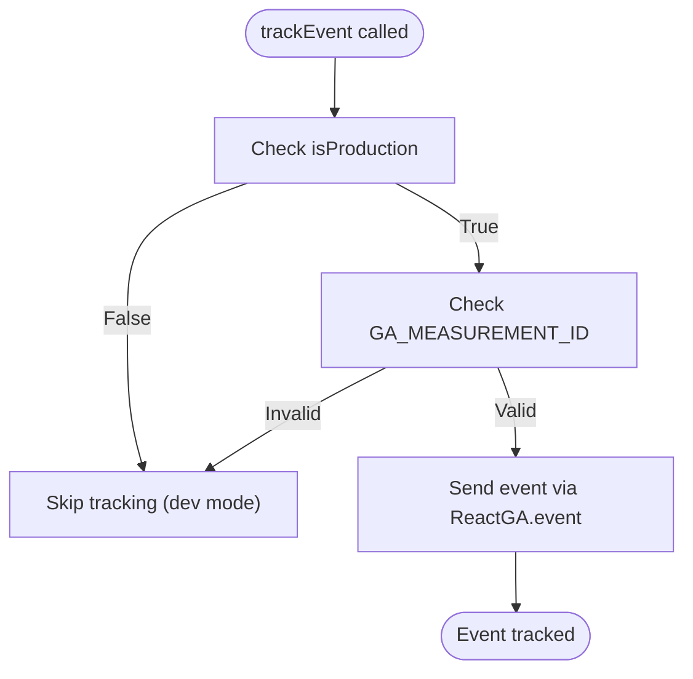
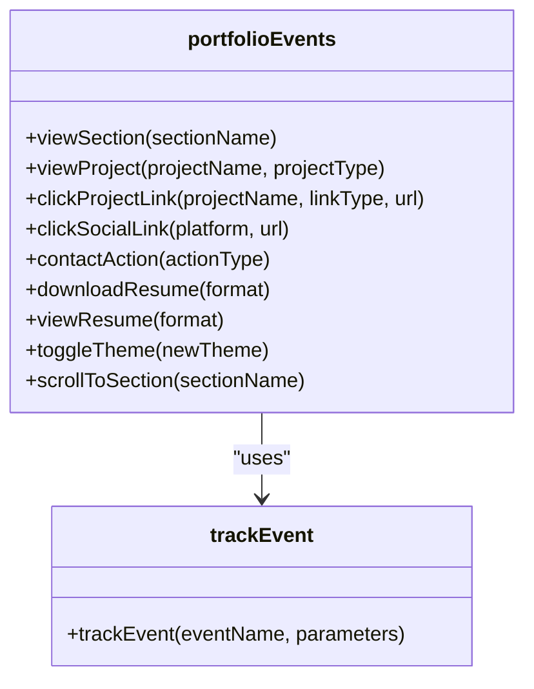
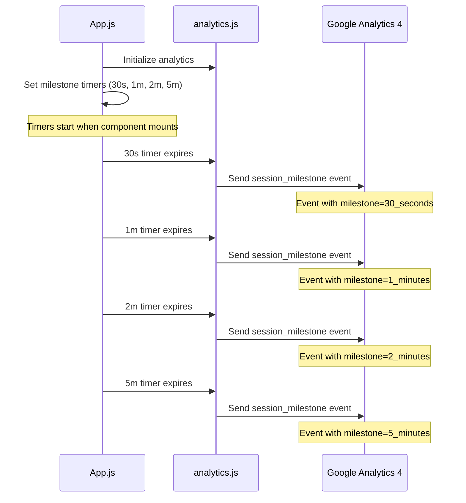
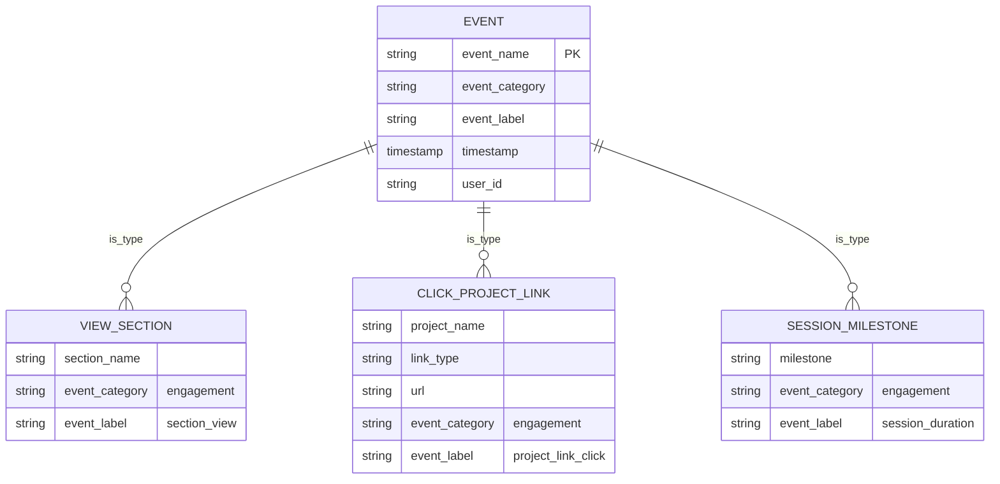
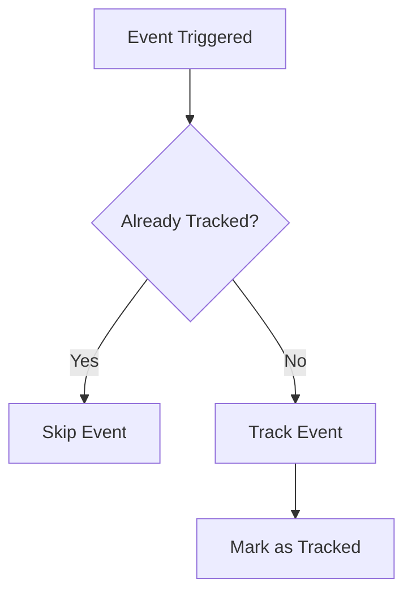

# Event Tracking

<cite>
**Referenced Files in This Document**   
- [analytics.js](file://src/utils/analytics.js)
- [App.js](file://src/App.js)
</cite>

## Table of Contents
1. [Introduction](#introduction)
2. [Core Tracking Function](#core-tracking-function)
3. [Portfolio Events Object](#portfolio-events-object)
4. [Session Milestone Tracking](#session-milestone-tracking)
5. [Event Parameters and Naming Conventions](#event-parameters-and-naming-conventions)
6. [Common Issues and Solutions](#common-issues-and-solutions)
7. [Performance Optimization](#performance-optimization)
8. [Developer Guidelines](#developer-guidelines)
9. [Conclusion](#conclusion)

## Introduction

The event tracking implementation in this portfolio application provides a comprehensive analytics framework for monitoring user interactions and engagement. Built on Google Analytics 4 (GA4) through the react-ga4 library, the system captures various user behaviors across the portfolio website. The implementation follows a structured approach with standardized parameters and domain-specific tracking functions to ensure consistent data collection and analysis.

**Section sources**
- [analytics.js](file://src/utils/analytics.js#L8-L288)
- [App.js](file://src/App.js#L1-L101)

## Core Tracking Function

The foundation of the event tracking system is the `trackEvent` function, which serves as the primary interface for sending custom events to GA4. This function acts as a wrapper around the ReactGA.event method, providing environment checks and standardized parameter handling.

The `trackEvent` function accepts two parameters: `eventName` (string) and `parameters` (object with default empty object). It first verifies that the application is running in production mode and that a valid GA4 measurement ID is configured before sending events. This prevents analytics data from being sent during development and testing phases.



**Diagram sources**
- [analytics.js](file://src/utils/analytics.js#L38-L42)

**Section sources**
- [analytics.js](file://src/utils/analytics.js#L38-L42)

## Portfolio Events Object

The `portfolioEvents` object encapsulates domain-specific tracking functions that standardize event collection across the application. This object provides a clean API for tracking various user interactions with consistent parameter formatting.

The implementation includes several categories of events:

- **Section interactions**: `viewSection` for tracking when users view specific sections
- **Project interactions**: `viewProject`, `clickProjectLink` for project engagement
- **Social media interactions**: `clickSocialLink` for social platform clicks
- **Contact interactions**: `contactAction` for contact-related actions
- **Resume interactions**: `downloadResume`, `viewResume` for resume engagement
- **Navigation interactions**: `scrollToSection`, `clickScrollToTop` for navigation
- **Theme interactions**: `toggleTheme` for theme changes

Each function within `portfolioEvents` follows a consistent pattern of calling `trackEvent` with standardized parameters including `event_category` and `event_label`. The `event_category` parameter categorizes events into logical groups such as "engagement", "ui_interaction", and "navigation", while `event_label` provides a consistent descriptor for the type of interaction.



**Diagram sources**
- [analytics.js](file://src/utils/analytics.js#L45-L225)

**Section sources**
- [analytics.js](file://src/utils/analytics.js#L45-L225)

## Session Milestone Tracking

The application implements session milestone tracking to measure user engagement duration. This functionality is configured in the App.js file, where timers are set to trigger events at specific intervals: 30 seconds, 1 minute, 2 minutes, and 5 minutes.

The implementation uses JavaScript's `setTimeout` function to schedule milestone events. When a milestone is reached, the `sessionMilestone` function from the `portfolioEvents` object is called with a formatted milestone string (e.g., "30_seconds" or "1_minutes"). This approach allows for the analysis of user engagement patterns and identification of content that retains visitor attention.



**Diagram sources**
- [App.js](file://src/App.js#L23)
- [analytics.js](file://src/utils/analytics.js#L198-L206)

**Section sources**
- [App.js](file://src/App.js#L1-L101)
- [analytics.js](file://src/utils/analytics.js#L198-L206)

## Event Parameters and Naming Conventions

The event tracking system follows consistent naming conventions and parameter structures to ensure data uniformity and ease of analysis in GA4.

### Standard Parameters

All events include three standard parameters:
- `event_category`: Categorizes events into logical groups (e.g., "engagement", "navigation")
- `event_label`: Provides a consistent descriptor for the type of interaction
- Additional event-specific parameters (e.g., `section_name`, `project_name`)

### Naming Conventions

The implementation follows these naming conventions:
- **Event names**: Use snake_case format (e.g., "view_section", "click_project_link")
- **Parameter names**: Use snake_case format (e.g., "section_name", "event_category")
- **Category values**: Use lowercase with underscores (e.g., "engagement", "ui_interaction")
- **Label values**: Use lowercase with underscores (e.g., "section_view", "project_link_click")

### Parameter Structure



**Diagram sources**
- [analytics.js](file://src/utils/analytics.js#L50-L51)
- [analytics.js](file://src/utils/analytics.js#L60-L61)
- [analytics.js](file://src/utils/analytics.js#L70)

**Section sources**
- [analytics.js](file://src/utils/analytics.js#L45-L225)

## Common Issues and Solutions

### Duplicate Events

**Issue**: Events may be triggered multiple times due to component re-renders or multiple event listeners.

**Solution**: The implementation mitigates this by:
1. Using cleanup functions in useEffect hooks to clear timers
2. Ensuring event tracking is only initialized once when the component mounts
3. Checking production environment before sending events



### Missing Parameters

**Issue**: Required parameters might be missing or undefined.

**Solution**: The implementation includes:
1. Default parameter values (e.g., projectType = "portfolio")
2. Comprehensive parameter validation within the tracking functions
3. Consistent parameter structure across all event types

### Development Mode Tracking

**Issue**: Analytics events being sent from development environments.

**Solution**: The `trackEvent` function includes environment checks that prevent events from being sent when not in production mode.

**Section sources**
- [analytics.js](file://src/utils/analytics.js#L38-L42)
- [App.js](file://src/App.js#L1-L101)

## Performance Optimization

The event tracking implementation includes several performance optimization techniques to minimize impact on application performance.

### Debouncing Rapid Events

While not explicitly implemented for all events, the architecture supports debouncing for rapid-fire events. For example, scroll events could be debounced to prevent excessive event tracking.

### Cleanup of Event Listeners

The implementation properly cleans up event listeners and timers when components unmount, preventing memory leaks:

```javascript
return () => {
  timers.forEach(timer => clearTimeout(timer));
  document.removeEventListener("visibilitychange", handleVisibilityChange);
  window.removeEventListener("beforeunload", handleBeforeUnload);
  window.removeEventListener("error", handleError);
  window.removeEventListener("unhandledrejection", handleUnhandledRejection);
};
```

### Asynchronous Event Sending

Events are sent asynchronously through the ReactGA library, ensuring that event tracking does not block the main thread or impact user experience.

### Conditional Tracking

The implementation only initializes and sends events in production mode, reducing overhead during development.

**Section sources**
- [App.js](file://src/App.js#L1-L101)
- [analytics.js](file://src/utils/analytics.js#L8-L24)

## Developer Guidelines

When adding new event types to maintain consistency with existing patterns, follow these guidelines:

### 1. Follow Existing Patterns

New event functions should be added to the `portfolioEvents` object and follow the same structure as existing functions:

```javascript
newEventName: (param1, param2) => {
  trackEvent("event_name", {
    param1: param1,
    param2: param2,
    event_category: "category",
    event_label: "label"
  });
}
```

### 2. Use Consistent Naming

- Event names: snake_case (e.g., "click_button")
- Parameters: snake_case (e.g., "button_id")
- Categories: use existing categories when possible ("engagement", "navigation", "ui_interaction")
- Labels: descriptive and consistent (e.g., "button_click")

### 3. Include Standard Parameters

Always include `event_category` and `event_label` with every event:

```javascript
event_category: "engagement" // or appropriate category
event_label: "specific_action" // descriptive label
```

### 4. Handle Edge Cases

Include default values for optional parameters and validate required parameters:

```javascript
functionName: (requiredParam, optionalParam = "default") => {
  if (!requiredParam) return; // or throw error
  // track event
}
```

### 5. Test in Development

Use the `debugAnalytics` function to verify events are being tracked correctly without sending data to GA4:

```javascript
Analytics.debugAnalytics();
```

### 6. Document New Events

Update documentation to include new event types, their parameters, and intended use cases.

**Section sources**
- [analytics.js](file://src/utils/analytics.js#L45-L225)
- [App.js](file://src/App.js#L1-L101)

## Conclusion

The event tracking implementation provides a robust framework for monitoring user engagement and behavior on the portfolio website. By standardizing event parameters and organizing tracking functions within the `portfolioEvents` object, the system ensures consistent data collection that can be effectively analyzed in GA4.

The implementation balances comprehensive tracking with performance considerations, using environment checks to prevent development data from polluting analytics and proper cleanup to avoid memory leaks. The session milestone tracking provides valuable insights into user engagement patterns, while the structured approach to event naming and parameters enables meaningful analysis of user behavior.

Developers can extend the system by following the established patterns for new event types, ensuring that the analytics data remains consistent and actionable. The combination of standardized parameters, clear categorization, and comprehensive coverage of user interactions makes this implementation a solid foundation for data-driven decision making regarding the portfolio's content and user experience.