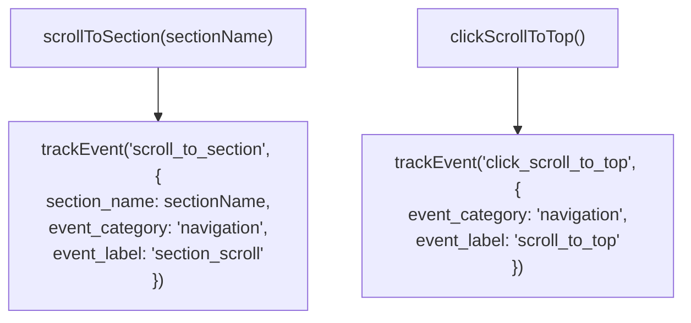
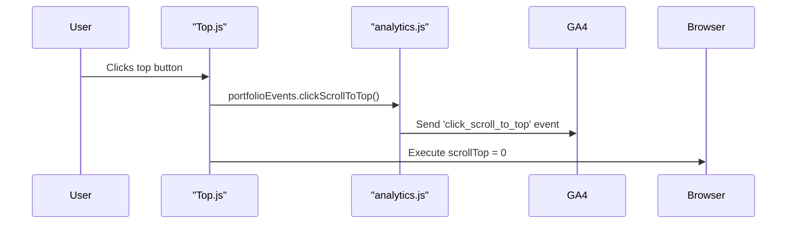

# Navigation Tracking

<cite>
**Referenced Files in This Document**   
- [analytics.js](file://src/utils/analytics.js)
- [Header.js](file://src/components/header/Header.js)
- [Footer.js](file://src/components/footer/Footer.js)
- [Top.js](file://src/containers/topbutton/Top.js)
</cite>

## Table of Contents
1. [Introduction](#introduction)
2. [Core Navigation Tracking Functions](#core-navigation-tracking-functions)
3. [Integration Points in UI Components](#integration-points-in-ui-components)
4. [Event Structure and Naming Conventions](#event-structure-and-naming-conventions)
5. [Scroll Event Handling and Debouncing Considerations](#scroll-event-handling-and-debouncing-considerations)
6. [Best Practices for Extending Navigation Tracking](#best-practices-for-extending-navigation-tracking)
7. [Conclusion](#conclusion)

## Introduction
This document details the implementation of navigation tracking within the personal portfolio SPA, focusing on user interaction monitoring through scroll-based navigation. The system captures user behavior via two primary functions: `scrollToSection` and `clickScrollToTop`, both part of the analytics utility. These events are categorized under 'navigation' with structured labels to ensure consistency in data collection. The tracking is integrated into key UI components including the header, footer, and top navigation button, enabling comprehensive visibility into how users navigate the single-page application.

**Section sources**
- [analytics.js](file://src/utils/analytics.js#L151-L163)
- [Top.js](file://src/containers/topbutton/Top.js#L6-L8)

## Core Navigation Tracking Functions

The navigation tracking functionality is implemented within the `portfolioEvents` object in the analytics utility module. Two core functions handle user-initiated navigation actions:

- `scrollToSection(sectionName)`: Tracks when a user scrolls to a specific section via anchor links. This event uses 'navigation' as the `event_category` and 'section_scroll' as the `event_label`, with the targeted section name passed as a parameter.
- `clickScrollToTop()`: Captures when a user clicks the "scroll to top" button. This event also belongs to the 'navigation' category but uses 'scroll_to_top' as its label, indicating upward navigation.

These functions abstract the underlying Google Analytics 4 (GA4) event tracking, ensuring consistent parameter formatting and reducing duplication across components.



**Diagram sources**
- [analytics.js](file://src/utils/analytics.js#L151-L163)

**Section sources**
- [analytics.js](file://src/utils/analytics.js#L151-L163)

## Integration Points in UI Components

Navigation tracking is integrated into multiple UI components where users initiate scroll actions:

### Header Component
The header contains anchor links to various sections of the portfolio (e.g., Skills, Projects, Contact). While the current implementation uses standard anchor hrefs (`#skills`, `#experience`), these could be enhanced with onClick handlers to explicitly trigger `scrollToSection` with the corresponding section name.

### Top Button Component
The "scroll to top" button, rendered by `Top.js`, actively integrates navigation tracking. When clicked, it invokes `Analytics.portfolioEvents.clickScrollToTop()` before executing the scroll action. This ensures that every upward navigation is recorded.



**Diagram sources**
- [Top.js](file://src/containers/topbutton/Top.js#L6-L8)
- [analytics.js](file://src/utils/analytics.js#L159-L163)

**Section sources**
- [Top.js](file://src/containers/topbutton/Top.js#L1-L45)
- [Header.js](file://src/components/header/Header.js#L1-L93)

## Event Structure and Naming Conventions

The navigation events follow a consistent structure to ensure reliable data analysis:

| Property | scrollToSection | clickScrollToTop |
|--------|------------------|-------------------|
| **event_name** | scroll_to_section | click_scroll_to_top |
| **event_category** | navigation | navigation |
| **event_label** | section_scroll | scroll_to_top |
| **parameters** | section_name | none |

This standardized approach enables clear segmentation in analytics reports and supports future expansion. For example, adding new sections only requires passing the appropriate `sectionName` without modifying the tracking logic.

**Section sources**
- [analytics.js](file://src/utils/analytics.js#L151-L163)

## Scroll Event Handling and Debouncing Considerations

A potential issue in scroll tracking arises from smooth scrolling animations, which may trigger multiple rapid scroll events as the page animates to the target position. While the current implementation does not include debouncing, this could lead to inflated event counts if scroll listeners are attached directly to scroll position changes.

Recommended solutions include:
- **Debouncing**: Implement a debounce mechanism (e.g., 300ms) to prevent duplicate events during animation.
- **State Tracking**: Use component state to track whether a scroll event has already been recorded for a given section within a time window.
- **Intersection Observers**: Replace scroll listeners with Intersection Observer API to detect when a section enters the viewport, reducing false positives.

Although not currently implemented, these patterns should be considered if scroll-based triggers (rather than click-based) are introduced.

**Section sources**
- [analytics.js](file://src/utils/analytics.js#L151-L163)
- [Top.js](file://src/containers/topbutton/Top.js#L6-L8)

## Best Practices for Extending Navigation Tracking

When extending navigation tracking to new components or interactions, follow these best practices:

1. **Consistent Naming**: Always use snake_case for event names and maintain the `action_object` pattern (e.g., `scroll_to_section`, `click_navigation_link`).
2. **Standardized Categories**: Use predefined `event_category` values like 'navigation', 'engagement', or 'ui_interaction' for consistent reporting.
3. **Parameter Structure**: Include relevant context in parameters (e.g., `section_name`) while avoiding excessive or redundant data.
4. **Centralized Definition**: Add new tracking functions to the `portfolioEvents` object in `analytics.js` rather than scattering GA calls throughout components.
5. **Production Safeguards**: Ensure tracking only occurs in production mode using the `isProduction` flag.
6. **Privacy Compliance**: Avoid collecting personally identifiable information (PII) in event parameters.

Example of extending tracking to header links:
```javascript
// In Header.js onClick handler
Analytics.portfolioEvents.scrollToSection("projects");
```

**Section sources**
- [analytics.js](file://src/utils/analytics.js#L151-L163)

## Conclusion
The navigation tracking system effectively captures user movement within the SPA through well-structured events. The `scrollToSection` and `clickScrollToTop` functions provide valuable insights into user engagement patterns, categorized under 'navigation' with clear labels. Current integration focuses on explicit user actions, particularly in the top navigation button. Future improvements could include enhanced tracking of header link interactions and implementation of debouncing mechanisms to handle animation-related event duplication. By adhering to consistent naming conventions and centralized event management, the system remains maintainable and scalable for future enhancements.