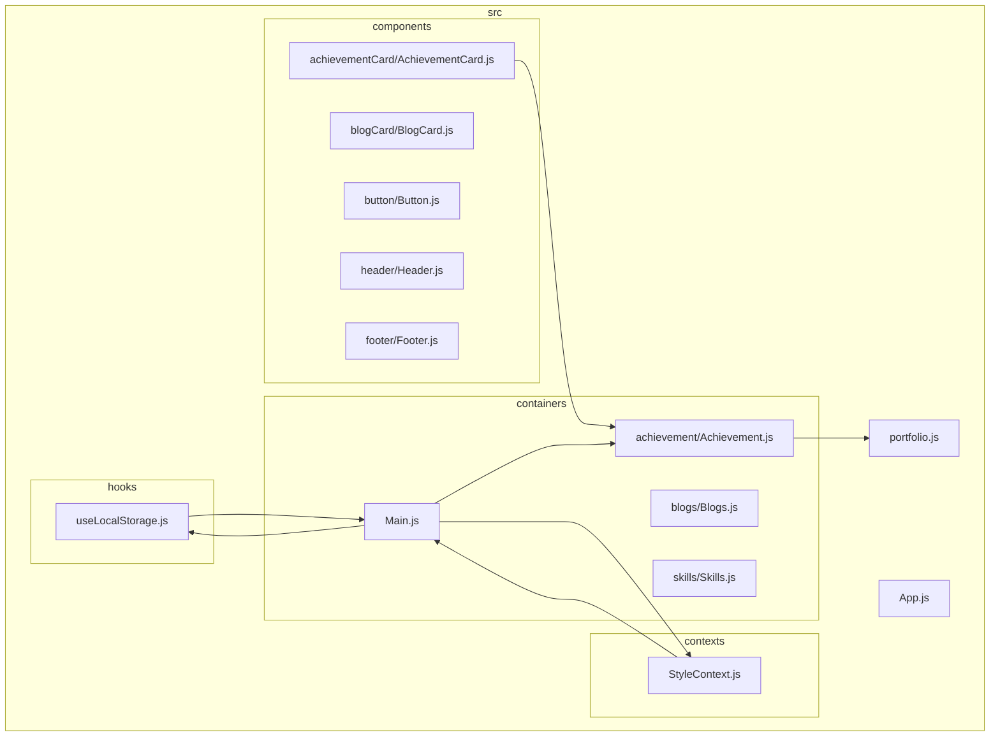
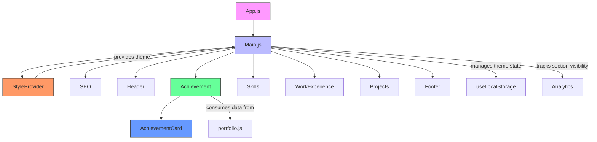
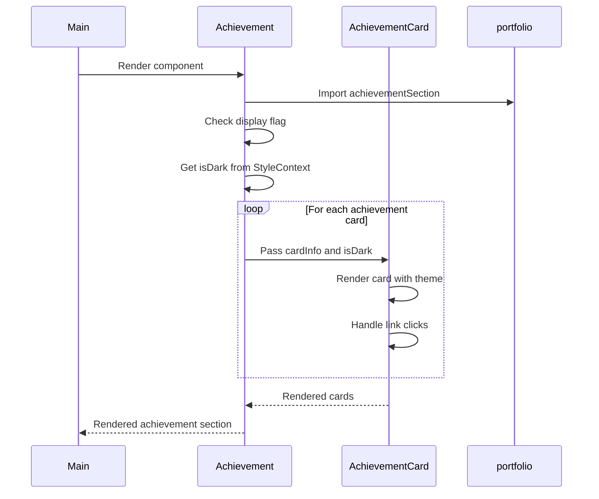
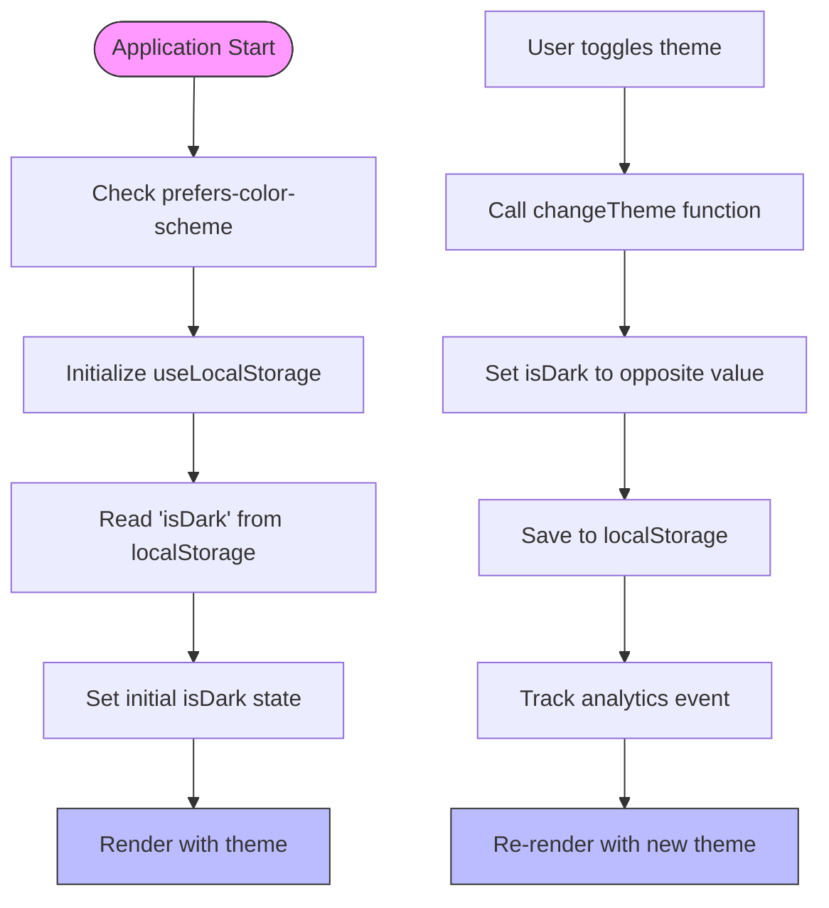
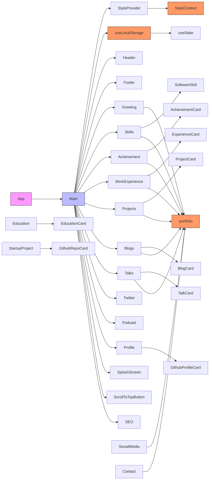

# Component Architecture

<cite>
**Referenced Files in This Document**   
- [App.js](file://src/App.js)
- [Main.js](file://src/containers/Main.js)
- [StyleContext.js](file://src/contexts/StyleContext.js)
- [useLocalStorage.js](file://src/hooks/useLocalStorage.js)
- [AchievementCard.js](file://src/components/achievementCard/AchievementCard.js)
- [Achievement.js](file://src/containers/achievement/Achievement.js)
- [portfolio.js](file://src/portfolio.js)
</cite>

## Table of Contents
1. [Introduction](#introduction)
2. [Project Structure](#project-structure)
3. [Core Components](#core-components)
4. [Architecture Overview](#architecture-overview)
5. [Detailed Component Analysis](#detailed-component-analysis)
6. [Dependency Analysis](#dependency-analysis)
7. [Performance Considerations](#performance-considerations)
8. [Troubleshooting Guide](#troubleshooting-guide)
9. [Conclusion](#conclusion)

## Introduction
This document provides comprehensive architectural documentation for a React-based portfolio application that implements a component-container pattern. The system leverages React functional components and hooks to create a modular, maintainable architecture with clear separation of concerns. The documentation details how presentational components are decoupled from data-fetching logic, how theme persistence is implemented, and how configuration data flows through the application to render dynamic UI elements.

## Project Structure

The application follows a well-organized directory structure that separates concerns and promotes maintainability:

**Diagram sources**
- [src/components/achievementCard/AchievementCard.js](file://src/components/achievementCard/AchievementCard.js)
- [src/containers/achievement/Achievement.js](file://src/containers/achievement/Achievement.js)
- [src/containers/Main.js](file://src/containers/Main.js)
- [src/contexts/StyleContext.js](file://src/contexts/StyleContext.js)
- [src/hooks/useLocalStorage.js](file://src/hooks/useLocalStorage.js)
- [src/portfolio.js](file://src/portfolio.js)

**Section sources**
- [src/components](file://src/components)
- [src/containers](file://src/containers)
- [src/contexts](file://src/contexts)
- [src/hooks](file://src/hooks)

## Core Components

The application architecture is built around several core components that implement key patterns:

- **Presentational Components**: Stateless UI components that receive data via props and focus solely on rendering
- **Container Components**: Components that handle data fetching and state management, passing data to presentational components
- **Context Providers**: Components that manage global application state and provide it to consumers
- **Custom Hooks**: Reusable logic encapsulated in hooks for state management and side effects

The Component-Container Pattern is evident throughout the application, with components like AchievementCard (presentational) being used by Achievement (container) which manages the data flow from the configuration in portfolio.js.

**Section sources**
- [src/components/achievementCard/AchievementCard.js](file://src/components/achievementCard/AchievementCard.js)
- [src/containers/achievement/Achievement.js](file://src/containers/achievement/Achievement.js)
- [src/portfolio.js](file://src/portfolio.js)

## Architecture Overview

The application follows a hierarchical architecture where data flows from the root App component down through Main to various container components, which in turn render presentational components.

**Diagram sources**
- [src/App.js](file://src/App.js)
- [src/containers/Main.js](file://src/containers/Main.js)
- [src/contexts/StyleContext.js](file://src/contexts/StyleContext.js)
- [src/containers/achievement/Achievement.js](file://src/containers/achievement/Achievement.js)
- [src/components/achievementCard/AchievementCard.js](file://src/components/achievementCard/AchievementCard.js)
- [src/portfolio.js](file://src/portfolio.js)

## Detailed Component Analysis

### Achievement Component Analysis

The Achievement component demonstrates the Component-Container Pattern, where the container handles data access and the presentational component handles rendering.

**Diagram sources**
- [src/containers/Main.js](file://src/containers/Main.js#L25-L133)
- [src/containers/achievement/Achievement.js](file://src/containers/achievement/Achievement.js#L6-L56)
- [src/components/achievementCard/AchievementCard.js](file://src/components/achievementCard/AchievementCard.js#L3-L47)
- [src/portfolio.js](file://src/portfolio.js#L378-L514)

**Section sources**
- [src/containers/achievement/Achievement.js](file://src/containers/achievement/Achievement.js)
- [src/components/achievementCard/AchievementCard.js](file://src/components/achievementCard/AchievementCard.js)
- [src/portfolio.js](file://src/portfolio.js)

### Theme Management Analysis

The theme management system demonstrates how React Context and custom hooks work together to manage global state.

**Diagram sources**
- [src/containers/Main.js](file://src/containers/Main.js#L25-L133)
- [src/hooks/useLocalStorage.js](file://src/hooks/useLocalStorage.js#L2-L36)
- [src/contexts/StyleContext.js](file://src/contexts/StyleContext.js#L4-L4)

**Section sources**
- [src/containers/Main.js](file://src/containers/Main.js)
- [src/hooks/useLocalStorage.js](file://src/hooks/useLocalStorage.js)
- [src/contexts/StyleContext.js](file://src/contexts/StyleContext.js)

## Dependency Analysis

The application has a clear dependency hierarchy that ensures separation of concerns and maintainability.

**Diagram sources**
- [src/App.js](file://src/App.js)
- [src/containers/Main.js](file://src/containers/Main.js)
- [src/contexts/StyleContext.js](file://src/contexts/StyleContext.js)
- [src/hooks/useLocalStorage.js](file://src/hooks/useLocalStorage.js)
- [src/portfolio.js](file://src/portfolio.js)

**Section sources**
- [src/App.js](file://src/App.js)
- [src/containers/Main.js](file://src/containers/Main.js)
- [src/contexts/StyleContext.js](file://src/contexts/StyleContext.js)
- [src/hooks/useLocalStorage.js](file://src/hooks/useLocalStorage.js)
- [src/portfolio.js](file://src/portfolio.js)

## Performance Considerations

The application implements several performance optimizations:

- **Lazy Loading**: Components are rendered conditionally based on configuration flags
- **Intersection Observer**: Used to track section visibility and analytics events
- **Theme Persistence**: Uses localStorage to maintain user preferences across sessions
- **Configuration Centralization**: All content is defined in portfolio.js, reducing the need for external API calls
- **Component Reusability**: Presentational components are designed to be reusable across different sections

The use of React.memo is not explicitly implemented, but the architecture supports it for components that would benefit from it, particularly the presentational components that receive stable props.

## Troubleshooting Guide

Common issues and their solutions:

**Theme Not Persisting**
- Check if localStorage is available and not blocked by browser settings
- Verify that the useLocalStorage hook is correctly implemented
- Ensure the StyleProvider is wrapping all components that need theme access

**Components Not Rendering**
- Check the display flag in portfolio.js for the specific section
- Verify that the container component is properly imported and rendered in Main.js
- Ensure required data exists in the portfolio.js configuration

**Analytics Not Tracking**
- Verify that the Analytics module is properly initialized in App.js
- Check that event tracking functions are called in the appropriate lifecycle methods
- Ensure the Google Analytics script is properly loaded

**Section Visibility Not Tracked**
- Verify that Intersection Observer is properly set up in Main.js
- Check that sections have appropriate IDs for tracking
- Ensure the observer is not disconnected prematurely

**Section sources**
- [src/App.js](file://src/App.js)
- [src/containers/Main.js](file://src/containers/Main.js)
- [src/hooks/useLocalStorage.js](file://src/hooks/useLocalStorage.js)
- [src/portfolio.js](file://src/portfolio.js)

## Conclusion

The application demonstrates a well-structured