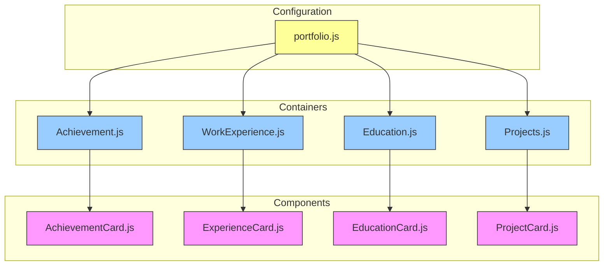
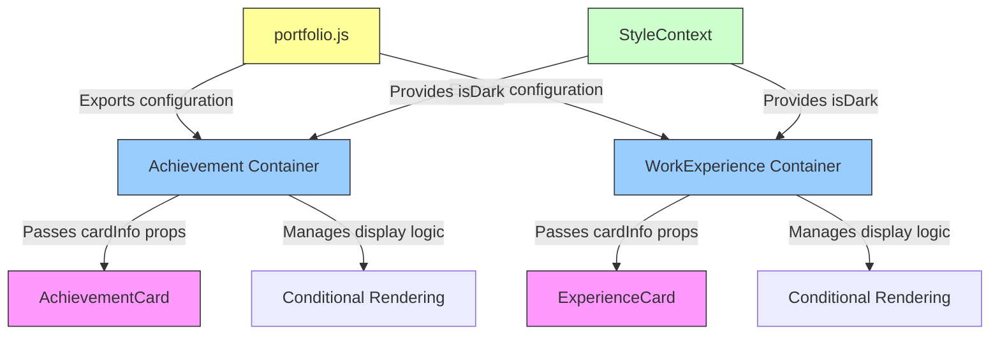
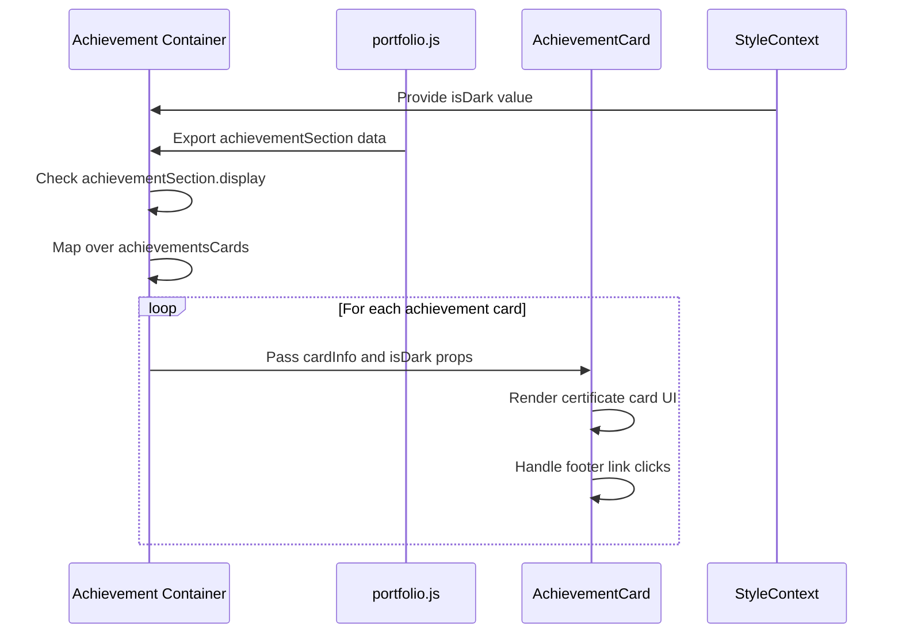
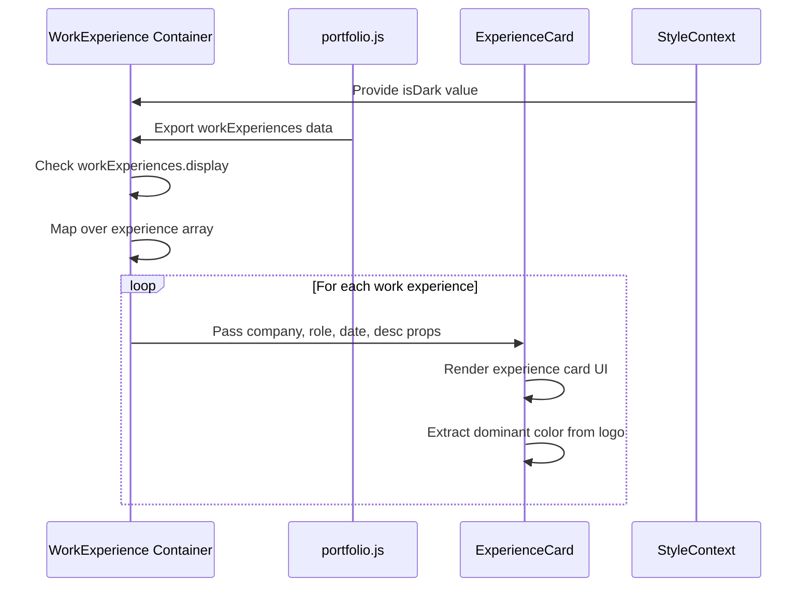

# Component-Container Pattern

<cite>
**Referenced Files in This Document**  
- [portfolio.js](file://src/portfolio.js)
- [AchievementCard.js](file://src/components/achievementCard/AchievementCard.js)
- [Achievement.js](file://src/containers/achievement/Achievement.js)
- [ExperienceCard.js](file://src/components/experienceCard/ExperienceCard.js)
- [WorkExperience.js](file://src/containers/workExperience/WorkExperience.js)
</cite>

## Table of Contents
1. [Introduction](#introduction)  
2. [Project Structure](#project-structure)  
3. [Core Components](#core-components)  
4. [Architecture Overview](#architecture-overview)  
5. [Detailed Component Analysis](#detailed-component-analysis)  
6. [Dependency Analysis](#dependency-analysis)  
7. [Performance Considerations](#performance-considerations)  
8. [Troubleshooting Guide](#troubleshooting-guide)  
9. [Conclusion](#conclusion)  

## Introduction

The Component-Container Pattern is a fundamental architectural approach used in this portfolio application to separate concerns between presentational components and data-fetching/state management logic. This pattern enhances code maintainability, reusability, and testability by clearly delineating responsibilities: containers handle data retrieval and business logic, while components focus solely on UI rendering. This document explores how this pattern is implemented across key sections of the application, particularly in the Achievement and WorkExperience modules.

## Project Structure

The application follows a clear directory structure that enforces the separation of concerns central to the Component-Container Pattern. Presentational components are organized under `src/components`, while their corresponding containers reside in `src/containers`. Configuration data is centralized in `src/portfolio.js`, serving as the single source of truth for content across the application.



**Diagram sources**  
- [src/components/achievementCard/AchievementCard.js](file://src/components/achievementCard/AchievementCard.js)  
- [src/containers/achievement/Achievement.js](file://src/containers/achievement/Achievement.js)  
- [src/components/experienceCard/ExperienceCard.js](file://src/components/experienceCard/ExperienceCard.js)  
- [src/containers/workExperience/WorkExperience.js](file://src/containers/workExperience/WorkExperience.js)  
- [src/portfolio.js](file://src/portfolio.js)  

**Section sources**  
- [src/components](file://src/components)  
- [src/containers](file://src/containers)  
- [src/portfolio.js](file://src/portfolio.js)  

## Core Components

The core of the Component-Container Pattern lies in the strict separation between presentational components and container components. Presentational components like `AchievementCard` and `ExperienceCard` are pure functions that receive data through props and render UI without knowledge of data sources. Container components like `Achievement` and `WorkExperience` orchestrate data flow, manage section-level state, and pass down props to their corresponding presentational components.

**Section sources**  
- [src/components/achievementCard/AchievementCard.js](file://src/components/achievementCard/AchievementCard.js#L3-L47)  
- [src/containers/achievement/Achievement.js](file://src/containers/achievement/Achievement.js#L6-L56)  
- [src/components/experienceCard/ExperienceCard.js](file://src/components/experienceCard/ExperienceCard.js#L3-L84)  
- [src/containers/workExperience/WorkExperience.js](file://src/containers/workExperience/WorkExperience.js#L7-L41)  

## Architecture Overview

The architecture follows a unidirectional data flow where configuration data from `portfolio.js` is consumed by container components, which then transform and pass this data as props to presentational components. This creates a clean separation of concerns and enables easy configuration changes without modifying component logic.



**Diagram sources**  
- [src/portfolio.js](file://src/portfolio.js#L377-L513)  
- [src/containers/achievement/Achievement.js](file://src/containers/achievement/Achievement.js#L6-L56)  
- [src/containers/workExperience/WorkExperience.js](file://src/containers/workExperience/WorkExperience.js#L7-L41)  
- [src/components/achievementCard/AchievementCard.js](file://src/components/achievementCard/AchievementCard.js#L3-L47)  
- [src/components/experienceCard/ExperienceCard.js](file://src/components/experienceCard/ExperienceCard.js#L3-L84)  

## Detailed Component Analysis

### Achievement Component Analysis

The Achievement module exemplifies the Component-Container Pattern by separating the data-fetching logic in the container from the UI rendering in the presentational component. The `Achievement` container imports configuration from `portfolio.js`, handles display logic based on the `display` flag, and maps over the `achievementsCards` array to create multiple `AchievementCard` instances.



**Diagram sources**  
- [src/containers/achievement/Achievement.js](file://src/containers/achievement/Achievement.js#L6-L56)  
- [src/portfolio.js](file://src/portfolio.js#L377-L513)  
- [src/components/achievementCard/AchievementCard.js](file://src/components/achievementCard/AchievementCard.js#L3-L47)  

**Section sources**  
- [src/containers/achievement/Achievement.js](file://src/containers/achievement/Achievement.js#L6-L56)  
- [src/components/achievementCard/AchievementCard.js](file://src/components/achievementCard/AchievementCard.js#L3-L47)  

### Work Experience Component Analysis

The WorkExperience module follows the same architectural pattern, with the container component managing the display of multiple experience entries. The `WorkExperience` container consumes the `workExperiences` configuration, checks the display flag, and maps over the experience array to create `ExperienceCard` instances, passing down transformed props.



**Diagram sources**  
- [src/containers/workExperience/WorkExperience.js](file://src/containers/workExperience/WorkExperience.js#L7-L41)  
- [src/portfolio.js](file://src/portfolio.js#L181-L211)  
- [src/components/experienceCard/ExperienceCard.js](file://src/components/experienceCard/ExperienceCard.js#L3-L84)  

**Section sources**  
- [src/containers/workExperience/WorkExperience.js](file://src/containers/workExperience/WorkExperience.js#L7-L41)  
- [src/components/experienceCard/ExperienceCard.js](file://src/components/experienceCard/ExperienceCard.js#L3-L84)  

## Dependency Analysis

The Component-Container Pattern creates a clear dependency hierarchy where containers depend on configuration files and presentational components, while presentational components remain independent of data sources. This structure enables component reuse and simplifies testing.

```mermaid
graph TD
    A[portfolio.js] --> B[Achievement]
    A --> C[WorkExperience]
    B --> D[AchievementCard]
    C --> E[ExperienceCard]
    F[StyleContext] --> B
    F --> C
    G