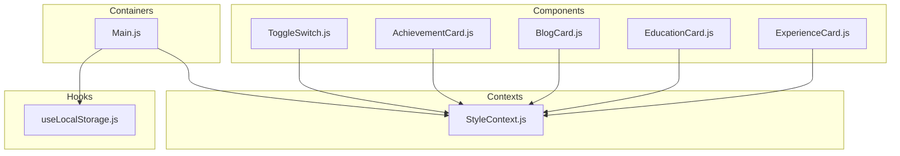
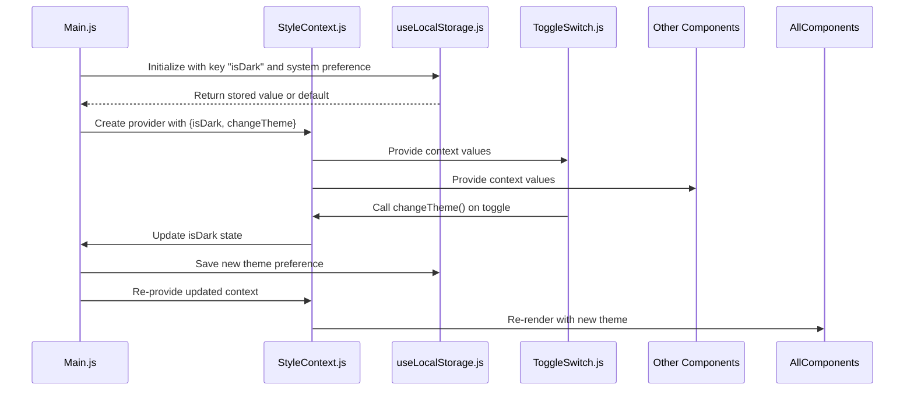
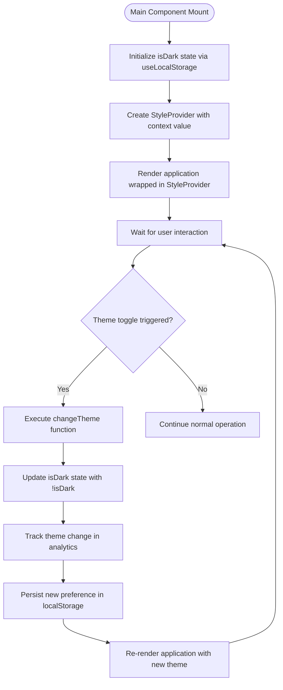
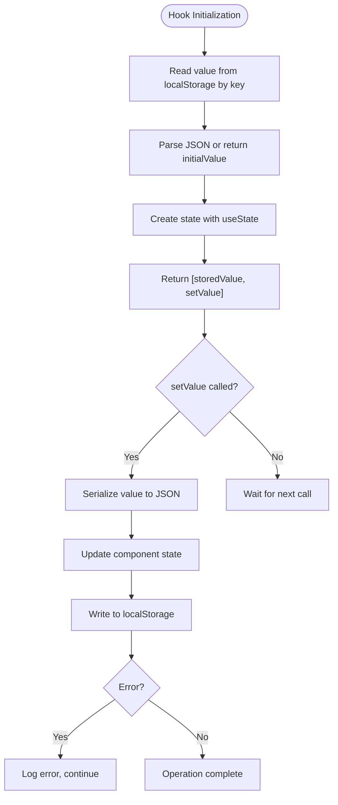
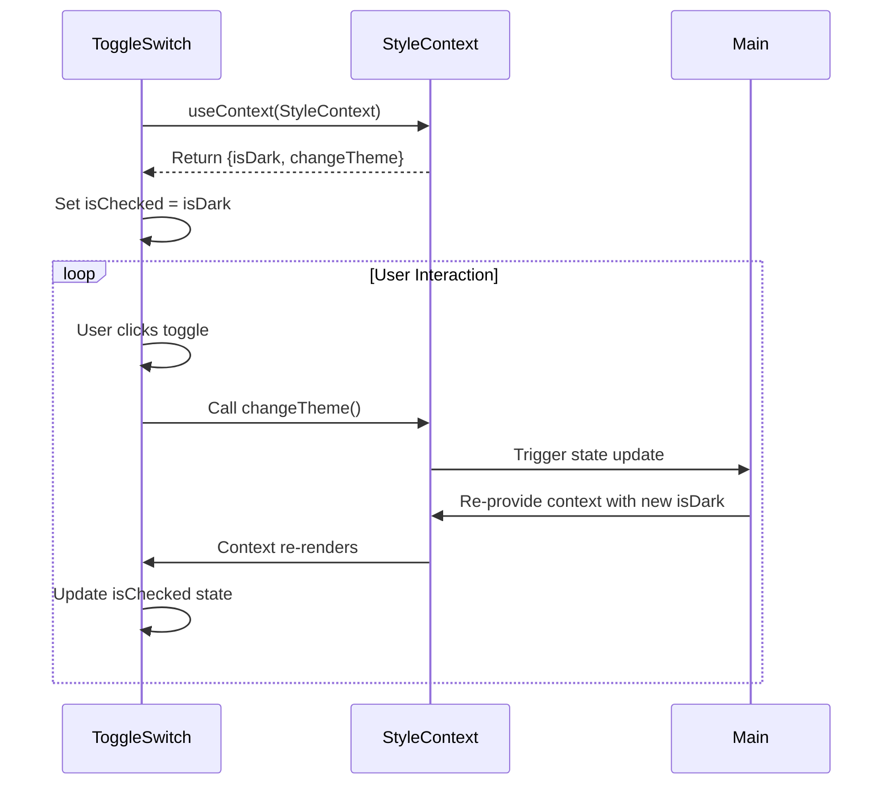
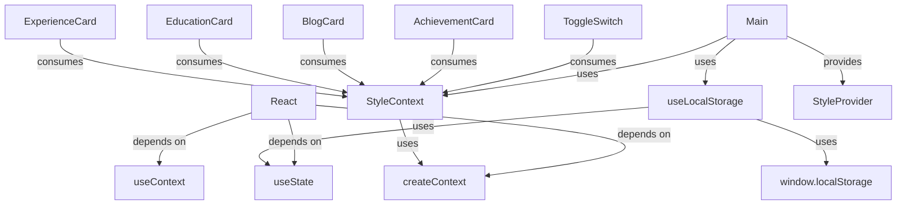

# Context API Implementation

<cite>
**Referenced Files in This Document**   
- [StyleContext.js](file://src/contexts/StyleContext.js)
- [Main.js](file://src/containers/Main.js)
- [useLocalStorage.js](file://src/hooks/useLocalStorage.js)
- [ToggleSwitch.js](file://src/components/ToggleSwitch/ToggleSwitch.js)
</cite>

## Table of Contents
1. [Introduction](#introduction)
2. [Project Structure](#project-structure)
3. [Core Components](#core-components)
4. [Architecture Overview](#architecture-overview)
5. [Detailed Component Analysis](#detailed-component-analysis)
6. [Dependency Analysis](#dependency-analysis)
7. [Performance Considerations](#performance-considerations)
8. [Troubleshooting Guide](#troubleshooting-guide)
9. [Conclusion](#conclusion)

## Introduction

This document provides comprehensive architectural documentation for the React Context API implementation used for theme management in the portfolio application. The system enables dynamic theme switching between light and dark modes while persisting user preferences. The implementation leverages React's Context API to provide theme state and functionality to all components without prop drilling. The documentation details how the StyleContext creates a centralized state management system, how it integrates with localStorage for persistence, and how components consume this context to adapt their appearance based on the current theme.

## Project Structure

The theme management system is organized across several key directories within the application structure. The context implementation resides in the `contexts` directory, custom hooks in the `hooks` directory, and UI components that consume the context in the `components` directory. The main application container wraps the entire app with the theme provider.



**Diagram sources**
- [StyleContext.js](file://src/contexts/StyleContext.js)
- [Main.js](file://src/containers/Main.js)
- [useLocalStorage.js](file://src/hooks/useLocalStorage.js)
- [ToggleSwitch.js](file://src/components/ToggleSwitch/ToggleSwitch.js)

**Section sources**
- [StyleContext.js](file://src/contexts/StyleContext.js)
- [Main.js](file://src/containers/Main.js)

## Core Components

The theme management system consists of four core components that work together to provide a seamless dark/light mode experience. The StyleContext.js file creates the React context that holds the theme state and change function. The Main.js container component wraps the entire application with the StyleProvider, making the theme context available to all child components. The useLocalStorage.js custom hook handles persistent storage of the user's theme preference across sessions. The ToggleSwitch.js component provides the UI element that allows users to switch between themes, consuming the context to display the current state and trigger theme changes.

**Section sources**
- [StyleContext.js](file://src/contexts/StyleContext.js)
- [Main.js](file://src/containers/Main.js)
- [useLocalStorage.js](file://src/hooks/useLocalStorage.js)
- [ToggleSwitch.js](file://src/components/ToggleSwitch/ToggleSwitch.js)

## Architecture Overview

The theme management architecture follows a provider-consumer pattern using React's Context API. The Main component initializes the theme state by reading the user's system preference for dark mode and checking localStorage for any previously saved preference. It then provides this state and the changeTheme function through the StyleProvider to all child components. Components throughout the application can consume this context to determine the current theme and access the function to change it. The useLocalStorage hook ensures that theme preferences are persisted between sessions, providing a consistent user experience.



**Diagram sources**
- [Main.js](file://src/containers/Main.js)
- [StyleContext.js](file://src/contexts/StyleContext.js)
- [useLocalStorage.js](file://src/hooks/useLocalStorage.js)
- [ToggleSwitch.js](file://src/components/ToggleSwitch/ToggleSwitch.js)

## Detailed Component Analysis

### StyleContext Analysis

The StyleContext component creates a React context that serves as the central state management system for theme information. It exports both the context object and a provider component that wraps the application. The context value includes the current theme state (isDark) and a function to change the theme (changeTheme). This design follows React best practices for context implementation, providing a clean API for components to consume the theme state without needing to manage it directly.

```mermaid
classDiagram
class StyleContext {
+Object createContext()
+Provider StyleProvider
+Consumer StyleConsumer
}
class StyleProvider {
+value {isDark, changeTheme}
}
StyleProvider --> StyleContext : "provides"
```

**Diagram sources**
- [StyleContext.js](file://src/contexts/StyleContext.js#L2-L5)

**Section sources**
- [StyleContext.js](file://src/contexts/StyleContext.js#L1-L8)

### Main Component Analysis

The Main component serves as the root container for the application and is responsible for initializing and providing the theme context. It uses the useLocalStorage hook to manage persistent theme preferences, defaulting to the user's system preference for dark mode when no stored preference exists. The component defines the changeTheme function that toggles the isDark state and tracks the event using analytics. By wrapping the entire application with the StyleProvider, it ensures that all child components have access to the theme context without requiring prop drilling.



**Diagram sources**
- [Main.js](file://src/containers/Main.js#L27-L76)

**Section sources**
- [Main.js](file://src/containers/Main.js#L1-L136)

### useLocalStorage Hook Analysis

The useLocalStorage hook provides a reusable mechanism for persisting state in the browser's localStorage. It follows the custom hook pattern in React, encapsulating the logic for reading from and writing to localStorage. The hook uses useState with a lazy initialization function to read the initial value from localStorage, preventing unnecessary reads on every render. When the state is updated, the hook writes the new value to localStorage, ensuring persistence across sessions. This hook is a key enabler for maintaining user preferences between visits to the application.



**Diagram sources**
- [useLocalStorage.js](file://src/hooks/useLocalStorage.js#L2-L36)

**Section sources**
- [useLocalStorage.js](file://src/hooks/useLocalStorage.js#L1-L37)

### ToggleSwitch Component Analysis

The ToggleSwitch component demonstrates how UI elements consume the theme context to provide user interaction. It uses useContext to access the isDark state and changeTheme function from the StyleContext. The component maintains its own checked state that is synchronized with the context's isDark value. When the user interacts with the toggle, it calls the changeTheme function to update the global theme state and updates its local checked state accordingly. The component also displays different emojis (moon for dark mode, sun for light mode) based on the current theme, providing visual feedback to the user.



**Diagram sources**
- [ToggleSwitch.js](file://src/components/ToggleSwitch/ToggleSwitch.js#L6-L16)

**Section sources**
- [ToggleSwitch.js](file://src/components/ToggleSwitch/ToggleSwitch.js#L1-L27)

## Dependency Analysis

The theme management system has a clear dependency hierarchy that follows React best practices. The Main component depends on both the StyleContext and useLocalStorage hook, combining their functionality to provide theme state to the application. The StyleContext has no external dependencies beyond React, making it a lightweight context provider. The useLocalStorage hook depends only on React's useState hook, encapsulating localStorage operations in a reusable component. Various UI components throughout the application depend on the StyleContext to consume theme information, creating a unidirectional flow of theme state from the provider to consumers.



**Diagram sources**
- [StyleContext.js](file://src/contexts/StyleContext.js)
- [Main.js](file://src/containers/Main.js)
- [useLocalStorage.js](file://src/hooks/useLocalStorage.js)
- [ToggleSwitch.js](file://src/components/ToggleSwitch/ToggleSwitch.js)

**Section sources**
- [StyleContext.js](file://src/contexts/StyleContext.js)
- [Main.js](file://src/containers/Main.js)
- [useLocalStorage.js](file://src/hooks/useLocalStorage.js)

## Performance Considerations

The theme management implementation follows several performance best practices to minimize unnecessary re-renders. The context value object in Main.js is stable between renders because it's created with the same function references (changeTheme doesn't change) and state values are only updated when necessary. Components that consume the context should ideally only subscribe to the specific values they need, though in this implementation most components only use the isDark boolean. The useLocalStorage hook uses lazy initialization to avoid reading from localStorage on every render. For optimal performance, components should be memoized when appropriate, especially if they are deep in the component tree and don't need to re-render on every theme change. The current implementation is efficient for the application's size and complexity, with theme changes triggering re-renders only for components that need to adapt their appearance.

**Section sources**
- [Main.js](file://src/containers/Main.js)
- [useLocalStorage.js](file://src/hooks/useLocalStorage.js)

## Troubleshooting Guide

When working with the theme context implementation, several common issues may arise. If components are not receiving the theme context, verify that the Main component properly wraps the application with the StyleProvider. Check that the context value is correctly passed and that there are no missing dependencies. For issues with theme persistence, ensure that the useLocalStorage hook is properly initialized with the correct key ("isDark") and that the browser allows localStorage operations. If theme changes are not reflected in the UI, verify that components are correctly consuming the context with useContext and that they are using the isDark value in their conditional rendering. For analytics tracking issues, confirm that the Analytics object is properly imported and that the toggleTheme event is correctly configured. When debugging, use React DevTools to inspect the context value at different levels of the component tree to identify where the context might be breaking.

**Section sources**
- [Main.js](file://src/containers/Main.js#L73-L76)
- [useLocalStorage.js](file://src/hooks/useLocalStorage.js)
- [ToggleSwitch.js](file://src/components/ToggleSwitch/ToggleSwitch.js)

## Conclusion

The React Context API implementation for theme management in this portfolio application provides an effective solution for managing global UI state. By leveraging the Context API with a custom localStorage hook, the system enables persistent theme preferences while maintaining a clean component architecture. The implementation follows React best practices for context usage, with a clear provider-consumer pattern and proper state management. The separation of concerns between the context definition, state persistence, and UI components creates a maintainable and extensible system. This architecture could be extended to manage other global application states beyond theme preferences, serving as a template for other context-based state management needs in the application.