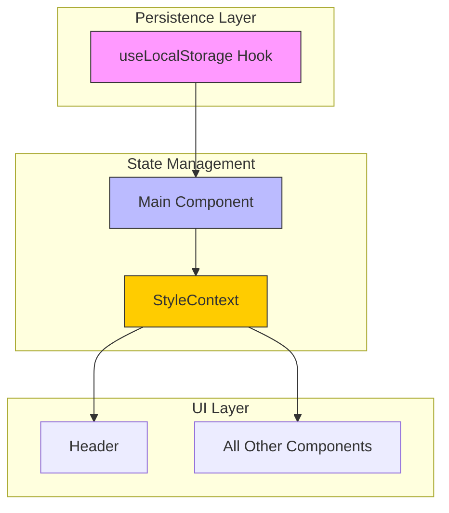
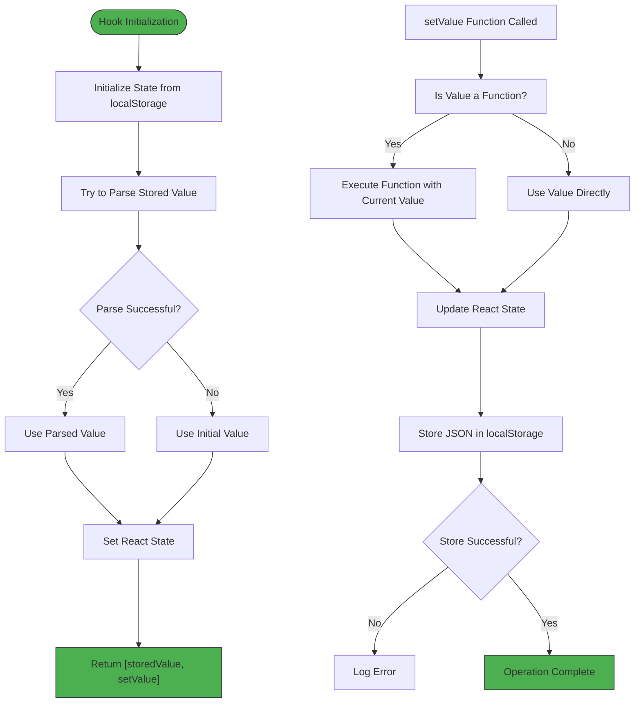
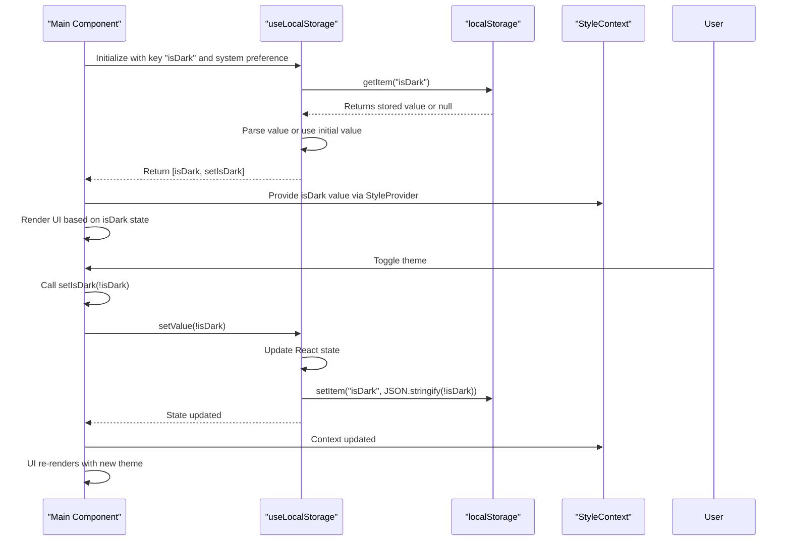

<cite>
**Referenced Files in This Document**   
- [useLocalStorage.js](file://src/hooks/useLocalStorage.js)
- [Main.js](file://src/containers/Main.js)
- [StyleContext.js](file://src/contexts/StyleContext.js)
</cite>

## Table of Contents
1. [Introduction](#introduction)
2. [Core Components](#core-components)
3. [Architecture Overview](#architecture-overview)
4. [Detailed Component Analysis](#detailed-component-analysis)
5. [Dependency Analysis](#dependency-analysis)
6. [Performance Considerations](#performance-considerations)
7. [Troubleshooting Guide](#troubleshooting-guide)
8. [Conclusion](#conclusion)

## Introduction

This document provides a comprehensive analysis of the `useLocalStorage` custom React hook implementation within the portfolio application. The hook serves as a critical utility for persisting user preferences across sessions, specifically demonstrated through theme preference management in the Main component. By abstracting the complexity of the browser's localStorage API, this hook provides a React-friendly interface that seamlessly integrates state management with persistent storage. The documentation will explore the hook's implementation details, usage patterns, error handling mechanisms, and integration within the application's context system.

## Core Components

The core functionality revolves around the `useLocalStorage` hook and its integration with the Main component to manage theme persistence. The hook encapsulates localStorage operations while maintaining React's reactivity model, and the Main component leverages this to provide a consistent user experience across sessions.

**Section sources**
- [useLocalStorage.js](file://src/hooks/useLocalStorage.js#L2-L36)
- [Main.js](file://src/containers/Main.js#L25-L30)

## Architecture Overview

The application employs a context-based theming system where the `useLocalStorage` hook acts as the persistence layer. The Main component initializes the theme state using the hook, which then propagates through the StyleContext to all child components. This architecture separates concerns by isolating storage logic from UI rendering while maintaining reactivity.



**Diagram sources**
- [useLocalStorage.js](file://src/hooks/useLocalStorage.js#L2-L36)
- [Main.js](file://src/containers/Main.js#L25-L30)
- [StyleContext.js](file://src/contexts/StyleContext.js#L1-L8)

## Detailed Component Analysis

### useLocalStorage Hook Analysis

The `useLocalStorage` hook provides a persistent state management solution by synchronizing React state with the browser's localStorage. It follows the custom hook pattern by encapsulating complex logic into a reusable function that can be consumed across components.



**Diagram sources**
- [useLocalStorage.js](file://src/hooks/useLocalStorage.js#L2-L36)

**Section sources**
- [useLocalStorage.js](file://src/hooks/useLocalStorage.js#L2-L36)

### Main Component Integration

The Main component demonstrates the practical application of the `useLocalStorage` hook by managing the application's dark mode preference. It combines system preference detection with user preference persistence to create a seamless theming experience.



**Diagram sources**
- [Main.js](file://src/containers/Main.js#L25-L30)
- [useLocalStorage.js](file://src/hooks/useLocalStorage.js#L2-L36)

**Section sources**
- [Main.js](file://src/containers/Main.js#L25-L30)

## Dependency Analysis

The `useLocalStorage` hook has minimal external dependencies, relying only on React's useState hook. It integrates with the broader application through the StyleContext, creating a clean separation between persistence logic and UI presentation. The Main component serves as the integration point, connecting the hook's functionality with the application's theming system.

```mermaid
classDiagram
class useLocalStorage {
+key : string
+initialValue : any
+storedValue : any
+setStoredValue : Function
+setValue(value) : void
-initializeFromStorage() : any
-serializeForStorage(value) : string
}
class Main {
+isDark : boolean
+setIsDark : Function
+changeTheme() : void
+render() : JSX
}
class StyleContext {
+isDark : boolean
+changeTheme : Function
}
useLocalStorage --> React : "uses useState"
Main --> useLocalStorage : "consumes"
Main --> StyleContext : "provides values"
StyleContext <-- Header : "consumes"
StyleContext <-- AllComponents : "consumes"
note right of useLocalStorage
Custom hook that abstracts
localStorage operations
with React state management
end note
note right of Main
Integration point that
connects persistence layer
with UI components
end note
```

**Diagram sources**
- [useLocalStorage.js](file://src/hooks/useLocalStorage.js#L2-L36)
- [Main.js](file://src/containers/Main.js#L25-L30)
- [StyleContext.js](file://src/contexts/StyleContext.js#L1-L8)

**Section sources**
- [useLocalStorage.js](file://src/hooks/useLocalStorage.js#L2-L36)
- [Main.js](file://src/containers/Main.js#L25-L30)
- [StyleContext.js](file://src/contexts/StyleContext.js#L1-L8)

## Performance Considerations

The `useLocalStorage` hook is optimized for performance by leveraging React's lazy state initialization. The initial value is only computed when the component mounts, preventing unnecessary localStorage reads on every render. However, developers should be aware that localStorage operations are synchronous and can block the main thread, potentially affecting performance when storing large amounts of data. The current implementation is suitable for small, infrequently updated values like user preferences, but would require optimization for larger datasets. Additionally, the error handling is minimal (console logging), which is appropriate for user preference storage but might need enhancement for more critical data persistence scenarios.

## Troubleshooting Guide

Common issues with the `useLocalStorage` hook typically involve browser compatibility, storage limits, or serialization errors. When localStorage is unavailable (private browsing mode, browser settings), the hook gracefully falls back to in-memory state. JSON serialization errors are caught and logged, with the hook continuing to operate using the in-memory state. For debugging theme persistence issues, verify that the localStorage key ("isDark") contains the expected boolean value and that the StyleContext is properly consuming the state from the Main component. Clearing localStorage for the domain can resolve corruption issues, and checking browser console errors can identify permission or quota issues.

**Section sources**
- [useLocalStorage.js](file://src/hooks/useLocalStorage.js#L10-L15)
- [useLocalStorage.js](file://src/hooks/useLocalStorage.js#L25-L30)
- [Main.js](file://src/containers/Main.js#L25-L30)

## Conclusion

The `useLocalStorage` custom hook exemplifies effective React pattern implementation by abstracting complex browser API interactions into a simple, reusable interface. Its integration with the application's theming system demonstrates how custom hooks can enhance user experience through persistent state management. The hook's design prioritizes simplicity and reliability, gracefully handling edge cases while providing a familiar useState-like API. This implementation serves as a model for creating other custom hooks in the codebase, emphasizing separation of concerns, error resilience, and React integration patterns. Future enhancements could include support for storage event listeners to synchronize state across tabs, or enhanced error handling with fallback storage mechanisms.