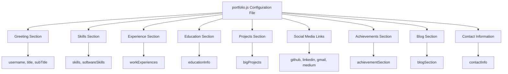
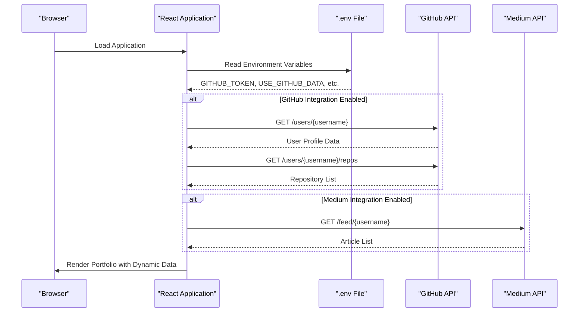

# Configuration and Customization

<cite>
**Referenced Files in This Document**   
- [portfolio.js](file://src/portfolio.js)
- [.env.example](file://.env.example)
- [SETUP.md](file://SETUP.md)
- [README.md](file://README.md)
- [fetch.js](file://fetch.js)
</cite>

## Table of Contents
1. [Introduction](#introduction)
2. [Portfolio Configuration Structure](#portfolio-configuration-structure)
3. [Greeting Section Configuration](#greeting-section-configuration)
4. [Skills Section Configuration](#skills-section-configuration)
5. [Experience and Education Configuration](#experience-and-education-configuration)
6. [Projects Management](#projects-management)
7. [Social Media Integration](#social-media-integration)
8. [Environment Variables and API Integration](#environment-variables-and-api-integration)
9. [Theme Customization](#theme-customization)
10. [Content Management Best Practices](#content-management-best-practices)
11. [Troubleshooting Common Issues](#troubleshooting-common-issues)
12. [Performance Considerations](#performance-considerations)

## Introduction
This document provides comprehensive guidance on configuring and customizing a React-based portfolio using the portfolio.js configuration file. The portfolio is designed as a configuration-driven application where all content is managed through a central configuration file, enabling easy updates without requiring code changes. The system supports dynamic content loading from external sources like GitHub and Medium through environment variables, and allows for extensive customization of themes, projects, and personal information.

**Section sources**
- [portfolio.js](file://src/portfolio.js#L1-L50)
- [README.md](file://README.md#L1-L30)

## Portfolio Configuration Structure
The portfolio.js file serves as the central configuration hub for the entire portfolio application, containing all content and display settings in a structured JSON-like format. The configuration is organized into distinct sections including greeting, skills, experience, education, projects, and social media, each controlled by specific variables that determine both content and visibility. Each section includes a `display` property that acts as a toggle to show or hide the entire section, providing flexibility in content presentation. The configuration file imports necessary assets such as images and animations, and exports all sections as named exports for use throughout the application. This modular structure allows for easy maintenance and updates, as changes to personal information, skills, or projects can be made directly in this single file without modifying component code.

**Diagram sources**
- [portfolio.js](file://src/portfolio.js#L1-L606)

**Section sources**
- [portfolio.js](file://src/portfolio.js#L1-L100)

## Greeting Section Configuration
The greeting section is configured through the `greeting` object in portfolio.js, which contains key personal information displayed prominently on the portfolio homepage. This section includes properties for `username`, `title`, `subTitle`, and `resumeLink`, allowing customization of the name, headline, professional summary, and CV download link respectively. The `subTitle` supports emoji rendering through the react-easy-emoji library, enabling expressive content with icons. The section can be toggled on or off globally using the `displayGreeting` boolean property, with a default value of true. To modify the greeting content, users should update the corresponding values in the greeting object, ensuring that text strings are properly quoted and special characters are escaped if necessary. The resume link should point to a publicly accessible PDF file, typically hosted on a cloud storage service like Google Drive.

**Section sources**
- [portfolio.js](file://src/portfolio.js#L65-L85)

## Skills Section Configuration
The skills section is defined by the `skillsSection` object, which contains both descriptive content and technical skill listings. The section includes a `title` and `subTitle` for heading text, followed by a `skills` array that lists key competencies using emoji-enhanced strings. Each skill entry is wrapped in the emoji() function to support icon rendering. The `softwareSkills` array contains objects with `skillName` and `fontAwesomeClassname` properties, where the classname must correspond to valid Font Awesome 5+ icons. To add a new skill, create an additional object in the softwareSkills array with the appropriate skill name and FontAwesome class. To remove a skill, delete the corresponding object from the array. The entire section can be hidden by setting `display: false`. When modifying skills, ensure that Font Awesome classnames are correct and that the corresponding FontAwesome package is included in the project dependencies.

**Section sources**
- [portfolio.js](file://src/portfolio.js#L87-L150)

## Experience and Education Configuration
The experience and education sections are configured through the `workExperiences` and `educationInfo` objects respectively, each following a consistent structure for listing professional and academic history. The workExperiences object contains a boolean `display` property and an `experience` array, where each experience entry includes `role`, `company`, `companylogo`, `date`, `desc`, and `descBullets` properties. The educationInfo object follows a similar pattern with a `schools` array containing educational entries. Each entry requires a logo import using the require() function for image assets. To add a new position or education entry, create a new object in the respective array with all required fields. To modify existing entries, update the field values directly. To remove an entry, delete the corresponding object from the array. The `descBullets` array supports multiple bullet points for detailed descriptions, enhancing the presentation of responsibilities and achievements.

**Section sources**
- [portfolio.js](file://src/portfolio.js#L250-L350)

## Projects Management
The projects section is managed through the `bigProjects` object in portfolio.js, which contains a `projects` array with detailed information about featured projects. Each project entry includes `image`, `projectName`, `projectDesc`, and `footerLink` properties, allowing for rich project presentations with visuals and external links. The image property references imported image assets, while footerLink contains an array of action links with `name` and `url` properties. Projects are displayed in the order they appear in the array, with the first projects appearing first on the page. To add a new project, create a new object in the projects array with all required fields and import the necessary image asset at the top of the file. To modify a project, update the relevant fields directly. To remove a project, delete the corresponding object from the array. The entire section can be toggled with the `display` property. Additionally, Markdown files in the Projects directory can be used to provide detailed project documentation, though these are not automatically linked to the main projects display.

**Section sources**
- [portfolio.js](file://src/portfolio.js#L352-L500)
- [Projects](file://Projects)

## Social Media Integration
Social media links are configured through the `socialMediaLinks` object, which contains properties for various platforms including github, linkedin, gmail, and medium. Each property holds the corresponding URL or email address, enabling direct links from the portfolio to external profiles. The section can be toggled globally with the `display` boolean property. To add a new social media platform, add a new property to the object with the platform name and URL. To modify existing links, update the URL values directly. To remove a platform, delete the corresponding property from the object. The portfolio also supports additional platforms like Twitter and Kaggle, though these require uncommenting in the component code. The SocialMedia component in src/components/socialMedia/SocialMedia.js controls the icon display and may need modification to support additional platforms or custom icons.

**Section sources**
- [portfolio.js](file://src/portfolio.js#L152-L165)
- [SocialMedia.js](file://src/components/socialMedia/SocialMedia.js)

## Environment Variables and API Integration
Environment variables for API integration are managed through the .env file, with configuration options for GitHub and Medium data fetching. The .env.example file provides a template with variables including GITHUB_TOKEN, GITHUB_USERNAME, USE_GITHUB_DATA, MEDIUM_USERNAME, and USE_MEDIUM_DATA. To enable GitHub integration, generate a personal access token with public_repo and read:user scopes, add it to the .env file, and set USE_GITHUB_DATA to true. For Medium integration, set USE_MEDIUM_DATA to true and specify the Medium username. These environment variables are processed during the build phase and used by the fetch.js script to retrieve data from external APIs. The fetch.js script validates environment variables and handles API requests to populate dynamic content such as GitHub repositories and Medium articles. Sensitive information like API tokens should never be committed to version control and should remain in the local .env file only.

**Diagram sources**
- [.env.example](file://.env.example#L1-L24)
- [fetch.js](file://fetch.js#L1-L61)

**Section sources**
- [.env.example](file://.env.example#L1-L24)
- [fetch.js](file://fetch.js#L1-L61)

## Theme Customization
Theme customization is primarily handled through the _globalColor.scss file, which contains CSS variables for the entire color scheme of the portfolio. The portfolio supports both light and dark themes, with color variables defined for primary, secondary, background, and text colors. To customize the theme, modify the color values in _globalColor.scss, ensuring that contrast ratios meet accessibility standards. The ToggleSwitch component in src/components/ToggleSwitch enables theme switching between light and dark modes. Additional styling can be customized by modifying the SCSS files in the components directory, with each component typically having its own SCSS file for targeted styling. For global font changes, modify the font-family declarations in the main SCSS files. When making theme changes, test the portfolio in both light and dark modes to ensure readability and visual consistency across all sections.

**Section sources**
- [_globalColor.scss](file://src/_globalColor.scss)
- [ToggleSwitch.js](file://src/components/ToggleSwitch/ToggleSwitch.js)

## Content Management Best Practices
Effective content management for this portfolio follows several best practices to ensure maintainability and consistency. Always back up the portfolio.js file before making significant changes, as it contains all critical content. When adding new image assets, place them in the src/assets/images/ directory and import them at the top of portfolio.js using the import statement. Maintain consistent formatting in the configuration file, including proper indentation and quotation marks, to prevent JSON parsing errors. Update content incrementally and test changes locally using npm start before deploying. For projects, ensure that all external links are valid and use descriptive names in footerLink entries. When modifying skills, verify that Font Awesome classnames are current and supported in the installed version. Document any custom modifications in comments within the configuration file to aid future updates.

**Section sources**
- [portfolio.js](file://src/portfolio.js)
- [SETUP.md](file://SETUP.md#L1-L96)

## Troubleshooting Common Issues
Common issues in portfolio configuration typically involve incorrect JSON formatting, missing required fields, or broken asset references. For JSON errors, verify that all objects are properly closed with matching braces and that all strings are enclosed in double quotes. Missing commas between array elements or object properties are frequent sources of syntax errors. For broken image links, ensure that image files exist in the specified path and that import statements in portfolio.js are correct. If environment variables are not working, verify that the .env file is present in the root directory and that variable names match exactly, including the REACT_APP_ prefix for create-react-app environment variables. Clear browser cache when changes don't appear to take effect. For GitHub API issues, verify that the personal access token has the required scopes and hasn't expired. Use the browser's developer console to identify specific error messages that can guide troubleshooting efforts.

**Section sources**
- [portfolio.js](file://src/portfolio.js)
- [.env.example](file://.env.example)
- [SETUP.md](file://SETUP.md)

## Performance Considerations
Performance optimization for the portfolio involves several considerations when loading large amounts of content. The application uses code splitting and lazy loading to minimize initial load time, but adding excessive content to configuration sections can still impact performance. Limit the number of projects displayed in the bigProjects section to 8-12 high-quality entries rather than including every project. Optimize image assets by compressing them before adding to the repository, as large images significantly increase load time. For portfolios with extensive blog content, rely on the Medium integration rather than hardcoding many blog entries to reduce bundle size. The GitHub data fetching should be used judiciously, as retrieving large numbers of repositories can slow down initial rendering. Monitor performance using browser developer tools and aim for a Lighthouse performance score above 90 by minimizing render-blocking resources and leveraging browser caching.

**Section sources**
- [DEPLOYMENT_CHECKLIST.md](file://DEPLOYMENT_CHECKLIST.md#L1-L108)
- [App.js](file://src/App.js#L1-L101)
- [portfolio.js](file://src/portfolio.js)