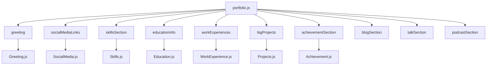
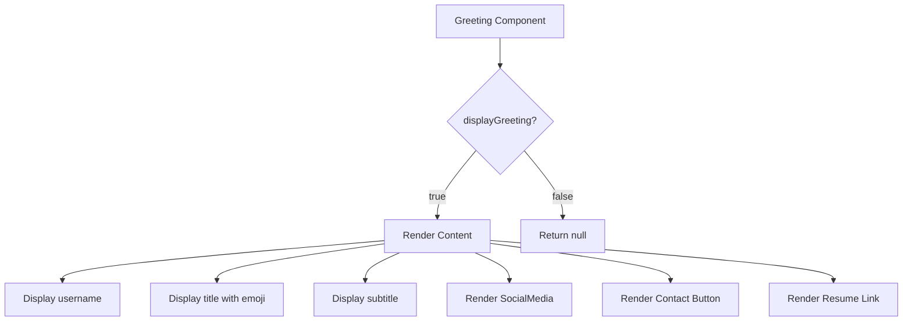
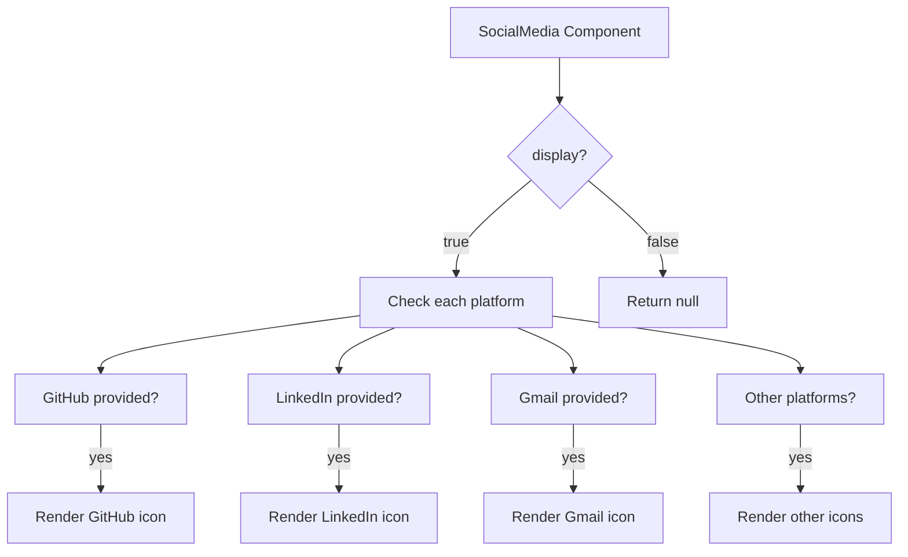
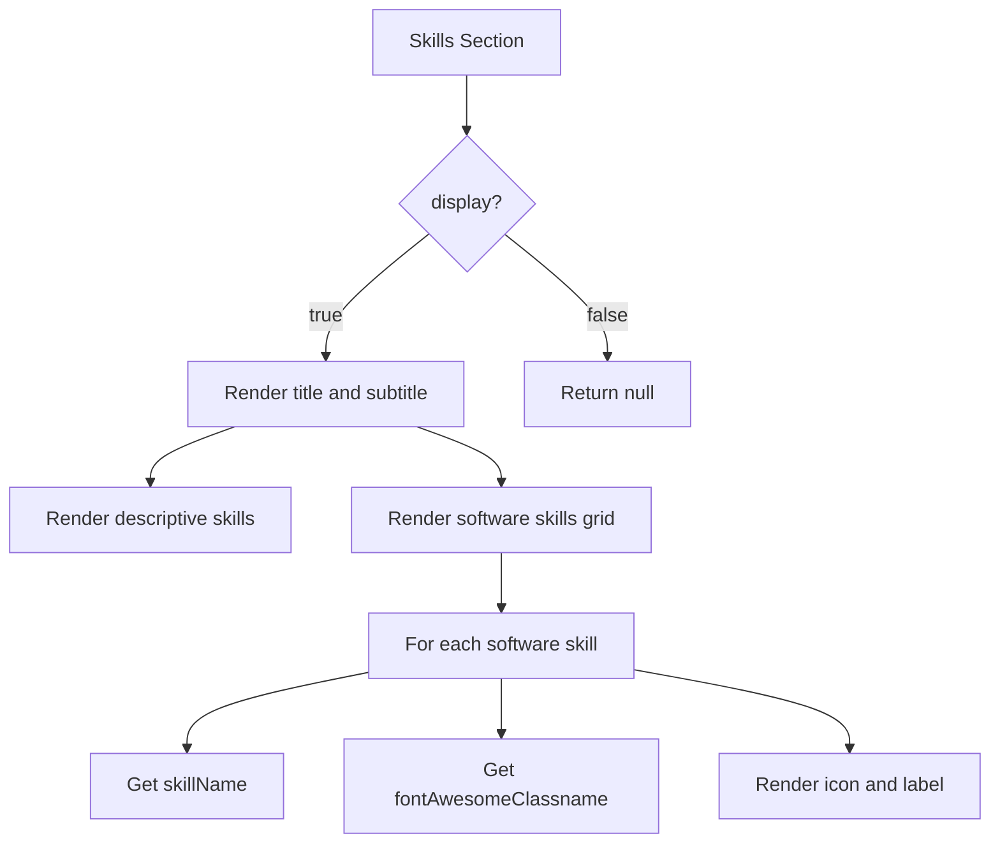
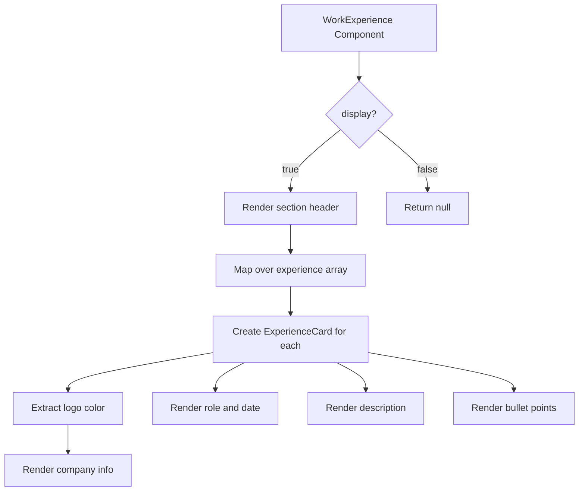
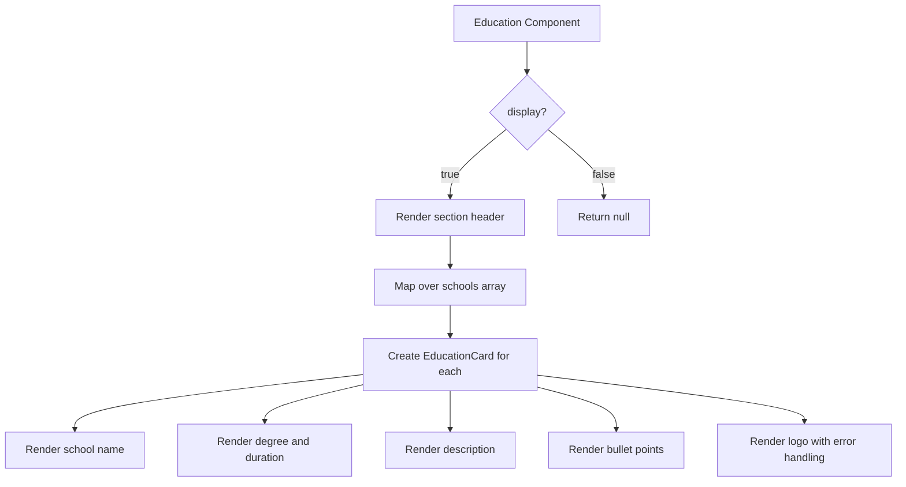
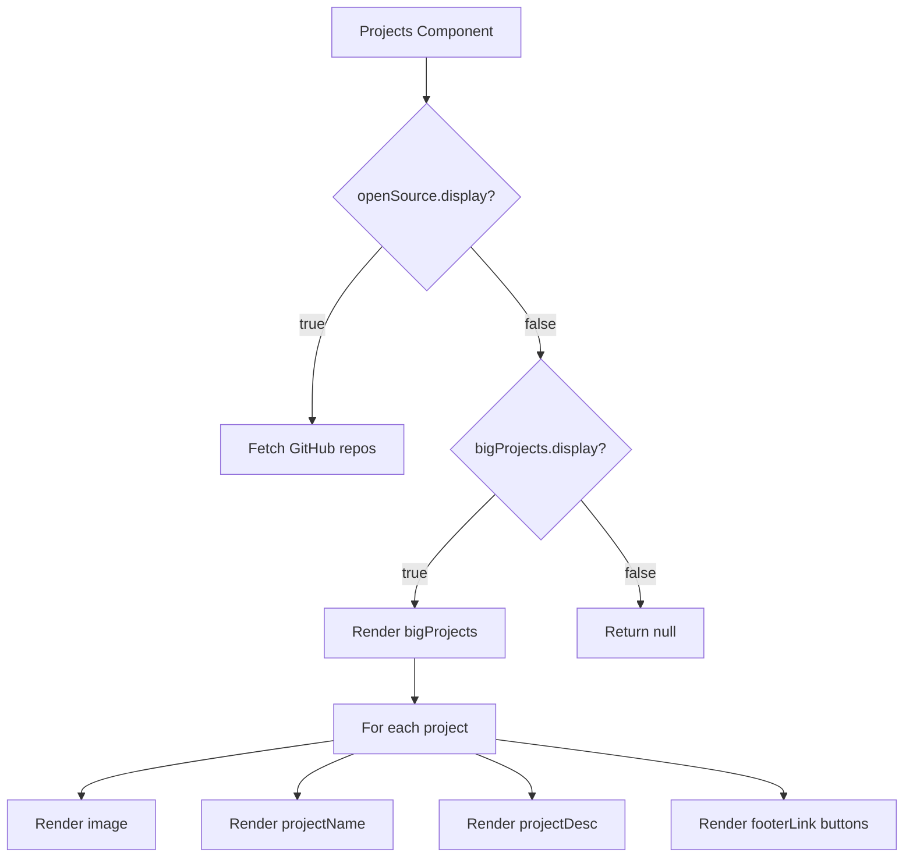
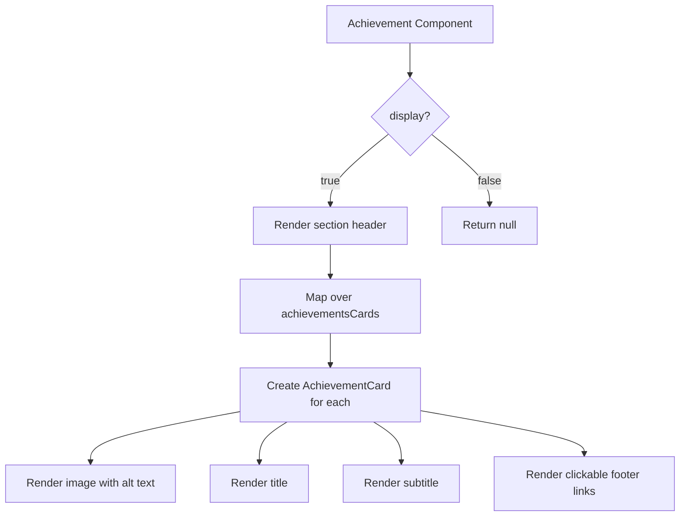

# Content Configuration

<cite>
**Referenced Files in This Document**   
- [portfolio.js](file://src/portfolio.js)
- [Greeting.js](file://src/containers/greeting/Greeting.js)
- [SocialMedia.js](file://src/components/socialMedia/SocialMedia.js)
- [Skills.js](file://src/containers/skills/Skills.js)
- [WorkExperience.js](file://src/containers/workExperience/WorkExperience.js)
- [Education.js](file://src/containers/education/Education.js)
- [Projects.js](file://src/containers/projects/Projects.js)
- [Achievement.js](file://src/containers/achievement/Achievement.js)
</cite>

## Table of Contents
1. [Introduction](#introduction)
2. [Portfolio Configuration Structure](#portfolio-configuration-structure)
3. [Greeting Section](#greeting-section)
4. [Social Media Links](#social-media-links)
5. [Skills Section](#skills-section)
6. [Experience Section](#experience-section)
7. [Education Section](#education-section)
8. [Projects Section](#projects-section)
9. [Achievements Section](#achievements-section)
10. [Troubleshooting Common Issues](#troubleshooting-common-issues)
11. [Performance Considerations](#performance-considerations)

## Introduction

This document provides comprehensive guidance for managing portfolio content through the `src/portfolio.js` configuration file. The portfolio is structured as a modular React application where content is defined in a centralized configuration file and rendered by dedicated components. Each section of the portfolio is controlled by specific configuration objects that define the content, appearance, and behavior of that section.

The configuration system allows for easy customization of the portfolio without requiring changes to the underlying component logic. Content managers can add, modify, or remove entries by editing the appropriate configuration object in `portfolio.js`. The system supports rich content including emoji, images, links, and interactive elements.

**Section sources**
- [portfolio.js](file://src/portfolio.js#L1-L605)

## Portfolio Configuration Structure

The portfolio configuration is organized into distinct sections, each represented by a dedicated object in `portfolio.js`. These configuration objects are then imported and used by their corresponding React components to render the content. The main configuration sections include:

- `greeting`: Personal introduction and headline information
- `socialMediaLinks`: Social media and contact links
- `skillsSection`: Technical skills and proficiencies
- `educationInfo`: Educational background
- `workExperiences`: Professional work history
- `bigProjects`: Featured project showcases
- `achievementSection`: Certifications and awards
- `blogSection`: Blog content integration
- `talkSection`: Speaking engagements
- `podcastSection`: Podcast appearances

Each configuration object follows a consistent pattern with a `display` flag to control visibility and specific properties that define the content for that section.



**Diagram sources**
- [portfolio.js](file://src/portfolio.js#L31-L513)

**Section sources**
- [portfolio.js](file://src/portfolio.js#L31-L513)

## Greeting Section

The greeting section displays the user's name, title, subtitle, and resume link. It is configured through the `greeting` object in `portfolio.js`. The section can be enabled or disabled using the `displayGreeting` flag.

Key configuration fields:
- `username`: Full name displayed prominently
- `title`: Headline greeting text
- `subTitle`: Detailed professional description with emoji support
- `resumeLink`: Path to the downloadable resume file
- `displayGreeting`: Boolean flag to show/hide the section

The `emoji()` function from 'react-easy-emoji' enables emoji rendering in the subtitle. The component renders social media links and action buttons for contacting and viewing the resume.



**Diagram sources**
- [portfolio.js](file://src/portfolio.js#L31-L39)
- [Greeting.js](file://src/containers/greeting/Greeting.js#L1-L71)

**Section sources**
- [portfolio.js](file://src/portfolio.js#L31-L39)
- [Greeting.js](file://src/containers/greeting/Greeting.js#L1-L71)

## Social Media Links

The social media links section displays icons for various platforms and is configured through the `socialMediaLinks` object. The section is controlled by the `display` flag.

Supported platforms include:
- GitHub
- LinkedIn
- Gmail
- Medium
- GitLab
- Facebook
- Instagram
- Twitter
- StackOverflow
- Kaggle

Each platform is configured with its URL. The component renders Font Awesome icons for each provided link. The `SocialMedia.js` component handles click tracking through the Analytics utility and opens links in new tabs.

To add a new social media platform, add the corresponding property with its URL to the `socialMediaLinks` object. The component automatically handles rendering the appropriate icon based on the property name.



**Diagram sources**
- [portfolio.js](file://src/portfolio.js#L42-L50)
- [SocialMedia.js](file://src/components/socialMedia/SocialMedia.js#L1-L158)

**Section sources**
- [portfolio.js](file://src/portfolio.js#L42-L50)
- [SocialMedia.js](file://src/components/socialMedia/SocialMedia.js#L1-L158)

## Skills Section

The skills section is configured through the `skillsSection` object and displays both descriptive skills and software proficiencies. The section can be toggled with the `display` flag.

The configuration includes:
- `title`: Main section title
- `subTitle`: Subtitle description
- `skills`: Array of emoji-enhanced skill descriptions
- `softwareSkills`: Array of technical skills with Font Awesome class names
- `display`: Boolean to show/hide the section

The `softwareSkills` array contains objects with `skillName` and `fontAwesomeClassname` properties. The class names must correspond to valid Font Awesome icons. The component renders these as a grid of skill badges with icons and labels.

To add a new software skill, add an object to the `softwareSkills` array with the appropriate skill name and Font Awesome class name. For example, to add React:

```javascript
{
  skillName: "React",
  fontAwesomeClassname: "fab fa-react"
}
```



**Diagram sources**
- [portfolio.js](file://src/portfolio.js#L53-L140)
- [SoftwareSkill.js](file://src/components/softwareSkills/SoftwareSkill.js#L1-L27)

**Section sources**
- [portfolio.js](file://src/portfolio.js#L53-L140)
- [SoftwareSkill.js](file://src/components/softwareSkills/SoftwareSkill.js#L1-L27)

## Experience Section

The experience section displays work history through the `workExperiences` configuration object. It is controlled by the `display` flag and contains an array of experience objects.

Each experience object includes:
- `role`: Job title
- `company`: Company name
- `companylogo`: Logo image path using require()
- `date`: Employment period
- `desc`: Description of responsibilities
- `descBullets`: Array of bullet points highlighting achievements

The `WorkExperience.js` component maps over the `experience` array and renders an `ExperienceCard` for each entry. The component uses ColorThief to extract dominant colors from company logos for visual enhancement.

To add a new work experience, add an object to the `experience` array with the required fields. Ensure the `companylogo` path is correct and the image exists in the assets directory.



**Diagram sources**
- [portfolio.js](file://src/portfolio.js#L181-L211)
- [WorkExperience.js](file://src/containers/workExperience/WorkExperience.js#L1-L43)
- [ExperienceCard.js](file://src/components/experienceCard/ExperienceCard.js#L1-L85)

**Section sources**
- [portfolio.js](file://src/portfolio.js#L181-L211)
- [WorkExperience.js](file://src/containers/workExperience/WorkExperience.js#L1-L43)

## Education Section

The education section is configured through the `educationInfo` object and displays academic background. The `display` flag controls visibility.

Each school object in the `schools` array contains:
- `schoolName`: Institution name
- `logo`: School logo path using require()
- `subHeader`: Degree or program name
- `duration`: Attendance period
- `desc`: Description of the program
- `descBullets`: Array of bullet points highlighting achievements

The `Education.js` component renders an `EducationCard` for each school entry. The component handles image loading and error checking for missing logos.

To add a new educational entry, add an object to the `schools` array with the required fields. Ensure the logo path is correct and the image file exists in the assets directory.



**Diagram sources**
- [portfolio.js](file://src/portfolio.js#L143-L158)
- [Education.js](file://src/containers/education/Education.js#L1-L21)
- [EducationCard.js](file://src/components/educationCard/EducationCard.js#L1-L73)

**Section sources**
- [portfolio.js](file://src/portfolio.js#L143-L158)
- [Education.js](file://src/containers/education/Education.js#L1-L21)

## Projects Section

The projects section is configured through the `bigProjects` object and showcases featured projects. The section is controlled by the `display` flag.

Each project in the `projects` array includes:
- `image`: Project image path
- `projectName`: Project title
- `projectDesc`: Detailed description
- `footerLink`: Array of action links with name and URL

The `Projects.js` component is designed to fetch GitHub repositories, but the `bigProjects` configuration provides a static alternative for featured projects. Each project is rendered with its image, title, description, and optional action links.

To add a new featured project, add an object to the `projects` array with the required fields. The `footerLink` array can contain multiple links or be empty if no actions are needed.



**Diagram sources**
- [portfolio.js](file://src/portfolio.js#L221-L374)
- [Projects.js](file://src/containers/projects/Projects.js#L1-L75)

**Section sources**
- [portfolio.js](file://src/portfolio.js#L221-L374)
- [Projects.js](file://src/containers/projects/Projects.js#L1-L75)

## Achievements Section

The achievements section is configured through the `achievementSection` object and displays certifications and awards. The `display` flag controls visibility.

Each achievement in the `achievementsCards` array includes:
- `title`: Certification or award name
- `subtitle`: Issuing organization and date
- `image`: Logo or badge image URL
- `imageAlt`: Alternative text for accessibility
- `footerLink`: Array of action links to verify or view details

The `Achievement.js` component renders an `AchievementCard` for each entry, displaying the image, title, subtitle, and clickable footer links. The component handles opening links in new tabs.

To add a new achievement, add an object to the `achievementsCards` array with the required fields. Use direct image URLs for external badges or relative paths for local images.



**Diagram sources**
- [portfolio.js](file://src/portfolio.js#L377-L513)
- [Achievement.js](file://src/containers/achievement/Achievement.js)
- [AchievementCard.js](file://src/components/achievementCard/AchievementCard.js#L1-L49)

**Section sources**
- [portfolio.js](file://src/portfolio.js#L377-L513)
- [AchievementCard.js](file://src/components/achievementCard/AchievementCard.js#L1-L49)

## Troubleshooting Common Issues

### Content Not Appearing
When content fails to appear, check the following:

1. **Display flags**: Ensure the `display` flag for the section is set to `true`
2. **Configuration object name**: Verify the export name matches what the component imports
3. **Required fields**: Check that all required fields are present in the configuration
4. **Image paths**: Validate that image paths are correct and files exist
5. **Syntax errors**: Check for JSON syntax errors like missing commas or brackets

Common issues include:
- Missing `require()` for local images in education or experience sections
- Incorrect Font Awesome class names in software skills
- Invalid URLs in social media links
- Missing `footerLink` array in projects or achievements

### Image Path Issues
Image paths must be correctly specified:
- Use `require("./path/to/image.png")` for local assets
- Use direct URLs for external images
- Verify file extensions match actual files
- Check case sensitivity in file names

### JSON Syntax Errors
Ensure proper JSON syntax:
- Use commas to separate array elements and object properties
- Match opening and closing brackets and braces
- Use double quotes for strings
- Avoid trailing commas

## Performance Considerations

### Image Optimization
Large images can impact loading performance. Optimize images by:
- Compressing image files before adding them to the portfolio
- Using appropriate image formats (WebP for modern browsers)
- Resizing images to appropriate dimensions
- Implementing lazy loading for images below the fold

### Content Loading
The portfolio loads all content on initial render. For large amounts of content:
- Consider implementing pagination for projects or blog posts
- Use lazy loading for components that are not immediately visible
- Optimize the initial payload by code splitting

### External Resources
External resources like social media icons and certificate images are loaded from third-party servers. Monitor loading times and consider:
- Hosting critical images locally
- Using a CDN for external assets
- Implementing loading states for slow-loading resources

The current configuration efficiently manages content through centralized configuration, minimizing the need for component modifications and enabling easy content updates.