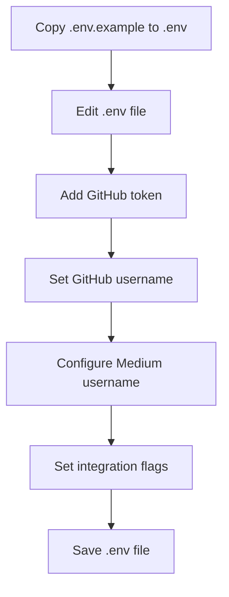
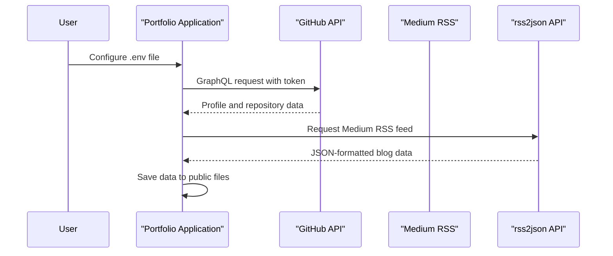
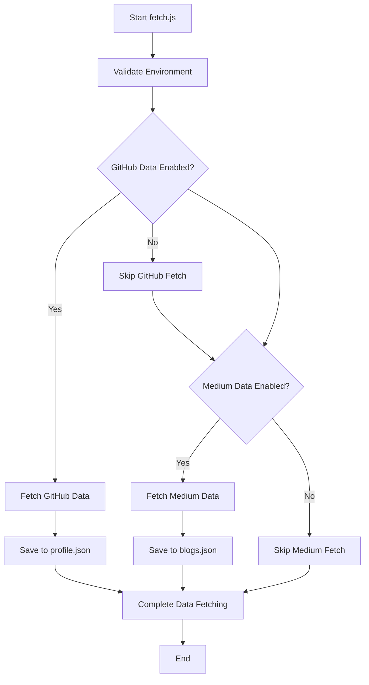
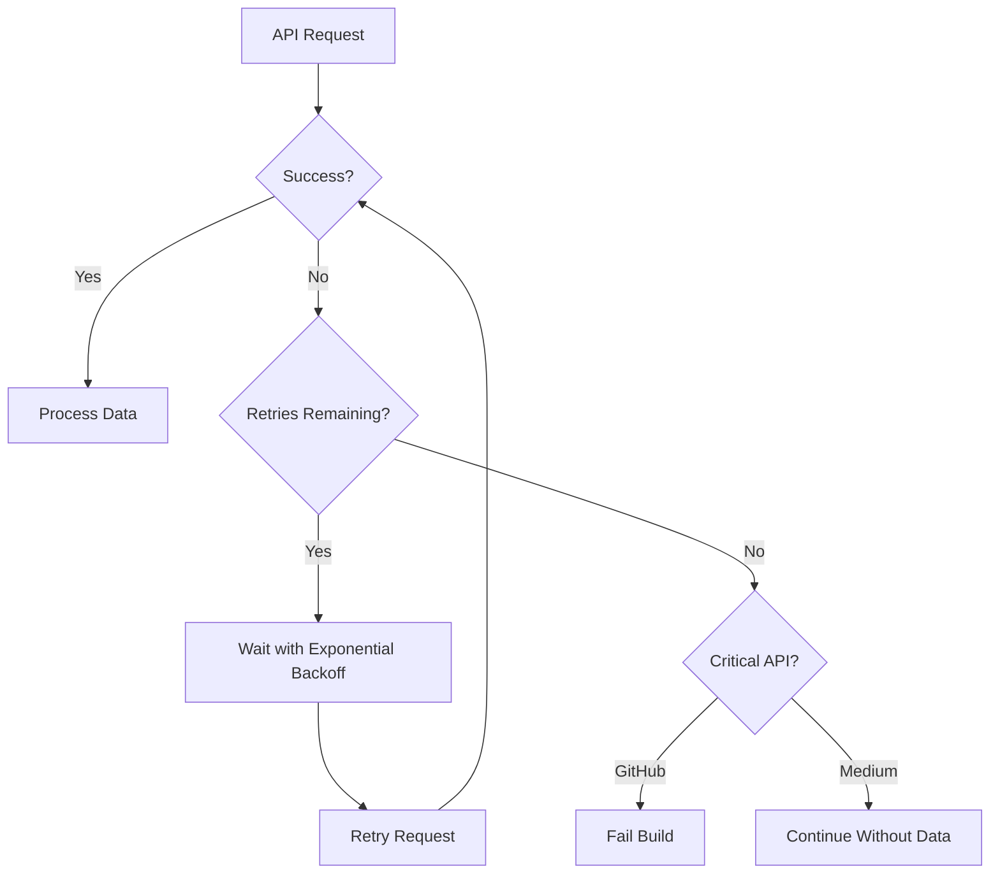

# Environment Configuration

<cite>
**Referenced Files in This Document**   
- [fetch.js](file://fetch.js)
- [.env.example](file://.env.example)
- [package.json](file://package.json)
- [src/portfolio.js](file://src/portfolio.js)
- [src/utils/analytics.js](file://src/utils/analytics.js)
- [validate-seo.js](file://validate-seo.js)
- [SETUP.md](file://SETUP.md)
</cite>

## Table of Contents
1. [Introduction](#introduction)
2. [Environment Variables Overview](#environment-variables-overview)
3. [Creating .env from .env.example](#creating-env-from-envexample)
4. [API Integration Setup](#api-integration-setup)
5. [Data Fetching Process](#data-fetching-process)
6. [Secure Credential Management](#secure-credential-management)
7. [CI/CD Pipeline Integration](#cicd-pipeline-integration)
8. [Error Handling and Fallback Mechanisms](#error-handling-and-fallback-mechanisms)
9. [Common Issues and Troubleshooting](#common-issues-and-troubleshooting)
10. [Security Best Practices](#security-best-practices)

## Introduction
This document provides comprehensive guidance on environment configuration and API integration setup for the portfolio application. It explains the purpose of environment variables in storing sensitive credentials for GitHub and Medium APIs, documents the process of creating configuration files, and details how the application uses these variables to fetch dynamic content. The document also covers secure credential management, error handling strategies, and best practices for frontend applications.

## Environment Variables Overview
The portfolio application uses environment variables to store configuration settings and sensitive credentials. These variables are loaded using the `dotenv` package and are used to control various aspects of the application's behavior, particularly the integration with external APIs.

The primary environment variables include:
- `GITHUB_TOKEN`: Personal access token for GitHub API authentication
- `GITHUB_USERNAME`: GitHub username for profile data fetching
- `MEDIUM_USERNAME`: Medium username for blog content integration
- `USE_GITHUB_DATA`: Flag to enable/disable GitHub data fetching
- `USE_MEDIUM_DATA`: Flag to enable/disable Medium data fetching
- `REACT_APP_GITHUB_TOKEN`: React-specific environment variable for GitHub token

These variables allow the application to securely access external APIs without hardcoding sensitive information into the source code.

**Section sources**
- [.env.example](file://.env.example#L1-L24)
- [fetch.js](file://fetch.js#L13-L69)
- [validate-seo.js](file://validate-seo.js#L248)

## Creating .env from .env.example
The process of creating a `.env` file from the `.env.example` template is straightforward and essential for configuring the application's API integrations.

To create the `.env` file:
1. Copy the `.env.example` file to create a new `.env` file
2. Edit the `.env` file to add your specific credentials and configuration

The `.env.example` file serves as a template with placeholder values and instructions for each environment variable. It includes comments explaining the purpose of each variable and where to obtain the necessary values (such as generating a GitHub personal access token).



**Diagram sources**
- [.env.example](file://.env.example#L1-L24)
- [SETUP.md](file://SETUP.md#L70-L78)

**Section sources**
- [.env.example](file://.env.example#L1-L24)
- [SETUP.md](file://SETUP.md#L70-L78)

## API Integration Setup
The application integrates with GitHub and Medium APIs to dynamically fetch content for display on the portfolio site. This integration is controlled through environment variables that specify credentials and enable/disable functionality.

### GitHub API Integration
GitHub integration requires a personal access token with specific scopes (`public_repo`, `read:user`) and the user's GitHub username. The token is used to authenticate API requests to GitHub's GraphQL API, which retrieves profile information and repository data.

### Medium API Integration
Medium integration uses the user's Medium username to fetch blog posts via the RSS feed. The application uses the rss2json API to convert the RSS feed into JSON format for easier processing.



**Diagram sources**
- [fetch.js](file://fetch.js#L191-L252)
- [fetch.js](file://fetch.js#L255-L279)

**Section sources**
- [fetch.js](file://fetch.js#L13-L69)
- [.env.example](file://.env.example#L1-L24)

## Data Fetching Process
The data fetching process is orchestrated by the `fetch.js` script, which runs during the build process to populate the portfolio with dynamic content from external APIs.

### Environment Validation
Before fetching data, the application validates the environment configuration to ensure all required variables are set. This validation checks for:
- GitHub username and token when GitHub integration is enabled
- Medium username when Medium integration is enabled

### Data Retrieval Workflow
The data retrieval process follows these steps:
1. Validate environment configuration
2. Fetch GitHub profile data via GraphQL API
3. Fetch Medium blog data via RSS feed
4. Save retrieved data to static files

The fetched data is saved to `public/profile.json` and `public/blogs.json`, which are then used by the React application to display the content.



**Diagram sources**
- [fetch.js](file://fetch.js#L134-L188)
- [fetch.js](file://fetch.js#L190-L279)

**Section sources**
- [fetch.js](file://fetch.js#L134-L282)
- [package.json](file://package.json#L65-L68)

## Secure Credential Management
The application implements several security measures to protect sensitive credentials and ensure secure handling of API keys.

### Environment Variable Protection
Credentials are stored in the `.env` file, which is excluded from version control via `.gitignore`. This prevents accidental exposure of sensitive information in public repositories.

### Token Security
GitHub personal access tokens should be created with the minimum required scopes (`public_repo`, `read:user`) to limit potential damage if the token is compromised. Tokens should be treated as passwords and never shared or exposed in client-side code beyond what is necessary.

### Build Process Security
The environment variables are used during the build process to fetch data, but the actual credentials are not included in the final build output. This ensures that API keys are not exposed in the deployed application.

**Section sources**
- [.env.example](file://.env.example#L1-L24)
- [fetch.js](file://fetch.js#L13-L69)
- [validate-seo.js](file://validate-seo.js#L248)

## CI/CD Pipeline Integration
The application is designed to work seamlessly with CI/CD pipelines, particularly GitHub Pages for deployment.

### Environment Variables in CI/CD
In CI/CD environments, environment variables should be configured as secrets in the repository settings. This allows the build process to access the necessary credentials without exposing them in the codebase.

### Build Script Integration
The build process is configured in `package.json` to run `fetch.js` before building the React application:

```json
"scripts": {
  "start": "node fetch.js && react-scripts start",
  "build": "node fetch.js && react-scripts build"
}
```

This ensures that fresh data is fetched from the APIs during each build, keeping the portfolio content up-to-date.

### Deployment Process
The deployment process involves:
1. Setting environment variables as secrets in the CI/CD platform
2. Running the build script, which executes `fetch.js`
3. Deploying the generated static files to the hosting platform

**Section sources**
- [package.json](file://package.json#L65-L68)
- [fetch.js](file://fetch.js#L134-L188)

## Error Handling and Fallback Mechanisms
The application implements robust error handling and fallback mechanisms to ensure reliability even when API calls fail or rate limits are exceeded.

### Retry Logic
The `fetchWithRetry` function implements exponential backoff retry logic for failed API requests:

```javascript
function fetchWithRetry(requestOptions, data, maxRetries = 3, baseDelay = 1000)
```

This function automatically retries failed requests with increasing delays between attempts, helping to handle temporary network issues or API rate limiting.

### Graceful Degradation
When API calls fail, the application implements graceful degradation:
- GitHub data fetching errors are treated as critical and cause the build to fail
- Medium data fetching errors are non-critical, and the application continues without Medium content

### Validation and Warnings
The environment validation process provides clear feedback about missing or incorrect configuration, helping users identify and fix issues before they affect the build process.



**Diagram sources**
- [fetch.js](file://fetch.js#L96-L142)
- [fetch.js](file://fetch.js#L255-L279)

**Section sources**
- [fetch.js](file://fetch.js#L70-L142)
- [fetch.js](file://fetch.js#L255-L279)

## Common Issues and Troubleshooting
This section addresses common issues encountered during environment configuration and API integration, along with their solutions.

### Environment Variables Not Loaded
**Issue**: Environment variables are not being recognized by the application.
**Solution**: 
- Ensure the `.env` file is in the root directory
- Verify the file is named exactly `.env` (not `.env.local` or other variants)
- Check that `dotenv` is properly imported in `fetch.js`

### CORS Errors
**Issue**: Cross-origin resource sharing errors when accessing APIs.
**Solution**: 
- The application fetches data during the build process, not at runtime, which avoids CORS issues
- Ensure API requests are made from the server-side `fetch.js` script, not from client-side code

### Rate Limiting
**Issue**: GitHub API rate limits being exceeded.
**Solution**:
- Use a personal access token to increase rate limits from 60 to 5,000 requests per hour
- Implement retry logic with exponential backoff
- Cache API responses to minimize unnecessary requests

### Invalid Credentials
**Issue**: Authentication failures with GitHub or Medium APIs.
**Solution**:
- Verify the GitHub token has the required scopes (`public_repo`, `read:user`)
- Check that the GitHub username is spelled correctly
- Ensure the Medium username matches the profile URL exactly

**Section sources**
- [fetch.js](file://fetch.js#L13-L69)
- [fetch.js](file://fetch.js#L191-L252)
- [validate-seo.js](file://validate-seo.js#L248)

## Security Best Practices
This section outlines security best practices for handling API keys and sensitive information in frontend applications.

### Principle of Least Privilege
Use API tokens with the minimum required permissions. For GitHub, only the `public_repo` and `read:user` scopes are needed, limiting potential damage if the token is compromised.

### Environment File Management
- Never commit `.env` files to version control
- Use `.gitignore` to exclude environment files
- Use `.env.example` to document required variables without exposing values

### Token Rotation
Regularly rotate API tokens and update them in the environment configuration. This reduces the risk of long-term exposure if a token is compromised.

### Build-Time vs Runtime Secrets
Store API keys as build-time secrets rather than runtime secrets when possible. This prevents client-side exposure of sensitive information.

### Monitoring and Alerts
Implement monitoring to detect unusual API usage patterns that might indicate a compromised token. Set up alerts for excessive API requests or failed authentication attempts.

**Section sources**
- [.env.example](file://.env.example#L1-L24)
- [fetch.js](file://fetch.js#L13-L69)
- [validate-seo.js](file://validate-seo.js#L248)