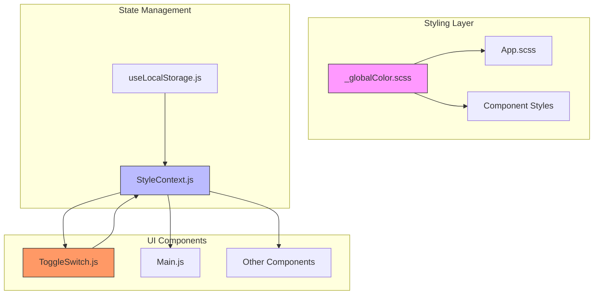
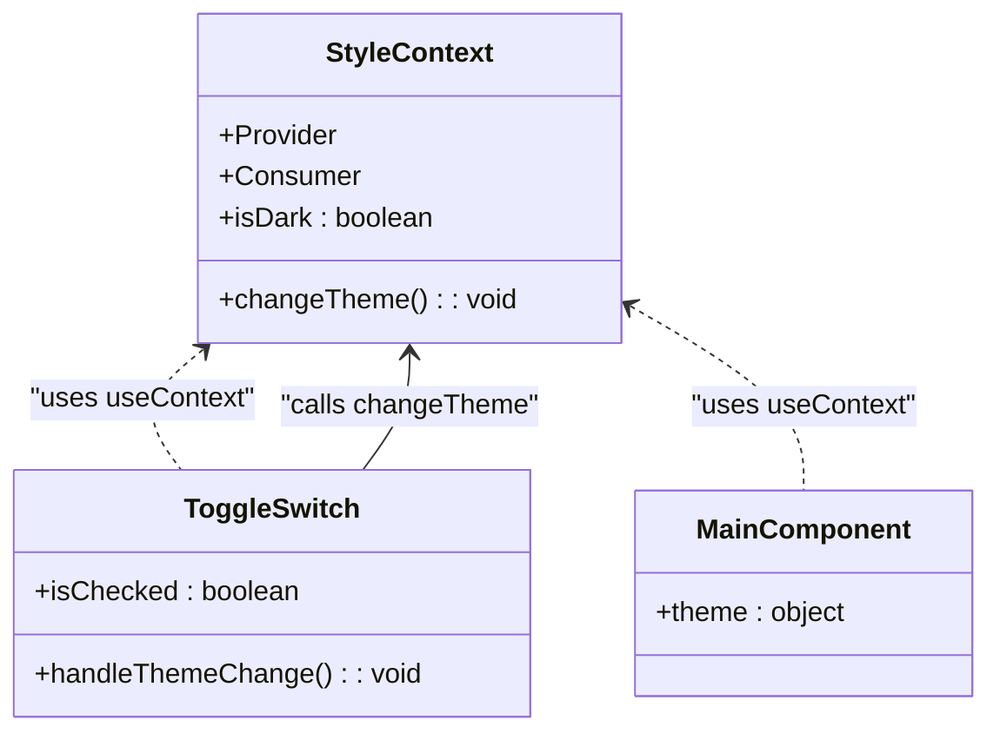
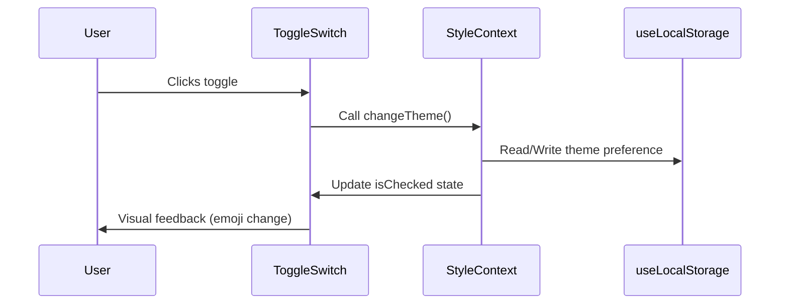
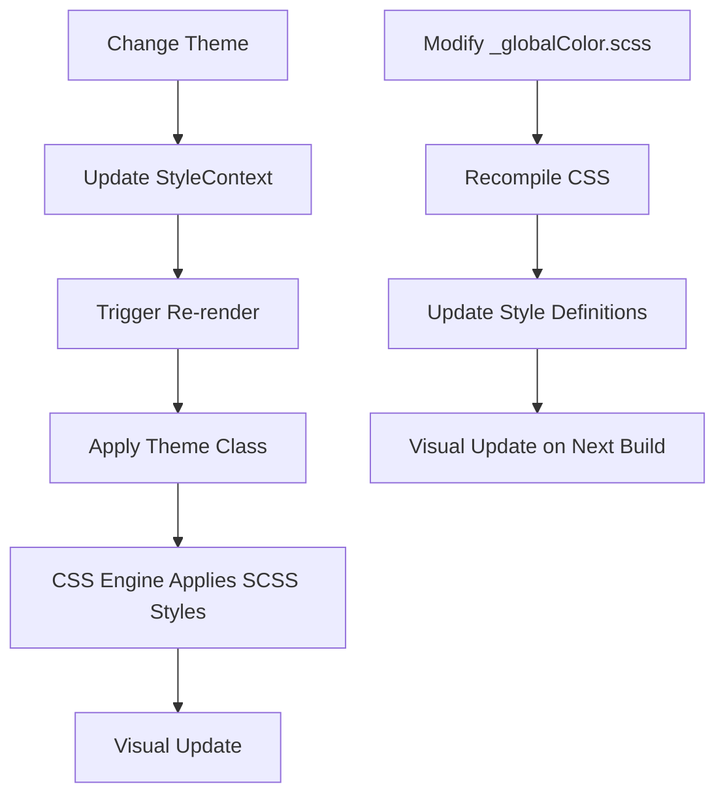

# Theme Customization

<cite>
**Referenced Files in This Document**   
- [_globalColor.scss](file://src/_globalColor.scss)
- [StyleContext.js](file://src/contexts/StyleContext.js)
- [useLocalStorage.js](file://src/hooks/useLocalStorage.js)
- [ToggleSwitch.js](file://src/components/ToggleSwitch/ToggleSwitch.js)
- [ToggleSwitch.scss](file://src/components/ToggleSwitch/ToggleSwitch.scss)
- [App.scss](file://src/App.scss)
- [App.js](file://src/App.js)
</cite>

## Table of Contents
1. [Introduction](#introduction)
2. [Theme Architecture Overview](#theme-architecture-overview)
3. [Global SCSS Variables](#global-scss-variables)
4. [Style Context Implementation](#style-context-implementation)
5. [Dark/Light Mode Toggle](#darklight-mode-toggle)
6. [Theme Persistence with Local Storage](#theme-persistence-with-local-storage)
7. [Step-by-Step Theme Customization](#step-by-step-theme-customization)
8. [Accessibility and Contrast Compliance](#accessibility-and-contrast-compliance)
9. [Integration Between SCSS and React Context](#integration-between-scss-and-react-context)
10. [Common Issues and Troubleshooting](#common-issues-and-troubleshooting)
11. [Performance Considerations](#performance-considerations)

## Introduction
This document provides comprehensive guidance on theme customization within the portfolio application. It explains how global styling is managed through SCSS variables, how dynamic theme switching is implemented using React Context, and how user preferences are persisted using the browser's local storage. The system enables seamless toggling between dark and light modes while maintaining consistent visual styling across all components. This guide covers both theoretical architecture and practical implementation details for developers looking to modify or extend the theme system.

## Theme Architecture Overview
The theme system follows a layered architecture combining static SCSS variables with dynamic React context state. Global color definitions are centralized in `_globalColor.scss`, while runtime theme state is managed through `StyleContext`. The `ToggleSwitch` component serves as the UI control for switching between dark and light modes, triggering updates that propagate through the context system. Theme preferences are persisted using the `useLocalStorage` hook, ensuring user settings survive page reloads. This architecture separates design tokens from component logic, enabling consistent theming while allowing for dynamic runtime changes.

**Diagram sources**
- [_globalColor.scss](file://src/_globalColor.scss)
- [StyleContext.js](file://src/contexts/StyleContext.js)
- [useLocalStorage.js](file://src/hooks/useLocalStorage.js)
- [ToggleSwitch.js](file://src/components/ToggleSwitch/ToggleSwitch.js)

**Section sources**
- [_globalColor.scss](file://src/_globalColor.scss)
- [StyleContext.js](file://src/contexts/StyleContext.js)
- [useLocalStorage.js](file://src/hooks/useLocalStorage.js)

## Global SCSS Variables
The `_globalColor.scss` file serves as the central repository for all design tokens used throughout the application. It defines color variables for both light and dark themes, including text colors, background colors, button states, shadows, and social media icons. These variables are imported into component SCSS files using the `@import` directive, ensuring consistent styling across the application. The file is organized into logical sections such as button colors, text colors, toggle switch colors, and background colors, making it easy to locate and modify specific design elements.

**Section sources**
- [_globalColor.scss](file://src/_globalColor.scss#L1-L90)

## Style Context Implementation
The `StyleContext.js` file implements a React Context to manage theme state globally. It creates a context object using `React.createContext()` and exports both the Provider and Consumer components for use throughout the application. This context holds the current theme state (dark/light) and provides methods to change the theme. Components that need to access theme information can use the `useContext` hook to subscribe to theme changes. The context pattern eliminates the need to pass theme props through intermediate components, enabling clean and efficient state propagation.

**Diagram sources**
- [StyleContext.js](file://src/contexts/StyleContext.js#L2-L8)

**Section sources**
- [StyleContext.js](file://src/contexts/StyleContext.js#L2-L8)

## Dark/Light Mode Toggle
The `ToggleSwitch` component provides the user interface for switching between dark and light themes. It renders a custom-styled checkbox input with a slider that displays either a sun (light mode) or moon (dark mode) emoji based on the current theme state. The component uses `useContext` to access the `StyleContext` and calls the `changeTheme` method when the toggle state changes. The visual appearance of the toggle is defined in `ToggleSwitch.scss`, which imports global color variables to maintain consistency with the overall theme.

**Diagram sources**
- [ToggleSwitch.js](file://src/components/ToggleSwitch/ToggleSwitch.js#L5-L25)
- [ToggleSwitch.scss](file://src/components/ToggleSwitch/ToggleSwitch.scss#L1-L109)

**Section sources**
- [ToggleSwitch.js](file://src/components/ToggleSwitch/ToggleSwitch.js#L5-L25)
- [ToggleSwitch.scss](file://src/components/ToggleSwitch/ToggleSwitch.scss#L1-L109)

## Theme Persistence with Local Storage
Theme preferences are persisted across sessions using the `useLocalStorage` custom hook. This hook implements a wrapper around React's `useState` that synchronizes state with the browser's local storage. When the theme is changed, the new value is automatically saved to local storage under a specified key. On subsequent visits, the hook retrieves the stored value, ensuring the user's preferred theme is restored. The implementation includes error handling to gracefully fallback to default values if local storage is unavailable or corrupted.

**Section sources**
- [useLocalStorage.js](file://src/hooks/useLocalStorage.js#L2-L36)

## Step-by-Step Theme Customization
To customize the theme, follow these steps:

1. **Modify Global Colors**: Edit `_globalColor.scss` to change color variables. For example, to change the primary button color, update the `$buttonColor` variable.

2. **Update Component Styles**: If needed, modify component-specific SCSS files to use new variables or add custom styling.

3. **Test Theme Switching**: Use the toggle switch to verify that changes appear correctly in both dark and light modes.

4. **Verify Accessibility**: Ensure sufficient contrast ratios between text and background colors using accessibility tools.

5. **Clear Local Storage**: During development, clear local storage to test default theme behavior.

6. **Deploy Changes**: Build and deploy the application to make theme changes live.

**Section sources**
- [_globalColor.scss](file://src/_globalColor.scss#L1-L90)
- [App.scss](file://src/App.scss#L1-L30)

## Accessibility and Contrast Compliance
When customizing themes, it's essential to maintain accessibility standards. The Web Content Accessibility Guidelines (WCAG) recommend a minimum contrast ratio of 4.5:1 for normal text and 3:1 for large text. The current theme variables should be evaluated using contrast checking tools to ensure compliance. For example, the `$titleColor` (#000000) on `$lightBackground1` (#ffffff) provides excellent contrast (21:1), while custom colors should be similarly evaluated. Consider providing alternative color schemes for users with specific visual needs.

**Section sources**
- [_globalColor.scss](file://src/_globalColor.scss#L1-L90)

## Integration Between SCSS and React Context
The theme system integrates SCSS variables with React context through a two-layer approach. Static styling is handled by SCSS variables that are compiled into CSS classes. Dynamic theme switching is managed by React context, which adds or removes theme-specific CSS classes from the document root. This hybrid approach leverages the performance benefits of static CSS while enabling dynamic runtime changes. The `App` component typically subscribes to the `StyleContext` and applies theme classes that cascade down to child components, triggering the appropriate SCSS styles.

**Diagram sources**
- [_globalColor.scss](file://src/_globalColor.scss)
- [StyleContext.js](file://src/contexts/StyleContext.js)
- [App.scss](file://src/App.scss)

**Section sources**
- [_globalColor.scss](file://src/_globalColor.scss)
- [StyleContext.js](file://src/contexts/StyleContext.js)
- [App.scss](file://src/App.scss)

## Common Issues and Troubleshooting
**Style Inconsistencies**: If components display incorrect colors, verify that the component's SCSS file imports `_globalColor.scss` and uses the correct variable names.

**Missing Theme Classes**: Ensure the root component subscribes to `StyleContext` and applies theme classes to the document or container element.

**Local Storage Persistence Failures**: Check browser settings that may block local storage. Implement fallback mechanisms that default to light theme if storage is unavailable.

**Toggle State Desynchronization**: Verify that the `isChecked` state in `ToggleSwitch` is properly synchronized with the context's `isDark` value.

**Performance Issues**: Minimize re-renders by ensuring only theme-sensitive components subscribe to `StyleContext`.

**Section sources**
- [ToggleSwitch.js](file://src/components/ToggleSwitch/ToggleSwitch.js#L5-L25)
- [useLocalStorage.js](file://src/hooks/useLocalStorage.js#L2-L36)
- [StyleContext.js](file://src/contexts/StyleContext.js#L2-L8)

## Performance Considerations
Theme switching should be optimized for performance by minimizing re-renders and leveraging CSS for visual changes. The current implementation using React Context may cause unnecessary re-renders of components that don't depend on theme state. Consider using CSS custom properties (variables) for simple color changes, which can be updated without React re-renders. For complex theme changes, memoize theme-sensitive components using `React.memo` to prevent unnecessary updates. The local storage operations are synchronous but typically fast enough for theme persistence, though error handling should be maintained for edge cases.

**Section sources**
- [useLocalStorage.js](file://src/hooks/useLocalStorage.js#L2-L36)
- [StyleContext.js](file://src/contexts/StyleContext.js#L2-L8)
- [App.js](file://src/App.js#L1-L100)