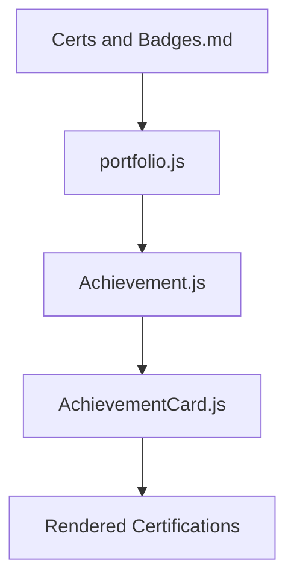
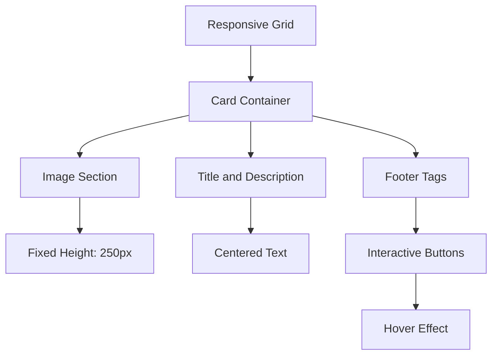

# Certifications and Badges Management

<cite>
**Referenced Files in This Document**   
- [Certs and Badges.md](file://Certs and Badges.md)
- [Achievement.js](file://src/containers/achievement/Achievement.js)
- [AchievementCard.js](file://src/components/achievementCard/AchievementCard.js)
- [portfolio.js](file://src/portfolio.js)
- [AchievementCard.scss](file://src/components/achievementCard/AchievementCard.scss)
</cite>

## Table of Contents
1. [Introduction](#introduction)
2. [Source of Truth: Certs and Badges.md](#source-of-truth-certs-and-badgesmd)
3. [Integration with Achievement.js Container](#integration-with-achievementjs-container)
4. [AchievementCard Component Implementation](#achievementcard-component-implementation)
5. [Markdown Structure Requirements](#markdown-structure-requirements)
6. [Adding New Certifications](#adding-new-certifications)
7. [Visual Presentation and Styling](#visual-presentation-and-styling)
8. [Common Issues and Troubleshooting](#common-issues-and-troubleshooting)
9. [Maintenance and Credibility Guidelines](#maintenance-and-credibility-guidelines)
10. [Conclusion](#conclusion)

## Introduction
This document provides comprehensive guidance on managing certifications and professional badges within the portfolio system. It explains how the Certs and Badges.md file serves as the source of truth for achievement content and details its integration with the Achievement.js container. The documentation covers the required Markdown structure, component implementation, visual presentation, and best practices for maintaining a credible and up-to-date certification portfolio.

## Source of Truth: Certs and Badges.md
The Certs and Badges.md file functions as the central repository for all certification and badge information in the portfolio. This Markdown file contains structured content that defines both digital badges and professional certifications, serving as the authoritative source for achievement data.

The file begins with front matter configuration that sets the page layout, title, permalink, description, and navigation properties. The main content is organized into two primary sections: Digital Badges and Professional Certifications.

For digital badges, the system uses Credly integration to display badges through embedded iframes. The badge IDs are defined in a Liquid template variable and rendered dynamically. For professional certifications, Google Drive links are used to embed certificate previews through iframes, with certification details stored as key-value pairs separated by pipes.

**Section sources**
- [Certs and Badges.md](file://Certs and Badges.md#L1-L84)

## Integration with Achievement.js Container
The Achievement.js container component integrates the certification data into the portfolio's React-based frontend. This component imports the achievementSection configuration from the portfolio.js file and renders it using the AchievementCard components.

The integration process begins with importing the achievementSection object, which contains all certification data in a structured format. The component first checks if the achievement section is enabled by evaluating the display property. If enabled, it renders the section with a fade-in animation effect provided by the react-reveal library.

The container maps through the achievementsCards array from the achievementSection configuration and creates an AchievementCard component for each certification. It passes the card data including title, description, image, and footer links as props to each AchievementCard instance.



**Diagram sources**
- [Achievement.js](file://src/containers/achievement/Achievement.js#L3-L56)
- [portfolio.js](file://src/portfolio.js#L375-L512)

**Section sources**
- [Achievement.js](file://src/containers/achievement/Achievement.js#L3-L56)

## AchievementCard Component Implementation
The AchievementCard component is responsible for rendering individual certification cards with consistent styling and interactive elements. It receives card information and the current theme mode as props and displays the certification details in a standardized format.

Each card displays the certification title, description, issuer logo, and interactive footer links. The component includes an openUrlInNewTab function that handles clicks on footer links, opening the certificate verification page in a new browser tab. The function includes error handling to log messages when URLs are missing.

The component's styling adapts to the current theme (light or dark mode) by applying appropriate CSS classes. Hover effects are implemented on the certificate tags in the footer, providing visual feedback when users interact with the links.

```mermaid
classDiagram
class AchievementCard {
+cardInfo : Object
+isDark : Boolean
-openUrlInNewTab(url, name)
+render()
}
AchievementCard --> "1" "0..*" CertificateTag
CertificateTag --> "1" "1" URL
```

**Diagram sources**
- [AchievementCard.js](file://src/components/achievementCard/AchievementCard.js#L3-L47)
- [AchievementCard.scss](file://src/components/achievementCard/AchievementCard.scss#L0-L76)

**Section sources**
- [AchievementCard.js](file://src/components/achievementCard/AchievementCard.js#L3-L47)

## Markdown Structure Requirements
The Certs and Badges.md file follows a specific Markdown structure with embedded Liquid templating to dynamically render certification content. The structure includes front matter, HTML containers, and Liquid template logic.

The front matter (between triple dashes) contains metadata including layout, title, permalink, description, and navigation settings. The main content uses HTML div elements with specific classes to structure the page layout. Two main sections are defined: Digital Badges and Professional Certifications.

For digital badges, the structure uses a badges-grid div containing a Liquid for loop that iterates through badge IDs. Each badge is rendered using a div with the class badge-credly and data attributes for Credly embedding. For professional certifications, a certifications-list div contains a for loop that processes certification data, creating iframe elements for certificate previews.

The certification data format uses a pipe (|) to separate the certification name from the Google Drive file ID, with entries separated by commas.

**Section sources**
- [Certs and Badges.md](file://Certs and Badges.md#L1-L84)

## Adding New Certifications
To add new certifications to the portfolio, updates must be made to both the Certs and Badges.md file and the portfolio.js configuration file. For digital badges from Credly, obtain the badge ID from the Credly platform and add it to the badge_ids array in the Certs and Badges.md file.

For professional certifications, add the certification details to the achievementsCards array in the portfolio.js file. Each certification object should include the following properties:
- title: The certification name
- subtitle: Issuer and year with brief description
- image: URL to the issuer's logo
- imageAlt: Alternative text for the logo
- footerLink: Array containing name and URL for certificate verification

When adding a new certification to the Certs and Badges.md file for Google Drive embedding, format the entry as "Certification Name|Google Drive File ID" and add it to the certs array, ensuring proper comma separation.

**Section sources**
- [Certs and Badges.md](file://Certs and Badges.md#L19-L84)
- [portfolio.js](file://src/portfolio.js#L375-L512)

## Visual Presentation and Styling
The visual presentation of certifications is controlled through a combination of React components and SCSS styling. The AchievementCard component displays certifications in a responsive grid layout that adapts to different screen sizes.

Each certification card features a consistent design with the issuer logo displayed prominently above the title and description. The card includes hover effects that enhance the box shadow, providing visual feedback when users interact with the card. The footer contains interactive tags styled as buttons that link to certificate verification pages.

The styling is defined in AchievementCard.scss, which imports global color variables and defines specific styles for card elements. The grid layout uses CSS Grid with auto-fit to create a responsive design that adjusts the number of columns based on available space. The certificate image div maintains a fixed height to ensure consistent card sizing.



**Diagram sources**
- [AchievementCard.scss](file://src/components/achievementCard/AchievementCard.scss#L0-L76)
- [Achievement.js](file://src/containers/achievement/Achievement.js#L37-L56)

**Section sources**
- [AchievementCard.scss](file://src/components/achievementCard/AchievementCard.scss#L0-L76)

## Common Issues and Troubleshooting
Several common issues may arise when managing certifications in the portfolio system. Broken image URLs typically occur when the logo URL becomes invalid or the hosting service restricts hotlinking. To resolve this, verify the image URL and consider hosting critical images within the portfolio's public directory.

Outdated certification links are a frequent issue, especially when certificate verification URLs change. Regular audits of all footerLink URLs are recommended to ensure they remain valid. The system includes basic URL validation in the validate-content.js script, which checks for properly formatted URLs in the achievement section.

Accessibility concerns with embedded images can be addressed by ensuring all images have appropriate alt text. The AchievementCard component includes a fallback alt text of "Card Thumbnail" when imageAlt is not provided, but specific descriptive text is preferred.

Theme-related display issues may occur when switching between light and dark modes. The component styling accounts for both modes, but customizations should ensure sufficient contrast ratios for readability.

**Section sources**
- [AchievementCard.js](file://src/components/achievementCard/AchievementCard.js#L10-L14)
- [validate-content.js](file://validate-content.js#L91-L139)

## Maintenance and Credibility Guidelines
Maintaining the credibility of the certification portfolio requires adherence to several best practices. Only verifiable credentials should be included, with each certification linking to an official verification page. This ensures transparency and allows visitors to validate the authenticity of the credentials.

Expiration dates should be monitored and updated regularly. For certifications with expiration dates, consider adding the expiration date to the subtitle and removing expired certifications from the portfolio. Regular audits (recommended quarterly) should be conducted to verify all links and images remain functional.

The portfolio should maintain a consistent format for all entries, including standardized date formatting and consistent capitalization. Grouping certifications by issuer or category (as seen in the achievementGroups example) can improve organization and user experience.

Version control practices should be followed, with changes to certification content documented in commit messages. This creates an audit trail and makes it easier to track additions and updates to the credential portfolio over time.

**Section sources**
- [portfolio.js](file://src/portfolio.js#L375-L512)
- [Certs and Badges.md](file://Certs and Badges.md#L1-L84)

## Conclusion
The certification management system in this portfolio provides a robust framework for showcasing professional achievements. By maintaining Certs and Badges.md as the source of truth and integrating it with the React component architecture, the system ensures consistency and ease of maintenance. Following the guidelines outlined in this document will help ensure that the certification portfolio remains accurate, credible, and visually appealing, effectively demonstrating professional expertise and commitment to continuous learning.