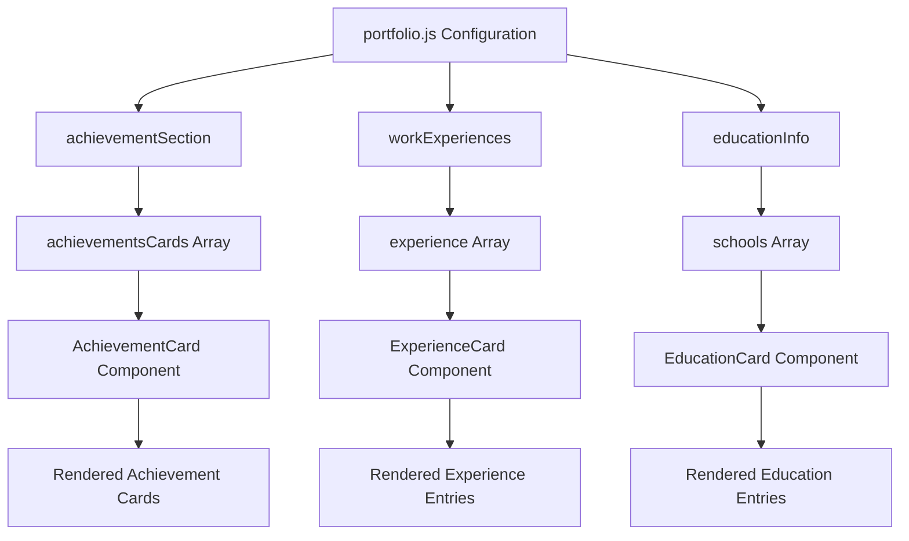
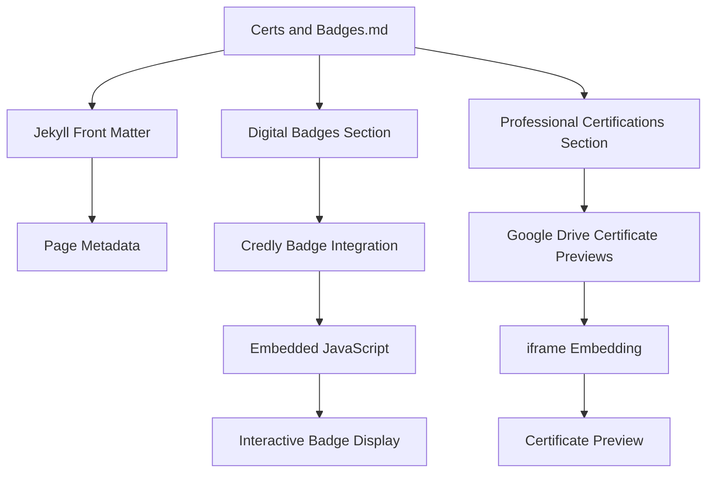

# Content Management

<cite>
**Referenced Files in This Document**   
- [Projects.js](file://src/containers/projects/Projects.js)
- [portfolio.js](file://src/portfolio.js)
- [Certs and Badges.md](file://Certs and Badges.md)
- [StartupProject.js](file://src/containers/StartupProjects/StartupProject.js)
- [Achievement.js](file://src/containers/achievement/Achievement.js)
- [AchievementCard.js](file://src/components/achievementCard/AchievementCard.js)
</cite>

## Table of Contents
1. [Introduction](#introduction)
2. [Project Content Management](#project-content-management)
3. [Achievements, Work Experience, and Education Structure](#achievements-work-experience-and-education-structure)
4. [Integration of Certs and Badges](#integration-of-certs-and-badges)
5. [Practical Examples](#practical-examples)
6. [Common Issues and Troubleshooting](#common-issues-and-troubleshooting)
7. [Content Quality and Consistency Guidelines](#content-quality-and-consistency-guidelines)

## Introduction
This document provides comprehensive guidance on managing portfolio content across various sections of the portfolio website. It details how project content is organized in Markdown files within the Projects/ directory and rendered through the Projects.js container. The structure of achievement, work experience, and education entries in portfolio.js is explained, along with the integration of Certs and Badges.md into the achievements section. Practical examples demonstrate how to add new projects, update experience entries, and format certification information. Common issues such as broken links and inconsistent formatting are addressed, along with guidelines for maintaining content quality and consistency across sections.

## Project Content Management

The portfolio's project content is managed through a dual system: Markdown files in the Projects/ directory for detailed project documentation and the portfolio.js configuration file for featured project highlights.

Project Markdown files (e.g., Project 1.md, Project 2.md) in the Projects/ directory contain comprehensive details about each project, including objectives, methodologies, visualizations, and outcomes. These files use standard Markdown syntax with additional Liquid templating for image inclusion and layout control. For example, project visualizations are embedded using the  syntax with specified paths, titles, and styling classes.

Featured projects are displayed on the main portfolio page through the bigProjects section in portfolio.js. This configuration object contains an array of project entries, each with properties such as image, projectName, projectDesc, and footerLink. The StartupProject.js component renders these entries as interactive cards, displaying project images, names, descriptions, and clickable footer links that open in new tabs.

External GitHub repositories are integrated through the Projects.js container, which fetches pinned repository data from a profile.json file. This component dynamically renders GitHub repository cards for open-source contributions, providing a "More Projects" button that links to the user's GitHub profile.

**Section sources**
- [Projects.js](file://src/containers/projects/Projects.js#L1-L74)
- [portfolio.js](file://src/portfolio.js#L221-L374)
- [StartupProject.js](file://src/containers/StartupProjects/StartupProject.js#L1-L94)

## Achievements, Work Experience, and Education Structure

The portfolio's professional content is structured through configuration objects in portfolio.js that define achievements, work experience, and education entries.

The achievementSection object contains an array of achievementsCards, each representing a certification or award with properties including title, subtitle, image, imageAlt, and footerLink. These entries are rendered by the Achievement.js container component, which maps through the achievementsCards array and passes data to the AchievementCard component for display.

Work experience entries are defined in the workExperiences object, which contains an array of experience objects. Each experience entry includes role, company, companylogo, date, desc, and descBullets properties. The descBullets array allows for multiple bullet points describing responsibilities and achievements in each role.

Education entries are configured in the educationInfo object, which contains a schools array. Each school entry includes schoolName, logo, subHeader, duration, desc, and descBullets properties, providing a structured format for academic credentials.



**Diagram sources**
- [portfolio.js](file://src/portfolio.js#L377-L513)
- [Achievement.js](file://src/containers/achievement/Achievement.js#L1-L57)
- [AchievementCard.js](file://src/components/achievementCard/AchievementCard.js#L1-L48)

**Section sources**
- [portfolio.js](file://src/portfolio.js#L377-L513)
- [portfolio.js](file://src/portfolio.js#L181-L211)
- [portfolio.js](file://src/portfolio.js#L154-L179)

## Integration of Certs and Badges

The Certs and Badges.md file is integrated into the portfolio as a dedicated page for digital credentials and professional certifications. This Markdown file uses Jekyll front matter to define page metadata including layout, title, permalink, description, and navigation properties.

The file structure separates content into two main sections: Digital Badges and Professional Certifications. The Digital Badges section displays Credly badges using embedded JavaScript and Liquid templating. Badge IDs are defined in an array and iterated through to create individual badge containers with specified dimensions and styling.

The Professional Certifications section features Google Drive-hosted certificate previews using iframe embedding. Certification data is structured as a comma-separated list with pipe delimiters, where each entry contains the certification name and corresponding Google Drive file ID. The Liquid template processes this data to create certification cards with embedded preview iframes and descriptive captions.

A Credly embed script is included at the bottom of the file to enable interactive badge functionality. The page also includes a link to the full Credly profile for viewers who want to explore all digital credentials.



**Diagram sources**
- [Certs and Badges.md](file://Certs and Badges.md#L1-L84)

**Section sources**
- [Certs and Badges.md](file://Certs and Badges.md#L1-L84)

## Practical Examples

### Adding a New Project
To add a new project to the featured projects section, modify the bigProjects.projects array in portfolio.js by adding a new object with the following structure:
```javascript
{
  image: newProjectImage,
  projectName: "Descriptive Project Name",
  projectDesc: "Comprehensive description of the project, its objectives, methodologies, and outcomes.",
  footerLink: [
    {
      name: "View Project",
      url: "https://link-to-project-or-dashboard"
    }
  ]
}
```
Ensure the image variable is imported at the top of portfolio.js, and maintain consistent formatting with existing entries.

### Updating Work Experience
To update a work experience entry, modify the corresponding object in the workExperiences.experience array. For example, to add a new achievement bullet:
```javascript
{
  role: "Updated Role Title",
  company: "Company Name",
  companylogo: require("./assets/images/companyLogo.png"),
  date: "2020 — Present",
  desc: "Updated role description with current responsibilities.",
  descBullets: [
    "Existing achievement statement",
    "New achievement statement highlighting recent accomplishments"
  ]
}
```

### Formatting Certification Information
When adding a new certification to Certs and Badges.md, follow the existing pattern in the appropriate section. For digital badges, add the badge ID to the badge_ids array:
```

```
For professional certifications, add to the certs array:
```

```

**Section sources**
- [portfolio.js](file://src/portfolio.js#L221-L374)
- [portfolio.js](file://src/portfolio.js#L181-L211)
- [Certs and Badges.md](file://Certs and Badges.md#L1-L84)

## Common Issues and Troubleshooting

### Broken Links
Broken links commonly occur when URLs in portfolio.js or Certs and Badges.md become outdated or incorrect. To troubleshoot:
1. Verify all URLs in footerLink arrays point to valid destinations
2. Check that Google Drive file IDs in Certs and Badges.md are correct and the files are publicly accessible
3. Ensure Credly badge IDs match the actual badge URLs

### Inconsistent Formatting
Inconsistent formatting issues can arise from:
- Mismatched date formats in work experience entries
- Inconsistent capitalization in project or certification titles
- Variable description lengths that create uneven card layouts

To resolve formatting inconsistencies:
1. Standardize date formats across all experience entries (e.g., "2020 — Present")
2. Use title case consistently for all headings and titles
3. Aim for similar description lengths to maintain visual balance

### Missing Images
Image loading issues may occur when:
- Image file paths in portfolio.js are incorrect
- Image variables are not properly imported
- Image files are missing from the assets directory

Verify that all image imports at the top of portfolio.js match the actual file names and locations in the assets/images directory.

**Section sources**
- [portfolio.js](file://src/portfolio.js#L221-L374)
- [portfolio.js](file://src/portfolio.js#L377-L513)
- [Certs and Badges.md](file://Certs and Badges.md#L1-L84)

## Content Quality and Consistency Guidelines

### Project Descriptions
Maintain high-quality project descriptions by:
- Using clear, concise language that explains the project's purpose and impact
- Including specific metrics or outcomes when possible
- Highlighting technical skills and methodologies used
- Ensuring each description is approximately 150-200 words

### Certification Presentation
Ensure consistent certification presentation by:
- Using the same date format (e.g., "Google, 2023") for all entries
- Maintaining parallel structure in subtitle descriptions
- Verifying all certificate images are high-resolution and properly sized
- Keeping footer link text consistent (e.g., "View Certificate", "Verify Credential")

### Visual Hierarchy
Preserve visual hierarchy and readability by:
- Using consistent heading levels and formatting
- Maintaining uniform spacing between sections and elements
- Ensuring adequate contrast between text and background colors
- Testing content display in both light and dark modes

### Regular Validation
Implement regular content validation by:
- Running the validate-content.js script to check for duplicate project names
- Reviewing all links quarterly to ensure they remain functional
- Updating outdated information promptly
- Cross-referencing content across files to ensure consistency

**Section sources**
- [portfolio.js](file://src/portfolio.js#L221-L374)
- [Certs and Badges.md](file://Certs and Badges.md#L1-L84)
- [validate-content.js](file://validate-content.js#L58-L83)