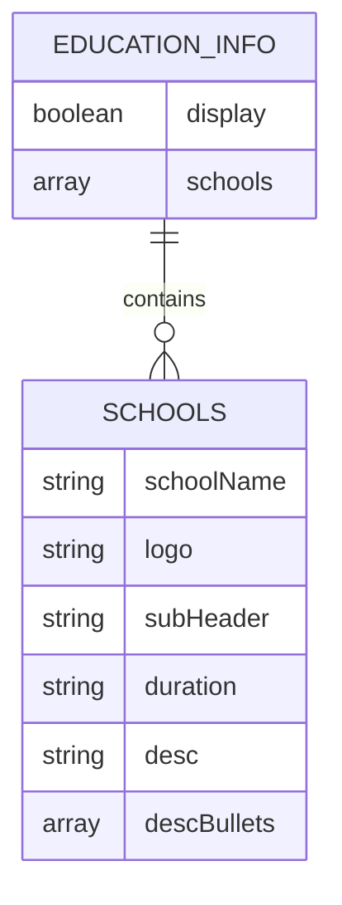
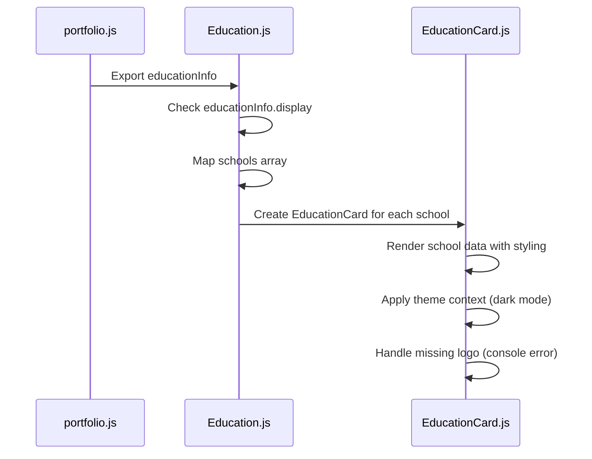
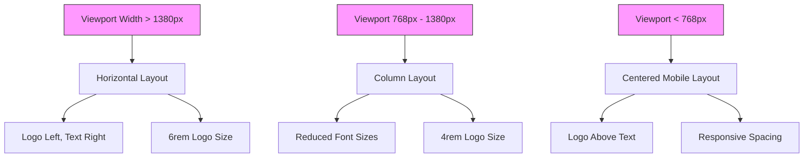

# Education Content Management

<cite>
**Referenced Files in This Document**  
- [portfolio.js](file://src/portfolio.js#L143-L158)
- [Education.js](file://src/containers/education/Education.js#L1-L21)
- [EducationCard.js](file://src/components/educationCard/EducationCard.js#L5-L71)
- [Education.scss](file://src/containers/education/Education.scss#L1-L51)
- [EducationCard.scss](file://src/components/educationCard/EducationCard.scss#L1-L135)
</cite>

## Table of Contents
1. [Introduction](#introduction)
2. [Education Configuration Structure](#education-configuration-structure)
3. [Data Processing and Rendering](#data-processing-and-rendering)
4. [Adding and Modifying Education Entries](#adding-and-modifying-education-entries)
5. [UI Layout and Responsive Design](#ui-layout-and-responsive-design)
6. [Common Formatting Issues](#common-formatting-issues)
7. [Best Practices for Academic Presentation](#best-practices-for-academic-presentation)
8. [Conclusion](#conclusion)

## Introduction

The education section of the portfolio is a critical component for showcasing academic qualifications and professional development. This document provides comprehensive guidance on managing education entries within the portfolio system, covering configuration, rendering, and presentation best practices. The system is designed to be both flexible and consistent, allowing for easy updates while maintaining a professional appearance across devices.

**Section sources**
- [portfolio.js](file://src/portfolio.js#L143-L158)

## Education Configuration Structure

The education entries are defined in the `portfolio.js` configuration file through the `educationInfo` object. This object controls the visibility of the education section and contains an array of school entries, each with specific fields that define the academic information to be displayed.

The primary fields for each education entry include:
- `schoolName`: The full name of the educational institution
- `logo`: Path to the institution's logo image using `require()` syntax
- `subHeader`: Degree or program information (e.g., "B.Sc. Chemistry and Microbiology")
- `duration`: Attendance period in a consistent format (e.g., "2004 — 2008")
- `desc`: Brief description of the academic experience and key focus areas
- `descBullets`: Array of bullet points highlighting specific achievements or skills developed

The entire education section can be toggled on or off globally using the `display` property of the `educationInfo` object, allowing for easy customization based on the portfolio's intended audience or purpose.

**Diagram sources**
- [portfolio.js](file://src/portfolio.js#L143-L158)

**Section sources**
- [portfolio.js](file://src/portfolio.js#L143-L158)

## Data Processing and Rendering

The education data flows from the configuration through a container component to individual card components for rendering. The `Education.js` container imports the `educationInfo` configuration and conditionally renders the education section based on the `display` flag.

When enabled, the container maps through the `schools` array and creates an `EducationCard` component for each entry. The mapping uses array indices as keys, ensuring each card has a unique identifier for React's reconciliation process.

The `EducationCard` component receives each school object as a prop and renders it with consistent styling and formatting. It implements conditional rendering for the institution logo, displaying a console error if the logo is missing. The component also integrates with the theme context to adjust styling based on dark mode preferences.

**Diagram sources**
- [Education.js](file://src/containers/education/Education.js#L1-L21)
- [EducationCard.js](file://src/components/educationCard/EducationCard.js#L5-L71)

**Section sources**
- [Education.js](file://src/containers/education/Education.js#L1-L21)
- [EducationCard.js](file://src/components/educationCard/EducationCard.js#L5-L71)

## Adding and Modifying Education Entries

To add a new degree to the portfolio, follow these steps:

1. Open the `portfolio.js` file and locate the `educationInfo` object
2. Add a new object to the `schools` array with the required fields
3. Ensure the `logo` field points to a valid image path using `require()`
4. Use consistent formatting for the `duration` field (e.g., "YYYY — YYYY")
5. Provide a descriptive `desc` and relevant `descBullets` to highlight achievements

To update an existing entry, such as changing a graduation date:
1. Locate the specific school object in the `schools` array
2. Modify the `duration` field with the new date range
3. Save the file and verify the changes in the rendered portfolio

To remove an outdated entry:
1. Identify the school object to be removed from the `schools` array
2. Delete the entire object, ensuring proper comma placement with adjacent entries
3. Test that the remaining entries render correctly

When adding multiple education entries, maintain consistency in formatting and detail level across all entries to present a professional appearance.

**Section sources**
- [portfolio.js](file://src/portfolio.js#L143-L158)

## UI Layout and Responsive Design

The education section employs a flexible layout system that adapts to different screen sizes. The container uses flexbox with a column direction, ensuring proper stacking of education cards on smaller devices.

On desktop views, education cards display with a horizontal layout where the institution logo appears to the left of the academic information. The card border animation enhances visual interest, expanding to full width on hover to create a subtle interactive effect.

For tablet devices (max-width: 1380px), the layout shifts to a column format with adjusted font sizes and spacing. The logo size is reduced, and the card container width is optimized for the smaller viewport.

On mobile devices (max-width: 768px), the design becomes fully responsive with centered text alignment. The logo is positioned above the text content, and bullet points are constrained to 80% width with automatic centering. Font sizes are further reduced to ensure readability without excessive zooming.

**Diagram sources**
- [Education.scss](file://src/containers/education/Education.scss#L1-L51)
- [EducationCard.scss](file://src/components/educationCard/EducationCard.scss#L1-L135)

**Section sources**
- [Education.scss](file://src/containers/education/Education.scss#L1-L51)
- [EducationCard.scss](file://src/components/educationCard/EducationCard.scss#L1-L135)

## Common Formatting Issues

Several common formatting issues can arise when managing education entries:

**Inconsistent Date Formats**: Mixing formats like "2004-2008", "2004 to 2008", and "2004 — 2008" creates visual inconsistency. Always use the en-dash character (—) with spaces around it for date ranges.

**Missing Degree Titles**: Omitting the `subHeader` field results in incomplete academic information. Ensure every entry includes the specific degree or program name.

**Broken Image Paths**: Incorrect logo paths using `require()` syntax will cause console errors and missing images. Verify that image files exist in the specified location and that the path is correct.

**Overly Long Descriptions**: Excessively long `desc` fields can disrupt the card layout. Keep descriptions concise (1-2 sentences) and use `descBullets` for additional details.

**Inconsistent Bullet Point Usage**: Some entries using bullet points while others don't creates visual imbalance. Apply a consistent approach across all education entries.

**Missing Duration Information**: Omitting the `duration` field removes important context about the academic timeline. Always include attendance dates for each entry.

**Section sources**
- [portfolio.js](file://src/portfolio.js#L143-L158)
- [EducationCard.js](file://src/components/educationCard/EducationCard.js#L5-L71)

## Best Practices for Academic Presentation

To effectively highlight academic achievements in the portfolio, consider the following recommendations:

**Prioritize Relevance**: Order education entries with the most recent or most relevant degree first. This ensures visitors see your highest qualification immediately.

**Highlight Academic Honors**: Use the `descBullets` array to showcase academic distinctions such as cum laude designations, scholarships, or academic awards.

**Include Relevant Coursework**: For recent graduates or when specific skills are important, include bullet points mentioning key courses or specializations that align with your professional expertise.

**Quantify Achievements**: Where possible, add measurable outcomes to your education description, such as "Graduated top 5% of class" or "Maintained 3.8 GPA in major."

**Connect to Professional Skills**: Use the `desc` field to bridge academic experience with professional capabilities, explaining how your education prepared you for your current work.

**Maintain Visual Consistency**: Ensure all education cards have logos of similar quality and dimensions. Use consistent formatting for degree abbreviations (e.g., always "B.Sc." not alternating with "Bachelor of Science").

**Optimize for Scannability**: Structure information in order of importance, with institution name and degree most prominent, followed by dates and key achievements.

**Section sources**
- [portfolio.js](file://src/portfolio.js#L143-L158)
- [EducationCard.js](file://src/components/educationCard/EducationCard.js#L5-L71)

## Conclusion

The education section of the portfolio provides a structured and responsive way to present academic qualifications. By understanding the configuration structure in `portfolio.js`, the rendering process through `Education.js` and `EducationCard.js`, and the styling defined in the SCSS files, users can effectively manage their education entries.

The system balances flexibility with consistency, allowing for customization while maintaining a professional appearance across devices. By following the guidelines for adding, modifying, and formatting education entries, and by applying best practices for academic presentation, users can create a compelling representation of their educational background that enhances their professional portfolio.

Regular maintenance of education entries, attention to formatting consistency, and strategic presentation of academic achievements will ensure this section effectively supports the overall narrative of professional competence and development.