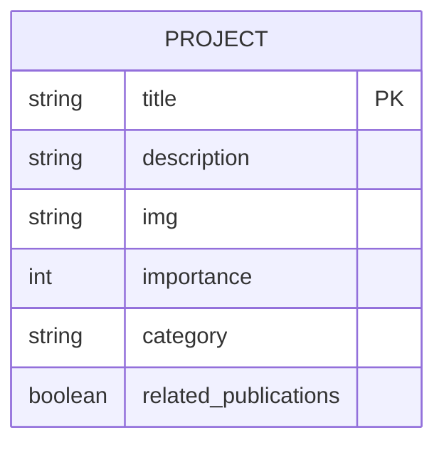
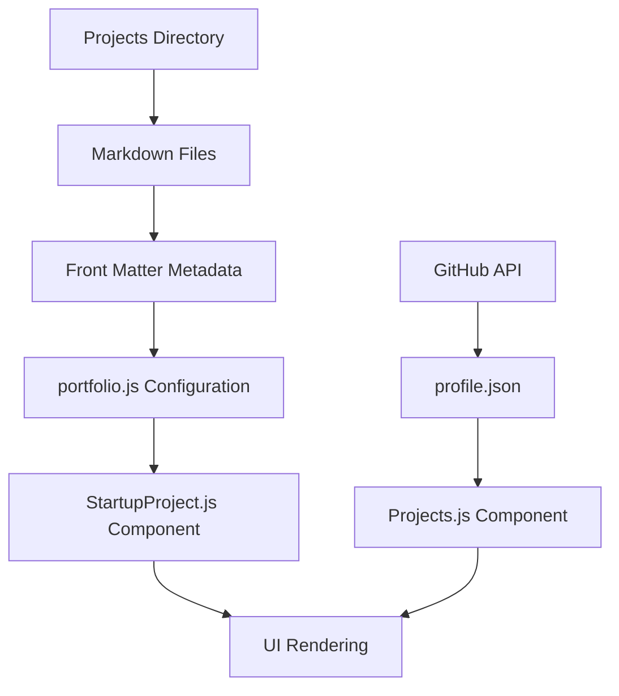
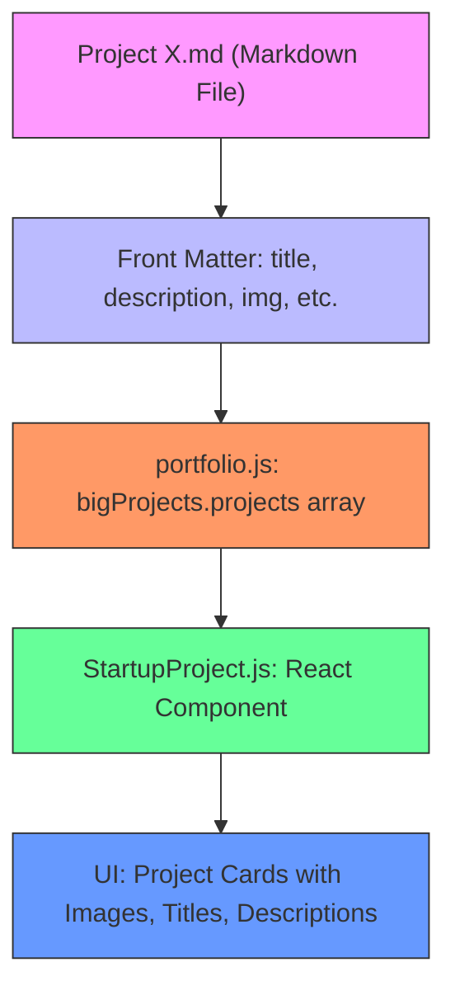

# Projects Content Management

<cite>
**Referenced Files in This Document**   
- [Project 1.md](file://Projects/Project 1.md)
- [Project 2.md](file://Projects/Project 2.md)
- [Project 3.md](file://Projects/Project 3.md)
- [Project 4.md](file://Projects/Project 4.md)
- [Project 12.md](file://Projects/Project 12.md)
- [Projects.js](file://src/containers/projects/Projects.js)
- [StartupProject.js](file://src/containers/StartupProjects/StartupProject.js)
- [portfolio.js](file://src/portfolio.js)
- [Main.js](file://src/containers/Main.js)
</cite>

## Table of Contents
1. [Introduction](#introduction)
2. [Project File Structure and Metadata](#project-file-structure-and-metadata)
3. [Project Rendering Mechanism](#project-rendering-mechanism)
4. [Adding and Updating Projects](#adding-and-updating-projects)
5. [Data Flow from Markdown to UI](#data-flow-from-markdown-to-ui)
6. [Common Issues and Troubleshooting](#common-issues-and-troubleshooting)
7. [SEO and Visual Consistency Guidelines](#seo-and-visual-consistency-guidelines)
8. [Conclusion](#conclusion)

## Introduction
This document provides comprehensive guidance on managing project documentation within the portfolio system. It explains how Markdown files in the Projects/ directory are structured, parsed, and rendered by the React components to create a dynamic and informative project showcase. The documentation covers the expected format for project entries, the rendering process, and best practices for maintaining content quality and consistency.

## Project File Structure and Metadata
Each project entry is defined in a Markdown file within the Projects/ directory, following a standardized structure with specific metadata fields in the front matter. The metadata provides essential information that can be used for sorting, categorization, and display.

**Diagram sources**
- [Project 1.md](file://Projects/Project 1.md#L1-L7)
- [Project 2.md](file://Projects/Project 2.md#L1-L7)
- [Project 3.md](file://Projects/Project 3.md#L1-L7)

**Section sources**
- [Project 1.md](file://Projects/Project 1.md#L1-L71)
- [Project 2.md](file://Projects/Project 2.md#L1-L54)
- [Project 3.md](file://Projects/Project 3.md#L1-L137)

## Project Rendering Mechanism
The project content is rendered through two distinct mechanisms in the portfolio: dynamic GitHub project fetching and static project content rendering. The Projects.js component handles open-source projects fetched from GitHub, while the StartupProject.js component renders the static project content defined in the portfolio configuration.

**Diagram sources**
- [Projects.js](file://src/containers/projects/Projects.js#L6-L73)
- [StartupProject.js](file://src/containers/StartupProjects/StartupProject.js#L2-L94)
- [portfolio.js](file://src/portfolio.js#L221-L372)

**Section sources**
- [Projects.js](file://src/containers/projects/Projects.js#L1-L74)
- [StartupProject.js](file://src/containers/StartupProjects/StartupProject.js#L1-L94)

## Adding and Updating Projects
To add a new project, create a Markdown file in the Projects/ directory with the appropriate naming convention and front matter metadata. The content should follow the established structure with clear sections and proper Markdown syntax. For updates, modify the existing Markdown file while preserving the front matter format.

**Section sources**
- [Project 1.md](file://Projects/Project 1.md#L1-L71)
- [Project 4.md](file://Projects/Project 4.md#L11-L14)

## Data Flow from Markdown to UI
The data flow from Markdown files to the user interface involves several steps: the project content is defined in Markdown files with front matter, referenced in the portfolio.js configuration, and rendered by the StartupProject.js component. This process ensures that project information is consistently displayed across the portfolio.

**Diagram sources**
- [Project 1.md](file://Projects/Project 1.md#L1-L7)
- [portfolio.js](file://src/portfolio.js#L221-L372)
- [StartupProject.js](file://src/containers/StartupProjects/StartupProject.js#L34-L69)

**Section sources**
- [portfolio.js](file://src/portfolio.js#L221-L372)
- [StartupProject.js](file://src/containers/StartupProjects/StartupProject.js#L1-L94)

## Common Issues and Troubleshooting
Common issues in project management include missing images, broken links, and incorrect front matter formatting. These can be identified through validation scripts and addressed by verifying file paths, link URLs, and metadata syntax. The validate-content.js script provides automated checking for these issues.

**Section sources**
- [validate-content.js](file://validate-content.js#L187-L239)
- [Project 12.md](file://Projects/Project 12.md#L73-L113)

## SEO and Visual Consistency Guidelines
To optimize project descriptions for SEO and visual consistency, use descriptive titles and meta descriptions, include relevant keywords, and maintain a consistent structure across all project entries. Images should be properly sized and optimized for web performance, and content should be organized with clear headings and sections.

**Section sources**
- [Project 1.md](file://Projects/Project 1.md#L1-L71)
- [Project 3.md](file://Projects/Project 3.md#L1-L137)

## Conclusion
Effective management of project documentation in the portfolio requires adherence to the defined structure and metadata format. By following the guidelines outlined in this document, contributors can ensure that project entries are properly formatted, visually consistent, and optimized for both user experience and search engine visibility. The combination of Markdown files and React components provides a flexible and maintainable system for showcasing project work.