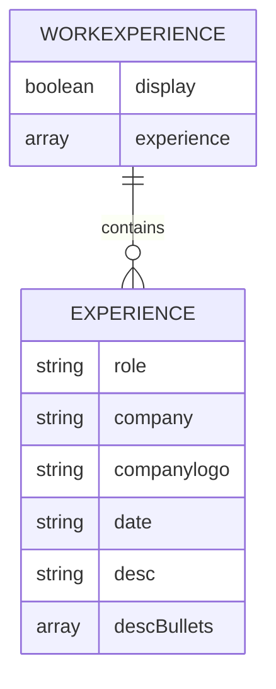
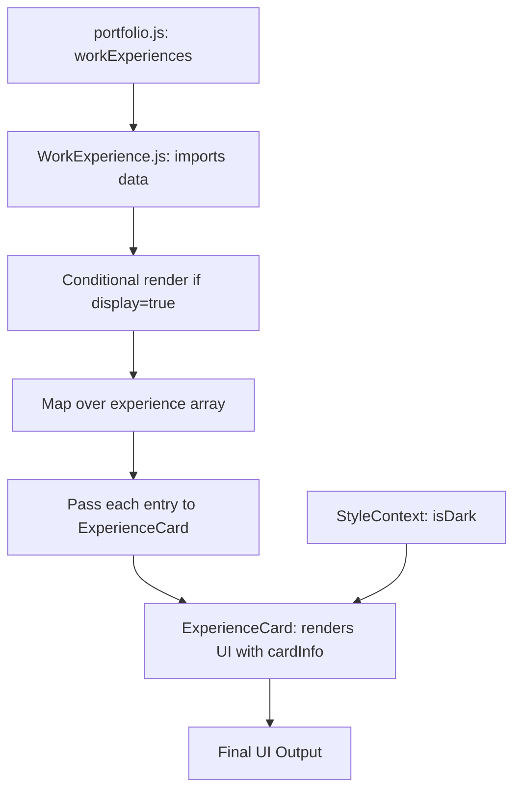
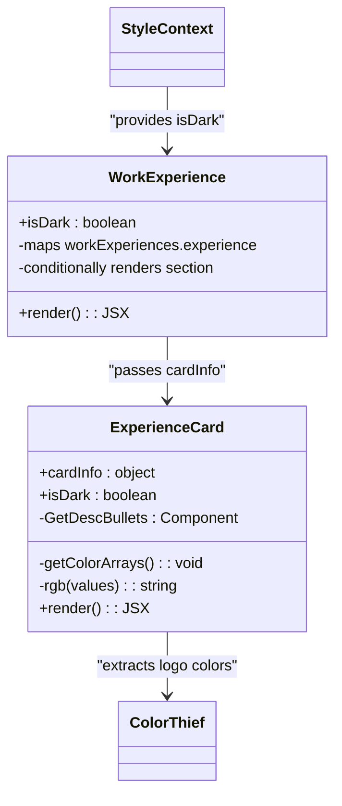

# Work Experience Management

<cite>
**Referenced Files in This Document**   
- [portfolio.js](file://src/portfolio.js)
- [WorkExperience.js](file://src/containers/workExperience/WorkExperience.js)
- [ExperienceCard.js](file://src/components/experienceCard/ExperienceCard.js)
- [ExperienceCard.scss](file://src/components/experienceCard/ExperienceCard.scss)
- [WorkExperience.scss](file://src/containers/workExperience/WorkExperience.scss)
</cite>

## Table of Contents
1. [Introduction](#introduction)
2. [Work Experience Data Structure](#work-experience-data-structure)
3. [Data Flow from Configuration to UI](#data-flow-from-configuration-to-ui)
4. [Adding, Editing, and Removing Entries](#adding-editing-and-removing-entries)
5. [Rendering Logic and UI Components](#rendering-logic-and-ui-components)
6. [Common Issues and Validation](#common-issues-and-validation)
7. [Best Practices for Writing Experience Entries](#best-practices-for-writing-experience-entries)
8. [Conclusion](#conclusion)

## Introduction
This document provides comprehensive guidance on managing work experience entries within the portfolio application. It details how professional experience data is structured, rendered, and maintained across the codebase. The system leverages a centralized configuration file (`portfolio.js`) to define job entries, which are then dynamically rendered through React components. This architecture enables easy updates while ensuring consistent formatting and responsive design across devices.

**Section sources**
- [portfolio.js](file://src/portfolio.js#L181-L211)

## Work Experience Data Structure
The work experience data is defined in the `workExperiences` object within `portfolio.js`. This configuration object controls both the visibility of the section and the array of individual job entries.

Each experience entry contains the following fields:
- **role**: Job title or position held
- **company**: Employer name
- **companylogo**: Path to company logo image using `require()`
- **date**: Employment period in string format (e.g., "2020 — Present")
- **desc**: Summary description of role and responsibilities
- **descBullets**: Array of detailed achievement points

The parent object also includes a `display` boolean flag that toggles the entire section's visibility in the UI.



**Diagram sources**
- [portfolio.js](file://src/portfolio.js#L181-L211)

**Section sources**
- [portfolio.js](file://src/portfolio.js#L181-L211)

## Data Flow from Configuration to UI
The work experience data flows from the configuration file through the container component to individual card components. This unidirectional data flow ensures consistency and maintainability.

1. `portfolio.js` exports the `workExperiences` configuration
2. `WorkExperience.js` imports this data and conditionally renders the section
3. The container maps over the experience array and passes each entry to `ExperienceCard`
4. Each `ExperienceCard` receives data via the `cardInfo` prop and renders it with styling

The process includes conditional rendering based on the `display` flag and theme-aware styling through the `isDark` context.



**Diagram sources**
- [WorkExperience.js](file://src/containers/workExperience/WorkExperience.js#L9-L41)
- [portfolio.js](file://src/portfolio.js#L181-L211)

**Section sources**
- [WorkExperience.js](file://src/containers/workExperience/WorkExperience.js#L9-L41)

## Adding, Editing, and Removing Entries
To modify work experience entries, edit the `experience` array in `workExperiences` within `portfolio.js`.

### Adding a New Entry
Insert a new object into the `experience` array with all required fields:
```javascript
{
  role: "New Position Title",
  company: "Company Name",
  companylogo: require("./assets/images/companyLogo.png"),
  date: "2023 — Present",
  desc: "Brief summary of role and impact.",
  descBullets: [
    "Key achievement or responsibility",
    "Notable project or result",
    "Skill or technology utilized"
  ]
}
```

### Editing an Existing Entry
Locate the target entry by company or role and update the relevant fields while preserving the object structure.

### Removing an Entry
Delete the entire object from the `experience` array.

The grid-based layout in `WorkExperience.scss` automatically adjusts to accommodate changes in the number of entries.

**Section sources**
- [portfolio.js](file://src/portfolio.js#L181-L211)
- [WorkExperience.scss](file://src/containers/workExperience/WorkExperience.scss#L1-L10)

## Rendering Logic and UI Components
The UI rendering is handled by two primary components that work together to display experience data.

### WorkExperience Container
The container component (`WorkExperience.js`) manages:
- Section-level conditional rendering
- Theme context integration
- Data mapping to individual cards
- Animation effects via `react-reveal`

### ExperienceCard Component
The card component (`ExperienceCard.js`) handles:
- Individual entry rendering
- Dynamic background color extraction from logos using `ColorThief`
- Bullet point rendering via the `GetDescBullets` sub-component
- Responsive styling based on dark/light mode

The card layout features a banner section with company name and logo, followed by detailed information including role, date, description, and bullet points.



**Diagram sources**
- [WorkExperience.js](file://src/containers/workExperience/WorkExperience.js#L4-L41)
- [ExperienceCard.js](file://src/components/experienceCard/ExperienceCard.js#L4-L83)

**Section sources**
- [WorkExperience.js](file://src/containers/workExperience/WorkExperience.js#L4-L41)
- [ExperienceCard.js](file://src/components/experienceCard/ExperienceCard.js#L4-L83)

## Common Issues and Validation
Several common issues can arise when managing experience entries. Understanding these helps maintain data integrity and visual consistency.

### Malformed Date Strings
Ensure date strings use the en-dash (—) character and follow consistent formatting (e.g., "2020 — Present" or "Jan 2020 — Dec 2022"). Inconsistent formatting breaks visual harmony.

### Excessive Description Length
Keep `desc` summaries concise (1-2 sentences). Overly long descriptions disrupt card layout and readability. Detailed information should go in `descBullets`.

### Missing Required Fields
All fields are required. Missing `companylogo` causes image loading errors. Omitting `descBullets` (even as an empty array) may cause rendering issues.

### Image Path Errors
Verify logo paths exist and use correct `require()` syntax. Broken image paths prevent color extraction and display fallbacks.

### Theme Rendering Issues
Ensure the `isDark` prop is properly passed from context to maintain consistent styling across light/dark modes.

**Section sources**
- [portfolio.js](file://src/portfolio.js#L181-L211)
- [ExperienceCard.js](file://src/components/experienceCard/ExperienceCard.js#L4-L83)

## Best Practices for Writing Experience Entries
Crafting effective experience entries enhances professional presentation and readability.

### Content Guidelines
- Start bullet points with strong action verbs (e.g., "Developed", "Implemented", "Optimized")
- Quantify achievements where possible (e.g., "reduced processing time by 30%")
- Focus on impact and results rather than just responsibilities
- Limit bullet points to 4-5 per position for optimal readability

### Formatting Standards
- Maintain parallel structure in bullet points
- Use consistent date formatting throughout
- Keep company names accurate and complete
- Ensure logo images are high-quality and properly sized

### Technical Maintenance
- Validate all entries after modifications
- Test both light and dark mode rendering
- Verify responsive behavior on different screen sizes
- Confirm all links and image paths are correct

Following these practices ensures a professional, consistent, and technically sound work experience section.

**Section sources**
- [portfolio.js](file://src/portfolio.js#L181-L211)
- [ExperienceCard.js](file://src/components/experienceCard/ExperienceCard.js#L4-L83)
- [WorkExperience.js](file://src/containers/workExperience/WorkExperience.js#L9-L41)

## Conclusion
The work experience management system provides a flexible yet structured approach to presenting professional history. By understanding the data structure in `portfolio.js` and the rendering pipeline through `WorkExperience.js` and `ExperienceCard.js`, users can effectively maintain their portfolio with consistent, professional entries. The component-based architecture allows for easy updates while preserving design integrity across themes and devices. Adhering to best practices in content creation and technical implementation ensures the work experience section effectively showcases professional achievements.