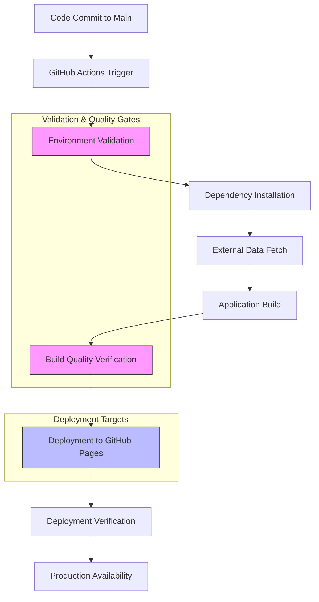
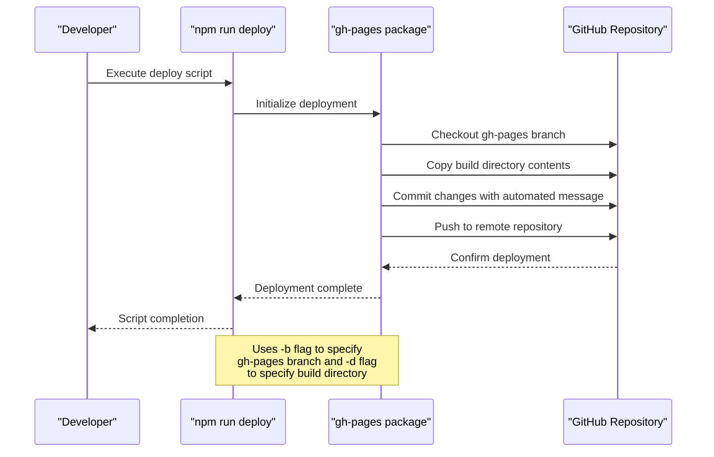
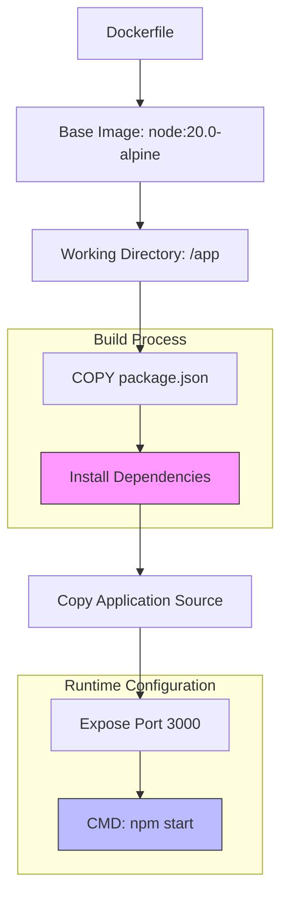
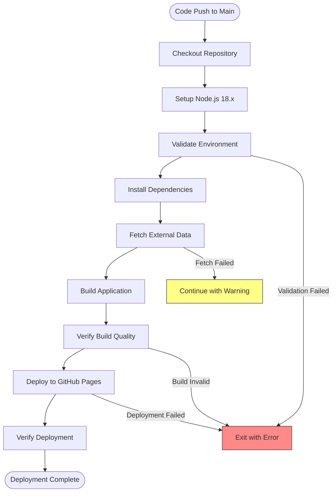
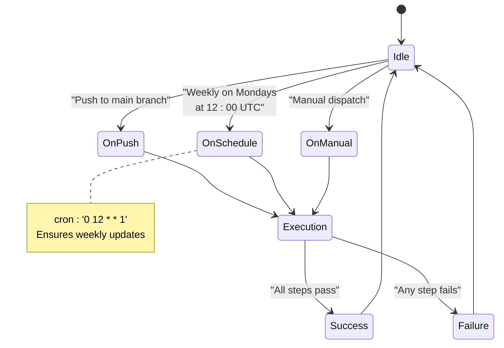
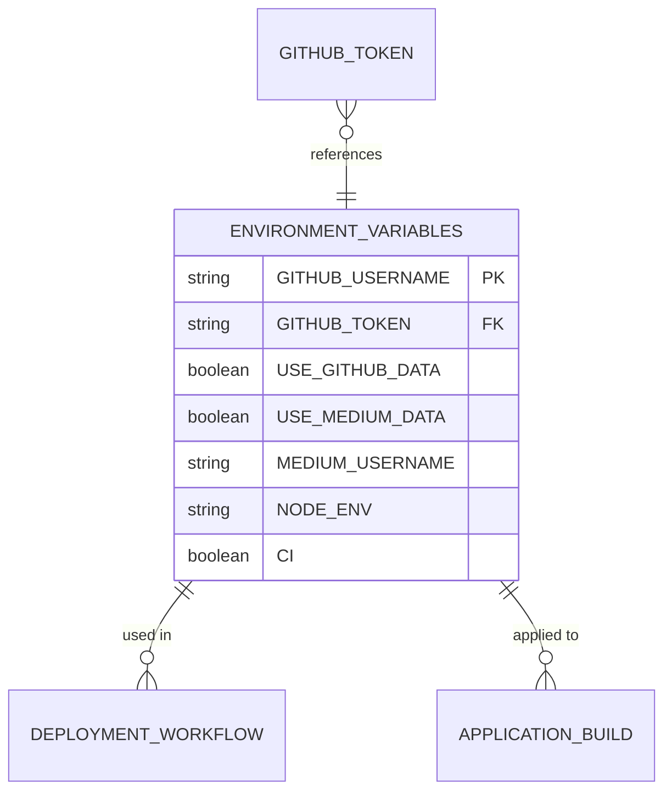
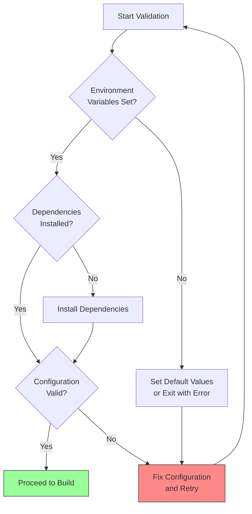
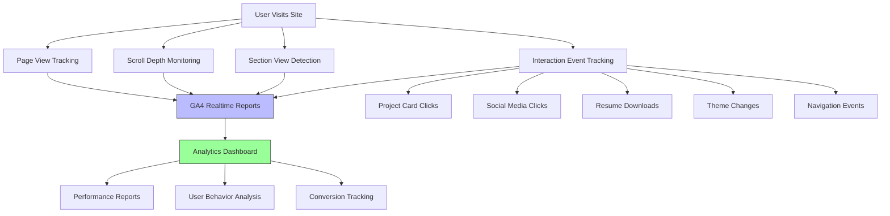
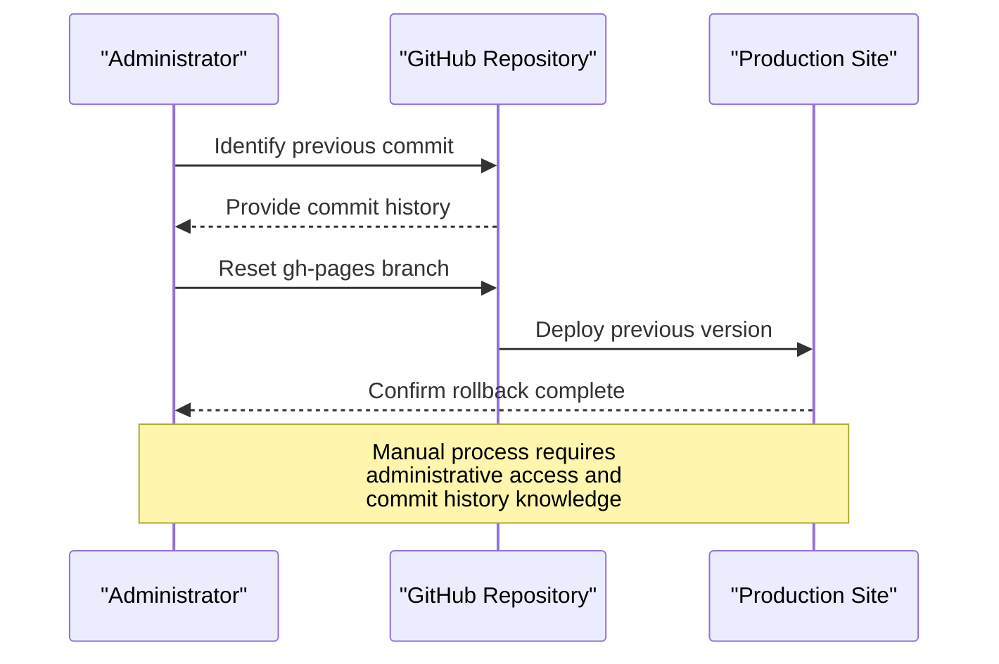

# Deployment and CI/CD

<cite>
**Referenced Files in This Document**  
- [package.json](file://package.json)
- [Dockerfile](file://Dockerfile)
- [.github/workflows/deploy.yml](file://.github/workflows/deploy.yml)
- [DEPLOYMENT_CHECKLIST.md](file://DEPLOYMENT_CHECKLIST.md)
- [DEPLOYMENT_SUCCESS.md](file://DEPLOYMENT_SUCCESS.md)
</cite>

## Table of Contents
1. [Introduction](#introduction)
2. [Deployment Configuration](#deployment-configuration)
3. [CI/CD Pipeline Architecture](#cicd-pipeline-architecture)
4. [GitHub Pages Deployment](#github-pages-deployment)
5. [Containerized Deployment](#containerized-deployment)
6. [Deployment Workflow](#deployment-workflow)
7. [Infrastructure Requirements](#infrastructure-requirements)
8. [Deployment Validation and Monitoring](#deployment-validation-and-monitoring)
9. [Rollback Procedures](#rollback-procedures)
10. [Best Practices](#best-practices)

## Introduction

This document provides comprehensive documentation for the deployment pipeline of the portfolio application. It details the CI/CD architecture, deployment mechanisms, and operational procedures that enable automated, reliable, and scalable deployment of the application to production. The system leverages GitHub Actions for continuous integration and deployment, GitHub Pages for static site hosting, and Docker for containerized deployment options. The documentation covers the complete deployment lifecycle from code commit to production deployment, including validation, monitoring, and rollback procedures.

## Deployment Configuration

The deployment configuration is managed through multiple files that define the build process, environment variables, and deployment parameters. The primary configuration files establish the foundation for both automated and manual deployment workflows.

**Section sources**
- [package.json](file://package.json#L1-L78)
- [.github/workflows/deploy.yml](file://.github/workflows/deploy.yml#L1-L134)

## CI/CD Pipeline Architecture

The CI/CD pipeline architecture implements a robust automated deployment system that ensures code quality, consistency, and reliability throughout the deployment process. The architecture follows modern DevOps practices with comprehensive validation and monitoring capabilities.



**Diagram sources**
- [.github/workflows/deploy.yml](file://.github/workflows/deploy.yml#L1-L134)
- [DEPLOYMENT_CHECKLIST.md](file://DEPLOYMENT_CHECKLIST.md#L1-L108)

## GitHub Pages Deployment

The GitHub Pages deployment mechanism utilizes the gh-pages package to deploy the built application to the gh-pages branch, enabling static site hosting through GitHub's infrastructure. The deployment process is automated through npm scripts and GitHub Actions workflows.

**Section sources**
- [package.json](file://package.json#L1-L78)
- [.github/workflows/deploy.yml](file://.github/workflows/deploy.yml#L1-L134)

### Deployment Script Configuration

The deployment script is configured in the package.json file with specific parameters for branch and directory deployment. The script ensures that the build output is properly deployed to the designated branch for GitHub Pages hosting.



**Diagram sources**
- [package.json](file://package.json#L60-L63)
- [.github/workflows/deploy.yml](file://.github/workflows/deploy.yml#L100-L110)

## Containerized Deployment

The containerized deployment configuration provides an alternative deployment method using Docker, enabling consistent deployment across different environments and infrastructure platforms. The Dockerfile defines the container image with all necessary dependencies and runtime configurations.



**Diagram sources**
- [Dockerfile](file://Dockerfile#L1-L30)
- [package.json](file://package.json#L1-L78)

### Docker Configuration Details

The Docker configuration implements best practices for container security and performance. It uses the Alpine Linux distribution for a minimal footprint, installs dependencies securely, and exposes the necessary port for application access. The container is configured to run the application using the npm start script defined in package.json.

**Section sources**
- [Dockerfile](file://Dockerfile#L1-L30)
- [package.json](file://package.json#L50-L53)

## Deployment Workflow

The deployment workflow is automated through GitHub Actions, triggered by code pushes to the main branch or scheduled weekly executions. The workflow implements a comprehensive series of steps to ensure successful deployment with proper validation and error handling.



**Diagram sources**
- [.github/workflows/deploy.yml](file://.github/workflows/deploy.yml#L1-L134)
- [DEPLOYMENT_CHECKLIST.md](file://DEPLOYMENT_CHECKLIST.md#L1-L108)

### Workflow Triggers and Scheduling

The deployment workflow is configured with multiple triggers to support both event-driven and time-based deployments. This ensures that the site is regularly updated and can be manually triggered when needed.



**Diagram sources**
- [.github/workflows/deploy.yml](file://.github/workflows/deploy.yml#L3-L9)

## Infrastructure Requirements

The deployment infrastructure requirements are designed to ensure compatibility, security, and performance across all deployment methods. The requirements specify the necessary runtime environments, dependencies, and configuration parameters.

### Runtime Environment

The application requires specific runtime environments for different deployment methods. For GitHub Actions deployment, Node.js 18.x is required, while the Docker deployment uses Node.js 20.0 on Alpine Linux. Both environments ensure compatibility with the application's dependencies and build process.

**Section sources**
- [.github/workflows/deploy.yml](file://.github/workflows/deploy.yml#L25-L28)
- [Dockerfile](file://Dockerfile#L3-L4)

### Environment Variables

The deployment process utilizes several environment variables to configure application behavior and integration features. These variables control feature flags, authentication credentials, and external service integrations.



**Diagram sources**
- [.github/workflows/deploy.yml](file://.github/workflows/deploy.yml#L15-L32)
- [DEPLOYMENT_CHECKLIST.md](file://DEPLOYMENT_CHECKLIST.md#L1-L108)

## Deployment Validation and Monitoring

The deployment validation and monitoring system implements comprehensive checks and tracking mechanisms to ensure deployment success and application performance. The system includes both automated validation during deployment and post-deployment monitoring capabilities.

### Pre-Deployment Validation

The deployment process includes multiple validation steps to ensure that all prerequisites are met before proceeding with the build and deployment. These validations check environment variables, dependencies, and configuration settings.



**Diagram sources**
- [.github/workflows/deploy.yml](file://.github/workflows/deploy.yml#L40-L58)
- [DEPLOYMENT_CHECKLIST.md](file://DEPLOYMENT_CHECKLIST.md#L1-L108)

### Post-Deployment Monitoring

Post-deployment monitoring is implemented through Google Analytics 4 (GA4) with comprehensive event tracking and performance monitoring. The system tracks user engagement, section views, project interactions, and technical performance metrics.



**Diagram sources**
- [DEPLOYMENT_SUCCESS.md](file://DEPLOYMENT_SUCCESS.md#L1-L216)
- [package.json](file://package.json#L1-L78)

## Rollback Procedures

The deployment system implements rollback procedures to address failed deployments or issues discovered in production. The rollback mechanism leverages the version control system to restore previous stable states.

### Automated Rollback Considerations

While the current workflow does not implement automated rollback, the git-based deployment system enables manual rollback through repository history. The gh-pages branch maintains a history of deployments, allowing restoration of previous versions.



**Diagram sources**
- [package.json](file://package.json#L60-L63)
- [.github/workflows/deploy.yml](file://.github/workflows/deploy.yml#L100-L110)

## Best Practices

The deployment system implements several best practices to ensure reliability, security, and maintainability. These practices cover configuration management, security, performance, and operational excellence.

### Configuration Management

The system follows configuration management best practices by separating configuration from code, using environment variables for sensitive data, and implementing feature flags for controlled feature rollout.

```mermaid
flowchart TD
    A[Configuration Management] --> B[