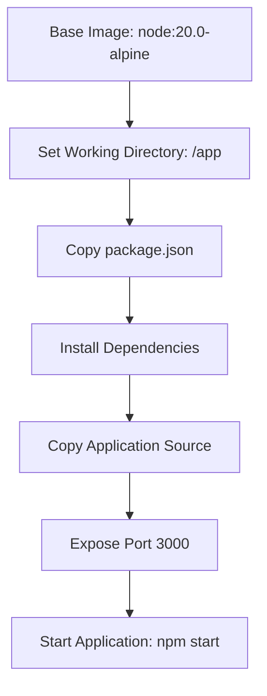

# Docker Container Deployment

<cite>
**Referenced Files in This Document**  
- [Dockerfile](file://Dockerfile)
- [package.json](file://package.json)
- [fetch.js](file://fetch.js)
- [DEPLOYMENT_SUCCESS.md](file://DEPLOYMENT_SUCCESS.md)
- [DEPLOYMENT_CHECKLIST.md](file://DEPLOYMENT_CHECKLIST.md)
</cite>

## Table of Contents
1. [Introduction](#introduction)
2. [Dockerfile Configuration](#dockerfile-configuration)
3. [Build Process and Layer Optimization](#build-process-and-layer-optimization)
4. [Application Startup and Script Integration](#application-startup-and-script-integration)
5. [Container Build and Execution](#container-build-and-execution)
6. [Deployment Use Cases](#deployment-use-cases)
7. [Post-Deployment Verification](#post-deployment-verification)

## Introduction

This document provides comprehensive documentation for containerized deployment of the Sameh Shehata portfolio application using Docker. The deployment strategy leverages Docker's containerization technology to create a consistent, portable environment for running the React-based portfolio application. The configuration enables reliable deployment across different environments, from local development to alternative hosting platforms, ensuring consistent behavior regardless of the underlying infrastructure.

The Docker implementation uses a multi-stage approach optimized for performance and security, with specific attention to dependency management, layer caching, and production readiness. This containerization approach complements the existing GitHub Pages deployment while providing additional flexibility for testing and alternative hosting scenarios.

**Section sources**
- [Dockerfile](file://Dockerfile#L1-L30)
- [package.json](file://package.json#L1-L83)

## Dockerfile Configuration

The Dockerfile defines the container image configuration for the portfolio application, establishing a lightweight and secure runtime environment based on the official Node.js Alpine image.

The configuration begins with `node:20.0-alpine` as the base image, selected for its small footprint and security advantages. Alpine Linux provides a minimal operating system that reduces the attack surface and image size while maintaining compatibility with Node.js applications. This choice results in faster image downloads, reduced storage requirements, and improved security posture.

The working directory is set to `/app` within the container, establishing a consistent location for application files and simplifying path references. This directory serves as the root context for all subsequent operations within the container lifecycle.

Port 3000 is explicitly exposed to enable network communication between the container and external systems. This configuration allows the React development server to accept incoming HTTP requests when the container is run with appropriate port mapping. The exposed port aligns with the default React development server port, ensuring compatibility with the application's expected runtime environment.

**Diagram sources**
- [Dockerfile](file://Dockerfile#L1-L15)

## Build Process and Layer Optimization

The Docker build process implements strategic layer optimization to maximize build efficiency and leverage Docker's layer caching mechanism. This optimization significantly reduces build times during development and deployment cycles by minimizing the amount of work required when changes occur.

The build process follows a deliberate sequence that prioritizes cache efficiency. The `package.json` file is copied to the container before the rest of the application source code. This ordering is critical for optimization, as it allows Docker to cache the dependency installation layer separately from the application code layer. Since `package.json` changes less frequently than application source files, this approach ensures that npm dependencies only need to be reinstalled when actual dependency changes occur, rather than on every code change.

Following the package file copy, the build process installs Git within the container using Alpine's package manager (`apk`). Git is required for the application's data fetching functionality, which retrieves content from GitHub and Medium. The `--no-cache` flag ensures that package index files are not stored in the image, reducing the final image size.

The dependency installation process consists of two phases: initial installation with `npm install` followed by security hardening with `npm audit fix`. The audit command automatically addresses known vulnerabilities in the dependency tree, enhancing the security posture of the containerized application. This two-step approach ensures that the application runs with up-to-date, secure dependencies while maintaining compatibility with the specified package versions.

After dependencies are installed and secured, the entire application source code is copied into the container using `COPY . /app`. This operation places all application files in the designated working directory, completing the application bundling process.

**Section sources**
- [Dockerfile](file://Dockerfile#L15-L25)
- [package.json](file://package.json#L1-L83)

## Application Startup and Script Integration

The container execution lifecycle is initiated through the `CMD ["npm", "start"]` instruction, which defines the default command executed when the container starts. This command triggers the application startup process as defined in the `package.json` file, creating a seamless integration between the Docker container and the application's script configuration.

The `npm start` script in `package.json` orchestrates a multi-step startup process that prepares the application for execution. The script first executes `node fetch.js`, which runs a data fetching utility responsible for retrieving dynamic content from external sources. This JavaScript file implements functionality to fetch profile data from GitHub and blog content from Medium, enriching the portfolio with up-to-date information from these platforms.

The `fetch.js` script includes comprehensive error handling, environment validation, and retry logic to ensure reliable data retrieval. It validates required environment variables, checks authentication credentials, and implements exponential backoff retry mechanisms for failed requests. Upon successful data retrieval, the script writes the fetched content to JSON files in the public directory, where the React application can access them at runtime.

Following the data fetching phase, the startup script proceeds to execute `react-scripts start`, which launches the React development server. This command starts the webpack development server with hot reloading capabilities, serving the application on port 3000. The development server provides features like live reloading, error overlay, and module hot replacement, which are valuable for development and testing purposes within the container environment.

This integrated startup sequence ensures that the application has access to the latest external content before the development server begins serving requests, providing a complete and up-to-date user experience from the moment the container starts.

**Section sources**
- [package.json](file://package.json#L60-L65)
- [fetch.js](file://fetch.js#L1-L284)

## Container Build and Execution

The container build and execution process follows standard Docker practices, enabling consistent deployment across different environments. To build the container image, execute the command `docker build -t sameh-portfolio .` from the project root directory. This command instructs Docker to build an image using the Dockerfile in the current directory and tag it with the name "sameh-portfolio" for easy reference.

Once the image is built, the container can be run using the command `docker run -p 3000:3000 sameh-portfolio`. This command starts a container instance from the built image, mapping port 3000 on the host machine to port 3000 in the container. After the container starts, the application becomes accessible at `http://localhost:3000` in a web browser.

For development purposes, the container can be run in interactive mode with volume mounting to enable live code reloading. Using the command `docker run -p 3000:3000 -v ${PWD}:/app sameh-portfolio` mounts the current directory as a volume in the container, allowing code changes on the host machine to be immediately reflected in the running container. This setup facilitates rapid development and testing without requiring image rebuilds for every code change.

The containerized application inherits environment variables from the host system when needed, allowing configuration of features like GitHub and Medium integration through the same `.env` file mechanism used in the non-containerized deployment. This consistency ensures that feature toggles and authentication credentials work identically across deployment methods.

**Section sources**
- [Dockerfile](file://Dockerfile#L1-L30)
- [package.json](file://package.json#L1-L83)

## Deployment Use Cases

The Docker containerization approach supports multiple deployment use cases, extending beyond the primary GitHub Pages deployment to provide additional flexibility for development, testing, and alternative hosting scenarios.

For local testing and development, the container provides a consistent environment that eliminates "works on my machine" issues. Developers can ensure that the application behaves identically across different development machines by running it in the standardized container environment. This consistency is particularly valuable when collaborating across teams or when setting up new development environments.

The container image can be deployed to alternative hosting platforms that support containerized applications, such as Docker Hub, AWS ECS, Google Cloud Run, or Azure Container Instances. This flexibility allows for deployment to platforms that may offer different pricing models, geographic distribution options, or feature sets compared to GitHub Pages. For example, cloud container services often provide automatic scaling, global load balancing, and integrated monitoring capabilities.

The containerized deployment also facilitates integration with continuous integration/continuous deployment (CI/CD) pipelines. The build process can be automated in CI/CD systems to create and test container images on every code change, ensuring that the containerized version remains functional and up-to-date. These images can then be pushed to container registries and deployed to staging or production environments as part of automated release processes.

Additionally, the container serves as an excellent tool for demonstration and presentation purposes. A container image can be easily shared with stakeholders or potential employers, allowing them to run the portfolio application locally without requiring complex setup procedures or specific development environments.

**Section sources**
- [DEPLOYMENT_CHECKLIST.md](file://DEPLOYMENT_CHECKLIST.md#L1-L108)
- [DEPLOYMENT_SUCCESS.md](file://DEPLOYMENT_SUCCESS.md#L1-L216)

## Post-Deployment Verification

After deploying the containerized application, thorough verification ensures that all components function correctly and provide the expected user experience. The verification process includes checking application accessibility, validating data integration, and confirming proper functionality of all interactive elements.

When accessing the application at the designated URL (typically `http://localhost:3000` for local container runs), verify that the site loads completely and displays all sections correctly. Test navigation between different portfolio sections to ensure smooth transitions and proper routing. Check responsive design by resizing the browser window or testing on different device sizes to confirm that the layout adapts appropriately.

Validate the integration of external data sources by confirming that GitHub profile information and Medium blog posts appear correctly in their respective sections. If these features do not display content, check that the required environment variables (GITHUB_USERNAME, GITHUB_TOKEN, MEDIUM_USERNAME) are properly configured and that the `fetch.js` script executed successfully during container startup.

Test interactive elements such as the dark/light theme toggle, social media links, and contact form (if implemented) to ensure they function as expected. Verify that theme changes persist across page reloads and that external links open in new tabs correctly. Check that any tracking or analytics functionality, such as Google Analytics 4 integration, is properly configured and sending data to the appropriate endpoints.

Monitor container logs during startup and operation to identify any errors or warnings that may indicate configuration issues or failed operations. The logs should show successful execution of the `fetch.js` script, completion of data fetching operations, and normal startup of the React development server without errors.

**Section sources**
- [DEPLOYMENT_SUCCESS.md](file://DEPLOYMENT_SUCCESS.md#L1-L216)
- [DEPLOYMENT_CHECKLIST.md](file://DEPLOYMENT_CHECKLIST.md#L1-L108)