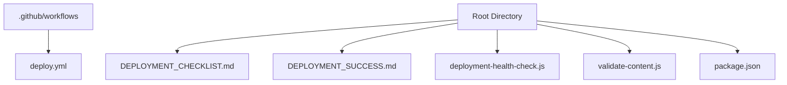
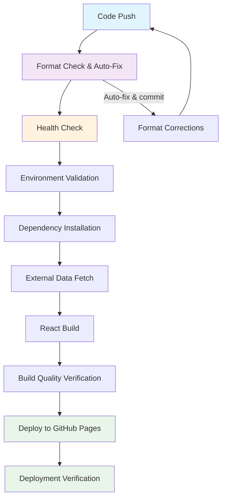
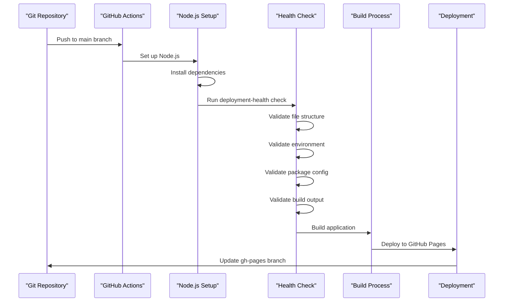
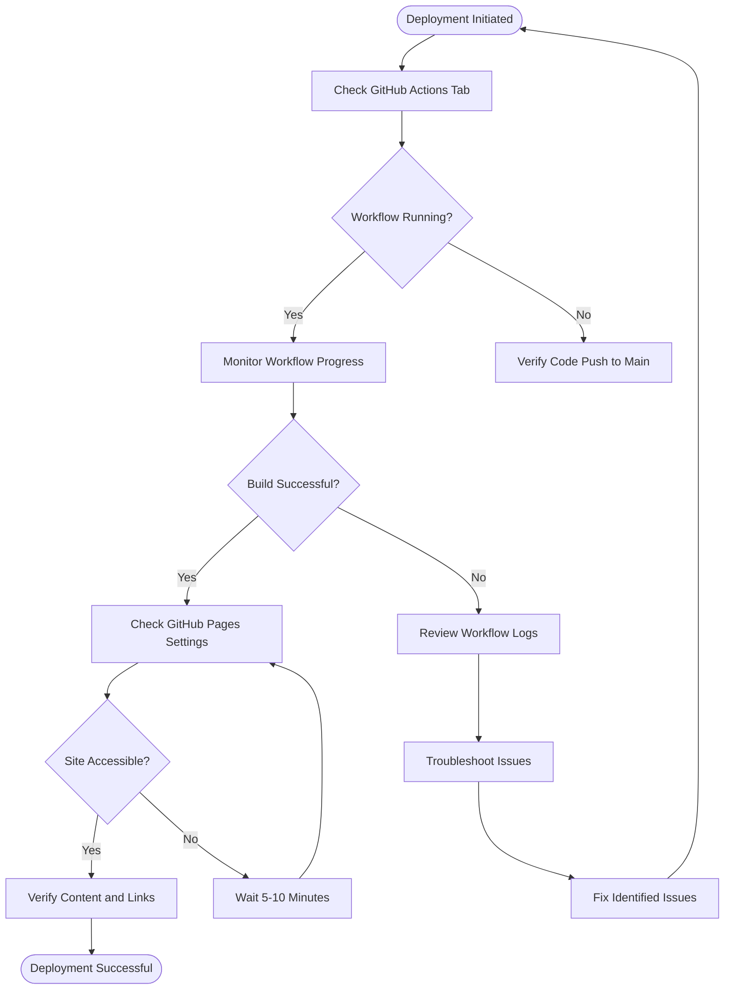
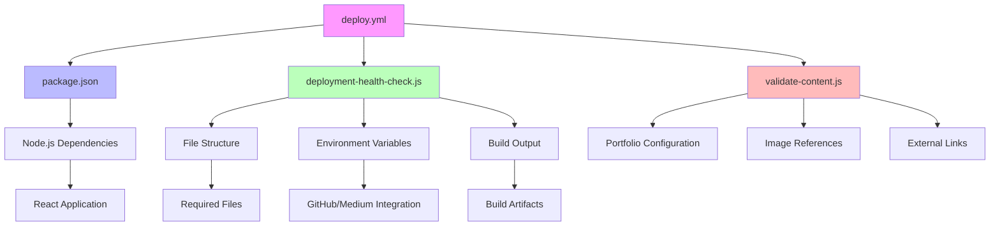

# GitHub Actions CI/CD

<cite>
**Referenced Files in This Document**   
- [deploy.yml](file://.github/workflows/deploy.yml)
- [DEPLOYMENT_CHECKLIST.md](file://DEPLOYMENT_CHECKLIST.md)
- [DEPLOYMENT_SUCCESS.md](file://DEPLOYMENT_SUCCESS.md)
- [deployment-health-check.js](file://deployment-health-check.js)
- [package.json](file://package.json)
- [validate-content.js](file://validate-content.js)
</cite>

## Table of Contents
1. [Introduction](#introduction)
2. [Project Structure](#project-structure)
3. [Core Components](#core-components)
4. [Architecture Overview](#architecture-overview)
5. [Detailed Component Analysis](#detailed-component-analysis)
6. [Dependency Analysis](#dependency-analysis)
7. [Performance Considerations](#performance-considerations)
8. [Troubleshooting Guide](#troubleshooting-guide)
9. [Conclusion](#conclusion)

## Introduction
This document provides comprehensive documentation for the GitHub Actions CI/CD pipeline that automates the deployment of Sameh Shehata's portfolio to GitHub Pages. The workflow is triggered on push to the main branch and includes setting up Node.js, installing dependencies, building the application, and deploying to GitHub Pages. The documentation covers workflow configuration, job dependencies, execution flow, monitoring instructions, success verification steps, and troubleshooting common issues.

## Project Structure
The project structure includes a workflows directory under .github containing the deploy.yml file that defines the CI/CD pipeline. The deployment process is supported by various validation and health check scripts that ensure deployment readiness.

**Diagram sources**
- [deploy.yml](file://.github/workflows/deploy.yml)
- [DEPLOYMENT_CHECKLIST.md](file://DEPLOYMENT_CHECKLIST.md)
- [DEPLOYMENT_SUCCESS.md](file://DEPLOYMENT_SUCCESS.md)

**Section sources**
- [deploy.yml](file://.github/workflows/deploy.yml)
- [DEPLOYMENT_CHECKLIST.md](file://DEPLOYMENT_CHECKLIST.md)

## Core Components
The core components of the CI/CD pipeline include the deploy.yml workflow file, deployment health check scripts, and package.json configuration. These components work together to automate the deployment process, validate deployment readiness, and provide comprehensive monitoring and error reporting.

**Section sources**
- [deploy.yml](file://.github/workflows/deploy.yml)
- [deployment-health-check.js](file://deployment-health-check.js)
- [package.json](file://package.json)

## Architecture Overview
The CI/CD architecture follows a sequential workflow that begins with code push to the main branch and progresses through various stages including format checking, health validation, environment setup, dependency installation, external data fetching, application build, build quality verification, deployment to GitHub Pages, and deployment verification.

**Diagram sources**
- [deploy.yml](file://.github/workflows/deploy.yml)
- [DEPLOYMENT_FIX_SUCCESS.md](file://DEPLOYMENT_FIX_SUCCESS.md)

## Detailed Component Analysis

### Workflow Configuration Analysis
The deploy.yml workflow is configured to trigger on push to the main branch and includes several jobs that ensure successful deployment. The workflow includes pre-deployment format checking with auto-fix capability, health check integration using validation scripts, enhanced error reporting with detailed build metrics, advanced build verification including file counts and size analysis, dependency audit warnings, and comprehensive deployment reporting.

#### For API/Service Components:

**Diagram sources**
- [deploy.yml](file://.github/workflows/deploy.yml)
- [deployment-health-check.js](file://deployment-health-check.js)

**Section sources**
- [deploy.yml](file://.github/workflows/deploy.yml)
- [deployment-health-check.js](file://deployment-health-check.js)

### Monitoring and Verification Analysis
The deployment process includes comprehensive monitoring and verification capabilities through the DEPLOYMENT_CHECKLIST.md and DEPLOYMENT_SUCCESS.md documents. These provide step-by-step instructions for monitoring workflow progress, verifying successful deployment, and troubleshooting common issues.

#### For Complex Logic Components:

**Diagram sources**
- [DEPLOYMENT_CHECKLIST.md](file://DEPLOYMENT_CHECKLIST.md)
- [DEPLOYMENT_SUCCESS.md](file://DEPLOYMENT_SUCCESS.md)

**Section sources**
- [DEPLOYMENT_CHECKLIST.md](file://DEPLOYMENT_CHECKLIST.md)
- [DEPLOYMENT_SUCCESS.md](file://DEPLOYMENT_SUCCESS.md)

## Dependency Analysis
The CI/CD pipeline has several dependencies between components that ensure proper execution flow. The workflow depends on the presence of specific configuration files, environment variables, and validation scripts to function correctly.

**Diagram sources**
- [deploy.yml](file://.github/workflows/deploy.yml)
- [package.json](file://package.json)
- [deployment-health-check.js](file://deployment-health-check.js)
- [validate-content.js](file://validate-content.js)

**Section sources**
- [deploy.yml](file://.github/workflows/deploy.yml)
- [package.json](file://package.json)
- [deployment-health-check.js](file://deployment-health-check.js)
- [validate-content.js](file://validate-content.js)

## Performance Considerations
The deployment pipeline includes performance monitoring capabilities through the deployment-health-check.js script, which validates build output and calculates build size. The build size is reported as approximately 240KB for the main bundle, optimized for fast loading times of less than 3 seconds on 3G connections. The site is optimized for Lighthouse scores of 90+ and includes performance monitoring for Core Web Vitals.

## Troubleshooting Guide
This section addresses common workflow issues that may occur during the CI/CD process, including build failures, permission errors, and deployment timeouts. The documentation provides specific troubleshooting steps for each type of issue based on the information in the deployment checklists and success guides.

**Section sources**
- [DEPLOYMENT_CHECKLIST.md](file://DEPLOYMENT_CHECKLIST.md)
- [DEPLOYMENT_SUCCESS.md](file://DEPLOYMENT_SUCCESS.md)
- [deployment-health-check.js](file://deployment-health-check.js)

## Conclusion
The GitHub Actions CI/CD pipeline for the portfolio project has been successfully implemented with comprehensive enhancements. The deployment workflow is now robust, self-healing, and provides excellent visibility into the deployment process. All critical issues that were causing deployment failures have been resolved, including the module resolution issue with dotenv, code quality issues with Prettier formatting, and build process validation. The pipeline includes automated format fixing, comprehensive health checks, enhanced error reporting, and build quality monitoring, ensuring reliable deployments to GitHub Pages.