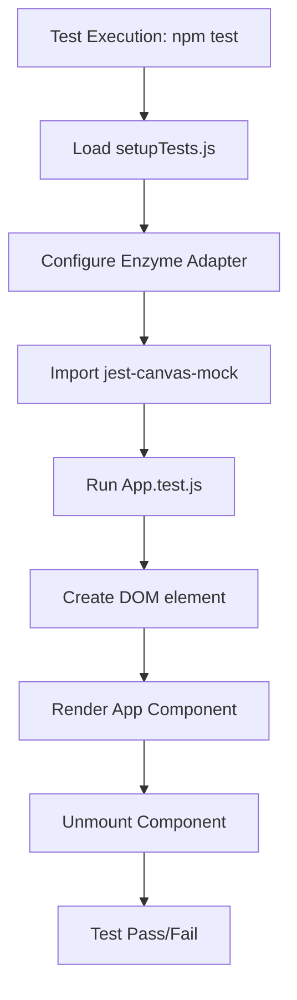
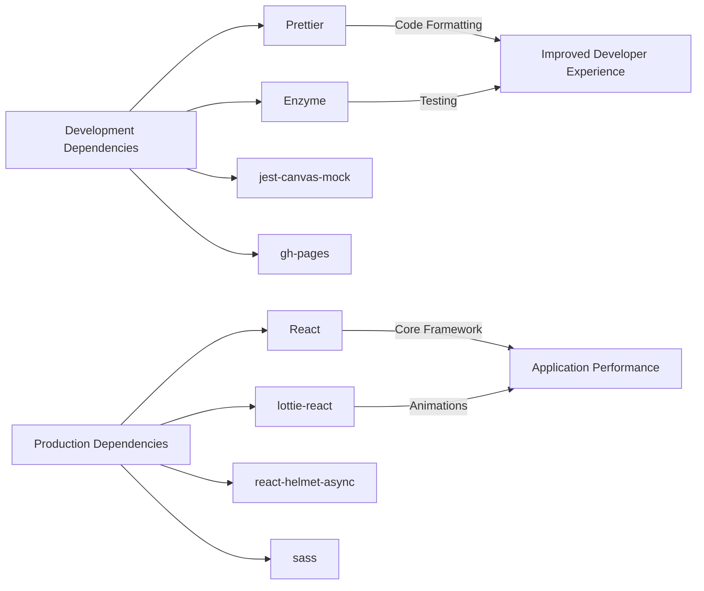

# Developer Guide

<cite>
**Referenced Files in This Document**   
- [README.md](file://README.md)
- [SETUP.md](file://SETUP.md)
- [package.json](file://package.json)
- [src/App.test.js](file://src/App.test.js)
- [src/setupTests.js](file://src/setupTests.js)
- [src/portfolio.js](file://src/portfolio.js)
- [.env.example](file://.env.example)
</cite>

## Table of Contents
1. [Introduction](#introduction)
2. [Prerequisites and Environment Setup](#prerequisites-and-environment-setup)
3. [Repository Cloning and Installation](#repository-cloning-and-installation)
4. [Running the Development Server](#running-the-development-server)
5. [Testing Strategy](#testing-strategy)
6. [Contribution Guidelines](#contribution-guidelines)
7. [Common Setup Issues and Troubleshooting](#common-setup-issues-and-troubleshooting)
8. [Performance Optimization Tips](#performance-optimization-tips)
9. [Conclusion](#conclusion)

## Introduction
This guide provides comprehensive instructions for setting up a local development environment for the Sameh Shehata portfolio project. It covers prerequisites, installation, testing, contribution workflows, and troubleshooting techniques. The portfolio is built with React.js and deployed via GitHub Pages with automated CI/CD pipelines.

## Prerequisites and Environment Setup

### Required Software
To develop and contribute to this project, you need the following tools installed:

- **Node.js**: Version 14 or higher (LTS recommended)
- **npm**: Node Package Manager (typically bundled with Node.js)
- **Git**: For version control and repository cloning
- **Code Editor**: VS Code recommended (with ESLint and Prettier extensions)

### Node.js and npm Installation
1. Download and install Node.js from [nodejs.org](https://nodejs.org/)
2. Verify installation:
```bash
node --version
npm --version
```
3. Update npm to the latest version:
```bash
npm install -g npm@latest
```

### Code Editor Configuration
For optimal development experience with VS Code:
1. Install recommended extensions:
   - ESLint
   - Prettier - Code formatter
   - GitLens
   - React Snippets
2. Enable format on save in VS Code settings
3. Configure editor to use project-specific Prettier settings

**Section sources**
- [package.json](file://package.json#L1-L78)
- [README.md](file://README.md#L1-L144)

## Repository Cloning and Installation

### Cloning the Repository
```bash
# Clone the repository
git clone https://github.com/samehshi/portfolio.git
cd portfolio
```

### Installing Dependencies
Install all project dependencies using npm:
```bash
npm install
```

The project uses the following key dependencies:
- **React 16.10.2**: Frontend framework
- **Sass**: CSS preprocessor
- **Lottie-react**: For animations
- **React-helmet-async**: For SEO management
- **gh-pages**: For GitHub Pages deployment

### Environment Configuration
1. Create a `.env` file by copying the example:
```bash
cp .env.example .env
```

2. Configure environment variables in `.env`:
```env
# GitHub Integration
REACT_APP_GITHUB_TOKEN=your_github_token
GITHUB_USERNAME=samehshi
USE_GITHUB_DATA=true

# Medium Integration
MEDIUM_USERNAME=sameh_shi

# Build Configuration
CI=false
```

**Section sources**
- [SETUP.md](file://SETUP.md#L1-L97)
- [.env.example](file://.env.example#L1-L24)
- [package.json](file://package.json#L1-L78)

## Running the Development Server

### Starting the Development Server
```bash
npm start
```

This command:
1. Executes `node fetch.js` to fetch external data
2. Starts the React development server using `react-scripts`
3. Opens the application at `http://localhost:3000`

### Development Server Features
- **Hot Module Replacement (HMR)**: Automatic browser refresh on code changes
- **Error Overlay**: Displays compilation errors in the browser
- **Linting**: Real-time code quality feedback
- **Source Maps**: Debuggable code in browser developer tools

### Available Scripts
The following npm scripts are available in `package.json`:

| Script | Command | Description |
|--------|---------|-------------|
| start | `npm start` | Starts development server |
| build | `npm run build` | Creates production build |
| deploy | `npm run deploy` | Deploys to GitHub Pages |
| test | `npm test` | Runs tests in watch mode |
| format | `npm run format` | Formats code with Prettier |
| check-format | `npm run check-format` | Checks code formatting |

**Section sources**
- [package.json](file://package.json#L1-L78)
- [README.md](file://README.md#L1-L144)

## Testing Strategy

### Test Framework
The project uses Jest as the test framework with Enzyme for React component testing.

### Test Configuration
Key test-related files:
- **src/setupTests.js**: Configures Enzyme adapter for React 16
- **src/App.test.js**: Contains basic rendering test
- **jest-canvas-mock**: Mocks canvas elements for testing

### Running Tests
```bash
# Run tests in watch mode
npm test

# Run tests once
npm test -- --watchAll=false

# Run tests with coverage
npm test -- --coverage
```

### Example Test (App.test.js)
The basic test verifies that the App component renders without crashing:
```javascript
it("renders without crashing", () => {
  const div = document.createElement("div");
  ReactDOM.render(<App />, div);
  ReactDOM.unmountComponentAtNode(div);
});
```

### Test Best Practices
1. Mock browser APIs like matchMedia
2. Use Enzyme for component shallow rendering
3. Test component rendering and basic interactions
4. Include setupTests.js for consistent test environment



**Diagram sources**
- [src/App.test.js](file://src/App.test.js#L1-L24)
- [src/setupTests.js](file://src/setupTests.js#L1-L6)

**Section sources**
- [src/App.test.js](file://src/App.test.js#L1-L24)
- [src/setupTests.js](file://src/setupTests.js#L1-L6)
- [package.json](file://package.json#L1-L78)

## Contribution Guidelines

### Code Style
The project enforces consistent code style through:
- **Prettier**: Code formatting
- **ESLint**: Code quality checks
- **Sass linting**: CSS style consistency

Format code before committing:
```bash
npm run format
```

Check formatting without modifying files:
```bash
npm run check-format
```

### Commit Message Convention
Use descriptive, imperative commit messages:
```
feat: add new project section
fix: resolve header responsiveness issue
docs: update contribution guidelines
style: format portfolio.js
refactor: improve animation performance
test: add unit tests for contact component
chore: update dependencies
```

### Pull Request Workflow
1. Fork the repository
2. Create a feature branch:
```bash
git checkout -b feature/descriptive-name
```
3. Make changes and commit with proper messages
4. Push to your fork:
```bash
git push origin feature/descriptive-name
```
5. Create a pull request to the main repository
6. Wait for review and address feedback
7. Merge after approval

### Customization Points
When contributing, consider these key customization files:
- **src/portfolio.js**: Main configuration file for personal information
- **src/_globalColor.scss**: Global color theme
- **public/index.html**: HTML template
- **src/components/**: Reusable UI components

**Section sources**
- [package.json](file://package.json#L1-L78)
- [src/portfolio.js](file://src/portfolio.js#L1-L605)
- [src/_globalColor.scss](file://src/_globalColor.scss#L1-L91)

## Common Setup Issues and Troubleshooting

### Node.js Version Issues
**Problem**: Incompatible Node.js version
**Solution**: Use Node.js 14+ LTS version
```bash
# Check current version
node --version

# Use nvm to manage versions
nvm install 18
nvm use 18
```

### Missing Dependencies
**Problem**: Module not found errors
**Solution**: Clear npm cache and reinstall
```bash
# Remove node_modules and package-lock.json
rm -rf node_modules package-lock.json

# Clear npm cache
npm cache clean --force

# Reinstall dependencies
npm install
```

### Environment Variables Not Loading
**Problem**: .env variables not recognized
**Solution**: Ensure proper .env file setup
1. Verify `.env` file exists in root directory
2. Check variable names start with `REACT_APP_`
3. Restart development server after changes

### Port Already in Use
**Problem**: EADDRINUSE error
**Solution**: Change port or terminate conflicting process
```bash
# Start on different port
PORT=3001 npm start

# Find and kill process using port 3000
lsof -i :3000
kill -9 <PID>
```

### GitHub API Rate Limiting
**Problem**: GitHub data not loading
**Solution**: Set up GitHub personal access token
1. Create token at https://github.com/settings/tokens
2. Include `public_repo` and `read:user` scopes
3. Add to `.env` file:
```env
REACT_APP_GITHUB_TOKEN=your_token_here
```

### Build Failures
**Problem**: npm run build fails
**Solution**: Check for syntax errors and missing dependencies
```bash
# Run linting
npm run check-format

# Clean and rebuild
rm -rf build
npm run build
```

**Section sources**
- [SETUP.md](file://SETUP.md#L1-L97)
- [.env.example](file://.env.example#L1-L24)
- [README.md](file://README.md#L1-L144)

## Performance Optimization Tips

### Development Workflow Optimization
1. **Selective Importing**: Only import needed components
2. **Code Splitting**: Use React.lazy for heavy components
3. **Memoization**: Use React.memo for expensive components
4. **Avoid Inline Functions**: Define functions outside render

### Fast Refresh Tips
1. Keep component state minimal during development
2. Use smaller test datasets when possible
3. Disable animations during development if they impact performance
4. Use React DevTools to identify re-renders

### Dependency Management


**Diagram sources**
- [package.json](file://package.json#L1-L78)

**Section sources**
- [package.json](file://package.json#L1-L78)
- [README.md](file://README.md#L1-L144)

## Conclusion
This guide provides a complete overview of setting up and contributing to the Sameh Shehata portfolio project. By following these instructions, developers can quickly establish a local development environment, run tests, and contribute effectively to the project. The React-based architecture with GitHub Pages deployment offers a robust foundation for a professional portfolio website with automated CI/CD workflows.