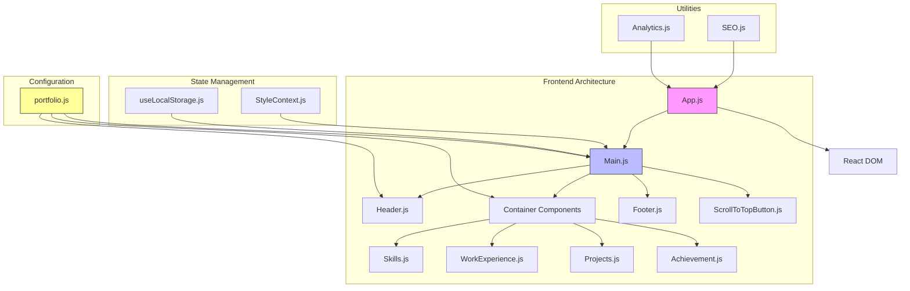
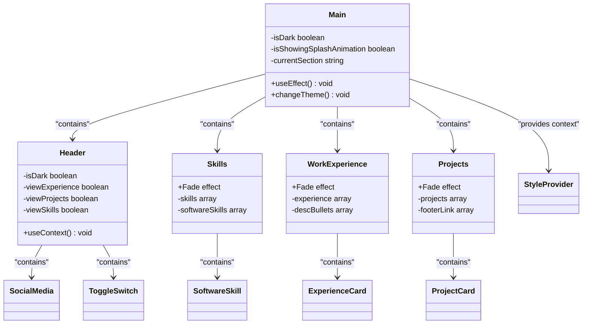

# Project Overview

<cite>
**Referenced Files in This Document**   
- [portfolio.js](file://src/portfolio.js)
- [App.js](file://src/App.js)
- [Main.js](file://src/containers/Main.js)
- [Header.js](file://src/components/header/Header.js)
- [StyleContext.js](file://src/contexts/StyleContext.js)
- [SEO.js](file://src/components/SEO/SEO.js)
- [useLocalStorage.js](file://src/hooks/useLocalStorage.js)
- [skillProgress.js](file://src/containers/skillProgress/skillProgress.js)
</cite>

## Table of Contents
1. [Introduction](#introduction)
2. [Core Features](#core-features)
3. [Architecture Overview](#architecture-overview)
4. [Configuration-Driven Content](#configuration-driven-content)
5. [Component Structure](#component-structure)
6. [Theme and State Management](#theme-and-state-management)
7. [SEO and Analytics](#seo-and-analytics)
8. [Customization and Deployment](#customization-and-deployment)

## Introduction

The portfolio application serves as a professional showcase for Sameh Shehata Abdelaziz, an experienced Data Scientist and Business Intelligence (BI) Analyst with over 15 years of expertise in transforming complex datasets into actionable business insights. This React-based single-page application (SPA) is designed to highlight key professional attributes including project accomplishments, technical skills, work experience, educational background, and certifications. The application provides visitors with a comprehensive view of the individual's capabilities in advanced analytics, AI/ML, and business intelligence solutions that drive organizational success through data-driven decision making.

Built with modern web technologies, the portfolio offers an interactive and visually engaging experience while maintaining excellent performance and search engine visibility. The design emphasizes clarity and professionalism, allowing the content to take center stage. The application supports both light and dark themes, automatically adapting to user preferences while providing a manual toggle option for user convenience.

**Section sources**
- [portfolio.js](file://src/portfolio.js#L32-L40)
- [README.md](file://README.md#L1-L20)

## Core Features

The portfolio application delivers several key features that effectively present the professional profile of a data scientist and BI analyst. The **Project Presentation** section showcases 12 featured data science projects across diverse domains including finance, real estate, aviation, and environmental analysis. Each project includes descriptive information, relevant images, and direct links to view complete implementations on platforms like Kaggle and Google Drive.

The **Skills Display** functionality highlights technical expertise through multiple complementary approaches. The application presents a categorized list of skills in data science, business intelligence, and cloud computing, while also visualizing proficiency levels through progress bars that indicate expertise in Data Science & Analytics (95%), Business Intelligence & Visualization (90%), and AI/ML & Cloud Computing (85%).

The **Experience Timeline** provides a chronological overview of professional roles, currently featuring positions as a Freelance Data Scientist & BI Analyst at Upwork and Independent Clients (2020–Present) and Data Services Officer at NANSC, Cairo (2009–Present). Each role includes detailed descriptions of responsibilities and quantifiable achievements, such as developing automated ETL/ELT workflows that reduced processing times by 30-40% and building predictive models that increased client ROI by up to 25%.

The **Contact Functionality** enables visitors to connect through multiple channels, including email, LinkedIn, GitHub, and Medium. The contact section prominently displays the email address samehshihata@gmail.com and phone number +201274766641, while also providing direct links to professional social media profiles. Additionally, the application includes sections for achievements and certifications from industry leaders like Google, Microsoft, IBM, and WorldQuant University, further establishing professional credibility.

**Section sources**
- [portfolio.js](file://src/portfolio.js#L135-L593)
- [README.md](file://README.md#L21-L80)

## Architecture Overview

**Diagram sources**
- [App.js](file://src/App.js#L1-L101)
- [Main.js](file://src/containers/Main.js#L1-L137)
- [portfolio.js](file://src/portfolio.js#L1-L594)

**Section sources**
- [App.js](file://src/App.js#L1-L101)
- [Main.js](file://src/containers/Main.js#L1-L137)

## Configuration-Driven Content

The portfolio application employs a configuration-driven architecture centered around the `portfolio.js` file, which serves as the single source of truth for all content displayed in the application. This design pattern separates content from presentation logic, enabling easy customization without modifying component code. The configuration file exports multiple objects that define different sections of the portfolio, including `greeting`, `skillsSection`, `workExperiences`, `bigProjects`, and `achievementSection`.

Each configuration object follows a consistent structure with a `display` property that controls section visibility, allowing for flexible content management. For example, setting `display: false` in the `blogSection` object completely hides the blogs section from the rendered application. The configuration also supports rich content through the use of the `emoji` utility for adding visual elements and `require()` statements for importing image assets.

Content is structured in a hierarchical format that mirrors the application's component structure. Project data is organized within the `bigProjects.projects` array, with each project containing properties for `image`, `projectName`, `projectDesc`, and `footerLink`. This array-based structure enables the dynamic rendering of project cards through mapping operations in the `Projects` container component. Similarly, skills are defined in the `skillsSection.softwareSkills` array, with each skill specifying a `skillName` and corresponding Font Awesome classname for icon display.

**Section sources**
- [portfolio.js](file://src/portfolio.js#L1-L594)
- [Main.js](file://src/containers/Main.js#L25-L133)

## Component Structure

The application follows a clear component hierarchy with distinct separation between containers and presentational components. **Container components** located in the `src/containers` directory manage data flow and business logic, importing configuration data from `portfolio.js` and passing it as props to child components. Examples include `Skills.js`, `WorkExperience.js`, and `Projects.js`, which each correspond to major sections of the portfolio.

**Presentational components** in the `src/components` directory focus on UI rendering and visual presentation. These components are typically smaller and more reusable, such as `Button.js`, `SocialMedia.js`, and `DisplayLottie.js`. The `Header.js` component exemplifies this pattern by consuming the `isDark` context value to conditionally apply CSS classes while using configuration data from `portfolio.js` to determine which navigation links to display based on section visibility settings.

The component structure follows React best practices with functional components and hooks. The `Main.js` component serves as the primary container, orchestrating the overall layout and rendering sequence of all major sections. It uses React's `useEffect` hook to implement analytics tracking for section visibility through the Intersection Observer API, demonstrating how behavioral logic is encapsulated within container components while maintaining clean separation from presentation.

**Diagram sources**
- [Main.js](file://src/containers/Main.js#L25-L133)
- [Header.js](file://src/components/header/Header.js#L16-L91)
- [portfolio.js](file://src/portfolio.js#L32-L40)

**Section sources**
- [Main.js](file://src/containers/Main.js#L1-L137)
- [Header.js](file://src/components/header/Header.js#L1-L94)
- [skillProgress.js](file://src/containers/skillProgress/skillProgress.js#L1-L46)

## Theme and State Management

The portfolio implements a robust theme management system using React's Context API through the `StyleContext.js` file. This context provides both the current theme state (`isDark`) and a function to toggle between light and dark modes (`changeTheme`). The `Main.js` component serves as the context provider, initializing the theme state by checking both the user's system preference via `window.matchMedia("(prefers-color-scheme: dark)")` and persisted user preferences stored in localStorage using the custom `useLocalStorage` hook.

The theme state is consumed by multiple components throughout the application. The `Header.js` component uses `useContext(StyleContext)` to determine which CSS classes to apply, rendering either "dark-menu header" or "header" based on the current theme. Similarly, individual container components conditionally apply theme-specific classes to ensure visual consistency across the application. The theme toggle functionality is implemented through the `ToggleSwitch` component, which calls the `changeTheme` function when interacted with, triggering a re-render of all context-consuming components.

State persistence is handled by the `useLocalStorage` custom hook, which wraps the `useState` hook with localStorage synchronization logic. This hook automatically saves the theme preference to localStorage whenever it changes and retrieves the stored value on initial load, ensuring that user preferences persist across sessions. The hook includes error handling to gracefully manage cases where localStorage access might be restricted or unavailable.

**Section sources**
- [StyleContext.js](file://src/contexts/StyleContext.js#L1-L9)
- [Main.js](file://src/containers/Main.js#L25-L133)
- [useLocalStorage.js](file://src/hooks/useLocalStorage.js#L1-L36)

## SEO and Analytics

The portfolio application incorporates comprehensive SEO and analytics capabilities to enhance discoverability and provide insights into user engagement. The `SEO.js` component leverages the `react-helmet-async` library to manage document head elements, implementing a configuration system that defines metadata for different sections of the application through the `seoConfigs` object. This includes title tags, meta descriptions, keywords, Open Graph tags for social sharing, and Twitter Card metadata.

The SEO implementation follows best practices with proper canonical URLs, robots meta tags, and structured data in JSON-LD format. Each section of the portfolio has predefined SEO configurations with optimized titles and descriptions, such as the home page configuration that emphasizes key skills in Python, R, Power BI, AI/ML, and cloud analytics. The component also includes regional metadata specifying Egypt as the geographic location and English as the primary language.

Analytics tracking is implemented in the `App.js` file, initializing Google Analytics 4 and tracking various user interactions. The application monitors page views, engagement time, session milestones at 30 seconds, 1 minute, 2 minutes, and 5 minutes, and section visibility through the Intersection Observer API. Additional tracking includes error monitoring for both caught exceptions and unhandled promise rejections, as well as performance metrics for page load times. The analytics system also tracks