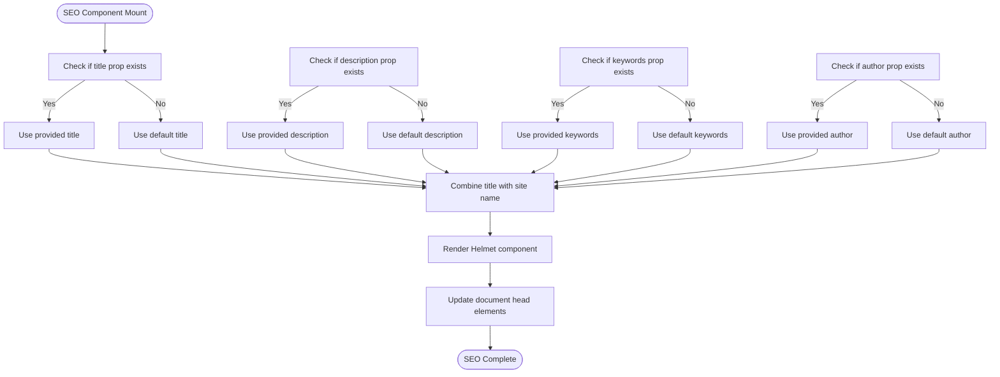
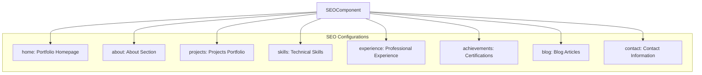
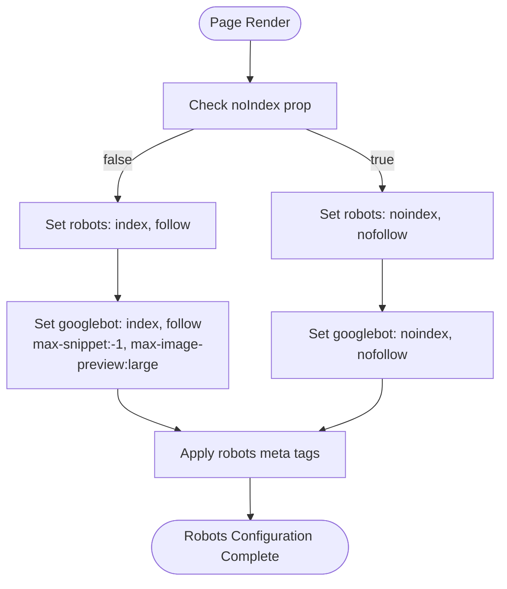
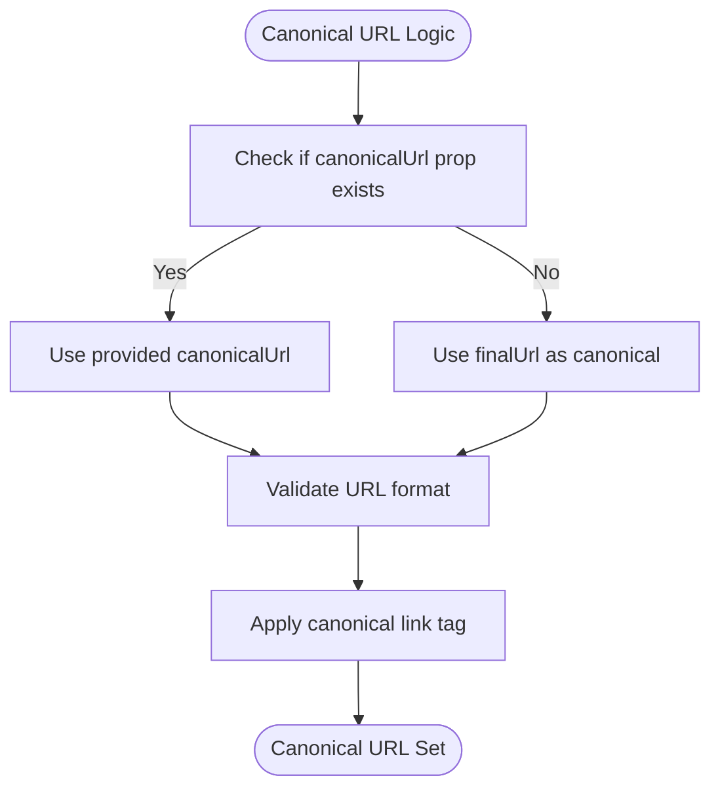
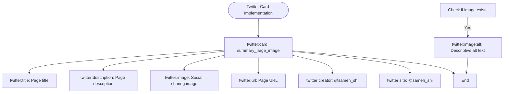
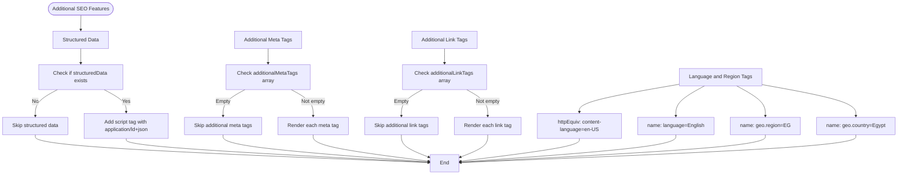
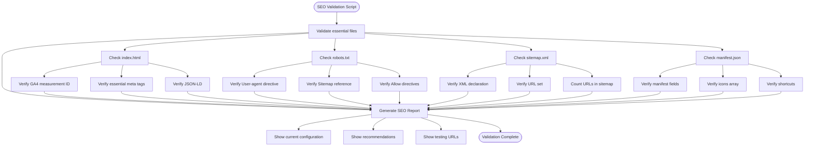

# Meta Tags Management

<cite>
**Referenced Files in This Document**   
- [SEO.js](file://src/components/SEO/SEO.js)
- [portfolio.js](file://src/portfolio.js)
- [robots.txt](file://public/robots.txt)
- [sitemap.xml](file://public/sitemap.xml)
- [validate-seo.js](file://validate-seo.js)
</cite>

## Table of Contents
1. [Introduction](#introduction)
2. [Core SEO Component Implementation](#core-seo-component-implementation)
3. [Dynamic Meta Tags with react-helmet-async](#dynamic-meta-tags-with-react-helmet-async)
4. [Section-Specific SEO Configurations](#section-specific-seo-configurations)
5. [Robots Meta Tags and Indexing Control](#robots-meta-tags-and-indexing-control)
6. [Canonical URL Management](#canonical-url-management)
7. [Open Graph Tags for Social Sharing](#open-graph-tags-for-social-sharing)
8. [Twitter Cards Implementation](#twitter-cards-implementation)
9. [Structured Data and Additional Meta Tags](#structured-data-and-additional-meta-tags)
10. [SEO Validation and Troubleshooting](#seo-validation-and-troubleshooting)
11. [Performance Considerations](#performance-considerations)
12. [Conclusion](#conclusion)

## Introduction
This document provides comprehensive documentation on the meta tags implementation in Sameh Shehata Abdelaziz's portfolio website. It details how the SEO component leverages react-helmet-async to manage dynamic title, description, keywords, author, robots, canonical URLs, Open Graph tags, and Twitter Cards. The implementation includes section-specific configurations, fallback defaults, and validation mechanisms to ensure optimal search engine visibility and social media sharing performance.

## Core SEO Component Implementation

The SEO component is implemented as a reusable React component that manages all meta tags dynamically based on the current page context. It uses react-helmet-async to ensure proper server-side rendering support and efficient client-side updates.

```mermaid
classDiagram
class SEO {
+string title
+string description
+string keywords
+string author
+string type
+string image
+string url
+boolean noIndex
+string canonicalUrl
+object structuredData
+array additionalMetaTags
+array additionalLinkTags
+Helmet render()
}
class seoConfigs {
+object home
+object about
+object projects
+object skills
+object experience
+object achievements
+object blog
+object contact
}
SEO --> seoConfigs : "uses"
SEO --> "react-helmet-async" : "depends on"
```

**Diagram sources**
- [SEO.js](file://src/components/SEO/SEO.js#L4-L167)

**Section sources**
- [SEO.js](file://src/components/SEO/SEO.js#L4-L167)

## Dynamic Meta Tags with react-helmet-async

The SEO component utilizes react-helmet-async to manage document head elements dynamically. This approach allows for server-side rendering compatibility and prevents race conditions that can occur with the original react-helmet package.

The component accepts various props for meta tags with fallback mechanisms to default values when specific values are not provided:



**Diagram sources**
- [SEO.js](file://src/components/SEO/SEO.js#L35-L71)

**Section sources**
- [SEO.js](file://src/components/SEO/SEO.js#L35-L71)

## Section-Specific SEO Configurations

The portfolio implements predefined SEO configurations for different sections through the `seoConfigs` object, which provides optimized meta tags for each major section of the website.



Each configuration includes tailored title, description, keywords, and type values specific to the content of that section. For example, the about section uses a "profile" type while other sections use "website" type.

**Diagram sources**
- [SEO.js](file://src/components/SEO/SEO.js#L190-L262)

**Section sources**
- [SEO.js](file://src/components/SEO/SEO.js#L190-L262)

## Robots Meta Tags and Indexing Control

The SEO component implements comprehensive robots meta tags to control search engine indexing behavior with flexible configuration options.



The implementation includes both general robots directives and Googlebot-specific directives with enhanced parameters for snippet length, image preview size, and video preview settings. This ensures optimal indexing behavior across different search engines while providing Google with detailed crawling instructions.

**Diagram sources**
- [SEO.js](file://src/components/SEO/SEO.js#L55-L65)

**Section sources**
- [SEO.js](file://src/components/SEO/SEO.js#L55-L65)

## Canonical URL Management

The SEO component handles canonical URL management to prevent duplicate content issues and consolidate page ranking signals.



The canonical URL defaults to the page URL if no specific canonical URL is provided. This implementation helps search engines understand the preferred version of a page, especially important for single-page applications with client-side routing.

**Diagram sources**
- [SEO.js](file://src/components/SEO/SEO.js#L67-L69)

**Section sources**
- [SEO.js](file://src/components/SEO/SEO.js#L67-L69)

## Open Graph Tags for Social Sharing

The portfolio implements comprehensive Open Graph tags to optimize content presentation when shared on social media platforms, particularly Facebook.

```mermaid
flowchart TD
Start([Open Graph Implementation]) --> BasicOG["Basic OG Tags"]
BasicOG --> OGType["og:type: website/article/profile"]
BasicOG --> OGTitle["og:title: Page title"]
BasicOG --> OGDescription["og:description: Page description"]
BasicOG --> OGImage["og:image: Social sharing image"]
BasicOG --> OGUrl["og:url: Page URL"]
BasicOG --> OGSiteName["og:site_name: Portfolio name"]
BasicOG --> OGLocale["og:locale: en_US"]
CheckImage["Check if image exists"] --> |Yes| OGImageDetails["Add image details"]
OGImageDetails --> OGImageWidth["og:image:width: 1200"]
OGImageDetails --> OGImageHeight["og:image:height: 630"]
OGImageDetails --> OGImageAlt["og:image:alt: Descriptive alt text"]
CheckType["Check if type is article"] --> |Yes| ArticleOG["Add article-specific tags"]
ArticleOG --> ArticlePublished["article:published_time"]
ArticleOG --> ArticleModified["article:modified_time"]
ArticleOG --> ArticleAuthor["article:author"]
ArticleOG --> ArticleSection["article:section"]
ArticleOG --> ArticleTags["article:tag (multiple)"]
BasicOG --> End
OGImageDetails --> End
ArticleOG --> End
```



The Open Graph implementation includes proper image dimensions (1200x630 pixels) for optimal social media previews and supports article-specific metadata for blog content. The og:image:alt tag provides accessibility information for screen readers.

**Diagram sources**
- [SEO.js](file://src/components/SEO/SEO.js#L71-L116)

**Section sources**
- [SEO.js](file://src/components/SEO/SEO.js#L71-L116)

## Twitter Cards Implementation

The portfolio includes Twitter Card meta tags to control how content appears when shared on Twitter, using the summary_large_image card format for enhanced visual presentation.



The implementation uses the summary_large_image format, which displays a large featured image alongside the title and description, maximizing visual impact in Twitter feeds. The component also includes both twitter:creator and twitter:site tags pointing to the same @sameh_shi handle for consistent attribution.

**Diagram sources**
- [SEO.js](file://src/components/SEO/SEO.js#L118-L134)

**Section sources**
- [SEO.js](file://src/components/SEO/SEO.js#L118-L134)

## Structured Data and Additional Meta Tags

The SEO component supports structured data through JSON-LD format and allows for additional meta and link tags to extend functionality.



The implementation includes language and region metadata to specify content language (en-US) and geographic targeting (Egypt). The component also includes mobile web app capabilities tags for progressive web app functionality.

**Diagram sources**
- [SEO.js](file://src/components/SEO/SEO.js#L136-L167)

**Section sources**
- [SEO.js](file://src/components/SEO/SEO.js#L136-L167)

## SEO Validation and Troubleshooting

The portfolio includes a comprehensive SEO validation script (`validate-seo.js`) to verify the correctness of SEO implementation and identify potential issues.



Common issues and troubleshooting steps:

1. **Missing Meta Tags**: Use browser developer tools to inspect the page source and verify that expected meta tags are present in the `<head>` section.

2. **Incorrect Social Sharing Previews**: Test using platform-specific debuggers:
   - Facebook Sharing Debugger: https://developers.facebook.com/tools/debug/
   - Twitter Card Validator: https://cards-dev.twitter.com/validator
   - Google Rich Results Test: https://search.google.com/test/rich-results

3.