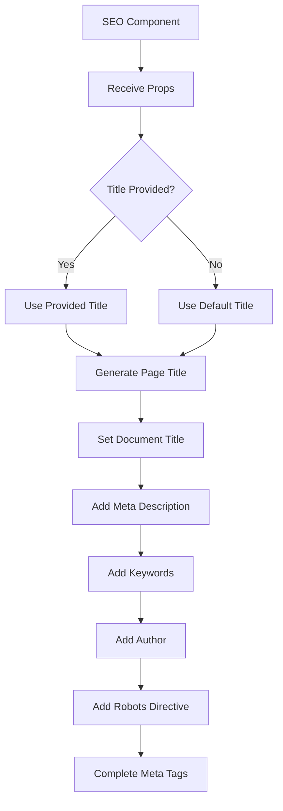
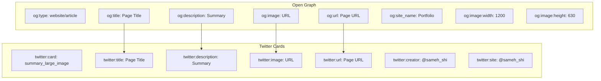
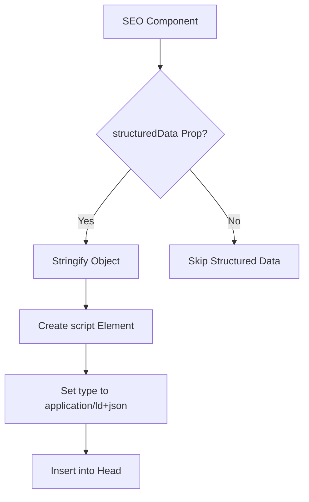
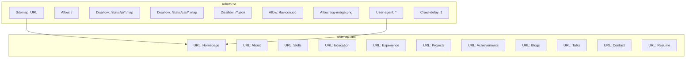
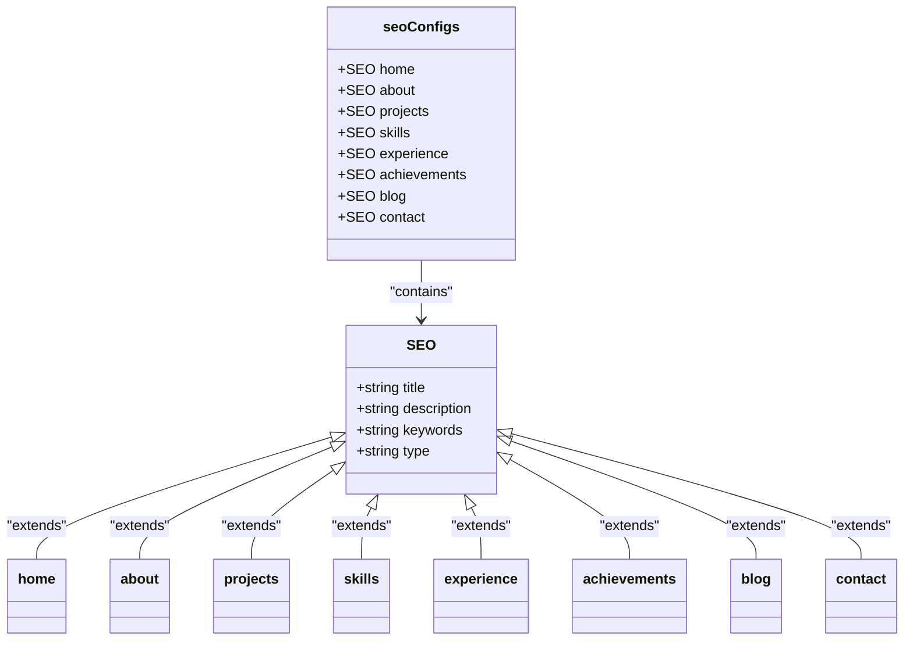

# SEO Optimization

<cite>
**Referenced Files in This Document**   
- [SEO.js](file://src/components/SEO/SEO.js)
- [robots.txt](file://public/robots.txt)
- [sitemap.xml](file://public/sitemap.xml)
- [validate-seo.js](file://validate-seo.js)
- [Main.js](file://src/containers/Main.js)
</cite>

## Table of Contents
1. [Introduction](#introduction)
2. [Dynamic Meta Tags Management](#dynamic-meta-tags-management)
3. [Open Graph and Twitter Cards](#open-graph-and-twitter-cards)
4. [Structured Data Implementation](#structured-data-implementation)
5. [Sitemap and Robots Configuration](#sitemap-and-robots-configuration)
6. [Page-Specific Metadata Generation](#page-specific-metadata-generation)
7. [Performance Considerations](#performance-considerations)
8. [Troubleshooting Common SEO Issues](#troubleshooting-common-seo-issues)
9. [Validation and Monitoring](#validation-and-monitoring)
10. [Conclusion](#conclusion)

## Introduction

The portfolio implements a comprehensive SEO strategy to maximize visibility and engagement across search engines and social platforms. The architecture centers around a dynamic SEO component that manages metadata generation, supported by configuration files and validation tools. This document details the implementation of SEO best practices, focusing on the integration of react-helmet-async for dynamic meta tags, structured data for rich snippets, and configuration files that guide search engine behavior.

**Section sources**
- [SEO.js](file://src/components/SEO/SEO.js#L1-L234)
- [robots.txt](file://public/robots.txt#L1-L75)
- [sitemap.xml](file://public/sitemap.xml#L1-L142)

## Dynamic Meta Tags Management

The SEO implementation leverages `react-helmet-async` to manage dynamic meta tags that adapt to different pages and content types. The `SEO` component serves as the central mechanism for generating appropriate metadata based on route and content context.

The component accepts various props to customize metadata for specific pages, including title, description, keywords, author, and image. It implements a fallback system where default values are used when specific values are not provided, ensuring consistent metadata across the site. The component also manages the robots meta tag, allowing control over indexing behavior through the `noIndex` prop.



**Diagram sources**
- [SEO.js](file://src/components/SEO/SEO.js#L4-L68)

**Section sources**
- [SEO.js](file://src/components/SEO/SEO.js#L1-L234)

## Open Graph and Twitter Cards

The portfolio implements comprehensive social media metadata to ensure optimal presentation when links are shared on platforms like Facebook, Twitter, and LinkedIn. The SEO component includes dedicated sections for Open Graph and Twitter Card metadata.

For Open Graph, the implementation includes essential properties such as `og:type`, `og:title`, `og:description`, `og:image`, `og:url`, and `og:site_name`. The image metadata includes specific dimensions (1200x630) and alt text to enhance accessibility and platform compatibility. For articles, additional properties like `article:published_time`, `article:modified_time`, and `article:author` are included when applicable.

Twitter Card implementation follows the `summary_large_image` format, which displays a large featured image alongside the title and description. The implementation includes the Twitter handle `@sameh_shi` in both the `twitter:creator` and `twitter:site` fields to establish authorship and site association.



**Diagram sources**
- [SEO.js](file://src/components/SEO/SEO.js#L90-L120)

**Section sources**
- [SEO.js](file://src/components/SEO/SEO.js#L1-L234)

## Structured Data Implementation

The portfolio implements structured data using JSON-LD format to enable rich snippets in search engine results. The SEO component includes a `structuredData` prop that accepts an object to be serialized and injected into the page as a script tag with type `application/ld+json`.

This implementation allows for the definition of schema.org types such as Person, Organization, or Article, depending on the page content. The structured data enhances search engine understanding of the content, potentially leading to enhanced search result displays with additional information like ratings, publication dates, or author information.

The component conditionally renders the structured data script only when the `structuredData` prop is provided, preventing unnecessary markup on pages where structured data is not applicable. This approach maintains clean HTML while providing rich semantic information where needed.



**Diagram sources**
- [SEO.js](file://src/components/SEO/SEO.js#L145-L152)

**Section sources**
- [SEO.js](file://src/components/SEO/SEO.js#L1-L234)

## Sitemap and Robots Configuration

The portfolio includes both a sitemap.xml and robots.txt file in the public directory to guide search engine crawlers and improve indexing efficiency.

The `robots.txt` file implements a comprehensive crawling policy that allows all user agents to access the site while disallowing access to development artifacts like source maps and JSON files. It specifically allows access to important media files such as the Open Graph image, favicon, and touch icons. The file also specifies the sitemap location and includes crawl-delay directives to ensure polite crawling behavior. Notably, it blocks aggressive SEO crawlers like SemrushBot and AhrefsBot while allowing major search engines and social media crawlers.

The `sitemap.xml` file provides a complete map of the portfolio's content, including the homepage and all major sections (about, skills, education, experience, projects, achievements, blogs, talks, and contact). Each URL entry includes metadata about last modification date, change frequency, and priority to help search engines prioritize crawling. The sitemap also includes the resume/CV file, ensuring important downloadable content is indexed.



**Diagram sources**
- [robots.txt](file://public/robots.txt#L1-L75)
- [sitemap.xml](file://public/sitemap.xml#L1-L142)

**Section sources**
- [robots.txt](file://public/robots.txt#L1-L75)
- [sitemap.xml](file://public/sitemap.xml#L1-L142)

## Page-Specific Metadata Generation

The portfolio implements a systematic approach to page-specific metadata generation through predefined configuration objects. The `seoConfigs` export in the SEO component provides tailored metadata for different sections of the portfolio, ensuring each page has optimized, context-appropriate metadata.

The configuration includes eight predefined sets: home, about, projects, skills, experience, achievements, blog, and contact. Each configuration includes a unique title, description, keywords, and content type. For example, the "about" configuration emphasizes professional experience and expertise, while the "projects" configuration highlights data science and business intelligence projects.

In the main application component, the home configuration is applied globally, as the portfolio is a single-page application with section-based navigation rather than discrete pages. This approach ensures consistent metadata while allowing for potential expansion to multi-page routing in the future.



**Diagram sources**
- [SEO.js](file://src/components/SEO/SEO.js#L175-L231)
- [Main.js](file://src/containers/Main.js#L50-L51)

**Section sources**
- [SEO.js](file://src/components/SEO/SEO.js#L154-L231)
- [Main.js](file://src/containers/Main.js#L1-L136)

## Performance Considerations

The SEO implementation considers performance implications for critical rendering and indexing. The use of `react-helmet-async` ensures that metadata is managed efficiently without blocking the main thread, as it defers updates to the document head until after React has rendered.

The component minimizes re-renders by only updating the document head when metadata changes, leveraging React's reconciliation process. The implementation avoids unnecessary DOM manipulations by batching all metadata updates through the Helmet component.

For indexing performance, the sitemap.xml file includes change frequency and priority hints to help search engines optimize their crawling schedule. The robots.txt file implements crawl-delay directives to prevent overwhelming the server with requests while still allowing timely indexing.

The structured data implementation uses conditional rendering to include JSON-LD only when needed, reducing page weight for pages that don't require rich snippets. This selective approach balances SEO benefits with performance considerations.

**Section sources**
- [SEO.js](file://src/components/SEO/SEO.js#L1-L234)
- [robots.txt](file://public/robots.txt#L1-L75)
- [sitemap.xml](file://public/sitemap.xml#L1-L142)

## Troubleshooting Common SEO Issues

Common SEO issues in the portfolio typically involve missing meta tags, incorrect structured data, or configuration problems. The validation script `validate-seo.js` provides comprehensive checks for these issues.

For missing meta tags, verify that the SEO component is properly imported and rendered in the component hierarchy. Ensure that required props are passed correctly and that fallback values are appropriate. Check that `react-helmet-async` is properly installed and that there are no conflicts with other helmet implementations.

For structured data issues, validate that the JSON-LD object conforms to schema.org specifications and that it's properly formatted. Use Google's Rich Results Test to identify specific validation errors. Ensure that the structured data reflects the actual page content to avoid penalties for misleading markup.

Configuration issues often stem from incorrect environment variables or build process problems. Verify that the GA4 measurement ID is correctly configured and that the build process preserves SEO elements. Check that the sitemap.xml and robots.txt files are properly deployed to the public directory.

```mermaid
flowchart TD
    A[SEO Issue] --> B{Missing Meta Tags?}
    B -->|Yes| C[Check SEO Component Import]
    C --> D[Verify Props and Fallbacks]
    D --> E[Confirm react-helmet-async]
    
    B -->|No| F{Structured Data Issue?}
    F -->|Yes| G[Validate JSON-LD Format]
    G -->