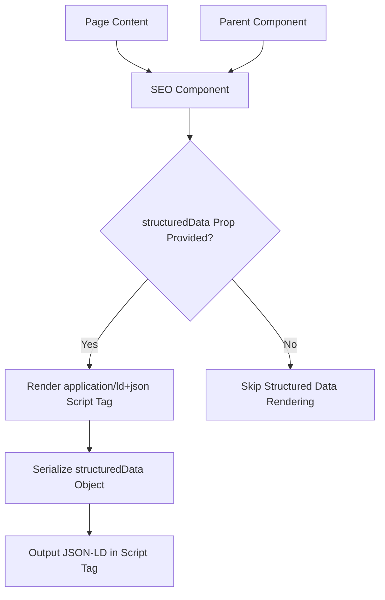
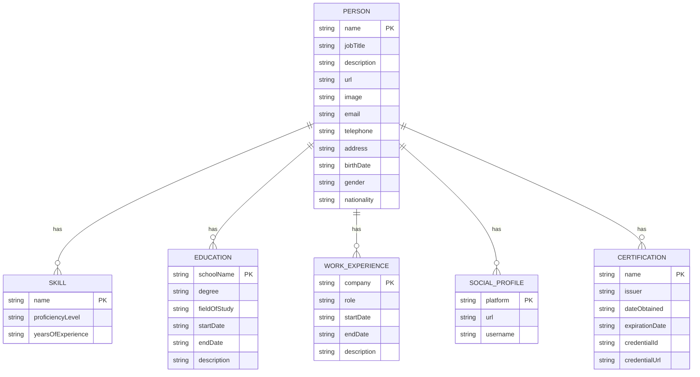
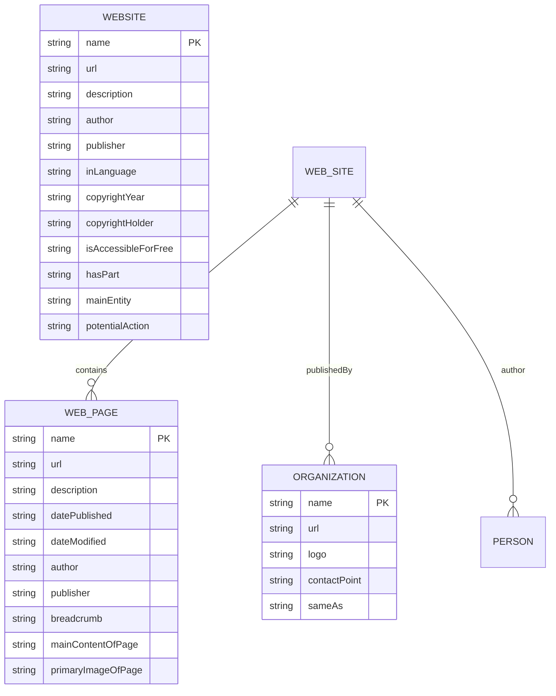

# Structured Data Implementation

<cite>
**Referenced Files in This Document**   
- [SEO.js](file://src/components/SEO/SEO.js)
- [portfolio.js](file://src/portfolio.js)
- [SEO_ANALYTICS_README.md](file://SEO_ANALYTICS_README.md)
</cite>

## Table of Contents
1. [Introduction](#introduction)
2. [SEO Component Architecture](#seo-component-architecture)
3. [Person Schema Implementation](#person-schema-implementation)
4. [Website Schema Implementation](#website-schema-implementation)
5. [Structured Data Integration](#structured-data-integration)
6. [Validation and Testing](#validation-and-testing)
7. [Performance Considerations](#performance-considerations)
8. [Troubleshooting Guide](#troubleshooting-guide)

## Introduction

The portfolio website implements comprehensive JSON-LD structured data to enhance search engine visibility and enable rich snippets in search results. The implementation focuses on two primary Schema.org types: Person and Website, which provide search engines with detailed information about the site owner and the website itself. This structured data is conditionally rendered through the SEO component, which dynamically generates application/ld+json script tags based on the provided structuredData prop. The implementation follows best practices for SEO, ensuring that search engines can properly index the content and display enhanced results with rich snippets that include the author's professional information, skills, education, and social profiles.

**Section sources**
- [SEO_ANALYTICS_README.md](file://SEO_ANALYTICS_README.md#L69-L84)

## SEO Component Architecture

The SEO component serves as the central mechanism for managing all metadata and structured data across the portfolio website. Built using React and react-helmet-async, this component conditionally renders application/ld+json script tags when structured data is provided as a prop. The component accepts various parameters including title, description, keywords, author, image, URL, and crucially, structuredData, which is expected to be a JavaScript object containing the JSON-LD data.

The component implements a fallback system where default values are used if specific props are not provided, ensuring consistent metadata across all pages. The structured data rendering is wrapped in a conditional check that only outputs the script tag when structuredData is present, preventing invalid JSON-LD from being rendered when no structured data is available.



**Diagram sources**
- [SEO.js](file://src/components/SEO/SEO.js#L136-L167)

**Section sources**
- [SEO.js](file://src/components/SEO/SEO.js#L0-L33)

## Person Schema Implementation

The Person schema implementation provides comprehensive information about Sameh Shehata Abdelaziz, including professional details, skills, education, and social profiles. The schema captures key professional attributes such as name, job title, professional expertise, and contact information. The implementation includes detailed information about technical skills in data science, business intelligence, AI/ML, and cloud analytics, reflecting the individual's expertise in Python, R, Power BI, Tableau, and various cloud platforms.

The education section includes information about the B.Sc. in Chemistry and Microbiology from Ain Shams University, with details about the duration (2004-2008) and relevant coursework in scientific research methodology, analytical chemistry, and statistical analysis. Professional experience is documented with two primary roles: Freelance Data Scientist & BI Analyst (2020-Present) at Upwork & Independent Clients, and Data Services Officer - Aeronautical Navigation (2009-Present) at NANSC (National Air Navigation Services Company), Cairo.

Social profiles are included through the socialMediaLinks configuration, which contains links to GitHub, LinkedIn, Gmail, and Medium accounts. The schema also incorporates professional achievements and certifications from Google, Microsoft, IBM, and other organizations, including the Data Analytics Professional Certificate, Power BI Data Analyst Associate (PL-300), and Fabric Analytics Engineer Associate (DP-600) certifications.



**Diagram sources**
- [portfolio.js](file://src/portfolio.js#L0-L603)
- [SEO_ANALYTICS_README.md](file://SEO_ANALYTICS_README.md#L69-L84)

**Section sources**
- [portfolio.js](file://src/portfolio.js#L0-L603)

## Website Schema Implementation

The Website schema implementation provides metadata about the portfolio website itself, including site metadata, author information, and language settings. The schema defines the website's name, URL, description, and other relevant properties that help search engines understand the nature and purpose of the site. The implementation includes language settings with content-language set to "en-US" and language set to "English", indicating that the primary language of the website is American English.

Geographic information is included with geo.region set to "EG" (Egypt) and geo.country set to "Egypt", indicating the geographic focus of the website. The site metadata includes the site name "Sameh Shehata Portfolio" and the default URL "https://samehshi.github.io/portfolio/". The implementation also includes Open Graph and Twitter Card metadata to optimize social sharing, with og:locale set to "en_US" and appropriate Twitter card settings.

The Website schema is designed to work in conjunction with the Person schema, creating a comprehensive representation of both the website and its author. This dual-schema approach enhances the website's visibility in search results and enables rich snippets that display both the website information and the author's professional details.



**Diagram sources**
- [SEO.js](file://src/components/SEO/SEO.js#L35-L71)
- [SEO_ANALYTICS_README.md](file://SEO_ANALYTICS_README.md#L69-L84)

**Section sources**
- [SEO.js](file://src/components/SEO/SEO.js#L35-L71)

## Structured Data Integration

Structured data is integrated throughout the portfolio website by passing the structuredData prop to the SEO component from various parent components. The integration follows a consistent pattern where each page or section of the website generates appropriate JSON-LD data based on its content and passes it to the SEO component for rendering.

The structured data is constructed from the configuration in portfolio.js, which contains all the necessary information for both the Person and Website schemas. This centralized configuration approach ensures consistency across the website and makes it easy to update the structured data when changes are needed. The SEO component then takes this structured data object and serializes it into a JSON string within the application/ld+json script tag.

The integration process involves mapping the data from portfolio.js to the appropriate Schema.org properties, ensuring that all required and recommended fields are included. For example, the person's name, job title, and contact information are mapped to the corresponding Person schema properties, while the website's name, URL, and description are mapped to the Website schema properties.

```mermaid
flowchart LR
A[portfolio.js Configuration] --> B[Data Mapping]
B --> C[Structured Data Object]
C --> D[SEO Component]
D --> E{structuredData Prop?}
E --> |Yes| F[JSON.stringify(structuredData)]
F --> G[Render script type="application/ld+json"]
G --> H[Browser/Googlebot]
E --> |No| I[No Structured Data Rendered]
```

**Diagram sources**
- [SEO.js](file://src/components/SEO/SEO.js#L136-L167)
- [portfolio.js](file://src/portfolio.js#L0-L603)

**Section sources**
- [SEO.js](file://src/components/SEO/SEO.js#L136-L167)
- [portfolio.js](file://src/portfolio.js#L0-L603)

## Validation and Testing

Validation of the structured data implementation is critical to ensure that search engines can properly parse and display the information. The website includes a validation script (validate-seo.js) that checks for the presence of structured data in the built files and verifies that the JSON-LD is correctly formatted. This script confirms that the application/ld+json script tag is present in the index.html file and that it contains valid JSON data.

For comprehensive validation, Google's Rich Results Test tool should be used to verify that the structured data is correctly implemented and that rich snippets will be displayed in search results. This tool can identify issues such as invalid JSON-LD syntax, missing required fields, or incorrect property values. Common issues to check include proper JSON formatting, correct use of Schema.org properties, and ensuring that all required fields are present.

Additional validation tools include the Facebook Sharing Debugger and Twitter Card Validator, which can be used to verify that the Open Graph and Twitter Card metadata are correctly implemented. These tools help ensure that the website displays properly when shared on social media platforms.

The validation process should also include checking for common issues such as:
- Invalid JSON-LD syntax (missing commas, incorrect