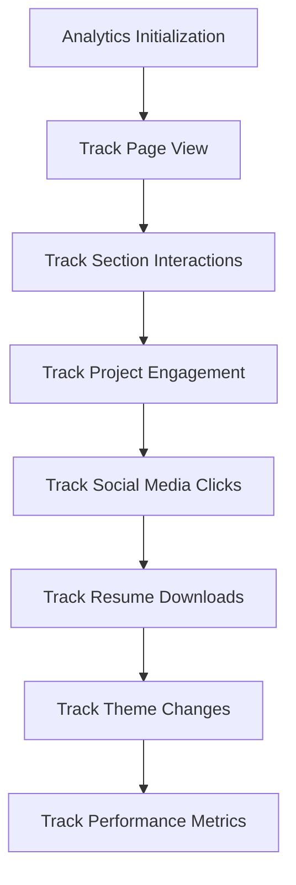
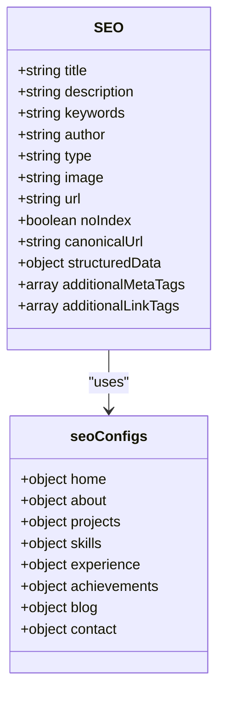
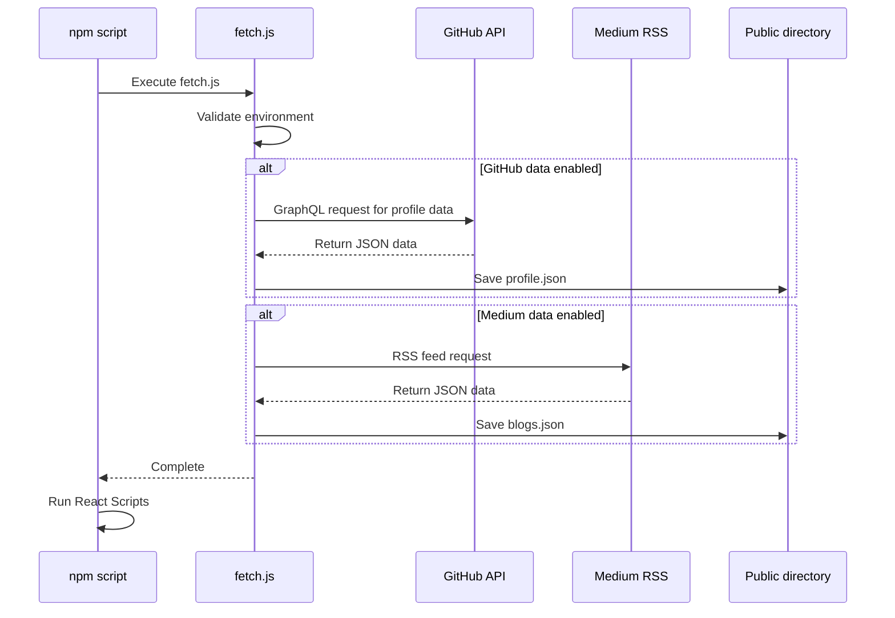

# Technology Stack & Dependencies

<cite>
**Referenced Files in This Document**   
- [package.json](file://package.json)
- [fetch.js](file://fetch.js)
- [src/utils/analytics.js](file://src/utils/analytics.js)
- [src/components/SEO/SEO.js](file://src/components/SEO/SEO.js)
- [src/App.js](file://src/App.js)
- [src/components/displayLottie/DisplayLottie.js](file://src/components/displayLottie/DisplayLottie.js)
- [README.md](file://README.md)
- [SETUP.md](file://SETUP.md)
- [SEO_ANALYTICS_README.md](file://SEO_ANALYTICS_README.md)
</cite>

## Table of Contents
1. [Frontend Technology Stack](#frontend-technology-stack)
2. [Core Dependencies](#core-dependencies)
3. [Development Dependencies](#development-dependencies)
4. [Package Scripts & Build Process](#package-scripts--build-process)
5. [Version Compatibility & Installation](#version-compatibility--installation)
6. [Integration & Configuration](#integration--configuration)

## Frontend Technology Stack

The portfolio application leverages a modern React-based frontend architecture with specialized tools for styling, animations, and SEO optimization. The core technology stack is designed to deliver a responsive, visually engaging, and search-engine-friendly experience for visitors.

### React 16.10.2
The application is built on React 16.10.2, a stable version that provides the foundation for component-based UI development. React enables the creation of reusable UI components that efficiently update and render when data changes. The version 16.10.2 was selected for its balance of feature completeness and stability, ensuring compatibility with the supporting ecosystem of libraries.

### Sass for Styling
Sass (Syntactically Awesome Style Sheets) is implemented through the `sass` package (version 1.32.8) to enhance CSS authoring capabilities. Sass provides features like variables, nesting, mixins, and functions that streamline the styling process. The application uses `.scss` files throughout the component structure, allowing for modular and maintainable stylesheets. Global color variables are defined in `_globalColor.scss` to ensure consistent theming across the application.

### Lottie Animations
Lottie animations are integrated using the `lottie-react` library (version 2.4.0) to create engaging visual elements. The `DisplayLottie` component wraps the Lottie player with React Suspense for lazy loading, ensuring smooth performance. This implementation allows for lightweight, scalable animations that enhance user experience without significant performance overhead. The component handles animation data as a prop, making it reusable across different parts of the application.

**Section sources**
- [package.json](file://package.json#L25-L26)
- [src/components/displayLottie/DisplayLottie.js](file://src/components/displayLottie/DisplayLottie.js#L1-L24)
- [src/_globalColor.scss](file://src/_globalColor.scss)

## Core Dependencies

The application relies on several key dependencies that provide essential functionality for analytics, SEO, deployment, and user experience.

### react-ga4 for Google Analytics 4
The `react-ga4` library (version 2.1.0) enables integration with Google Analytics 4, the latest version of Google's analytics platform. This dependency is configured to initialize GA4 only in production mode, respecting user privacy during development. The analytics system tracks various user interactions including page views, section visibility, project engagement, social media clicks, resume downloads, and theme toggling.

The implementation includes a comprehensive event tracking system defined in `analytics.js`, with specific event categories for engagement, navigation, UI interactions, and conversions. This granular tracking provides insights into user behavior and portfolio effectiveness.



**Diagram sources**
- [package.json](file://package.json#L25-L26)
- [src/utils/analytics.js](file://src/utils/analytics.js#L1-L289)

### react-helmet-async for SEO
The `react-helmet-async` library (version 2.0.5) manages document head elements for SEO optimization. This dependency enables dynamic management of meta tags, titles, and other head elements that are critical for search engine visibility and social media sharing.

The SEO implementation includes:
- Dynamic title and description generation with site name suffixing
- Open Graph meta tags for Facebook and other social platforms
- Twitter Card implementation for enhanced tweet previews
- Canonical URL management to prevent duplicate content issues
- Structured data (JSON-LD) for rich snippets in search results
- Robots meta tags for search engine crawling directives

The SEO component provides predefined configurations for different sections of the portfolio (home, about, projects, skills, etc.), ensuring consistent and optimized metadata across all pages.



**Diagram sources**
- [package.json](file://package.json#L25-L26)
- [src/components/SEO/SEO.js](file://src/components/SEO/SEO.js#L1-L235)

### gh-pages for Deployment
The `gh-pages` library (version 6.3.0) facilitates deployment to GitHub Pages, providing a streamlined process for publishing the portfolio. This dependency works in conjunction with npm scripts to automate the build and deployment workflow. The deployment process creates a `gh-pages` branch containing the production build, which GitHub Pages serves as a static website.

**Section sources**
- [package.json](file://package.json#L25-L26)
- [src/utils/analytics.js](file://src/utils/analytics.js#L1-L289)
- [src/components/SEO/SEO.js](file://src/components/SEO/SEO.js#L1-L235)

## Development Dependencies

The development environment is enhanced with tools that improve code quality, consistency, and developer experience.

### Prettier for Code Formatting
Prettier (version 2.3.1) is configured as a development dependency to enforce consistent code style across the codebase. The tool automatically formats JavaScript, CSS, JSON, and SCSS files according to predefined rules. Two npm scripts are provided for formatting operations:
- `format`: Applies formatting to all relevant files
- `check-format`: Validates formatting without making changes

This ensures that all code contributions maintain a consistent style, reducing code review time and improving readability.

### dotenv for Environment Variables
The `dotenv` package (version 8.2.0) enables environment variable management through `.env` files. This dependency allows sensitive information like API tokens and configuration settings to be kept out of the codebase while providing easy configuration for different environments. The application uses environment variables for:
- GitHub API token for data fetching
- Google Analytics 4 measurement ID
- Feature flags for optional integrations
- Deployment configuration

**Section sources**
- [package.json](file://package.json#L70-L77)
- [fetch.js](file://fetch.js#L3-L255)

## Package Scripts & Build Process

The application's build and deployment workflow is orchestrated through npm scripts defined in `package.json`, with a custom `fetch.js` script integrated into the process.

### Script Integration
The `start` and `build` scripts both execute `node fetch.js` before running the corresponding React Scripts command. This ensures that external data from GitHub and Medium is fetched and saved to JSON files before the React application is compiled or served.

```json
"scripts": {
  "start": "node fetch.js && react-scripts start",
  "build": "node fetch.js && react-scripts build",
  "deploy": "gh-pages -b gh-pages -d build"
}
```

### fetch.js Functionality
The `fetch.js` script performs several critical functions:
1. **Environment Validation**: Checks for required environment variables before proceeding
2. **GitHub Data Fetching**: Retrieves user profile and repository data via GitHub's GraphQL API
3. **Medium Data Fetching**: Retrieves blog posts via RSS-to-JSON conversion
4. **Error Handling**: Implements retry logic with exponential backoff for API requests
5. **File Writing**: Saves fetched data to JSON files in the public directory

The script uses the GitHub token for authentication and fetches pinned repositories, profile information, and other details that populate the portfolio dynamically. This approach decouples content from code, allowing the portfolio to automatically reflect the user's current GitHub activity.



**Diagram sources**
- [package.json](file://package.json#L50-L60)
- [fetch.js](file://fetch.js#L1-L255)

**Section sources**
- [package.json](file://package.json#L50-L60)
- [fetch.js](file://fetch.js#L1-L255)

## Version Compatibility & Installation

The dependency versions are carefully selected for compatibility and stability within the React ecosystem.

### Version Considerations
- **React 16.10.2**: Compatible with React Scripts 5.0.0 and supporting libraries
- **react-scripts 5.0.0**: Provides build tools and development server with modern features
- **lottie-react 2.4.0**: Compatible with React 16+ and provides TypeScript support
- **react-helmet-async 2.0.5**: Successor to react-helmet with improved server-side rendering
- **react-ga4 2.1.0**: Modern implementation for Google Analytics 4

### Installation Procedure
To install the dependencies, run:
```bash
npm install
```

This command reads the `package.json` file and installs all dependencies listed in both `dependencies` and `devDependencies`. The installation process will:
1. Create a `node_modules` directory
2. Install all packages and their dependencies
3. Generate or update `package-lock.json` for reproducible builds

For deployment, the `gh-pages` package must be available, which is included as a production dependency rather than a dev dependency to ensure it's available in the deployment environment.

**Section sources**
- [package.json](file://package.json#L1-L78)

## Integration & Configuration

The various dependencies are integrated through a cohesive configuration system that enables customization while maintaining security.

### Environment Configuration
The application uses a `.env` file for configuration, with a template available in the repository. Key environment variables include:
- `REACT_APP_GA4_MEASUREMENT_ID`: Google Analytics 4 measurement ID
- `REACT_APP_GITHUB_TOKEN`: GitHub personal access token
- `GITHUB_USERNAME`: GitHub username for data fetching
- `MEDIUM_USERNAME`: Medium username for blog integration
- `USE_GITHUB_DATA`: Feature flag to enable/disable GitHub integration
- `USE_MEDIUM_DATA`: Feature flag to enable/disable Medium integration

### Analytics Configuration
Google Analytics 4 is configured with privacy-conscious settings:
- IP anonymization
- Disabling of Google signals and ad personalization
- Manual page view tracking (rather than automatic)
- Cookie flags for SameSite and Secure attributes

The analytics initialization checks for production environment and valid measurement ID before activating tracking, ensuring that development activity is not recorded.

### SEO Configuration
The SEO system provides both global defaults and section-specific configurations. Each section of the portfolio can override default metadata values while inheriting sensible defaults for properties like site name, social handles, and image dimensions.

**Section sources**
- [package.json](file://package.json#L1-L78)
- [fetch.js](file://fetch.js#L1-L255)
- [src/utils/analytics.js](file://src/utils/analytics.js#L1-L289)
- [src/components/SEO/SEO.js](file://src/components/SEO/SEO.js#L1-L235)
- [README.md](file://README.md#L1-L144)
- [SETUP.md](file://SETUP.md#L1-L97)
- [SEO_ANALYTICS_README.md](file://SEO_ANALYTICS_README.md#L1-L378)