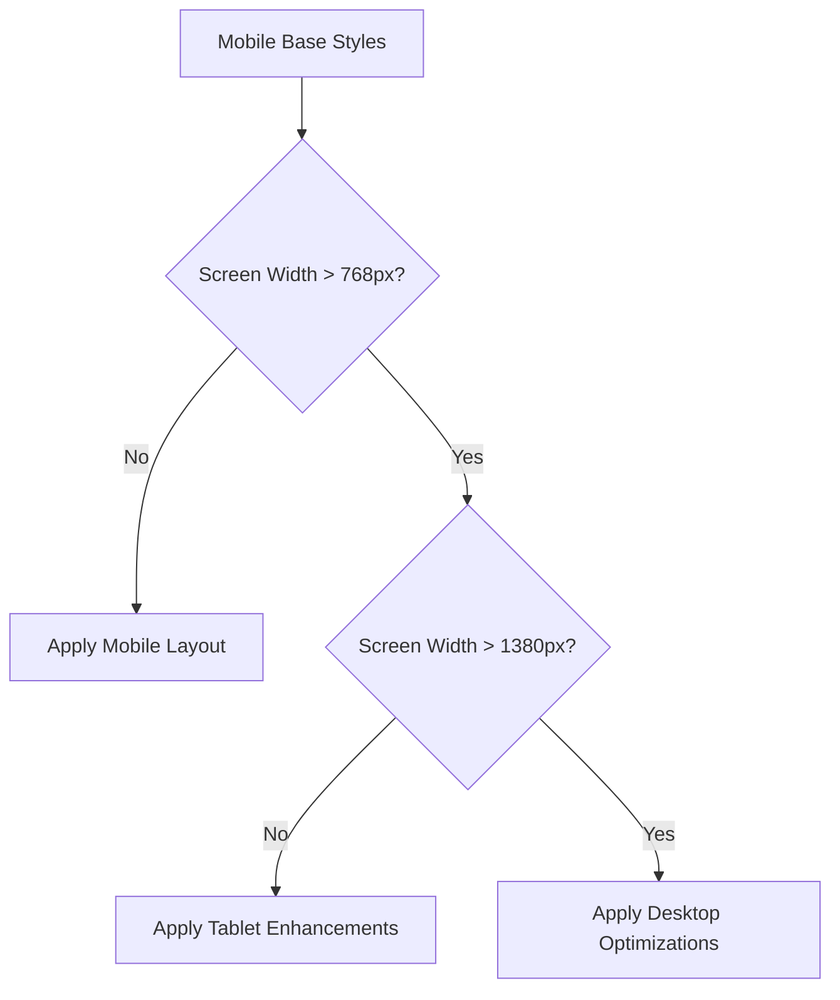
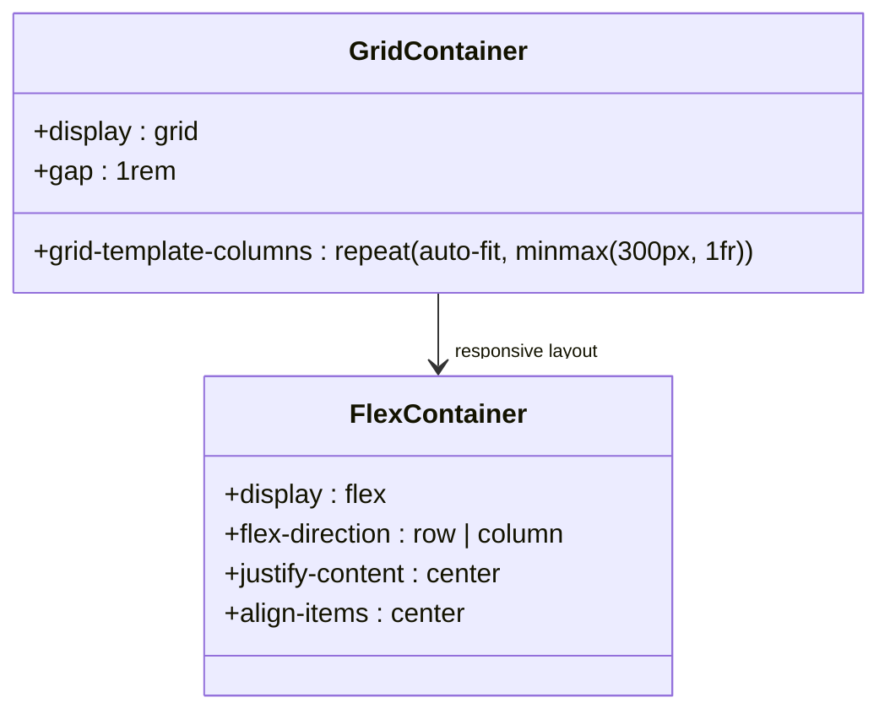
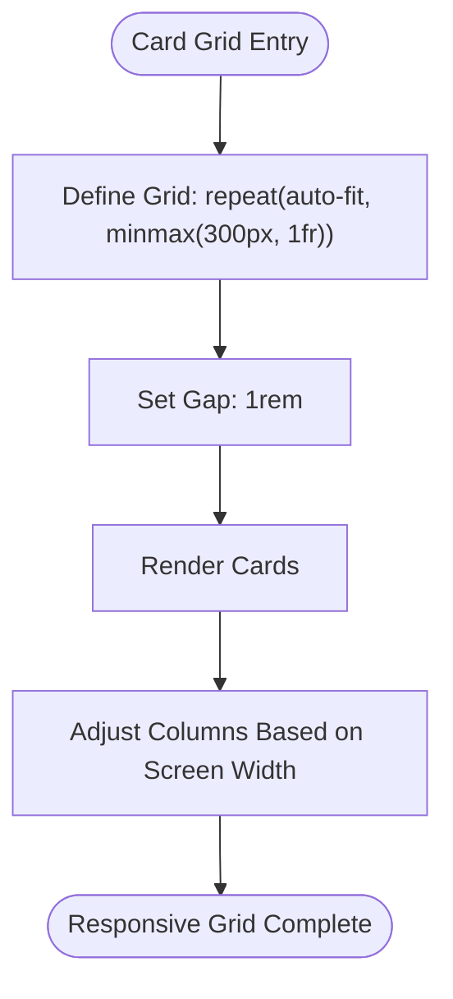
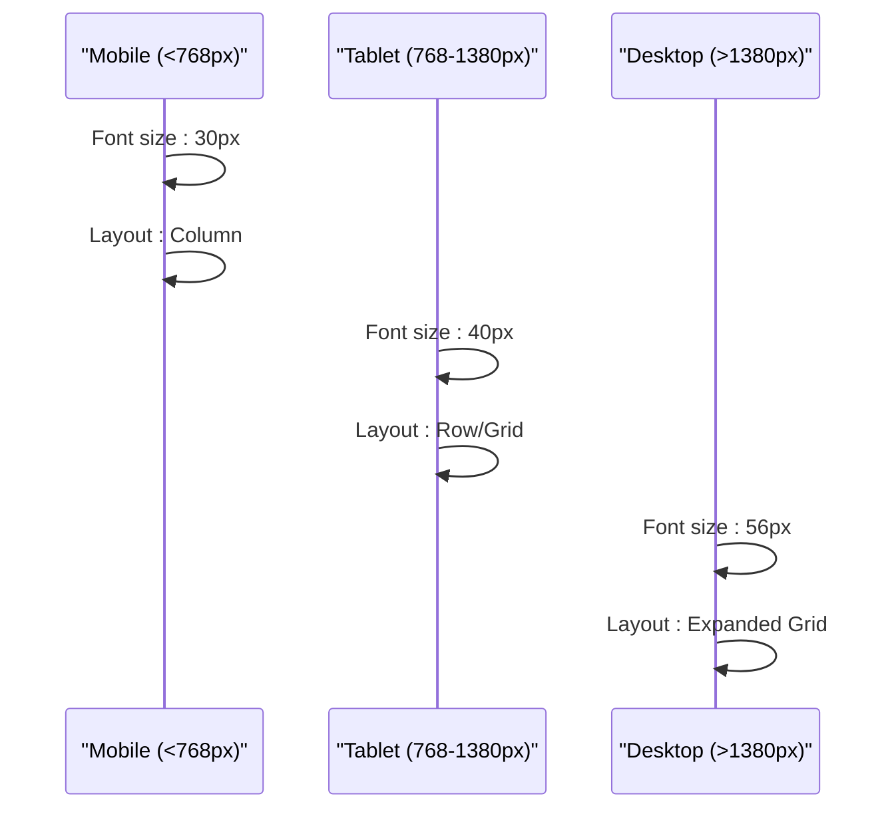

# Responsive Design Implementation

<cite>
**Referenced Files in This Document**   
- [App.scss](file://src/App.scss)
- [_globalColor.scss](file://src/_globalColor.scss)
- [ExperienceCard.scss](file://src/components/experienceCard/ExperienceCard.scss)
- [SoftwareSkill.scss](file://src/components/softwareSkills/SoftwareSkill.scss)
- [AchievementCard.scss](file://src/components/achievementCard/AchievementCard.scss)
- [BlogCard.scss](file://src/components/blogCard/BlogCard.scss)
- [Header.scss](file://src/components/header/Header.scss)
- [Footer.scss](file://src/components/footer/Footer.scss)
- [WorkExperience.scss](file://src/containers/workExperience/WorkExperience.scss)
- [Skills.scss](file://src/containers/skills/Skills.scss)
- [Project.scss](file://src/containers/projects/Project.scss)
- [Achievement.scss](file://src/containers/achievement/Achievement.scss)
</cite>

## Table of Contents
1. [Introduction](#introduction)
2. [Mobile-First Approach and Breakpoint Strategy](#mobile-first-approach-and-breakpoint-strategy)
3. [Flexbox and CSS Grid Layouts](#flexbox-and-css-grid-layouts)
4. [Responsive Behavior of Key Components](#responsive-behavior-of-key-components)
5. [Media Queries and Fluid Typography](#media-queries-and-fluid-typography)
6. [Touch Interface and Viewport Considerations](#touch-interface-and-viewport-considerations)
7. [Testing and Debugging Responsiveness](#testing-and-debugging-responsiveness)
8. [Performance and Conditional Rendering](#performance-and-conditional-rendering)
9. [Conclusion](#conclusion)

## Introduction
This document details the responsive design principles and implementation patterns used throughout the portfolio application. The design system prioritizes accessibility, adaptability, and performance across a wide range of devices and screen sizes. A mobile-first approach is employed, with progressive enhancement through targeted media queries and modern CSS layout techniques such as Flexbox and CSS Grid. The styling architecture leverages SCSS for maintainability and scalability, with global variables defined in `_globalColor.scss` ensuring consistent theming across components.

**Section sources**
- [App.scss](file://src/App.scss#L1-L31)
- [_globalColor.scss](file://src/_globalColor.scss#L1-L91)

## Mobile-First Approach and Breakpoint Strategy
The portfolio follows a mobile-first design philosophy, where base styles are optimized for mobile devices and enhanced for larger screens using media queries. This ensures optimal performance and usability on lower-powered devices and slower networks. The breakpoint strategy centers around three primary thresholds: mobile (up to 768px), tablet (768px–1380px), and desktop (above 1380px). These breakpoints are consistently applied across components to maintain visual harmony.

Key breakpoints are defined using `max-width` queries, allowing styles to cascade appropriately. For example, typography scales down on smaller screens to improve readability and layout efficiency. The consistent use of relative units (rem, em, %, vmin) ensures fluid adaptation to different viewport dimensions.

**Diagram sources**
- [Skills.scss](file://src/containers/skills/Skills.scss#L45-L64)
- [Project.scss](file://src/containers/projects/Project.scss#L25-L32)
- [WorkExperience.scss](file://src/containers/workExperience/WorkExperience.scss#L30-L37)

**Section sources**
- [Skills.scss](file://src/containers/skills/Skills.scss#L45-L64)
- [Project.scss](file://src/containers/projects/Project.scss#L25-L32)
- [WorkExperience.scss](file://src/containers/workExperience/WorkExperience.scss#L30-L37)

## Flexbox and CSS Grid Layouts
The layout system combines Flexbox and CSS Grid to create adaptive, responsive interfaces. Flexbox is used for one-dimensional layouts such as navigation bars, headers, footers, and component alignment. CSS Grid is employed for two-dimensional layouts, particularly in component grids like project cards, skill displays, and blog listings.

Grid containers use `repeat(auto-fit, minmax())` syntax to create flexible, responsive grids that automatically adjust column count based on available space. For example, the `repo-cards-div-main` class creates a grid that ensures each card has a minimum width of 300px while filling available space dynamically.

Flexbox is used extensively in container components such as `skills-main-div`, which switches from a row layout on desktop to a column layout on mobile screens, reordering content for optimal mobile viewing.

**Diagram sources**
- [AchievementCard.scss](file://src/components/achievementCard/AchievementCard.scss#L65-L70)
- [Skills.scss](file://src/containers/skills/Skills.scss#L55-L64)
- [Project.scss](file://src/containers/projects/Project.scss#L20-L23)

**Section sources**
- [AchievementCard.scss](file://src/components/achievementCard/AchievementCard.scss#L65-L70)
- [Skills.scss](file://src/containers/skills/Skills.scss#L55-L64)
- [Project.scss](file://src/containers/projects/Project.scss#L20-L23)

## Responsive Behavior of Key Components
### Project Cards and Achievement Displays
Project and achievement cards use CSS Grid with `auto-fit` to create responsive card layouts that adapt to screen size. The `achievement-cards-div` class defines a grid that maintains card integrity while adjusting column count. Cards have fixed minimum widths (300px) but expand to fill available space, ensuring consistent spacing and alignment.

**Diagram sources**
- [AchievementCard.scss](file://src/components/achievementCard/AchievementCard.scss#L65-L70)
- [Project.scss](file://src/containers/projects/Project.scss#L20-L23)

### Experience Timelines
The experience timeline uses a combination of Flexbox and CSS Grid. The container (`experience-cards-div`) uses a responsive grid layout with a minimum card width of 290px. Individual experience cards use Flexbox for internal alignment, with media queries adjusting font sizes and image dimensions at different breakpoints to maintain readability and visual balance.

**Section sources**
- [WorkExperience.scss](file://src/containers/workExperience/WorkExperience.scss#L1-L10)
- [ExperienceCard.scss](file://src/components/experienceCard/ExperienceCard.scss#L120-L156)

### Skill Displays
The skill display component uses Flexbox for layout, switching from a horizontal layout on desktop to a vertical stack on mobile. The `software-skill-inline` class creates inline skill items with consistent spacing, while media queries ensure appropriate sizing and wrapping behavior. Icons are sized using `rem` units for scalability.

**Section sources**
- [SoftwareSkill.scss](file://src/components/softwareSkills/SoftwareSkill.scss#L1-L32)
- [Skills.scss](file://src/containers/skills/Skills.scss#L55-L64)

## Media Queries and Fluid Typography
Media queries are strategically used to adjust layout, typography, and spacing at key breakpoints. The primary breakpoints are 768px and 1380px, with additional fine-tuning for intermediate ranges in components like the blog card hover effect.

Typography scales responsively using media queries that reduce font sizes on smaller screens. Headings such as `.experience-heading`, `.skills-heading`, and `.project-title` all have three size definitions: default (desktop), 1380px breakpoint, and 768px breakpoint. This ensures readability while maintaining visual hierarchy.

The blog card component demonstrates sophisticated media query usage with multiple ranges targeting specific device categories, including tablets and larger desktops, to fine-tune the hover animation scale effect based on available screen real estate.

**Diagram sources**
- [WorkExperience.scss](file://src/containers/workExperience/WorkExperience.scss#L30-L37)
- [Skills.scss](file://src/containers/skills/Skills.scss#L45-L64)
- [Project.scss](file://src/containers/projects/Project.scss#L25-L32)

**Section sources**
- [WorkExperience.scss](file://src/containers/workExperience/WorkExperience.scss#L30-L37)
- [Skills.scss](file://src/containers/skills/Skills.scss#L45-L64)
- [Project.scss](file://src/containers/projects/Project.scss#L25-L32)

## Touch Interface and Viewport Considerations
The design system incorporates several touch interface considerations. Interactive elements such as buttons, navigation links, and cards have sufficient tap targets with appropriate spacing to prevent mis-taps on touch devices. The header navigation includes a hamburger menu for mobile devices, implemented using a checkbox hack to toggle visibility without JavaScript.

Viewport scaling is managed through the default browser behavior, with no explicit viewport meta tag adjustments needed due to the fluid, responsive design. The `overflow-x: hidden` rule on the App component prevents horizontal scrolling issues that could interfere with touch navigation.

The toggle switch component (not analyzed in detail here) provides visual feedback suitable for touch interactions, with adequate hit areas and clear state indication.

**Section sources**
- [Header.scss](file://src/components/header/Header.scss#L1-L182)
- [App.scss](file://src/App.scss#L4-L6)

## Testing and Debugging Responsiveness
To test responsiveness, developers should use browser developer tools to simulate various device sizes and orientations. Key testing points include:
- 320px (mobile portrait)
- 768px (tablet portrait)
- 1024px (tablet landscape)
- 1380px (small desktop)
- 1920px (large desktop)

Common layout issues to debug include:
- Content overflow (addressed by `overflow-x: hidden` on App)
- Text wrapping and truncation (handled by `-webkit-line-clamp`)
- Grid and flexbox alignment issues
- Media query breakpoint transitions

The consistent use of relative units and responsive layout techniques minimizes the need for device-specific fixes.

**Section sources**
- [App.scss](file://src/App.scss#L4-L6)
- [BlogCard.scss](file://src/components/blogCard/BlogCard.scss#L45-L50)

## Performance and Conditional Rendering
Responsive performance is optimized through several strategies:
- Lightweight SCSS compilation with minimal redundant rules
- Efficient CSS selectors
- Use of hardware-accelerated properties for animations
- Conditional layout changes via CSS rather than JavaScript where possible

Conditional rendering based on screen size is primarily handled through CSS rather than component logic, reducing JavaScript overhead. For example, the header navigation toggles between mobile and desktop layouts using CSS media queries and the checkbox hack, avoiding the need for window resize event listeners or state management.

Asset performance is maintained by using vector icons (via CSS classes) rather than images for most decorative elements, ensuring crisp rendering at all resolutions without additional HTTP requests.

**Section sources**
- [Header.scss](file://src/components/header/Header.scss#L1-L182)
- [App.scss](file://src/App.scss#L1-L31)

## Conclusion
The portfolio's responsive design system effectively combines mobile-first principles with modern CSS techniques to create a seamless user experience across devices. By leveraging Flexbox, CSS Grid, and strategic media queries, the layout adapts gracefully to different screen sizes while maintaining visual consistency and performance. The component-based SCSS architecture enables maintainable, scalable styling that can be easily extended or modified. This responsive foundation ensures the portfolio remains accessible and visually appealing to users regardless of their device or screen size.