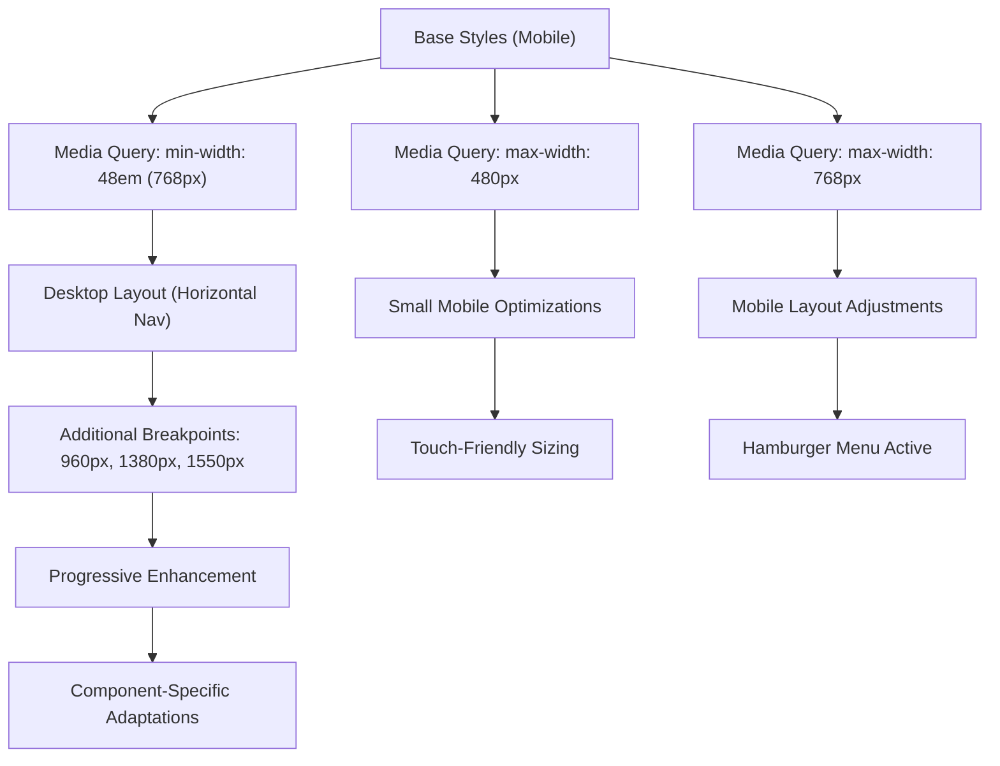

# SCSS Architecture and Styling System

<cite>
**Referenced Files in This Document**   
- [src/_globalColor.scss](file://src/_globalColor.scss)
- [src/App.scss](file://src/App.scss)
- [src/components/button/Button.scss](file://src/components/button/Button.scss)
- [src/components/header/Header.scss](file://src/components/header/Header.scss)
- [src/containers/Main.scss](file://src/containers/Main.scss)
- [src/components/ToggleSwitch/ToggleSwitch.scss](file://src/components/ToggleSwitch/ToggleSwitch.scss)
- [src/components/achievementCard/AchievementCard.scss](file://src/components/achievementCard/AchievementCard.scss)
- [src/components/blogCard/BlogCard.scss](file://src/components/blogCard/BlogCard.scss)
- [src/components/educationCard/EducationCard.scss](file://src/components/educationCard/EducationCard.scss)
- [src/components/experienceCard/ExperienceCard.scss](file://src/components/experienceCard/ExperienceCard.scss)
- [src/components/footer/Footer.scss](file://src/components/footer/Footer.scss)
- [src/components/githubProfileCard/GithubProfileCard.scss](file://src/components/githubProfileCard/GithubProfileCard.scss)
</cite>

## Table of Contents
1. [Introduction](#introduction)
2. [Global Color System](#global-color-system)
3. [Modular SCSS Structure](#modular-scss-structure)
4. [BEM-like Naming and Encapsulation](#bem-like-naming-and-encapsulation)
5. [Responsive Design Implementation](#responsive-design-implementation)
6. [Component Styling Patterns](#component-styling-patterns)
7. [Performance Optimization](#performance-optimization)
8. [Cross-Browser Compatibility](#cross-browser-compatibility)
9. [Style Maintenance Guidelines](#style-maintenance-guidelines)
10. [Conclusion](#conclusion)

## Introduction
This document provides comprehensive architectural documentation for the SCSS-based styling system used in the portfolio application. The system employs a modular, scalable approach to CSS management using SCSS preprocessing features. It centers around a global color variable system, component-specific stylesheets, and responsive design principles. The architecture supports both light and dark themes through systematic variable organization and conditional class application. This documentation details the structure, conventions, and best practices for maintaining and extending the styling system.

## Global Color System

The styling system implements a centralized color management approach through the `_globalColor.scss` file, which defines all color variables used throughout the application. These variables are categorized by theme, component, and function to ensure consistency and maintainability.

### Theme-Based Color Variables
The system supports both light and dark themes through dedicated variable sets:
- **Light theme text colors**: `$titleColor`, `$textColor`, `$subTitle`, `$cardSubtitle`
- **Dark theme text colors**: `$textColorDark`
- **Light theme backgrounds**: `$lightBackground1`, `$lightBackground2`, `$lightBackground3`
- **Dark theme background**: `$darkBackground`

### Component-Specific Color Variables
Colors are defined for specific UI components to ensure visual consistency:
- **Button colors**: `$buttonColor`, `$buttonHover`, `$topButtonHover`
- **Toggle switch**: `$toggleCheck`, `$toggleSwitchSliderBG`
- **GitHub components**: `$githubRepoCardLanguageColorBG`, `$githubProfileCardBorder`
- **Social media icons**: `$facebook`, `$linkedin`, `$github`, `$twitter`, etc.

### Functional Color Variables
The system includes variables for specific visual effects and UI functions:
- **Shadows**: `$lightBoxShadow`, `$lightBoxShadowDark`, `$darkBoxShadow`
- **Borders**: `$lightBorder1`, `$educationCardBorder`, `$progressBarBackground`
- **Gradients**: `$experienceCardBlurredDivLG`, `$experienceCardBannerLG`
- **Hovers**: `$achievementCertificateCardHoverDark`, `$blogCardHoverSmallColor`, `$headerHoverBG`

This categorization enables systematic theming and simplifies color updates across the entire application.

**Section sources**
- [src/_globalColor.scss](file://src/_globalColor.scss#L1-L90)

## Modular SCSS Structure

The SCSS architecture follows a modular structure where global styles are imported into component-specific stylesheets, creating a hierarchical and maintainable styling system.

### Global Styles Import Pattern
All component stylesheets import the global color variables using the relative path `@import "../../_globalColor";`. This pattern ensures that all components have access to the centralized color system while maintaining encapsulation.

### Component-Level Styling
Each UI component has its own SCSS file that:
1. Imports global variables
2. Defines component-specific styles
3. Implements responsive adjustments
4. Handles theme variations

The main application stylesheet (`App.scss`) imports global variables and defines base styles for application-wide elements like `.App`, `.App-header`, and `.App-link`.

### Container-Level Styling
Container components (e.g., `Main.scss`) define layout-level styles and theme classes like `.dark-mode`, which applies dark theme background and text colors across container elements.

This modular approach enables isolated component styling while maintaining design consistency through shared variables.

**Section sources**
- [src/App.scss](file://src/App.scss#L1-L30)
- [src/containers/Main.scss](file://src/containers/Main.scss#L1-L7)

## BEM-like Naming and Encapsulation

The styling system employs BEM (Block, Element, Modifier)-inspired naming conventions to create predictable, maintainable, and encapsulated CSS classes.

### Block-Element Structure
Components follow a clear block-element hierarchy:
- **Blocks**: Represent standalone components (e.g., `.certificate-card`, `.blog-container`)
- **Elements**: Represent parts of a block (e.g., `.card-title`, `.card-subtitle`, `.certificate-detail-div`)

### Modifier Patterns
The system uses class concatenation for state and theme modifications:
- **Theme modifiers**: `.dark-mode.certificate-card:hover` applies hover effects specifically in dark mode
- **State modifiers**: `.menu-btn:checked ~ .menu` controls menu visibility based on checkbox state
- **Combined selectors**: `.dark-mode .certificate-card` applies dark theme styles to certificate cards

### Encapsulation Strategy
The system prevents style leakage through:
- **Component-scoped styles**: Each component's SCSS file only styles its own elements
- **Avoidance of global selectors**: Minimal use of element selectors without class qualification
- **Specific class names**: Descriptive, unique class names that avoid conflicts
- **CSS containment**: Use of `overflow: hidden` and explicit positioning to contain visual effects

This approach ensures that style changes in one component do not inadvertently affect others.

**Section sources**
- [src/components/achievementCard/AchievementCard.scss](file://src/components/achievementCard/AchievementCard.scss#L1-L77)
- [src/components/blogCard/BlogCard.scss](file://src/components/blogCard/BlogCard.scss#L1-L149)

## Responsive Design Implementation

The styling system implements responsive design through strategic media queries and flexible layouts that adapt to various screen sizes.

### Media Query Strategy
The system uses targeted media queries at key breakpoints:
- **Mobile-first approach**: Base styles target smaller screens, with enhancements for larger screens
- **Key breakpoints**: `max-width: 768px`, `max-width: 480px`, and various ranges between 768px and 1550px
- **Device-specific adjustments**: Queries account for common device widths and resolutions

### Flexible Layouts
The system employs multiple layout techniques for responsiveness:
- **Flexbox**: Used extensively for alignment and distribution (e.g., `.header` navigation, `.row` layout)
- **CSS Grid**: Implemented in `.achievement-cards-div` with `grid-template-columns: repeat(auto-fit, minmax(300px, 1fr))` for responsive card layouts
- **Relative units**: Use of `vmin`, `rem`, and percentage-based dimensions for scalability

### Component-Specific Adaptations
Individual components implement responsive behaviors:
- **Header**: Transitions from hamburger menu to horizontal navigation at `min-width: 48em`
- **Education card**: Changes from row to column layout on smaller screens
- **Profile card**: Reorders content and adjusts sizing for mobile views
- **Blog card**: Adjusts hover effect scale based on screen width ranges

This comprehensive responsive strategy ensures optimal user experience across devices.

**Diagram sources**
- [src/components/header/Header.scss](file://src/components/header/Header.scss#L1-L182)
- [src/components/educationCard/EducationCard.scss](file://src/components/educationCard/EducationCard.scss#L1-L134)

## Component Styling Patterns

The styling system implements consistent patterns across various UI components, leveraging the global color system and responsive design principles.

### Button Component
The button styling demonstrates the global variable integration:
- Uses `$buttonColor` for background and border
- Applies `$textColorDark` for text in light theme
- Implements hover effects with `$darkBoxShadow2` background and color inversion
- Includes responsive font sizing and padding adjustments

### Card Components
Card-based components (Achievement, Blog, Experience, Education) share common patterns:
- **Consistent shadows**: Use of `$lightBoxShadowDark` for depth
- **Border treatment**: Application of `$lightBorder1` for subtle separation
- **Hover effects**: Enhanced shadows on interaction
- **Responsive grids**: Flexible layout systems for multiple cards

### Interactive Components
Interactive elements like the toggle switch implement sophisticated visual feedback:
- **Visual states**: Clear distinction between checked and unchecked states
- **Smooth transitions**: 0.4s transitions for state changes
- **Positional animations**: Transform-based movement for the slider indicator
- **Multiple breakpoint adjustments**: Specific positioning for various screen sizes

These patterns ensure a cohesive user experience while allowing for component-specific functionality.

**Section sources**
- [src/components/button/Button.scss](file://src/components/button/Button.scss#L1-L47)
- [src/components/ToggleSwitch/ToggleSwitch.scss](file://src/components/ToggleSwitch/ToggleSwitch.scss#L1-L109)
- [src/components/experienceCard/ExperienceCard.scss](file://src/components/experienceCard/ExperienceCard.scss#L1-L156)

## Performance Optimization

The SCSS architecture incorporates several performance optimization techniques to minimize CSS bundle size and enhance rendering efficiency.

### SCSS Partials and Imports
The system leverages SCSS partials to:
- **Centralize variables**: Single `_globalColor.scss` file prevents duplication
- **Modularize styles**: Component-specific files allow for selective loading
- **Avoid repetition**: Reusable variables eliminate redundant color values

### CSS Bundle Size Management
The architecture minimizes CSS output through:
- **Scoped styling**: Component styles only affect their intended elements
- **Efficient selectors**: Avoidance of expensive CSS selectors
- **Minimal!important usage**: Limited to necessary cases (e.g., theme overrides)
- **Tree-shakable structure**: Unused component styles can be eliminated

### Rendering Performance
The system optimizes visual rendering with:
- **Hardware-accelerated properties**: Use of `transform` instead of `top`/`left` for animations
- **Efficient transitions**: Specific property targeting rather than `transition: all`
- **Optimized shadows**: Careful application of box-shadow to avoid layout thrashing
- **Image optimization**: Use of `object-fit: cover` and controlled dimensions

These optimizations ensure fast load times and smooth interactions across devices.

## Cross-Browser Compatibility

The styling system addresses cross-browser compatibility through standardized approaches and vendor prefixing.

### Vendor Prefixing Strategy
The system implements vendor prefixes for CSS properties requiring them:
- **Filter effects**: Includes `-webkit-filter`, `-moz-filter`, `-o-filter`, and `-ms-filter` for blur effects
- **Transitions**: Uses `-webkit-transition` alongside standard `transition`
- **Box-sizing**: Applies `-webkit-box` for line clamping

### Consistent Rendering
The architecture ensures consistent appearance across browsers by:
- **Resetting defaults**: Using `margin: 0`, `padding: 0`, and `list-style: none` for consistent baseline
- **Standardized units**: Preferring `rem` and `px` over less predictable units
- **Fallback values**: Providing RGB alternatives alongside modern color formats
- **Feature detection**: Using standard CSS features with broad browser support

### Responsive Testing
The media query system accounts for various browser environments:
- **Viewport units**: Proper handling of `vmin` across mobile and desktop browsers
- **Touch vs. mouse**: Different hover states for touch and pointer devices
- **Font rendering**: Cross-browser consistent typography through web-safe font stacks

This approach ensures a reliable user experience regardless of browser choice.

**Section sources**
- [src/components/experienceCard/ExperienceCard.scss](file://src/components/experienceCard/ExperienceCard.scss#L1-L156)
- [src/components/blogCard/BlogCard.scss](file://src/components/blogCard/BlogCard.scss#L1-L149)

## Style Maintenance Guidelines

This section provides guidelines for extending and maintaining the SCSS styling system.

### Adding New Color Variables
When introducing new colors:
1. **Categorize appropriately**: Place in theme, component, or functional section
2. **Use descriptive names**: Follow existing naming patterns (e.g., `$component-element-state`)
3. **Document purpose**: Add comments explaining usage context
4. **Consider reusability**: Assess if existing variables can serve the purpose

### Overriding Defaults
To modify existing styles:
1. **Prefer variable overrides**: Update `_globalColor.scss` values when appropriate
2. **Use component-specific files**: Make changes in the relevant component's SCSS file
3. **Minimize!important**: Only use when necessary for theme overrides
4. **Test responsiveness**: Verify changes across all breakpoints

### Ensuring Consistency
Maintain design consistency by:
- **Using existing variables**: Leverage the established color system
- **Following naming conventions**: Adhere to BEM-like patterns
- **Respecting component boundaries**: Avoid styling other components from within a file
- **Testing theme variations**: Verify both light and dark theme appearances

### Performance Considerations
When adding new styles:
- **Minimize selector complexity**: Avoid deeply nested selectors
- **Optimize animations**: Use transform and opacity for smooth