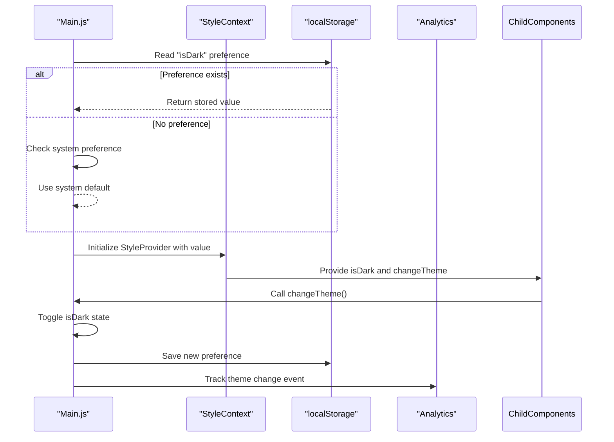
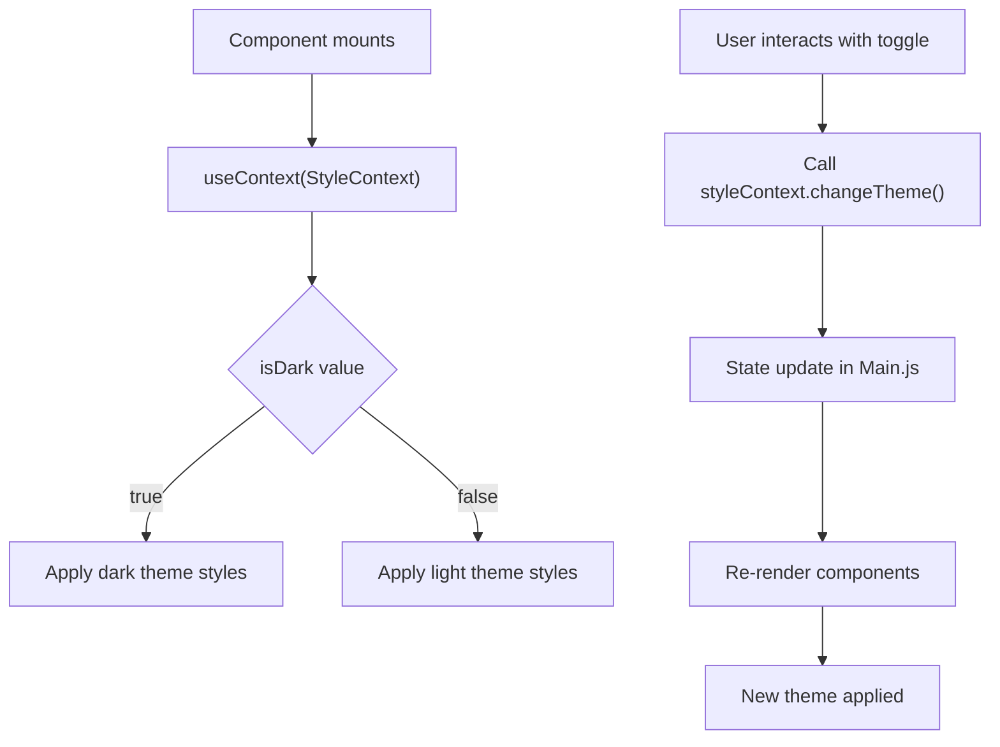

# Theme Implementation

<cite>
**Referenced Files in This Document**  
- [StyleContext.js](file://src/contexts/StyleContext.js)
- [Main.js](file://src/containers/Main.js)
- [_globalColor.scss](file://src/_globalColor.scss)
- [Main.scss](file://src/containers/Main.scss)
- [ToggleSwitch.js](file://src/components/ToggleSwitch/ToggleSwitch.js)
- [useLocalStorage.js](file://src/hooks/useLocalStorage.js)
</cite>

## Table of Contents
1. [Introduction](#introduction)
2. [Theme State Management with React Context](#theme-state-management-with-react-context)
3. [Context Provider Implementation in Main.js](#context-provider-implementation-in-mainjs)
4. [Color Variables and SCSS Styling](#color-variables-and-scss-styling)
5. [Theme Consumption in Components](#theme-consumption-in-components)
6. [Performance Implications and Best Practices](#performance-implications-and-best-practices)
7. [Extending the Theme System](#extending-the-theme-system)
8. [Conclusion](#conclusion)

## Introduction
This document provides a comprehensive analysis of the theme implementation architecture in the portfolio application. The system leverages React Context API through a custom `StyleContext` to manage global theme state, enabling seamless toggling between light and dark modes. The implementation integrates persistent user preferences via localStorage, dynamic SCSS styling, and efficient component re-rendering strategies. This documentation details the flow of theme data from initialization to consumption, explains the role of key files, and provides guidance on performance optimization and extensibility.

## Theme State Management with React Context

The theme system is built around React's Context API, which provides a mechanism to share values like theme or user authentication across the entire component tree without explicitly passing props through every level. The `StyleContext` serves as the central state container for theme-related data.

The context is created using `React.createContext()` and exports both a Provider and Consumer component for use throughout the application. This pattern enables any component to access the current theme state and the function to change it, promoting loose coupling and reusability.

The theme state consists of two primary elements:
- `isDark`: A boolean value indicating whether dark mode is currently active
- `changeTheme`: A function that toggles the theme state and handles associated side effects

This state is persisted across sessions using a custom hook `useLocalStorage`, ensuring user preferences are maintained between visits.

```mermaid
classDiagram
class StyleContext {
+boolean isDark
+function changeTheme()
}
class StyleProvider {
+value : {isDark, changeTheme}
}
class StyleConsumer {
+children : function
}
StyleProvider --> StyleContext : "provides"
StyleConsumer --> StyleContext : "consumes"
```

**Diagram sources**  
- [StyleContext.js](file://src/contexts/StyleContext.js#L2-L7)

**Section sources**  
- [StyleContext.js](file://src/contexts/StyleContext.js#L1-L9)

## Context Provider Implementation in Main.js

The `Main.js` component serves as the root container and is responsible for initializing and providing the theme context to all child components. It uses the `useLocalStorage` custom hook to initialize the `isDark` state, defaulting to the user's system preference for dark mode when no stored preference exists.

The `changeTheme` function is defined within `Main.js` and passed as part of the context value. When invoked, it toggles the `isDark` state and sends an analytics event to track theme changes. This function is then accessible to any component that consumes the `StyleContext`.

The `StyleProvider` wraps the entire application content, making the theme state available to all components. The root div conditionally applies a "dark-mode" class based on the current theme, which triggers the appropriate SCSS styles.



**Diagram sources**  
- [Main.js](file://src/containers/Main.js#L1-L137)
- [useLocalStorage.js](file://src/hooks/useLocalStorage.js#L1-L38)

**Section sources**  
- [Main.js](file://src/containers/Main.js#L1-L137)

## Color Variables and SCSS Styling

The theme system relies on SCSS variables defined in `_globalColor.scss` to manage color schemes for both light and dark themes. This file contains a comprehensive set of color variables organized by usage category, including text colors, background colors, button colors, and component-specific colors.

For the dark theme, specific variables are defined such as `$textColorDark` and `$darkBackground`, which are applied when the "dark-mode" class is present on the root element. The main SCSS file (`Main.scss`) imports these global variables and defines the dark mode styling rules.

The styling approach uses a simple but effective pattern: the root element receives a "dark-mode" class when dark mode is active, and descendant elements inherit the appropriate colors through SCSS variable references. This eliminates the need for complex CSS overrides and ensures consistency across the application.

```scss
// Example pattern in Main.scss
.dark-mode {
  background-color: $darkBackground;
  color: $textColorDark;
}
```

This approach allows for easy theming of components by simply referencing the appropriate SCSS variables in their respective style files, ensuring a cohesive visual experience across both themes.

**Section sources**  
- [_globalColor.scss](file://src/_globalColor.scss#L1-L91)
- [Main.scss](file://src/containers/Main.scss#L1-L8)

## Theme Consumption in Components

Components consume the theme context through the `useContext` hook, accessing both the current theme state and the function to change it. The `ToggleSwitch` component serves as a primary example of context consumption, rendering a visual toggle that reflects the current theme state and allows users to switch between modes.

When the toggle is activated, it calls the `changeTheme` function from the context, which updates the state in `Main.js` and triggers a re-render of all components that depend on the theme context. The component also maintains its own local state (`isChecked`) to ensure smooth visual feedback during the transition.

The context consumption pattern follows React best practices by minimizing direct state manipulation and instead relying on the provided context API. This ensures that theme changes are handled consistently across the application and that all components receive the updated state simultaneously.



**Diagram sources**  
- [ToggleSwitch.js](file://src/components/ToggleSwitch/ToggleSwitch.js#L5-L27)
- [StyleContext.js](file://src/contexts/StyleContext.js#L4-L5)

**Section sources**  
- [ToggleSwitch.js](file://src/components/ToggleSwitch/ToggleSwitch.js#L1-L28)

## Performance Implications and Best Practices

The current theme implementation has several performance considerations that should be addressed to ensure optimal application performance:

1. **Context Updates and Re-renders**: When the theme changes, the `StyleProvider` re-renders, potentially causing all consuming components to re-render. While this is generally acceptable for theme changes (which are infrequent), it could be optimized.

2. **Memoization Opportunities**: Components that consume the theme context but don't directly render theme-dependent styles could benefit from `React.memo()` to prevent unnecessary re-renders.

3. **Event Batching**: The current implementation triggers an analytics event on every theme change. These events should be debounced or batched if they occur frequently.

4. **LocalStorage Performance**: The `useLocalStorage` hook writes to localStorage on every theme change. While this operation is generally fast, it could be optimized by debouncing the storage update.

Best practices for minimizing re-renders include:
- Using `React.memo()` for components that don't change with theme
- Extracting non-theme-dependent logic into separate components
- Using CSS custom properties (CSS variables) instead of React state for simple style changes
- Implementing a more granular context structure if additional theme properties are added

The current implementation strikes a reasonable balance between simplicity and performance, as theme changes are user-initiated actions that don't occur frequently enough to cause performance issues in most scenarios.

**Section sources**  
- [Main.js](file://src/containers/Main.js#L73-L76)
- [useLocalStorage.js](file://src/hooks/useLocalStorage.js#L1-L38)

## Extending the Theme System

The current theme architecture can be extended to support additional features and customization options:

1. **Multiple Theme Modes**: The system can be enhanced to support more than two themes (e.g., light, dark, solarized, high contrast) by changing the `isDark` boolean to a `themeMode` string or enum.

2. **Custom Theme Creation**: Users could be allowed to create custom themes by adjusting individual color variables through a settings interface, with the custom theme configuration stored in localStorage.

3. **Theme Presets**: Predefined theme presets could be added, allowing users to choose from various color schemes beyond the default light/dark options.

4. **Dynamic Theme Switching**: The system could automatically switch themes based on time of day, location, or other environmental factors.

5. **CSS Custom Properties**: Migrating from SCSS variables to CSS custom properties would enable runtime theme changes without requiring a page reload or component re-renders.

6. **Theme Animation**: Smooth transitions between themes could be implemented using CSS transitions on the root element.

To implement these extensions, the `StyleContext` would need to be modified to accommodate more complex theme state, and the `changeTheme` function would need to be updated to handle the new functionality. The SCSS architecture would also need to be adjusted to support multiple theme variants.

**Section sources**  
- [StyleContext.js](file://src/contexts/StyleContext.js#L1-L9)
- [Main.js](file://src/containers/Main.js#L1-L137)

## Conclusion

The theme implementation in this portfolio application demonstrates an effective use of React Context API for managing global state. The architecture provides a clean separation of concerns, with theme state management centralized in `Main.js` and `StyleContext`, styling handled through SCSS variables in `_globalColor.scss`, and theme consumption implemented consistently across components.

The system successfully achieves its primary goals of providing a user-friendly dark/light mode toggle with persistent preferences. The integration with localStorage ensures user preferences are maintained across sessions, while the analytics integration provides valuable insights into user behavior.

While the current implementation is performant for its use case, opportunities exist for optimization and extension. By following the best practices outlined in this documentation, developers can maintain and enhance the theme system to meet evolving requirements while ensuring optimal performance and user experience.

The modular architecture makes it straightforward to extend the system with additional theme modes or customization options, providing a solid foundation for future enhancements.