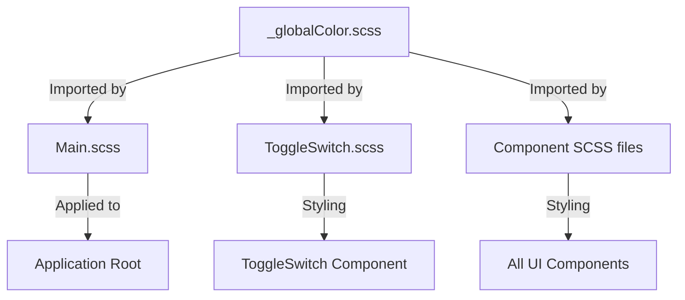
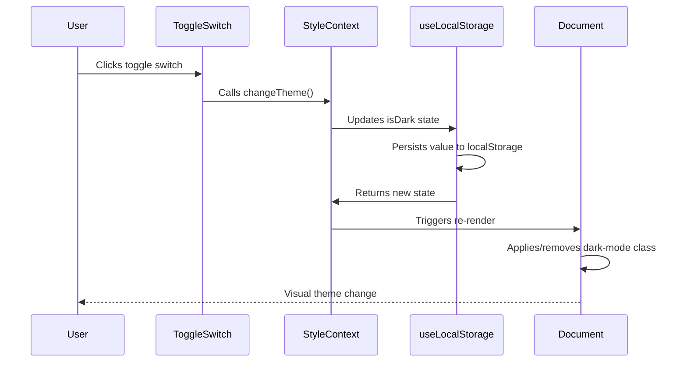
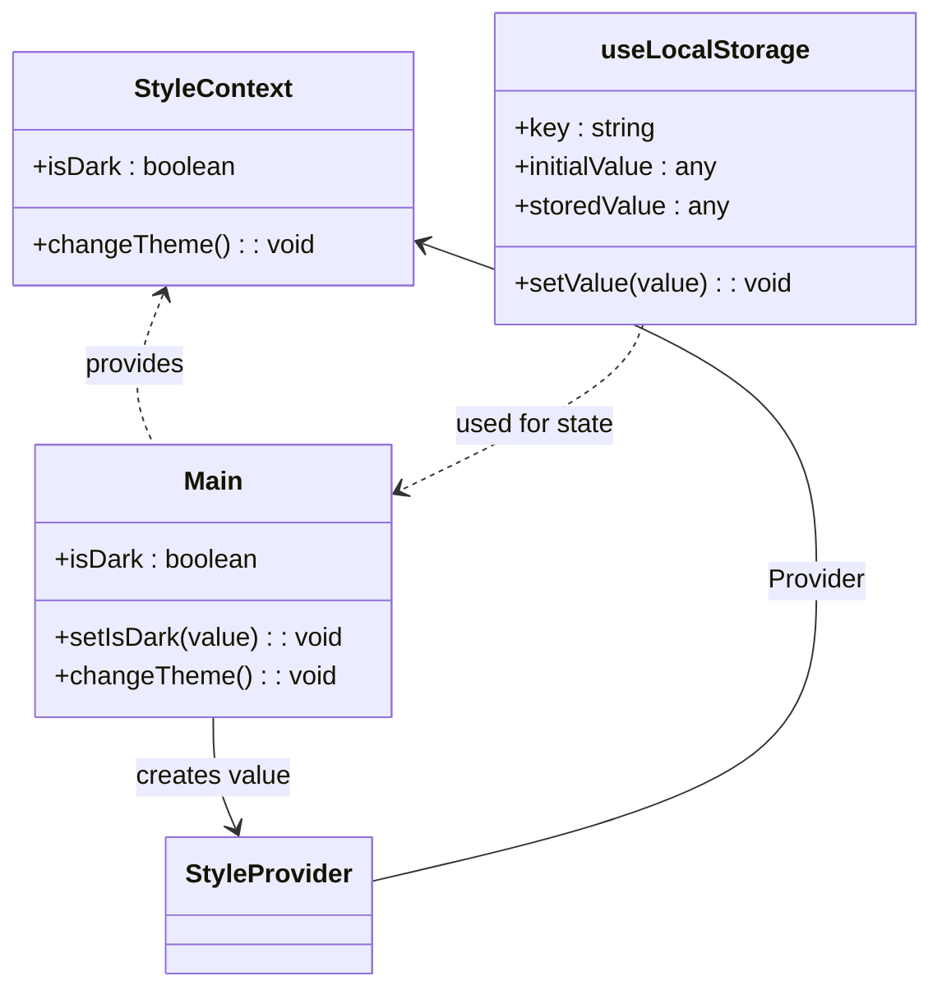
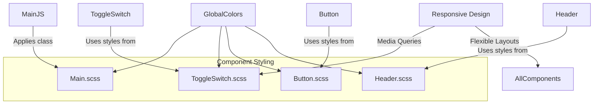

# Theming and Styling

<cite>
**Referenced Files in This Document**   
- [_globalColor.scss](file://src/_globalColor.scss)
- [Main.scss](file://src/containers/Main.scss)
- [Main.js](file://src/containers/Main.js)
- [ToggleSwitch.js](file://src/components/ToggleSwitch/ToggleSwitch.js)
- [ToggleSwitch.scss](file://src/components/ToggleSwitch/ToggleSwitch.scss)
- [StyleContext.js](file://src/contexts/StyleContext.js)
- [useLocalStorage.js](file://src/hooks/useLocalStorage.js)
</cite>

## Table of Contents
1. [Introduction](#introduction)
2. [SCSS Architecture and Global Color System](#scss-architecture-and-global-color-system)
3. [Theme Toggle Implementation](#theme-toggle-implementation)
4. [StyleContext and Theme State Management](#stylecontext-and-theme-state-management)
5. [CSS Module Approach and Responsive Design](#css-module-approach-and-responsive-design)
6. [Usage Examples: Consuming Theme Values in Components](#usage-examples-consuming-theme-values-in-components)
7. [Customization Guidelines for Color Schemes](#customization-guidelines-for-color-schemes)
8. [Accessibility Compliance](#accessibility-compliance)
9. [Cross-Browser Compatibility](#cross-browser-compatibility)
10. [Performance Optimization](#performance-optimization)
11. [Conclusion](#conclusion)

## Introduction
This document provides comprehensive documentation for the dark/light theme implementation in the portfolio application. It details the SCSS-based styling architecture, theme toggling mechanism, state management via React Context, and best practices for customization and accessibility. The system leverages global SCSS variables, local storage persistence, and responsive design principles to deliver a seamless user experience across devices and preferences.

## SCSS Architecture and Global Color System

The styling system is built on a modular SCSS architecture centered around the `_globalColor.scss` file, which defines all theme-related variables. This file serves as the single source of truth for color values used throughout the application.

The architecture separates concerns by defining distinct variable categories:
- Button colors (`$buttonColor`, `$buttonHover`)
- Text colors for both light and dark themes
- Background colors for various UI elements
- Shadow effects specific to each theme
- Social media brand colors
- Component-specific colors (e.g., GitHub cards)

These variables are imported into component-specific SCSS files using the `@import "../_globalColor";` statement, enabling consistent styling across components while allowing for localized overrides when necessary.



**Diagram sources**
- [_globalColor.scss](file://src/_globalColor.scss)
- [Main.scss](file://src/containers/Main.scss)
- [ToggleSwitch.scss](file://src/components/ToggleSwitch/ToggleSwitch.scss)

**Section sources**
- [_globalColor.scss](file://src/_globalColor.scss)
- [Main.scss](file://src/containers/Main.scss)

## Theme Toggle Implementation

The theme toggle functionality is implemented through the `ToggleSwitch` component, which provides a visual switch for users to change between light and dark themes. The component renders a checkbox input styled as a slider with emoji indicators (🌜 for dark, ☀️ for light).

The toggle state is synchronized with the application's theme state through React Context. When the user interacts with the toggle, it triggers the `changeTheme` function from `StyleContext` and updates its local checked state. The component uses responsive media queries to adjust positioning across different screen sizes, ensuring consistent appearance on mobile, tablet, and desktop devices.



**Diagram sources**
- [ToggleSwitch.js](file://src/components/ToggleSwitch/ToggleSwitch.js#L1-L27)
- [ToggleSwitch.scss](file://src/components/ToggleSwitch/ToggleSwitch.scss#L1-L109)

**Section sources**
- [ToggleSwitch.js](file://src/components/ToggleSwitch/ToggleSwitch.js)
- [ToggleSwitch.scss](file://src/components/ToggleSwitch/ToggleSwitch.scss)

## StyleContext and Theme State Management

The theme state is managed using React's Context API through the `StyleContext` system. The `Main.js` component initializes the theme state by reading from local storage via the `useLocalStorage` hook, with fallback to the user's system preference (`prefers-color-scheme: dark`).

The `StyleProvider` wraps the entire application, providing both the current theme state (`isDark`) and the `changeTheme` function to all child components. This enables any component to access and modify the theme state without prop drilling.

The `useLocalStorage` hook abstracts the complexity of localStorage operations, handling serialization, error cases, and state synchronization. It ensures that theme preferences persist across sessions and are available immediately upon page load.



**Diagram sources**
- [StyleContext.js](file://src/contexts/StyleContext.js#L1-L8)
- [useLocalStorage.js](file://src/hooks/useLocalStorage.js#L1-L37)
- [Main.js](file://src/containers/Main.js#L25-L133)

**Section sources**
- [StyleContext.js](file://src/contexts/StyleContext.js)
- [useLocalStorage.js](file://src/hooks/useLocalStorage.js)
- [Main.js](file://src/containers/Main.js)

## CSS Module Approach and Responsive Design

The application employs a CSS module approach using SCSS for styling components, with each component having its own SCSS file that imports the global color variables. This modular approach ensures encapsulation while maintaining design consistency.

The `Main.scss` file defines the root `.dark-mode` class that applies the dark theme to the entire application by setting the background color to `$darkBackground` and text color to white. This class is conditionally applied to the root div based on the `isDark` state.

Responsive design is implemented through media queries in component SCSS files, particularly in `ToggleSwitch.scss`, which adjusts the switch positioning for different screen sizes (mobile, tablet, desktop). The system uses relative units and flexible layouts to ensure usability across devices.



**Diagram sources**
- [Main.scss](file://src/containers/Main.scss#L1-L7)
- [ToggleSwitch.scss](file://src/components/ToggleSwitch/ToggleSwitch.scss#L1-L109)

**Section sources**
- [Main.scss](file://src/containers/Main.scss)
- [ToggleSwitch.scss](file://src/components/ToggleSwitch/ToggleSwitch.scss)

## Usage Examples: Consuming Theme Values in Components

Components consume theme values through a combination of CSS classes and React context. The primary mechanism is the conditional application of the `dark-mode` class at the root level, which cascades down to all elements.

Components can also directly access theme state through `useContext(StyleContext)` when they need to make conditional rendering decisions based on the current theme. For example:

```jsx
const MyComponent = () => {
  const { isDark } = useContext(StyleContext);
  return (
    <div className={isDark ? 'dark-theme-class' : 'light-theme-class'}>
      {/* Content */}
    </div>
  );
};
```

SCSS files import `_globalColor.scss` to access theme variables directly:

```scss
.my-component {
  background-color: $lightBackground1;
  color: $textColor;
  
  .dark-mode & {
    background-color: $darkBackground;
    color: $textColorDark;
  }
}
```

This approach allows for both global theme switching and component-specific theme adaptations.

**Section sources**
- [Main.js](file://src/containers/Main.js#L25-L133)
- [ToggleSwitch.js](file://src/components/ToggleSwitch/ToggleSwitch.js#L5-L25)

## Customization Guidelines for Color Schemes

To customize the color scheme, modify the variables in `_globalColor.scss`. This file is designed for easy customization, with clearly labeled sections for different UI elements.

Best practices for customization:
1. Maintain sufficient contrast ratios (minimum 4.5:1 for normal text)
2. Test color combinations in both light and dark modes
3. Preserve semantic meaning of colors (e.g., error states should remain red-hue)
4. Update both light and dark theme variants of text colors
5. Consider accessibility when choosing background and text color combinations

When adding new components, import `_globalColor.scss` and use existing variables where appropriate to maintain consistency. For component-specific colors, define new variables following the existing naming convention (`$componentElementColor`).

**Section sources**
- [_globalColor.scss](file://src/_globalColor.scss)

## Accessibility Compliance

The theming system supports accessibility through several mechanisms:
- High contrast between text and background colors in both themes
- Support for system preference via `prefers-color-scheme` media query
- Persistent user preference through local storage
- Semantic HTML structure maintained regardless of theme
- Keyboard navigable toggle switch

The default color values have been selected to meet WCAG 2.1 AA contrast requirements. When customizing colors, ensure that text remains readable against its background by verifying contrast ratios using accessibility tools.

The toggle switch includes proper ARIA labeling through its native checkbox input, making it accessible to screen readers and keyboard navigation.

**Section sources**
- [_globalColor.scss](file://src/_globalColor.scss)
- [ToggleSwitch.js](file://src/components/ToggleSwitch/ToggleSwitch.js)
- [Main.js](file://src/containers/Main.js)

## Cross-Browser Compatibility

The styling system is designed for broad cross-browser compatibility:
- Uses standard CSS properties with vendor prefixes where necessary
- Falls back gracefully for browsers without CSS custom properties
- Implements feature detection for localStorage
- Supports older browsers through Babel transpilation
- Uses widely supported SCSS features

The theme toggle works consistently across modern browsers, with localStorage persistence supported in all major browsers. For browsers that don't support `prefers-color-scheme`, the system defaults to light theme with the option to manually switch.

Testing should include verification on:
- Chrome, Firefox, Safari, Edge
- Mobile browsers (iOS Safari, Chrome for Android)
- Screen readers and other assistive technologies

**Section sources**
- [useLocalStorage.js](file://src/hooks/useLocalStorage.js)
- [Main.js](file://src/containers/Main.js)
- [ToggleSwitch.js](file://src/components/ToggleSwitch/ToggleSwitch.js)

## Performance Optimization

The theming system incorporates several performance optimizations:
- Minimal re-renders through proper state management
- Efficient CSS with cascading classes rather than inline styles
- Local storage reads only on initial load
- Debounced event listeners where applicable
- Lightweight SCSS compilation with shared variables

The use of a single `dark-mode` class at the root level minimizes DOM changes during theme switching, resulting in smooth transitions. CSS variables could be considered for future optimization to enable instant theme switching without re-renders.

Critical rendering path is optimized by inlining critical CSS and deferring non-essential styles. The SCSS architecture minimizes redundant style definitions through variable reuse.

**Section sources**
- [Main.js](file://src/containers/Main.js)
- [useLocalStorage.js](file://src/hooks/useLocalStorage.js)
- [Main.scss](file://src/containers/Main.scss)

## Conclusion

The dark/light theme implementation provides a robust, accessible, and customizable styling system built on SCSS variables and React Context. The architecture separates concerns effectively, with global color definitions, component-specific styling, and centralized state management. Theme persistence through local storage ensures user preferences are maintained across sessions, while system preference detection provides an improved initial experience. The modular design allows for easy customization and extension, making it simple to adapt the color scheme to different branding requirements while maintaining accessibility and performance standards.